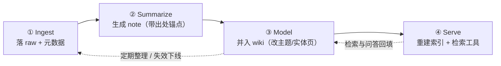

---
书名: 深入理解 AI Agent：设计原理与工程实践
类型: 方案（可自进化 wiki 知识库搭建）
来源: 原书第 3 章（用户记忆与知识库）+ 第 9 章预告（持续进化）；结合本项目实践（Obsidian + Git + mnemon）
创建日期: 2026-09-14
tags:
  - AI-Agent
  - 精读笔记
  - DeepReadNote
  - 知识库
---

# wiki 知识库搭建：从 raw source 到可自进化的知识库

> [!info] 本文是什么
> 因 [[QuickNote/Quick_note_3]] 第 3 条而写：把第 3 章的「记忆与知识库」技术栈落成一套**你可以直接照着搭**的方案——四层目录、四段流水线、检索与知识建模、维护与更新纪律，以及与 Obsidian / Git / mnemon 的接线方式。
> 标注：`〔原书〕`= 书中规范（带锚点）；`〔补充〕`= 工程经验补充；`〔决策点〕`= 需要你按自己场景拍板的取舍。

---

## 一、先定目标：什么叫「可自进化」

一个知识库会「自进化」，必须同时满足四条（缺一条就会退化成资料堆）：

1. **能吸收**：新证据进来后，知识能被局部修改（而不是每次重写）。
2. **能纠错**：每条结论都能回答「**从哪条证据而来、谁在什么时候批准**」〔原书 §增量更新〕。
3. **能遗忘**：过期内容会下线，而不是与新版一起被检索出来（原书称之为「失效内容的检测与下线」）。
4. **能验收**：结构与检索质量有可观测指标，退化能被发现。

〔原书〕对应的两条判断：**知识库当代码库**（PR 式增量更新）与**定期全量整理**（回到原始数据去重、合并、重建索引）〔原书 §知识应该如何更新〕。

---

## 二、总体架构：四层 + 两层记忆

### 2.1 四层（在书本「三层分离」上加一层「建模层」）

| 层 | 目录 | 是否可变 | 作用 | 对应书本概念 |
| --- | --- | --- | --- | --- |
| **证据层** | `01_raw/` | **只增不改** | 原始素材（论文/网页/书/记录）与附件，一切结论的最终依据 | 原始证据层〔原书 §增量更新〕 |
| **笔记层** | `02_notes/` | 可修订 | 一素材一笔记：结构化提炼 + 出处锚点 | 知识层 |
| **建模层** | `03_wiki/` | 可修订 | 跨素材的知识模型：主题页、实体页、主张、术语表、开放问题 | 结构化索引（RAPTOR/GraphRAG 的轻量替代：文件系统范式）〔原书 §结构化索引、§文件系统范式〕 |
| **服务层** | `05_index/`（生成物） | 可重建 | 嵌入索引、摘要缓存、检索元数据 | 「索引是可重建的派生物，已审核的知识才是真正的来源」〔原书 §增量更新〕 |

### 2.2 两层记忆（阅读与回答时的实际使用方式）

- **常驻概览**：`03_wiki/index.md` + 各主题页顶部的 TL;DR（像 Advanced JSON Cards 那样常驻上下文，提供全局视野）；
- **按需细节**：`02_notes/` → `01_raw/`（像上下文感知检索那样按需取回精确细节）。

这正是第 3 章章末汇合的双层记忆架构：只靠常驻上下文会因容量受限而丢失细节，只靠检索又会因缺乏全局视野而发现不了跨会话的隐藏关联〔原书 §RAG 技巧末〕。

---

## 三、四段流水线（每段都有产物与门禁）



| 阶段 | 输入 | 产物 | 门禁（不通过就不进下一段） |
| --- | --- | --- | --- |
| ① Ingest | 链接/PDF/书章节 | `01_raw/**` + 一条 `raw` frontmatter | 来源可定位（URL/DOI/文件路径）、抓取时间、版本或快照 |
| ② Summarize | 一条 raw | `02_notes/<slug>.md` | **每个结论都有出处锚点**（章/小节/页码/行号）；区分「原文说法」与「我的判断」 |
| ③ Model | 一条或多条 note | 改动 `03_wiki/topics/**`、`entities/**`、`glossary.md` | 增量 diff 尽可能小；冲突写清适用场景而非择一删除 |
| ④ Serve | 已合入的 wiki | `05_index/**`（可重建） | 索引带版本号，可随时从知识层全量重建 |

〔决策点〕③ 的粒度：**按素材一进一出**（简单、延迟低）还是**按主题批量**（一次改清一类知识，冲突更少）。建议：初期按素材、每周一次按主题合并。

---

## 四、目录结构（可直接复制）

```text
kb/
├─ 00_inbox/                  # 临时投放区：还没决定要不要收的素材
├─ 01_raw/                    # 证据层（只增不改）
│   ├─ papers/2026-09-14-attention-is-all-you-need.md
│   ├─ web/2026-09-14-xxx.md
│   ├─ books/ai-agent-book/chapter3.md
│   └─ attachments/           # 图片、PDF、数据文件（与 raw 同级引用）
├─ 02_notes/                  # 笔记层（一素材一笔记）
│   ├─ paper-attention-2017.md
│   ├─ book-ai-agent-ch3.md
│   └─ _templates/note.md
├─ 03_wiki/                   # 建模层
│   ├─ index.md               # 入口页：主题清单 + 最近变更 + 开放问题
│   ├─ topics/
│   │   ├─ context-engineering.md
│   │   └─ retrieval-augmented-generation.md
│   ├─ entities/
│   │   ├─ kv-cache.md
│   │   └─ mcp.md
│   ├─ claims/                # 可选：以「可被证据支持/反驳的主张」为单位
│   ├─ glossary.md            # 术语表（每术语只在一处给权威定义）
│   └─ open-questions.md      # 未解决的问题（驱动下一步检索）
├─ 04_queries/                # 问答回填：好答案沉淀成页（query → answer → 证据）
├─ 05_index/                  # 服务层（生成物，可删可重建）
├─ 90_meta/
│   ├─ schema.md              # frontmatter 规范
│   ├─ pr-checklist.md        # 合入前检查清单
│   └─ coverage.md            # 定期整理的覆盖清单（分批扫描的全量保证）
└─ 99_archive/                # 下线内容（保留可追溯）
```

**命名与链接纪律**：

- 文件名用 `日期-slug` 或 `类型-slug`，**避免空格**（跨平台与脚本友好）；
- wiki 内部一律用 `[[wikilink]]` 互链，并把 `index.md` 当入口页——**「文件之间必须建立起链接与索引」是文件系统范式的前提**，否则知识越多越难检索〔原书 §文件系统范式〕；
- 每个主题页顶部必须有一行 TL;DR（供常驻概览使用）。

---

## 五、frontmatter 规范（三层各一套）

```yaml
# 01_raw/ 证据层（只增不改）
---
id: raw-2026-09-14-attention
type: paper            # paper | web | book | note | data
title: Attention Is All You Need
source: https://arxiv.org/abs/1706.03762
ingested: 2026-09-14
version: v7            # 版本/快照标识
hash: sha256:...        # 内容哈希（用于判断是否被改动）
status: active          # active | superseded | retired
---

# 02_notes/ 笔记层
---
id: note-attention-2017
from: ["[[01_raw/papers/2026-09-14-attention-is-all-you-need]]"]
topic: ["[[03_wiki/topics/transformer]]"]
confidence: medium      # low | medium | high（对「我的提炼」的置信度）
updated: 2026-09-14
status: active
---

# 03_wiki/ 建模层（主题页/实体页）
---
id: topic-retrieval-augmented-generation
aliases: [RAG]
tldr: 一句话结论（常驻概览用）
evidence: ["[[02_notes/…]]", "[[02_notes/…]]"]   # 支持本页的证据链
contradictions: ["[[03_wiki/topics/…]]"]           # 已知张力/冲突（显性化，不隐藏）
effective_from: 2026-09-14                          # 生效时间（配合失效过滤）
status: active                                      # active | draft | retired
---
```

**要点**：`evidence` 必须能一路追回 `01_raw`；`contradictions` 用来**显性化矛盾**而不是抹平；`effective_from/status` 支持检索期过滤失效内容〔原书 §失效内容的检测与下线〕。

---

## 六、检索与知识建模

### 6.1 检索顺序（三层，先结论后细节）

1. `03_wiki/`（结论层，最省 token，带 TL;DR 与证据链）；
2. `02_notes/`（提炼层，含出处锚点与我的判断）；
3. `01_raw/`（证据层，只在需要核验/引用原文时读）。

**每层都要给「命中依据」**：命中 wiki 要能点回 notes，命中 notes 要能点回 raw。

### 6.2 索引期做什么（一次性投入，长期受益）

- **分块**：结构感知切分优先（按标题/段落），块间保留 10%–20% 重叠〔原书 §文档分块〕；
- **上下文感知前缀**：为每个块生成含来源与主题的前缀摘要再索引——这是检索失败率降幅最大的单点投入（原书引用 Anthropic 数据：结合 BM25 降 49%，再加重排序降 67%）〔原书 §上下文感知检索〕；
- **质量元数据**：来源等级、时效、是否含冲突（用于把「信息质量」并入排序，而不是只按相似度）。
- 〔决策点〕**要不要上结构化索引**：查询主要是「找包含某信息的片段」→ 混合检索足够；经常需要**跨文档综合**或**多层次导航** → 才上 RAPTOR/GraphRAG〔原书 §结构化索引〕。轻量替代：用目录 + 链接 + 入口页实现「文件系统范式」的导航能力。

### 6.3 检索工具化（给 Agent 的接口）

把检索暴露为工具（`kb_search(query, scope, k)`、`kb_read(path, offset, limit)`、`kb_update(pr)`），让 Agent 用 ReAct 多轮迭代：**先搜 → 评估是否足够 → 再构造更精确查询**——这正是智能体化 RAG 的形态（复杂问题上显著优于单次检索）〔原书 §智能体化 RAG〕。

**必须配的三条约束**：

- **分页与显式截断**：返回候选列表而非全文；截断要说明「已显示第 1–200 行，共 5000 行」——**静默截断是危险的**〔原书 §感知工具〕；
- **来源标记**：检索结果是**不可信数据**，注入时必须标注来源、不得当作指令执行〔原书 §智能体化 RAG 的安全边界〕；
- **权限过滤下推到检索层**：绝不能让越权内容进入上下文〔原书 §权限与租户隔离〕。

---

## 七、维护与更新（自进化的发动机）

### 7.1 增量更新：PR 式（每次一条新证据）

1. **Proposer**：在工作分支提出**尽可能小的 diff**——检索相关页、增删改对应段落、同步维护链接/索引/时间元数据/证据引用；不得把新素材粗暴追加到页尾；
2. **Reviewer**（**异源模型**，能力相近但不同家族）：拿变更前内容 + diff + 原始证据独立审核，意见必须**指向具体证据与行号**；
3. **迭代至收敛**：设最大迭代/成本上限，超限转人工，不能默认放行；
4. **合入后**：先跑检查（frontmatter 合法、链接可达、证据链完整、无失效引用），再**增量重建**受影响的 `05_index/`。

〔原书〕「把知识库当成代码库，把每次知识变更当成一个 Pull Request」；三层分离（原始证据 / 知识 / 服务索引）与「索引是可重建的派生物」〔原书 §增量更新〕。

### 7.2 定期整理（每周或每 N 条新增）

- **去重合并**：语义重复、被取代、过度碎片化的条目 → 删除/归并/重写；重建入口页与索引页；
- **回原始核查**：逐段对照 `01_raw`，检查旧结论是否漏了关键限定、丢了否定词或时间条件、把推测当事实；大批量要**保留覆盖清单**保证全量而非抽样；
- **冲突场景限定**：矛盾的两条若各自成立，写明适用条件（时间/对象/地域/任务），证据不足则**保留待确认状态**；
- **失效下线**：给内容加 `effective_from / retired_at`，检索期过滤或在摘要里标注「此条已废止」。

〔原书〕定期整理的三项核心工作与「不要强行收敛」的要求〔原书 §定期整理〕。

### 7.3 什么该写进哪一层（升级/降级规则）

| 经验形态 | 放到哪 | 判据 |
| --- | --- | --- |
| 事实性知识 | `03_wiki/topics` | 有证据支持、可被引用 |
| 操作流程 | `90_meta/` 或 Skill 文件 | 需要被反复执行、步骤稳定 |
| 可强制执行的规则 | 代码/脚本（不是文字） | 需要确定性执行或校验 |
| 高频变动值 | **不进知识库**，走实时查询 | 两次使用之间可能变 |
| 跨项目的长期洞见 | mnemon 记忆空间（`mnemon_remember`） | 与具体项目无关、值得跨会话复用 |

〔精读批注〕最后两行是这套体系的**准入门槛**：把「易变值」和「应当执行的规则」挡在知识库之外，知识库才不会被污染成日志。

---

## 八、与现有工具链的接线

| 环节 | 工具 | 接线方式 |
| --- | --- | --- |
| 编辑/浏览 | **Obsidian** | `kb/` 就是库或库中一个顶层目录；`[[wikilink]]`、属性面板直接可用；模板放 `90_meta/_templates/` |
| 版本与审核 | **Git（本仓库模式）** | 每个 PR 一个分支；Proposer 只写分支、Reviewer 只读证据；合入后重建索引；远端用你已验证的 SSH over 443 方案 |
| 热记忆 / 冷文档 / 空间 | **mnemon** | `03_wiki` 的 TL;DR 与 `index.md` → 运行时热记忆（少量、稳定）；`02_notes`/`03_wiki` 成体系文档 → `mnemon_document_create`（带 `sourcePaths`）；跨项目洞见 → `mnemon_remember` |
| 嵌入与检索服务 | Chroma / FAISS / Qdrant 任选 + BGE-M3 + bge-reranker-v2-m3 | `05_index/` 保存索引文件与元数据；稀疏侧用 BM25（或 SQLite FTS5）实现混合检索 + RRF + 重排序 |
| 问答沉淀 | `04_queries/` | 一次高质量问答 = 一条新证据 → 走同样的 PR 流程并入 wiki（好答案回填） |

〔补充〕不想引入数据库时，最小可行方案是：**SQLite FTS5（稀疏）+ numpy 余弦（稠密）+ 一个 JSON 元数据表**，规模 < 10 万块时完全够用。

---

## 九、落地路线（建议节奏）

**第 1 周 · 最小可用版（M0）**

- [ ] 建好四层目录与三套 frontmatter 模板；
- [ ] 只做 Ingest + Summarize 两段（手写 note，每个结论带出处锚点）；
- [ ] `03_wiki/index.md` 只维护「主题 → notes 链接」；
- [ ] 用 grep/文件名检索，不上向量索引；
- [ ] 立一条纪律：**每次新增都先检索并链接已有条目**。

**第 2–3 周 · 建模与检索（M1）**

- [ ] 引入主题页/实体页与 `tldr`，开始常驻概览；
- [ ] 把检索暴露成 Agent 工具（分页 + 显式截断 + 来源标记 + 权限过滤）；
- [ ] 上混合检索（FTS5 + 嵌入 + RRF），记录 recall@k / MRR / nDCG 基线；
- [ ] 建立 PR 流程（Proposer/Reviewer 异源）与 `pr-checklist.md`。

**第 4 周起 · 自进化（M2）**

- [ ] 加**上下文感知前缀**重建索引，对比失败率变化；
- [ ] 每周跑一次定期整理（覆盖清单 + 冲突场景限定 + 失效下线）；
- [ ] 视查询形态决定是否上结构化索引（跨文档综合/多层次导航）；
- [ ] 把 `04_queries/` 的高质量问答回填 wiki；
- [ ] 每季度评估：哪些知识该升级为 Skill/程序/参数（第 9 章视角）。

---

## 十、反模式清单（踩了任一条，知识库都会退化）

1. **把易变值写进知识库**（库存、余额、当前时间）→ 立刻过期并污染决策；
2. **只增不整理** → 新旧说法并存、目录失配、检索噪声上升；
3. **结论没有出处** → 无法核验、无法纠错，等于把猜测固化；
4. **把摘要当事实来源** → 不回到 `01_raw` 核查，误读会一代代传下去；
5. **索引当主库** → 一旦服务层损坏就无法恢复（索引必须可从知识层重建）；
6. **冲突强行收敛** → 丢掉适用条件，后续判断系统性出错；
7. **检索内容当指令** → 间接提示注入的典型入口；
8. **权限过滤放在回答之后** → 敏感内容一旦进上下文就难以收回；
9. **无验收指标** → 结构越改越乱却察觉不到；
10. **没有覆盖清单的批量整理** → 抽样处理被误当成全量。

---

## 十一、可复制模板

**note 模板（`90_meta/_templates/note.md`）**

```markdown
---
id: note-<slug>
from: ["[[01_raw/…]]"]
topic: ["[[03_wiki/topics/…]]"]
confidence: medium
updated: YYYY-MM-DD
status: active
---

# <标题>

## TL;DR
<3–5 行结论，可直接被 wiki 引用>

## 关键结论与证据
| # | 结论 | 出处锚点 | 我的置信度 |
| --- | --- | --- | --- |

## 原文要点（逐段/逐节）
- …

## 我的判断与疑问
- …

## 关联
- 相关主题：[[…]] ／ 矛盾：[[…]]
```

**主题页骨架（`03_wiki/topics/<topic>.md`）**

```markdown
---
id: topic-<slug>
aliases: []
tldr: <一句话>
evidence: ["[[02_notes/…]]"]
contradictions: []
effective_from: YYYY-MM-DD
status: active
---

# <主题>

> [!summary] 当前结论
> …

## 证据链
- …

## 张力与未决问题
- …

## 相关
- [[…]]
```

**PR 描述模板**

```markdown
### 变更
- 新增/修改：<文件与最小 diff 说明>

### 证据
- 原始证据：<raw 链接 / 行号>
- 与现有知识的冲突：<有/无，若有则写适用条件>

### 检查
- [ ] frontmatter 合法 · 链接可达 · 证据链完整
- [ ] 未删除历史证据（只改知识层）
- [ ] 索引重建范围已记录
```

---

*创建日期：2026-09-14 · 依据：原书第 3 章（记忆与知识库全章）与第 9 章预告（更新载体与经验沉淀）；结合本项目 `KLucenOS/Agent Book/` 的精读笔记实践与 mnemon 三层记忆结构。*
