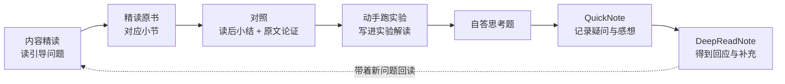

# 《深入理解 AI Agent：设计原理与工程实践》精读笔记

> 这是一本开源书籍的**个人精读笔记库**。它不只是摘抄，而是一套可运行的阅读闭环：
> **用「内容精读」带着问题读原书 → 用「QuickNote」记录疑问与感想 → 用「DeepReadNote」回顾并回应这些问题**，
> 再把实验与思考题沉淀成可检索、可复用、可讨论的知识资产。

[](LICENSE)

---

## 一、这是什么

| 项目 | 内容 |
| --- | --- |
| 笔记对象 | 《深入理解 AI Agent：设计原理与工程实践》，**李博杰** 著 |
| 原书仓库 | [bojieli/ai-agent-book](https://github.com/bojieli/ai-agent-book)（正文 + 编译版 PDF + 按章配套代码，Apache-2.0） |
| 原书背景 | 由图灵《AI Agent 实战营》讲义与国科大课程整理而成；核心公式：**Agent = LLM + 上下文 + 工具** |
| 本仓库性质 | **非官方**个人精读笔记，由读者与 AI 协作产出（见「六、AI 参与说明」） |
| 当前进度 | 第 1–2 章完成；第 3–10 章为占位骨架，**持续更新中** |
| 笔记语言 | 中文 |

**它不是**：原书的替代品，或对原书的完整翻译。**它是**：一份「怎么读这本书」的路线图 + 逐章的结构化理解 + 可动手的实验/思考题脚手架。

## 二、笔记架构

```
Agent Book/
├─ 00-阅读地图.md        ← 全书导航：核心公式、结构图、阅读路径、进度总表
├─ 01-精读笔记规范.md    ← 笔记模板与写作纪律（想复用这套方法的人看这里）
├─ 02-全书术语表.md      ← 跨章术语总表（术语在首次出现章给权威定义）
├─ images/              ← 原书插图副本（figX-Y.*，Apache-2.0，版权归原作者）
├─ 内容精读/            ← 每章「读」：引导问题 / 读后小结 / 原文论证 / 批判性思考
├─ 实验解读/            ← 每章「做」：实验逐条解读 + 动手记录区
├─ 思考题引导/          ← 每章「考」：题目原文 + 提示思路 + 自答留白区
├─ QuickNote/           ← 读者随笔：精读时的疑问与感想（原始记录，不改写）
└─ DeepReadNote/        ← AI 回应：对 QuickNote 的要点总结、逐条回应与补充
```

各目录职责：

| 目录 | 一句话 | 典型内容 |
| --- | --- | --- |
| `内容精读/` | 用来**辅助阅读** | 与前后章的关系、结构大纲、核心概念表、**逐节深析**（引导问题 → 读后小结 → 原文论证）、批判性思考 |
| `实验解读/` | 用来**动手实践** | 每个「实验 X-Y」的目的/设计/关键结论 + **动手记录区**（读者复现后自己填） |
| `思考题引导/` | 用来**自测与思考** | 题目原文 + 星级难度 + 提示思路（不剧透答案）+「我的回答」留白 |
| `QuickNote/` | 用来**记录感受** | 读者精读当章时随手写下的疑问、联想、不理解之处 |
| `DeepReadNote/` | 用来**回顾与闭环** | 对 QuickNote 逐条回应：确认对的、纠正偏的、补充缺的，并给下一步建议 |

## 三、怎么用这套笔记

### 3.1 跟着这本书一起精读（作者本人的用法，推荐）



具体步骤：

1. **读引导问题**：打开 `内容精读/第N章*.md`，找到你要读的小节，先看它的「带着这些问题阅读本节」。这些问题是按原书该小节**实际讲的内容**生成的，用来帮你抓住重点。
2. **精读原书小节**：带着问题去读原书对应段落（原书仓库正文或纸质书）。
3. **对照小结与论证**：读完回来对照「读后小结」（结论层）与「原文论证」（原书证据，逐字引用并标注出处）。
4. **动手做实验**：打开 `实验解读/第N章*.md`，按每个实验的「目的/设计/关键结论」建立预期，跑完原书配套代码后把环境、观察结果、与书中结论的差异填进**动手记录区**。
5. **自答思考题**：在 `思考题引导/第N章*.md` 里先自己写答案（注意：该文件只给提示、不剧透），再对照原书 `reference-answers.md`。
6. **写 QuickNote**：把这一章读下来的疑问、反驳、联想写成 `QuickNote/Quick_note_N.md`。不用讲究文风，写「卡住的地方」最有价值。
7. **读 DeepReadNote**：`DeepReadNote/第N章 回应与补充.md` 会对你的每条笔记做要点总结、逐条回应与补充，并指出这些悬念在后续哪一章会得到解答。

> **为什么这样设计**：读书的损耗主要发生在两处——读的时候没有焦点、读完没有反馈。引导问题解决前者，DeepReadNote 回应解决后者。笔记是否完整不重要，**疑问被追踪到闭环**才重要。

### 3.2 只想快速取用

- **看结论**：直接读 `内容精读/` 里各小节的「读后小结」+「原文论证」。
- **查术语**：`02-全书术语表.md`（每个术语只在其首次出现章给完整定义，避免多处定义打架）。
- **看实验值不值得做**：`实验解读/` 里每个实验都有「目的 + 关键结论」，可以先读结论再决定是否动手。
- **看 AI 问答讨论**：`DeepReadNote/` 是全书里最像「讨论区」的部分。

### 3.3 想复用这套笔记方法（写自己的精读笔记）

`01-精读笔记规范.md` 里有可直接复制的模板与契约，核心是四条：

1. **逐节深析四段式**：引导问题（源自该节正文）→ 读后小结（按原文充实，不是一两句空话）→ 原文论证（逐字引用 + 出处锚点）→ 取舍与延伸。
2. **引用纪律**：原文引用必须逐字一致并给出处（本书无页码，用「章 + 小节标题」锚定）；AI 的判断单独标注，避免与原文混写。
3. **三层标注体系**：`〔原书〕`（书中内容）/`〔补充〕`（书外知识补充）/`〔精读批注〕`（AI 或读者的判断）。
4. **每章三份 + 两条支线**：内容精读、实验解读、思考题引导三份一次产出；QuickNote 与 DeepReadNote 按需触发。

## 四、章节进度与导航

| 章 | 标题 | 内容精读 | 实验解读 | 思考题引导 | DeepReadNote | 状态 |
| --- | --- | --- | --- | --- | --- | --- |
| — | 阅读地图 / 规范 / 术语表 | [地图](00-阅读地图.md) · [规范](01-精读笔记规范.md) · [术语表](02-全书术语表.md) | — | — | — | ✅ |
| 1 | AI Agent 入门 | [内容精读](内容精读/第1章%20AI%20Agent%20入门.md) | [实验解读](实验解读/第1章%20AI%20Agent%20入门.md) | [思考题引导](思考题引导/第1章%20AI%20Agent%20入门.md) | [回应与补充](DeepReadNote/第1章%20回应与补充.md) | ✅ 已精读 |
| 2 | 上下文工程 | [内容精读](内容精读/第2章%20上下文工程.md) | [实验解读](实验解读/第2章%20上下文工程.md) | [思考题引导](思考题引导/第2章%20上下文工程.md) | — | ✅ 已精读 |
| 3 | 用户记忆和知识库 | [内容精读](内容精读/第3章%20用户记忆和知识库.md) | [实验解读](实验解读/第3章%20用户记忆和知识库.md) | [思考题引导](思考题引导/第3章%20用户记忆和知识库.md) | — | ⬜ 未开始 |
| 4 | 工具 | [内容精读](内容精读/第4章%20工具.md) | [实验解读](实验解读/第4章%20工具.md) | [思考题引导](思考题引导/第4章%20工具.md) | — | ⬜ 未开始 |
| 5 | Coding Agent 与通用 Agent | [内容精读](内容精读/第5章%20Coding%20Agent%20与通用%20Agent.md) | [实验解读](实验解读/第5章%20Coding%20Agent%20与通用%20Agent.md) | [思考题引导](思考题引导/第5章%20Coding%20Agent%20与通用%20Agent.md) | — | ⬜ 未开始 |
| 6 | 交互：观察与动作空间的扩展 | [内容精读](内容精读/第6章%20交互：观察与动作空间的扩展.md) | [实验解读](实验解读/第6章%20交互：观察与动作空间的扩展.md) | [思考题引导](思考题引导/第6章%20交互：观察与动作空间的扩展.md) | — | ⬜ 未开始 |
| 7 | Agent 的评估 | [内容精读](内容精读/第7章%20Agent%20的评估.md) | [实验解读](实验解读/第7章%20Agent%20的评估.md) | [思考题引导](思考题引导/第7章%20Agent%20的评估.md) | — | ⬜ 未开始 |
| 8 | 模型后训练 | [内容精读](内容精读/第8章%20模型后训练.md) | [实验解读](实验解读/第8章%20模型后训练.md) | [思考题引导](思考题引导/第8章%20模型后训练.md) | — | ⬜ 未开始 |
| 9 | Agent 的持续进化 | [内容精读](内容精读/第9章%20Agent%20的持续进化.md) | [实验解读](实验解读/第9章%20Agent%20的持续进化.md) | [思考题引导](思考题引导/第9章%20Agent%20的持续进化.md) | — | ⬜ 未开始 |
| 10 | 多 Agent 协作 | [内容精读](内容精读/第10章%20多%20Agent%20协作.md) | [实验解读](实验解读/第10章%20多%20Agent%20协作.md) | [思考题引导](思考题引导/第10章%20多%20Agent%20协作.md) | — | ⬜ 未开始 |

> 「未开始」章节是已建好的骨架文件，含该章主旨与大纲预览，精读后会填充为完整笔记。

## 五、在 GitHub 上浏览的注意事项

本笔记原生为 **Obsidian** 笔记（在 Obsidian 中体验最佳）：

- **内部链接**使用 Obsidian 语法 `[[内容精读/第2章 上下文工程]]`，在 GitHub 上**不会**渲染成可点击链接——请从上文「章节进度与导航」的表格进入各章文件。
- **提示框** `> [!info] ...`、`> [!question] ...` 在 GitHub 上显示为普通引用块（信息不丢失，只是样式不同）。
- **frontmatter**（文件开头的 YAML 属性）在 GitHub 上会渲染成一张表格。
- **图片**使用相对路径 `../images/`，已随仓库提交，可正常显示。
- **想要完整体验**：把仓库 clone 下来，让 `Agent Book/` 作为 Obsidian 库的根目录（或整体放进你的库中）——注意保持 `images/` 与 `内容精读/`、`实验解读/`、`思考题引导/` 同级，否则图片路径会失效。

## 六、AI 参与说明

这些笔记是**人机协作**产物：读者负责阅读、判断、动手实验与提出疑问；AI（DeepSeek Harness）负责结构化整理、原文比照、实验归纳，以及 DeepReadNote 中的逐条回应。

因此请注意：

- `〔原书〕` 标注的内容来自原书，引用经过逐字核验并给出处；
- `〔补充〕` 是原书之外的知识补充（如 RL 基础、API/SDK 概念辨析），**不代表原书观点**；
- `〔精读批注〕` 是 AI 或读者的判断，**可能有偏差**，欢迎质疑；
- 一切以[原书](https://github.com/bojieli/ai-agent-book)为准。

## 七、引用、版权与致谢

- **原书**：《深入理解 AI Agent：设计原理与工程实践》，李博杰 著，[bojieli/ai-agent-book](https://github.com/bojieli/ai-agent-book)，**Apache License 2.0**。
- `images/` 中为本笔记引用到的原书插图副本，版权归原作者所有，依 Apache-2.0 使用并保留署名；`内容精读`、`实验解读`、`思考题引导` 中的原文引用均标注出处（章 + 小节标题）。
- **本仓库的笔记内容**（各章节笔记、规范、地图、术语表、QuickNote、DeepReadNote）采用 **Apache License 2.0**（见 [LICENSE](LICENSE)）。
- 致谢：感谢作者李博杰开源此书与配套代码；本笔记的所有原书内容版权归原作者。

## 八、反馈与更新日志

**反馈**：笔记中的错误、不同理解、补充建议，欢迎开 [Issue](https://github.com/KLucen/ai-agent-book-note/issues) 讨论。若问题出在原书内容本身，建议提到[原书仓库](https://github.com/bojieli/ai-agent-book/issues)。

**更新日志**：

| 日期 | 变更 |
| --- | --- |
| 2026-09-08 | 建立笔记体系（阅读地图 / 精读规范 / 全书术语表 / 图像资源）；完成第 1 章三份笔记（内容精读、实验解读、思考题引导） |
| 2026-09-10 | 新增 QuickNote / DeepReadNote 支线：读者随笔与 AI 回应；完成第 1 章 DeepReadNote |
| 2026-09-10 | 第 2 章「上下文工程」精读完成（内容精读 + 实验解读 + 思考题引导）；笔记规范升级 v2.2（引导问题源自小节正文、读后小结按原文充实、每图配原书解读） |
| — | 第 3–10 章：待精读（骨架已就位） |
