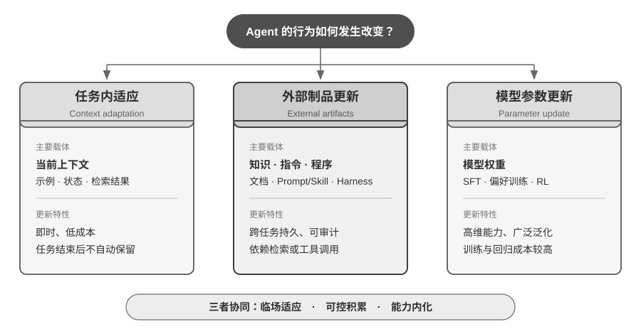
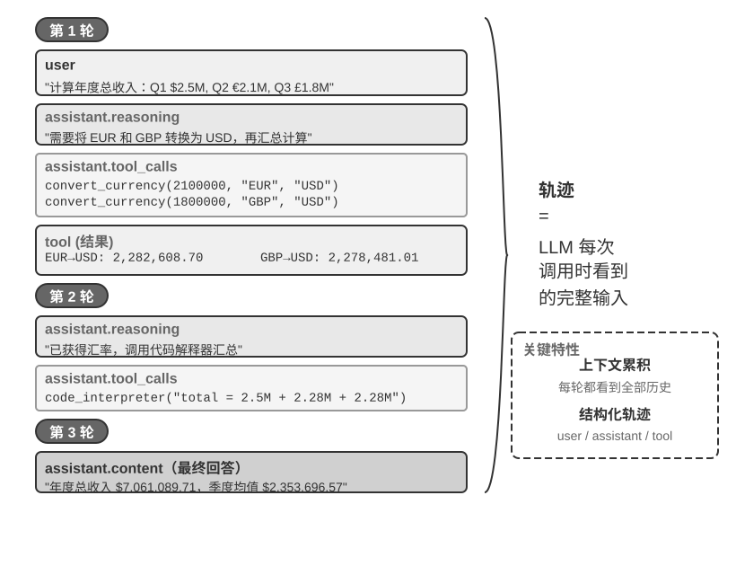

# 第1章 AI Agent 入门（内容精读）

> [!info] 一句话主旨
> 本章是全书的概念地图：建立核心公式（**Agent = LLM + 上下文 + 工具**）、ReAct 运行循环、Harness 工程与护栏框架，为后续章节提供统一术语与参照坐标。读完应能回答：Agent 的边界在哪、能力杠杆是什么、可靠运行的保障机制有哪些。

## 与前后章的关系

- **与引言的关系**：引言抛出「Agent = LLM + 上下文 + 工具」总公式与全书结构；本章是它的第一个展开——把公式落实为边界、循环、组件与工程分层。
- **承上启下**：本章自身是第一部分「构建 Agent」（第 1–6 章）的总纲：
  - 向后接 **第 2 章**（上下文工程）：「眼睛」的内部结构——静态前缀/轨迹的 API 形态、KV Cache、提示工程、Skills、状态栏、压缩；
  - 向后接 **第 3 章**（用户记忆与知识库）：上下文中「用户记忆、RAG 外部知识」两块跨会话内容的展开；
  - 向后接 **第 4 章**（工具）：「手脚」的五类工具、MCP 与执行层安全；
  - 向后接 **第 5 章**（Coding Agent）：验证与纠正机制在 Coding Agent 中的完整实践；
  - 向后接 **第 6 章**（交互）：观察与动作空间在模态、时序上的扩展；
  - 遥指 **第 7–9 章**（评估/后训练/持续进化）：「三层学习机制」中参数更新路径与评估方法论的伏笔；**第 10 章**（多 Agent）把单 Agent 编排与「提议者—审核者」扩展到群体。

## 结构大纲（导览注）

- **§1 现代 Agent = LLM + 上下文 + 工具**：三组件与 Agent/Environment 边界（图1-1）→ 观察/动作空间即能力杠杆 → 工具五类速览 → LLM 大脑（含「模型即 Agent」、三层学习机制）→ 上下文五部分 → ReAct 循环（轨迹示例）
- **§2 Harness 工程：模型之外的竞争力**：可靠性缺口与五要素 → 范式演进（提示→Graph 工程）→ 三条核心原则 → 模型选型五维 → 编排模式（工作流 vs 自主）→ 护栏三层 → 五要素与全书结构的对应
- **§3 贯穿全书的设计模式**：一次性命名五条复用模式
- **§4 本章小结**；**§5 思考题**（见 [[思考题引导/第1章 AI Agent 入门]]）

## 核心概念表

| 术语 | 一句话定义 | 原书出处 | 延伸 |
| --- | --- | --- | --- |
| LLM | Agent 的决策内核（大脑）：理解意图、拆解任务、持续判断 | §「LLM：Agent 的大脑」 | 后训练见 [[内容精读/第8章 模型后训练]] |
| 上下文 | Agent 在每个决策点收到并保留的信息表示（眼睛） | §「上下文：Agent 的眼睛」 | [[内容精读/第2章 上下文工程]] |
| 工具 | Agent 感知或改变外部世界的接口（手脚），分感知/执行/协作/事件触发/用户沟通五类 | §「工具：Agent 的手脚」 | [[内容精读/第4章 工具]] |
| Environment | Agent 边界之外、与之闭环交互的世界；不是 Agent 的组成部分 | §「现代 Agent = LLM + 上下文 + 工具」 | — |
| 观察空间 / 动作空间 | Agent 与环境的接口边界：没进上下文的观察「不存在」，没被动作接口允许的操作只能停留在文字建议 | §「观察空间与动作空间」 | — |
| 工具调用 Tool Calling | 模型以结构化方式声明调用外部工具：声明→决策→执行回传→下一步 | §「工具：Agent 的手脚」 | [[内容精读/第2章 上下文工程]] |
| 轨迹 Trajectory | 执行中不断积累的动态消息历史；**上下文 = 静态前缀 + 轨迹** | §「ReAct 循环」 | — |
| 静态前缀 | 系统提示词 + 工具定义（每次调用不变的部分） | §「上下文：Agent 的眼睛」 | — |
| 上下文五部分 | 系统提示词、工具定义（静态）；用户消息、模型回复、工具执行结果（动态） | §「上下文：Agent 的眼睛」 | 实验 1-1 |
| 消融实验 Ablation | 逐一移除组件以判断真实贡献的实证方法 | §「上下文：Agent 的眼睛」 | 实验 1-1、[[内容精读/第7章 Agent 的评估]] |
| 三层学习机制 | 上下文适应 / 外部产物更新 / 参数更新：临场适应、可控积累、内化难言能力 | §「Agent 的学习机制」 | 第 2、3–5、8、9 章 |
| 模型即 Agent | 后训练（尤其 RL）把工具调用**决策策略**内化为模型原生能力；工具执行仍在框架/服务端 | §「模型即 Agent」 | 实验 1-2/1-3、[[内容精读/第8章 模型后训练]] |
| Model–Harness | Agent 边界内双部件视图：Model = 策略决策；Harness = 运行与治理层 | §「现代 Agent = LLM + 上下文 + 工具」 | — |
| Harness 五要素 | 上下文管理 + 工具接口 + 约束 + 验证 + 纠正 | §「Harness 工程」 | 第 2–5 章 |
| 范式演进 | 提示工程 ⊂ 上下文工程 ⊂ Harness 工程 ⊂ Loop 工程 ⊂ Graph 工程 | §「从提示工程到 Loop 工程」 | — |
| ACI / 防呆 | 从 Agent 视角设计工具接口；用设计消除误用（Poka-yoke） | §「构建有效 Agent 的核心原则」 | [[内容精读/第4章 工具]] |
| 工作流 / 自主 Agent | 确定性代码路径编排 vs 依环境反馈实时决策的循环 | §「编排模式」 | [[内容精读/第10章 多 Agent 协作]] |
| 适配层 | 给模型能力短板打补丁的 Harness 代码；会被模型内化 | §「编排模式」 | 实验 1-4 |
| 护栏 Guardrails | 按被绕过难度分层：上下文层 / 执行层 / 数据层 | §「护栏与安全性」 | 第 2、4、5 章 |
| 人在回路 | 超失败阈值或高风险操作时移交人工的控制机制 | §「人工干预」 | — |
| 五条设计模式 | 提议者—审核者、渐进式披露、只增不改、边界集+保留集、最小 diff+可回滚 | §「贯穿全书的设计模式」 | 全书复用 |

> 完整定义见 [[02-全书术语表#第一章 AI Agent 入门|术语表·第一章]]。

## 逐节深析（先带问题读原书，再对照小结与原文论证）

### §1.1 现代 Agent = LLM + 上下文 + 工具：三组件各自的角色

> [!question] 带着这些问题阅读本节
> 1. 这一节用「大脑、眼睛、手脚」分别比喻 Agent 的哪三个组成部分？读完后不看正文，你能把**每个部分在 Agent 中负责什么**各用一句话讲清吗？
> 2. 书中说三者的理解都是「广义但边界清楚」的：LLM 不只是模型参数、上下文不只是输入文本、工具不只是 API——各自的「广义」体现在哪、边界又划在哪？
> 3. 直觉层（大脑/眼睛/手脚）、实现层（LLM/上下文/工具）与学术层（Policy/观察与历史/观察·行动接口）如何对应？书中为什么说这种对应「不是严格的一一等同」？

**读后小结**：

- **最小工程公式**：Agent = LLM + 上下文 + 工具。公式的「+」表示工程组件的组合（不是 RL 的形式化定义），且只描述 **Agent 边界之内**的实现——不包含与之交互的 Environment。
- **三组件角色**（正文用大脑/眼睛/手脚逐层展开）：
  - **LLM = 大脑**：不只是模型参数，而是整个**决策内核**——解析真实意图、把复杂任务拆成可执行步骤、执行中持续判断下一步。其能力来自两部分：预训练积累的世界知识与语言能力 + 后训练固化的决策策略。
  - **上下文 = 眼睛**：不只是输入文本，而是 Agent **在每个决策点收到并保留的信息表示**——环境观察、用户记忆、领域知识、自身状态、任务进展都在其中。
  - **工具 = 手脚**：Agent 用来**感知或改变外部世界**的接口——工具定义、调用协议、适配器；范围从预定义工具、动态生成代码，到委托子 Agent 协作、主动与用户沟通。
- **与 RL 视角的映射**（书中表格）：大脑=LLM=**策略 Policy**（决定下一步做什么）；眼睛=上下文构造=**观察与历史**（把观察与历史组织成决策信息）；手脚=工具与适配器=**观察/行动接口**（规定可读哪些观察、可发哪些行动及格式）。注意映射不严格：上下文只是观察在 Agent 内部的**表示**，不等于整个观察空间；工具定义接口，而工具背后的对象仍属于环境。
- **Agent 与 Environment 是闭环两方**（图1-1 外层）：环境不断返回观察，Agent 依上下文选择行动，行动改变环境状态，新状态产生新观察——这是理解所有 Agent 交互的最小结构。

**图1-1 解读**：原书说明本图「同时给出了两个抽象层次」——**外层**是 Agent 与 Environment 的交互关系：环境包含文件、数据库、网页、用户、其他 Agent 以及物理或仿真世界，Agent 只能通过观察和行动接口与它交互；**内层**是 Agent 的 **Model–Harness 结构**：Model 负责策略决策，Harness 是环绕模型的运行与治理层，负责构造上下文、暴露工具接口、维护循环和状态，并实施权限、验证与纠正（原书 §「现代 Agent = LLM + 上下文 + 工具」）。读图要点：Harness 可以创建、隔离或代理一个环境，但环境自身的状态与转移规律始终在 Agent 边界之外。

**原文论证**：

> Harness 可以创建、隔离或代理一个环境，却不因此包含环境自身的状态与转移规律。（原书 §「现代 Agent = LLM + 上下文 + 工具」）

> LLM 的能力也来自两部分：预训练所积累的世界知识与语言能力，以及后训练所固化的决策策略（原书 §「LLM：Agent 的大脑」）

**取舍与延伸**：本图是全书坐标图——后续记忆（第 3 章）、工具安全（第 4 章）、Computer Use/机器人（第 6 章）都用「观察空间/动作空间/环境归属」定位问题；「眼睛」隐喻有偏差须校正：上下文还包含工具定义，即 Agent「看到」的信息里也包括「有哪些手脚可用」。

### §1.1.1 观察空间与动作空间：模型与世界的接口

> [!question] 带着这些问题阅读本节
> 1. 观察通道与动作接口在 Agent 和环境之间分别承担什么？为什么说没进入上下文的观察「对模型来说就像不存在」、没被动作接口允许的操作「只能停留在文字建议上」？
> 2. 书中给出的核心判断是：底层模型固定时，提升任务表现最主要的系统工程手段是什么？为什么许多「需要更聪明模型」的问题其实只是接口问题？
> 3. Manus 把哪三类 Agent 的观察/动作空间合并进同一个产品？OpenClaw 又把接口延伸到了哪里？两者比较，谁跨越了更大的数据边界、靠什么？
> 4. 书末的产品表格里，各产品在眼睛/手脚/策略三列上有什么共性？

**读后小结**：

- **接口即边界**：观察通道 + 动作接口共同构成 Agent 与外部环境的边界。Harness 把环境观察转成上下文，再把模型选定的行动转成对环境的工具调用；两个方向任一缺失，Agent 就「看不见」或「做不了」。
- **能力杠杆判断**：模型固定时，最主要的系统工程手段就是**重新定义或扩展观察空间与动作空间**（=扩展上下文和工具）。很多看似需要更强模型的问题，只是把任务所需数据纳入上下文、或把所需操作封装成工具即可解。
- **案例一 · Manus = 空间并集**：此前生产级 Agent 沿 Deep Research、Coding、Computer Use 三条路线各自发展；Manus 率先把三者放进同一生产级 Agent——虚拟浏览器扩大观察空间，文件系统、代码执行与命令行扩大动作空间。它靠的不是换更强的模型，而是取三类空间之并。
- **案例二 · OpenClaw = 边界外推**：通过 WhatsApp/Telegram/Slack/Discord/iMessage 等消息渠道接收任务与返回结果（可随时被触达），用本地 Gateway 连接 Google Drive、Notion 与本地文件系统，把分散账号与设备里的数字文件在用户授权后纳入同一观察空间。对照：早期 Manus 以隔离云沙盒为中心、需上传文件或配置连接器，本地优先的 OpenClaw 跨越了更大的数据边界（Manus 后来补 Google Drive 与桌面本地访问，反向印证「产品演进 = 观察/动作空间演进」）。
- **五个产品的共性**（Cursor、Deep Research、Browser Use、豆包、Pine AI）：都使用**开放式的动作空间**（能生成任意自然语言与代码，而非有限按钮）、都能**内部思考**（行动前先规划）、都能**持续交互**（按环境反馈调整策略）。

**原文论证**：

> 没有通过观察通道进入上下文的信息，对模型来说就像不存在；没有被动作接口允许的操作，模型即使知道该怎么做，也只能停留在文字建议上。（原书 §「观察空间与动作空间」）

> 它没有仅靠替换一个更强的模型来成为通用 Agent，而是取三类 Agent 观察空间与动作空间的并集，使同一个 Agent 能跨越原有产品边界完成任务。（原书 §「观察空间与动作空间」，论 Manus）

> 相较于早期 Manus 以隔离云端沙盒为中心、往往需要上传文件或另行配置连接器的形态，本地优先的 OpenClaw 跨越了更大的数据边界。（原书 §「观察空间与动作空间」）

**取舍与延伸**：扩展必须按需进行并配权限控制（空间扩大 = 攻击面与复合错误风险同步扩大）；本章小结把它列为全书第一条能力杠杆，第 6 章（模态与时机）与第 10 章（Agent 群体）都是它的延伸。

### §1.1.2 工具：Agent 的手脚

> [!question] 带着这些问题阅读本节
> 1. 工具按 Agent 与外界的互动方向分哪五类？每类的代表场景是什么？其中「事件触发工具」的特殊之处在哪——它还是 Agent 主动「调用」的工具吗？
> 2. 工具调用（Tool Calling）的四步流程是什么？为什么说这个流程就是后文 ReAct 的基础？
> 3. 设计工具时「先窄后宽」怎么理解？为什么任务升级后要换成受限的代码解释器而不是不断叠加专用工具？通用执行器要付出什么代价（以代码解释器为例）？
> 4. 为什么支付、删数据这类高风险操作反而要用「专用工具」？工具设计的核心原则是哪句话？

**读后小结**：

- **五类工具**（按互动方向分，第四章展开体系）：

| 类别 | 作用方向 | 代表场景 | 特征 |
| --- | --- | --- | --- |
| 感知工具 | 环境 → Agent | 搜索引擎、文件读取、API/数据库 | 让 Agent 访问信息 |
| 执行工具 | Agent → 环境 | 代码执行、文件操作、系统命令 | 让 Agent 改变世界 |
| 协作工具 | Agent ↔ 其他 Agent/人 | 委托子 Agent、关键决策点请求人类确认 | 分工与确认 |
| 事件触发工具 | 外部 → Agent | 新邮件、定时、Webhook 回调 | **非主动调用**：事件激活 Agent 开工 |
| 用户沟通工具 | Agent → 用户 | 文字消息、语音、邮件 | 传递进展与主动关怀 |

- **事件触发工具的本质**：它是 Environment 向 Agent 提供观察的通道，驱动 Agent **开始**执行任务，与前三类「Agent 主动调用」的方向相反——书中因此把它归入**广义**工具体系。
- **工具调用四步**：① 上下文里声明工具（名称/用途/参数）→ ② 模型自主判断是否调用、调哪个、传什么参数 → ③ 执行结果被追加到上下文 → ④ 模型据此决定下一步。四步循环即 ReAct 的基础。
- **先窄后宽 + 通用/专用分工**：只做四则运算就给个参数清晰的**计算器**；要读表、清洗、统计、绘图时，**受限 Python 解释器**比不断叠加专用工具更容易组合与探索。通用性的代价是出错与攻击面扩大：代码须在隔离沙盒运行、默认不能访问网络、不能读授权目录外文件，并对执行时间/CPU/内存/输出设上限。长程任务则用**受控虚拟工作目录**（计划、中间结果、日志、产物同放一处以便接续），同样限路径/容量/文件类型并防越界。
- **核心原则**：

> 通用基础能力用于组合与探索；专用工具用于约束高风险和强业务规则操作。（原书 §「工具：Agent 的手脚」）

- **工具质量的三个失败模式**：接口不清 → 模型乱用；错误处理不到位 → 调用失败即死锁；权限过宽 → 出错后果不可挽回。MCP 标准正在让工具接入更容易。

**原文论证**：上文核心原则为逐字引用；「五类工具」分类与「事件适配器同样是 Environment 向 Agent 提供观察的通道」均为本节论点（原书 §「工具：Agent 的手脚」）；沙盒约束要点见「工具设计」段落转述（同上）。

**取舍与延伸**：本节是第 4 章（工具）与第 6 章（事件触发/用户沟通/异步运行时）的总预告；「事件触发归入工具」的分类一致性在第 6 章还会再讨论。

### §1.1.3 LLM：Agent 的大脑

> [!question] 带着这些问题阅读本节
> 1. LLM 的「理解—规划—执行」式决策能力来自什么？书中为什么说「用户说的往往不是他真正想要的」——意图解析难在哪？
> 2. LLM Agent 的独特能力「内部思考」是什么？为什么它能进行有效的内部推演，而不是像传统 RL Agent 那样靠随机试错？

**读后小结**：

- **决策核心**：LLM 收到请求后先解析真实意图，再把模糊/复杂的任务拆成可执行步骤，执行中持续判断下一步（是否调用工具、调哪个、传什么参数）。==这种 “理解-规划-执行” 的能力来自预训练所积累的知识，==是工作流和自主 Agent 都依赖的基础。
- **内部思考机制**：行动之前先规划与推演，**不改变外部环境**却能显著提升行动质量。推演可行，是因为==预训练==阶段习得的是「人类知识中已经沉淀下来的逻辑规则」——数学定律、因果关系、问题分解策略等；因此 LLM Agent 与经典 RL Agent 不同：不是盲目的随机探索，而是在**结构化的知识体系上展开**。

**原文论证**：

> 收到用户的请求后，它需要先解析真实意图（用户说的往往不是他真正想要的），再将模糊或复杂的任务拆解成可执行的步骤。（原书 §「LLM：Agent 的大脑」）

> LLM Agent 的一个独特能力是内部思考——在采取实际行动之前，Agent 可以先进行规划与推演。这一过程不改变外部环境，却能显著提升后续行动的质量。（原书 §「LLM：Agent 的大脑」）

**取舍与延伸**：这条「知识引导的推演而非盲目探索」是全书看待 Agent 智能的基础假设；它与第 8 章「为什么 LLM 的 RL 与经典 RL 不同」直接相关。

#### 模型即 Agent：当模型本身成为产品

> [!question] 带着这些问题阅读本节
> 1. 「模型即 Agent」范式里，模型通过后训练把**什么**内化为原生能力？内化的是「决策策略」还是「工具的执行」？
> 2. 作者为什么说模型越强、Harness 越关键？「Harness」一词（马具）的比喻想说明什么？
> 3. 面对《苦涩的教训》（人类编码的 Harness 终将被能扩展的通用方法吃掉），本书的立场是什么？「方向认同、节奏务实」具体指什么？

**读后小结**：

- 先进模型经后训练（尤其 RL）把**工具调用决策策略**内化：何时调用工具、调哪个、传什么参数、拿到结果后是否继续、如何把几十上百次调用串联成连贯推理——都由模型自主决定，无需人工编排。
- **内化的边界（常见误解）**：RL 写进参数的是**决策**；工具本身及其**执行**（web_search 的真实实现、沙盒、调用发起与结果回传）始终由 Agent 框架或 API 内置工具提供。编排循环没有消失——从客户端移到服务端，决策权交给模型。
- **模型越强，Harness 越关键**：马具的比喻——缰绳不是限制马的奔跑，而是把力量引向正确方向。模型自主决策空间越大，出错影响面越大，越需要精细的约束、验证与纠正；模型厂商的优势是模型与外围 Harness 的**协同优化**，而非「让框架变薄」。
- **对《苦涩的教训》的立场 = 方向认同、节奏务实**：不怀疑模型会持续「吃掉」Harness（工具调用、长程规划都曾靠外部编排，如今已是模型原生能力）；但「吃」的过程远比想象慢——训练以月计，模型无法一次内化真实业务中所有约束与偏好。**模型此刻的能力边界，就是 Harness 此刻的价值所在**。

**原文论证**：

> 何时调用工具、调哪个、传什么参数，都由模型自己决定，无需人工编排。（原书 §「模型即 Agent」）

> Harness 工程不是对苦涩的教训的抵抗，而是这一教训在工程时间尺度上的实践：模型还做不稳的，Harness 先补上；模型每内化一层，Harness 就卸下一层，转而兜底新的能力前沿。（原书 §「模型即 Agent」）

**取舍与延伸**：「卸下一层、兜底新前沿」意味着要定期审计 Harness 里哪些补丁已被新模型内化（实验 1-4 与第 5、8、9 章反复呼应）；实验 1-2/1-3 分别用 Kimi K3 与 GPT-5.6 实例化本小节。

#### Agent 的学习机制：从上下文适应到持久更新

> [!question] 带着这些问题阅读本节
> 1. Agent 的行为改变按「更新发生的位置和持续时间」可分为哪三条路径？各自更新的是什么、跨什么时间尺度？
> 2. 各自适合什么类型的能力？为什么说「外部产物」可审计可修订、而「参数更新」部署贵却能自然泛化？
> 3. 为什么说三条路径是「协同机制」而非「互斥分类」？它们分别对应后续哪些章节？

**读后小结**（图1-2）：

| 路径 | 更新位置 | 时间尺度 | 优点 / 局限 | 展开章节 |
| --- | --- | --- | --- | --- |
| 上下文适应 | 当前任务的上下文（示例、状态、检索结果） | 任务内 | 快、低成本；受上下文窗口与信息组织方式约束；不改变持久状态 | 第 2 章 |
| 外部产物更新（artifact） | 知识文档；Prompt 或 Skill；程序与 Harness | 跨任务 | 可审计、可修订；使用仍需经上下文或工具接口 | 第 3–5 章；第 9 章（如何从已评价轨迹生成更新） |
| 参数更新 | 模型参数（后训练） | 训练周期 | 部署成本高；能泛化难以显式表达的高维能力（医疗影像理解、语言风格、隐式决策策略） | 第 8 章 |

- 按**可回滚程度**从高到低排列：上下文适应 > 外部产物 > 参数。
- 任务内的即时调整（上下文）负责临场，跨任务的经验（外部产物）负责可控积累，难言的能力（参数）负责内化——三者不是互斥选项。

**图1-2 解读**：本图把 Agent 的能力更新按「发生的位置与持续时间」分成三个层次（原书 §「Agent 的学习机制」）：任务内的上下文适应、跨任务的外部产物（artifact）更新、训练周期中的参数更新；图上三个层次与各自的载体（上下文/文档·Prompt·程序/模型参数）对应，从左到右持久性递增、可回滚性递减。

**原文论证**：

> 三条路径因此不是互斥分类，而是不同时间尺度上的协同机制：上下文负责临场适应，外部产物负责可控积累，参数负责内化难以显式表达的能力。（原书 §「Agent 的学习机制」）

### §1.1.4 上下文：Agent 的眼睛

> [!question] 带着这些问题阅读本节
> 1. 从 API 的视角看，每次调用 LLM 时上下文由哪五个部分构成？前两项（系统提示词、工具定义）与后三项（用户消息、模型回复、工具执行结果）在动态性上有什么不同？
> 2. 模型回复（assistant 消息）最多包含哪三个部分？什么情况下它们「不一定同时出现」（各举一种典型场景）？
> 3. 系统提示词与用户每次输入的提示词有什么区别？它相当于 Agent 的什么？
> 4. 要验证上下文每个组件是否不可或缺，书中推荐什么方法？为什么说它像医生诊断？

**读后小结**：

- **上下文五部分**：

| 部分     | 动态性 | 内容与作用                                                                |
| ------ | --- | -------------------------------------------------------------------- |
| 系统提示词  | 静态  | 开发者编写、对话全程不变；相当于 Agent 的「岗位说明书」——身份、权限、行为准则；可含跨会话的**用户记忆**与动态注入的环境状态 |
| 工具定义   | 静态  | 声明工具名称、功能描述与参数格式；无它 Agent 无法调用任何工具（但不会因此停下来，见实验 1-1）                 |
| 用户消息   | 动态  | 用户输入；可含 RAG 动态检索引入的外部知识（覆盖训练截止后的信息与私有领域知识）                           |
| 模型回复   | 动态  | 含 reasoning（思考过程）+ content（文本）+ tool_calls（工具调用请求），三者可部分出现           |
| 工具执行结果 | 动态  | 框架执行工具后的返回；是 Agent 下一步思考的依据，也让它能从结果学习、避免重复犯错                         |

- **静态前缀 + 动态历史**：前两项构成保持不变的静态前缀；后三项构成随交互增长的消息历史（工具 schema 在 2026 年后的生产框架中也可按需动态加载到上下文末尾而不破坏前缀——见第 2、4 章）。
- **模型回复的组成规律**：调工具时通常只有 reasoning + tool_calls（不直接说话）；给出最终回答时通常只有 reasoning + content（不再调工具）。
- **验证方法 = 消融实验**：逐一去掉组件看系统是否还正常，判断各组件真实贡献（实验 1-1 即对四组件做系统性消融）。

**原文论证**：

> 系统提示词由开发者编写，在整个对话过程中保持不变，相当于 Agent 的“岗位说明书”——定义它的身份、权限和行为准则。（原书 §「上下文：Agent 的眼睛」）

> 在一次具体的回复中，三者不一定同时出现：例如 Agent 决定调用工具时通常只有 `reasoning` + `tool_calls`，给出最终回答时通常只有 `reasoning` + `content`。（原书 §「上下文：Agent 的眼睛」）

> 工具定义与系统提示词一起构成对话中保持不变的静态前缀（原书 §「上下文：Agent 的眼睛」）

**取舍与延伸**：静态前缀与轨迹的划分是第 2 章 KV Cache 前缀缓存讨论的基础（前缀越稳定、缓存越值钱）；「无工具定义时模型仍会给出笃定答案」预告了实验 1-1 与第 7 章评估的必要性。

### §1.1.5 ReAct 循环

> [!question] 带着这些问题阅读本节
> 1. ReAct 的名字只有 Reasoning 和 Acting 两个词，实际循环为什么是**三个**环节？「想→做→看」的循环什么时候结束？
> 2. 「轨迹」指什么？为什么说每次调用 LLM 时「上下文 = 静态前缀 + 轨迹」——这种结构让 Agent 在长任务里凭什么不迷路？
> 3. 看最小运行骨架伪代码：Model、Harness、Environment 各自只负责什么？为什么「决策里没有工具调用」就可以返回答案？
> 4. 轨迹除了推动当前任务，还有哪些「资产」用途？

**读后小结**：

- **ReAct 三环节**：思考（当前该做什么）→ 行动（调用工具）→ 观察（看工具结果）→ 再思考……循环直至任务完成。名字只体现 Reasoning+Acting，机制上是三个环节。
- **轨迹与上下文公式**：轨迹 = 执行中不断积累的消息历史（用户消息、模型回复——含思考过程与工具调用、工具执行结果）；**上下文 = 静态前缀 + 轨迹**。每次调用模型都能看到完整轨迹（静态前缀自动拼接在轨迹前），因此清楚任务进度、尝试过什么、得到什么结果。
- **运行示例**（多币种收入汇总，图1-4）：3 次迭代、4 次工具调用——第一次迭代并行发起 3 个汇率换算调用（EUR/GBP/JPY→USD）并收到结果；第二次迭代调用代码解释器做汇总计算；第三次迭代输出最终答案。可见独立工具调用可并行执行。
- **骨架分工**（Python 风格伪代码，不可直接运行）：Model 只负责基于 context 生成 decision；Harness 负责组装上下文、校验（validate）并执行工具；Environment 负责真实状态变化与观察。退出条件：decision 无工具调用即返回答案。
- **轨迹的结构化价值**：可解释、可调试（消息角色分明）；分析大量轨迹可发现行为模式、优化决策路径、改进工具设计；轨迹可沉淀进知识库，或用于强化学习训练更好的模型——形成从经验学习的闭环。

**图1-4 解读**：该图以「多币种收入汇总」任务展示一条真实 ReAct 轨迹的构成（原书 §「ReAct 循环」）：自上而下依次是用户消息 → 第一次迭代的模型回复（reasoning + 三个并行的 convert_currency 工具调用）→ 三条工具执行结果 → 第二次迭代（reasoning + code_interpreter 调用）→ 汇总工具结果 → 第三次迭代的最终回答；注意轨迹中不含系统提示词与工具定义——它们作为静态前缀在每次调用时自动拼接。

**原文论证**：

> 轨迹是 Agent 在执行任务过程中不断积累的消息历史——用户消息、模型回复（包括思考过程和工具调用）、工具执行结果。（原书 §「ReAct 循环」）

> 伪代码不能直接运行，也不对应某个 SDK。具体的可执行代码在本书配套代码仓库中。（原书 §「ReAct 循环」）

**取舍与延伸**：这是全书一切架构图的「基线循环」；第 2 章给出完整 API 消息循环，第 6 章的事件驱动、第 10 章的多 Agent 通信都在此骨架上增删。注意骨架里还没有 verify/correct——那是 §2.1 生产形态的扩展。

### §2.1 Harness 工程：模型之外的竞争力

> [!question] 带着这些问题阅读本节
> 1. 前面的机制已经能跑，为什么还说 Demo 和可靠产品之间「有巨大的鸿沟」？脆弱点具体指哪几类失败？
> 2. 生产形态下公式如何展开？Harness 的五个要素各自负责什么（各举一个书中的例子）？「约束」的故障安全默认值是什么意思？
> 3. Harness 与 Environment 的边界如何判定？为什么说「物理部署位置不能决定概念归属」？
> 4. 五要素闭环中，Verify 为什么强调只看结构化数据而不看模型自由文本？Correct 为什么要求「在确认无法恢复之前不暴露中间态」？

**读后小结**：

- **脆弱点**：模型可能产生幻觉（编造不存在的工具或参数）、选错工具、遇到错误无法自我恢复——能跑的 Demo ≠ 可靠的产品。
- **生产形态公式**：**Agent = Model + Harness**；**Harness = 上下文管理 + 工具接口 + 约束 + 验证 + 纠正**。最小 Demo 只需 Model + 上下文/工具；生产系统必须加后三层。例：退款 Agent 把政策放进上下文、用权限与金额规则约束调用、用数据库状态验证结果、超时重试或回退。
- **五要素职责（书中表格）**：Context 提供感知信息（系统提示词、知识库、Agent 状态栏、Sidecar 旁路查询）；Tools 提供接口（MCP、代码解释器、搜索）；Constrain 设行为边界，采用**故障安全默认值**——能力默认关闭、显式开放（Claude Code 每个工具默认需用户授权）；Verify 自动判断结果对错，**只看结构化数据**（如工具返回的 JSON 字段），因为模型自由文本可能已被提示注入操纵（Linter、类型系统）；Correct 自动修正或回退，工具失败先静默重试、不把半成品暴露给用户，连续失败熔断回退人工。
- **边界判据**：Harness = 「==Agent 边界内、模型之外==」的运行与治理层。工具定义、调用适配器、沙箱权限与重置机制 ∈ Harness；沙箱内随行动变化的文件与进程、外部数据库、网页、用户、物理世界 ∈ Environment。**部署位置不决定归属**：仿真环境与 Agent 同进程也仍是 Environment。
- **重心不对称**：早期框架重心在「上下文与工具」（能做事）；生产级系统重心已转向「约束、验证与纠正」（可靠地做事）——Claude Code 的 Harness 大部分代码即流程状态管理、多层上下文压缩、权限分类、熔断器、错误恢复机制。

**原文论证**：

> 一个能跑的 Demo 和一个可靠的产品之间还有巨大的鸿沟，而这些脆弱点正是 Harness 工程要解决的问题。（原书 §「Harness 工程」）

> 行业正在从“能做事”向“可靠地做事”转变，Harness 工程因此成为 Agent 系统的核心竞争力。（原书 §「Harness 工程」）

（原书 §「Harness 工程」五要素表转述）Constrain（约束）：设定行为边界，采用故障安全默认值——所有能力默认关闭、必须显式开放（类似手机 App 权限管理；实例：Claude Code 中每个工具默认需要用户授权才能执行）；Verify（验证）：自动判断操作结果对错，安全检查只看结构化数据（如工具返回的 JSON 字段），不看模型自由生成的文本，因为后者可能已被提示注入操纵。

**取舍与延伸**：五要素与第 2–5 章的对应关系见 §2.7 的表；「Verify 不看模型文本」这条在 Coding Agent（第 5 章用测试输出验证）中反复出现。

### §2.2 从提示工程到 Loop 工程：工程范式的演进

> [!question] 带着这些问题阅读本节
> 1. 五个阶段的名称与各自关注对象是什么？（提示工程→上下文工程→Harness 工程→Loop 工程→Graph 工程分别管什么？）
> 2. 这五个阶段是替代关系还是层层包含？「竞争优势转移到模型之外的工程实践」这句话的依据是什么（LangChain 的 Terminal Bench 2.0 案例）？
> 3. Graph 工程是 2026 年 7 月才出现的新实践吗？作者提醒我们怎么看待这类「新命名」？

**读后小结**：

- **五阶段一览**：提示工程（优化输入指令）→ 上下文工程（系统性管理模型能看到的所有信息：指令/工具定义/历史/外部知识）→ Harness 工程（Agent 边界内模型之外的运行与治理）→ Loop 工程（跨轮次持续自主运转：谁发现下一件事、何时验证、何时算真正完成）→ Graph 工程（把循环、确定性程序与人工审批组织成显式执行图：节点=能力、边=路由与依赖、结构化状态沿边传递并在关键边界持久化）。
- **包含而非替代**：提示 ⊂ 上下文 ⊂ Harness ⊂ Loop ⊂ Graph；每一层在前一层上扩展工程师的关注范围。单个 Agent 循环只是执行图中的一个节点。
- **例证**：LangChain 在 Terminal Bench 2.0（评估 Agent 在终端环境完成复杂任务的基准）从 52.8% 提升到 66.5%、由排行榜 30 名开外进入前 5——改变的**不是模型而是 Harness**：自动检查执行结果、检测重复循环、优化思考策略。
- **命名观**：Graph 工程等术语是对早已存在的实践（LangGraph、MS Agent Framework、Google ADK 的图编排）的归纳——「实践在前，命名在后」。
- **结论**：模型能力趋同时，竞争差异转移到模型之外的工程实践。

**原文论证**：

> 当各家模型的能力越来越接近、不再是决定性的差异因素时，竞争优势就转移到了模型之外的工程实践。（原书 §「从提示工程到 Loop 工程」）

> 这五个阶段不是替代关系，而是层层包含的：提示工程是上下文工程的子集，上下文工程是 Harness 工程的子集，Harness 工程又是 Loop 工程的子集，Loop 工程又是 Graph 工程的子集——单个 Agent 循环正是执行图中的一个节点。（原书 §「从提示工程到 Loop 工程」）

**取舍与延伸**：读行业文章时可用此框架判断「新实践 vs 旧实践的新名字」；第 10 章的多 Agent 系统即 Loop/Graph 层面的内容。

### §2.3 构建有效 Agent 的核心原则

> [!question] 带着这些问题阅读本节
> 1. Anthropic 总结的三条原则是哪三条？每条原则分别针对什么失效（盲区、信任、误用）？
> 2. 「保持简单」为什么成立？复杂框架的隐藏成本是什么？
> 3. ACI（Agent-Computer Interface）与传统的、给程序员设计的 API 有什么不同？「防呆」（Poka-yoke）思想如何落到接口设计上（SIM 卡、微波炉的例子说明什么）？

**读后小结**：

- **原则一 · 保持简单**：从最简单方案开始，只在必要时加复杂度；直接 API 调用优于复杂框架，清晰代码优于聪明抽象——每多一层抽象都会成为日后调试的新盲区。
- **原则二 · 保持透明**：明确显示规划步骤、执行日志、决策轨迹——不只是为调试，也是用户建立信任的前提；黑箱里的错误外部观察者既无法定位也无法纠正。
- **原则三 · 设计好工具接口（ACI）**：从 **Agent 的视角**设计接口（让模型容易理解与使用），而不是传统 API 的程序员视角。命名与参数要直观；容易误用的地方要**从设计上让错误无法发生**——SIM 卡缺角只能一个方向插入、微波炉门未关好就绝不加热，制造业称之为「防呆」（Poka-yoke，源自丰田生产体系）。
- **为什么接口如此重要**：模型与工具之间唯一的沟通通道就是接口本身，模糊的接口会被模型放大成系统性的错误。

**原文论证**：

> 每多一层抽象都会成为以后调试时新的盲区。（原书 §「构建有效 Agent 的核心原则」）

> 设计不好的工具会让再强的模型也频繁出错——因为模型与工具之间唯一的沟通通道就是接口本身，模糊的接口会被模型放大成系统性的错误。（原书 §「构建有效 Agent 的核心原则」）

**取舍与延伸**：ACI 是第 4 章「工具描述的艺术」与「参数传递保真性」的理论起点。

### §2.4 如何选择模型

> [!question] 带着这些问题阅读本节
> 1. 闭源与开源模型在能力差距、成本、部署上有哪些取舍？书中给出「选模型时不要只看排行榜」的替代做法是什么？
> 2. 「模型的策略边界」指什么？为什么基准测试具备的能力不等于你的产品能用（结合网络安全/蒸馏/隐私等例子）？
> 3. 为什么说绝大多数 Agent 需要支持思考（Reasoning）的模型？哪两类例外不需要？
> 4. 除成本外还有哪两个容易被忽视的选型维度（给出书中的量化例子）？

**读后小结**（五维选型框架）：

1. **闭源 vs 开源**：闭源（OpenAI GPT/o 系、Anthropic Claude 系）通常能力领先但成本高、受厂商 API 策略限制；开源与闭源差距约 6 个月以内、成本显著低，可私有化部署、可微调定制，适合成本敏感/数据合规场景（国内 DeepSeek、Kimi、GLM 的 Agent 能力较强）。不同模型**工具调用能力差异大**，选型前务必在自己场景测试。
2. **策略边界**：模型有能力 ≠ 产品允许你调用（网络安全、模型蒸馏、隐私数据、高风险操作各有厂商策略）；同一任务在聊天产品、Coding Agent、API 中结果可能不同。业务关键任务要备人工接管或合规替代模型。
3. **思考（Reasoning）能力**：多步思考、工具选择等复杂决策基本离不开；例外只有单步简单任务或 Computer Use 中点击固定位置的简单 GUI 操作。
4. **输出速度**：Agent 多轮推理串行等待，输出 token 速度直接决定端到端延迟——20 轮 × 每轮慢 2 秒 = 多等 40 秒。
5. **多模态**：需要理解图片/音频/视频时是硬性要求，模型间差异大。

**原文论证**：

> 选模型时不要只看排行榜，要在你自己的任务上做评估（见第七章）。（原书 §「如何选择模型」）

> 模型在基准测试中具备某种能力，并不意味着承载它的产品一定允许用户调用这种能力。（原书 §「如何选择模型」）

**取舍与延伸**：「在自己任务上评估」正是第 7 章评估方法论的动机；本章实验 1-2/1-3 的动手过程就是最简评估样例。

### §2.5 编排模式：工作流与自主

> [!question] 带着这些问题阅读本节
> 1. 作者给出的构建顺序是什么（单次调用→？→？）？为什么一开始就搭复杂工作流是常见反面教材（记忆提炼流水线错在哪）？
> 2. 「Less structure, more intelligence.」（Manus）怎么理解？哪些东西应该用程序固化、哪些应该留给模型？
> 3. 工作流模式的两个核心优势是什么？「安全性来自确定性」的机制是什么？它最大的局限是什么？
> 4. 自主 Agent 与工作流的本质区别是什么？为什么必须显式设计停止条件？适合什么任务？
> 5. 两种模式怎么混合？「先由自主 Agent 写出工作流、再由工作流执行」妙在哪里？

**读后小结**：

- **从简单到复杂**：先单个 LLM 调用（优化提示词/示例能解决就不上系统）→ 需要多步且可固定分解时用**工作流** → 需要动态决策与灵活路径时才用**自主 Agent**。Agent 系统通常以延迟与成本换任务性能，要谨慎评估交换值不值。
- **反面教材**：「从百万条聊天记录提炼个人记忆」的流水线（切分对话 → 提取/证据核验/身份解析/整理/合并复核 Agent → 事实图+覆盖账本+不可变版本）——每个部件都有道理，组合起来低效不可靠：固定拓扑遇到新例外只能继续加节点，模型本可用上下文做的语义判断被写死。
- **好结构的标准**（Manus 的取舍）：给能力足够的 Agent 清晰目标、必要上下文与可组合工具，用自然语言交代查证/比较/处理冲突的方式；程序只固化**必须始终成立的边界**（权限、不得覆盖原始材料、原子发布）。只有业务约束要求、或评估反复暴露某类稳定失败时，才把对应步骤升级为验证器/独立 Agent/确定性流程。

> 好的结构不是替 Agent 预演全部思考，而是守住边界，并把边界内的决策空间还给模型。（原书 §「编排模式」）

#### 工作流模式：确定性的编排

- **定义**：用预定义代码路径编排 LLM 与工具；节点间流转代码写死，LLM 只在节点内部理解与生成。订机票例：核实身份 → 搜索航班 → 完成付款 → 确认预订，顺序强制执行（「付款前不能预订」不依赖 LLM 判断）。
- **优势 1 · 严格流程控制**：关键步骤不可跳过或乱序，业务规则代码化。
- **优势 2 · 安全性**：路径确定 → 提示注入或模型犯错最多影响当前节点内部，攻击面被限制在单节点内。
- **局限 · 缺乏变通**：预设流程未覆盖的情况（付款时临时改签、航班取消需替代方案）只能走异常分支或交还人类。
- **文生图例子与适配层**：用户大白话 → 节点 1 用 LLM 改写为 SD 风格提示词 → 节点 2 生成图片。改写节点是给「听不懂人话」的生图模型打补丁，这类代码称为**适配层**；换成原生图像生成的多模态模型（Nano Banana 2、GPT-Image 2）后适配层被内化、节点消失（实验 1-4 对照验证）。

#### 自主 Agent：动态自主决策

- **定义与区别**：执行路径不是预先定义，而是 Agent 根据环境反馈**实时决定**；本质就是 ReAct——循环中使用工具的 LLM。
- **能力要求**：自主规划 + 识别失败、调整策略（而非出错就停）。
- **停止条件必须显式设计**：任务完成 / 达到最大迭代次数 / 遭遇不可恢复错误，否则死循环或过度执行。常见退出条件：调用最终输出工具、模型返回无工具调用的响应、出错、达最大轮数。
- **适用场景**：开放式问题——难以预测所需步骤数（SWE-bench 修 Issue、Computer Use、迭代式研究）。代价：更高成本 + 潜在复合错误；缓解：沙盒充分测试、护栏监控、关键决策点人机检查点。

**图1-6 解读**：原书以该图示意自主 Agent 的执行循环（§「自主 Agent」）：Agent 接收用户请求后进入「思考→行动→观察」的迭代（即 ReAct 循环），每一步行动由环境反馈驱动下一步决策，直到满足退出条件——调用最终输出工具、返回不含工具调用的响应、出错或达到最大轮数——才结束并把结果交给用户。

#### 两种模式的选择与混合

- **同系统混合**：n8n 等平台可在一个系统里同时使用工作流节点与自主 Agent 节点（合规关键段用工作流、灵活段用自主）。
- **「Agent 写工作流，工作流去执行」**：Agent 读完任务自行决定拓扑并生成编排代码，一旦生成，执行退回确定性——既有面对未知任务的灵活性，又不必让模型在每次调度上参与决策（第 10 章展开）。
- **框架表阅读要点**（Codex Harness / Claude Agent SDK / LangChain-LangGraph / n8n / Dify / CrewAI / OpenClaw / DeepSeek Harness / Pi）：选型不按框架复杂度，而看**能否用尽可能少的抽象层让你专注业务逻辑**；框架迭代很快，学会具体框架不重要。

**图1-7 解读**：这是 n8n（可视化工作流自动化开源框架）的编辑器界面截图（原书 §「两种模式的选择与混合」）：开发者通过可视化界面拖拽功能组件构建 Agent，该图展示工作流自动化系统的实际形态——原书用它说明可在同一系统中同时使用工作流节点与自主 Agent 节点。

**原文论证**：

> 自主 Agent 与工作流的核心区别在于：执行路径不是预先定义的，而是 Agent 根据环境反馈实时决定的。（原书 §「自主 Agent」）

> 由于执行路径是确定的，提示注入或模型犯错最多只能影响当前节点内部的处理，无法让 Agent 跳到不该执行的分支——攻击面被限制在单个节点内。（原书 §「工作流模式」）

> 常见的退出条件包括：调用最终输出工具、模型返回没有任何工具调用的响应，或者遇到错误、达到最大轮数。（原书 §「自主 Agent」）

> n8n 是一个成熟的工作流自动化开源框架……可以在同一个系统中同时使用工作流节点和自主 Agent 节点。（原书 §「两种模式的选择与混合」）

### §2.6 护栏与安全性（含人工干预）

> [!question] 带着这些问题阅读本节
> 1. 三层护栏分别管什么（看到什么/能做什么/世界被改成什么样）？为什么按「被绕过的难度」排序而不是请求处理顺序？
> 2. 上下文层有哪四种机制？Anthropic Constitutional Classifiers 的三个设计点是什么？两级筛查为什么能兼顾成本与体验？这一层的「结构性上限」是什么？
> 3. 执行层的核心机制（工具风险评级）看哪些维度？为什么「复核必须由上下文之外的机制完成」？为什么输出检查（PII 过滤等）也属于执行层？
> 4. 数据层凭什么「不依赖上面两层是否正确」也能兜底？
> 5. 人工干预的两类触发条件是什么？为什么护栏评估还要测「误拒绝」？

**读后小结**：

- **三层结构**（按被绕过的难度从低到高——越靠下越不依赖模型自身判断，越难被一次攻击穿透；后续各章安全讨论都挂在这棵树上）：

| 层 | 管什么 | 核心机制（书中列举） |
| --- | --- | --- |
| 上下文层 | 模型能看到什么（内容进上下文前拦截） | 相关性分类器、安全分类器、内容审核、基于规则的保护（黑名单/长度限制/正则）；来源标注与「指令/数据」分离（第 2 章展开） |
| 执行层 | 模型能做什么（动作生效前验证） | 工具风险评级（可逆性/权限等级/财务影响→低中高）+ 上下文之外复核（独立审查进程、最小权限凭证、沙盒、人在回路）；输出检查（PII 过滤、与品牌一致的输出验证） |
| 数据层 | 世界最终能被改成什么样 | 行级安全策略、约束与校验器、受控视图与存储过程、受信任运行时绑定的访问上下文（第 5 章展开） |

- **越狱 vs 提示注入**：越狱是用户自己试图绕过模型安全限制；提示注入是攻击者经外部数据（网页内容、文档）间接操纵模型行为。
- **Constitutional Classifiers（Anthropic）三点**：① 规则驱动——自然语言规则生成合成数据训练输入输出分类器；② 上下文联合判断——把用户提问与模型回答放在一起检查（识破「食品调味料=化学试剂暗语」这类单看无问题的回答）；③ 两级筛查——极轻量探针（直接读模型内部激活、几乎零成本）扫全部对话，可疑再交更强分类器复审，第一级误报多也不伤体验、成本大降。
- **上下文层的结构性上限**：处在同一上下文里的 Agent 很难判断自己是否已被注入——本层只能降低成功率、给不出保证，必须有下面两层。
- **人工干预（人在回路）**：两类触发——超过失败阈值（重试/操作次数上限）；高风险操作（敏感、不可逆，如授权大额退款/付款，至少在团队建立信心之前）。价值：不损害体验地提升性能、部署早期识别失败模式与边缘情况、建立健壮评估周期。
- **误拒绝也是失败**：护栏评估要双侧——既测「应当拒绝的请求被拦截」，也测「明确允许的请求能正常完成」。

**原文论证**：

> 越狱是用户自己试图绕过模型的安全限制，提示注入则是攻击者通过外部数据（如网页内容、文档）间接操纵模型行为。（原书 §「护栏类型」）

> 处在同一个上下文里的 Agent，很难判断自己是否已经被注入。（原书 §「护栏类型」）

> 这类复核必须由上下文之外的机制完成——独立的审查进程、最小权限凭证、沙盒隔离、人在回路——否则它会和被注入的 Agent 一起沦陷。（原书 §「护栏类型」）

> 这一层的价值在于它不依赖上面两层是否正确——即使提示注入得手、生成的代码完全漏写了权限判断，越权操作仍会在数据层被拒绝。（原书 §「护栏类型」论数据层）

**取舍与延伸**：三层是防护纵深而非处理时序；第 2 章（提示注入）、第 4 章（工具权限）、第 5 章（代码执行安全、信任边界下移）分别给出每层实现细节。「自审不可靠」这条结论同时是 §3 设计模式「提议者—审核者」成立的依据。

### §2.7 Harness 五要素与「构建」部分的对应

> [!question] 带着这些问题阅读本节
> 1. 全书到底有几套结构骨架？「Agent = Model + Harness」与「Agent = LLM + 上下文 + 工具」是什么关系，为什么作者专门澄清？
> 2. 五要素分别对应第 2–5 章的哪些内容（含安全关注点）？为什么第 6–10 章不硬塞进五要素？
> 3. 安全在全书里按什么方式组织？Anthropic 把长任务拆成「初始化 Agent + 执行 Agent」解决了模型的什么问题？

**读后小结**：

- **只有一套骨架**：全书结构是 Agent = LLM + 上下文 + 工具（第 1–6 章构建、7–9 章评估与进化、10 章协作）；Model + Harness 是同一事物在生产形态下的展开——把「上下文、工具」细分为上下文管理、工具接口、约束、验证、纠正五项职责，是「构建」部分内部的一个观察视角，**不是**覆盖全书的另一套目录。
- **五要素 ↔ 章节对应**（书中表格）：

| Harness 要素 | 对应章 | 核心内容 | 安全落点 |
| --- | --- | --- | --- |
| 上下文管理 | 第 2 章 | 提示工程、Agent 状态栏、上下文压缩、Agent Skills | 提示注入、上下文污染 |
| 上下文管理（跨会话） | 第 3 章 | 用户记忆、RAG、结构化索引、智能体化 RAG | 敏感信息暴露、隐私 |
| 工具接口与约束 | 第 4 章 | 工具分类、权限控制、MCP、主动工具发现 | 误操作、未授权访问、不可逆操作 |
| 验证与纠正 | 第 5 章 | Coding Agent 的 Harness、测试驱动、代码化规则 | 身份冒用、责任归属 |

- **范围外章节的理由**：第 6 章扩展观察/动作空间本身的模态与时机；7–9 章回答「怎么知道 Harness 建对了、怎么让它持续变好」；第 10 章把单个 Harness 换成多 Agent 协作结构——塞进五要素只会让格子失去区分力。
- **安全是横切关注点**：贯穿全书、按三层护栏组织，上表只是每章在三层里的主要落点。
- **长任务结构实践（Anthropic）**：拆成「初始化 Agent」（设置环境、分解任务列表）与「执行 Agent」（会话内增量推进、留清晰交接产物）——用结构化 Harness 解决模型自身的「上下文耗尽」与「过早声明完成」。

**原文论证**：要点转述自原书 §「Harness 五要素与「构建」部分的对应」（含两张表）；「初始化/执行 Agent」案例见该节末段。

### §3 贯穿全书的设计模式

> [!question] 带着这些问题阅读本节
> 1. 五条设计模式分别叫什么？各自的核心纪律是什么？「防的失效」各是什么？
> 2. 提议者—审核者为什么要求产出与评判**不共享上下文**？它与护栏那节的哪条结论同源？
> 3. 只增不改为什么能换来「可缓存、可重放、可审计」？边界集+保留集防的是哪两类错误（把过拟合当进步 / 把无效修改当安全）？

**读后小结**：

| 模式 | 核心纪律 | 防的失效 | 本书应用点 |
| --- | --- | --- | --- |
| 提议者—审核者 Proposer-Reviewer | 产出与评判分属两个不共享上下文的角色；评判方只见产物（渲染结果、测试输出、结构化参数），不见推理过程 | 自审不可靠：同一上下文难发现自身盲区、难判断是否已被注入 | 第 3 章知识更新、4 章工具调用事前审批/事后验证（Sidecar 为只读变体）、5 章 PPT/视频/日志实验、7 章 UI 评估、9 章更新提案审核、10 章对等协作 |
| 渐进式披露 Progressive Disclosure | 先给可检索目录，再按需加载细节 | 上下文预算与选择精度双输 | Skills（元数据常驻、正文按需）、分层检索、主动工具发现与分页截断、Agent 发现 |
| 只增不改 Append-only | 状态只追加、已写内容不再回头改 | 缓存作废、无法重放与审计 | KV Cache 前缀稳定性（改动越靠前、作废缓存越多）、事件式记忆、工具 schema 追加到轨迹末尾而非插回前缀 |
| 边界集 + 保留集 Boundary/Retention Set | 修改同时在「应改变样本」与「不应影响样本」上验证 | 只测前者→把过拟合当进步；只测后者→把无效修改当安全 | 回归任务、训练与评估隔离、更新提案验证 |
| 最小 diff + 可回滚 | 修改尽量小、带来源、可单独回滚 | 出错无法归因 | 知识更新、代码补丁、Prompt/程序更新 |

- 三条更新路径（§1.1.3 学习机制）恰好按**可回滚程度从高到低**排列——与「最小 diff」模式同构。
- 作者在此一次性命名，后续每章出现时回链本节。

**原文论证**：

> 它成立的前提是自审不可靠：同一个上下文中的模型难以发现自己的认知盲区，也很难判断自己是否已被注入。（原书 §「贯穿全书的设计模式」论提议者—审核者）

**取舍与延伸**：五条模式都是「工程纪律」（约束而非能力）；精读后续章节时建议每章自问——本章哪些设计是这些模式的实例化，这是建立跨章抽象最快的方式。

### §4 本章小结（原书七条要点）

1. **Agent = 大脑 + 眼睛 + 手脚**：LLM 决策、上下文决定能看到什么、工具决定能做什么，三者缺一不可；
2. **扩展眼睛和手脚是最主要的能力杠杆**：模型固定时，接口边界扩大常把不可解任务变可解（Manus/OpenClaw）；须按需扩大并配权限控制；
3. **眼睛（上下文）是决定性因素**：静态前缀 + 动态轨迹；消融显示组件不等价（丢工具定义/工具结果 = 丢行动与闭环；丢其他取决于能否从观测重建）；
4. **Harness 是竞争力所在**：约束/验证/纠正 =「可靠地做事」；
5. **编排顺序**：先提示词 → 工作流 → 最后自主 Agent；无通用最优解，Agent 用延迟与成本换性能；
6. **五条设计模式贯穿全书**；
7. **安全是架构问题**：从第一行代码考虑；护栏三层按被绕过难度组织。

## 批判性思考（聚焦 Agent 本身）

### Agent 概念与边界

- **五类工具的归类一致性**：事件触发工具被归入「广义工具」，但书中同时承认它本质是 Environment→Agent 的**观察通道**——那么「工具」到底指动作接口还是所有接口？分类学上这暗示「工具」标签承载了两类不同性质的接口，后续章节（第 4 章工具、第 6 章事件驱动）需留意作者是否保持同一口径。
- **「上下文是决定性因素」的适用范围**：本章把它作为构建期论断（模型固定时）；但实验 1-2/1-3 又展示 RL 正把「何时调用工具」的决策内化——上下文工程与后训练两条路的能力边界在哪？读第 8 章时可带着这个问题验证「SFT 记忆、RL 泛化」能否解释二者的分工。

### Agent 可靠性与安全

- **自审不可靠 = 单体上下文 Agent 的固有弱点**：上下文层「给不出保证」+「提议者—审核者」成立前提，二者共同暗示：凡安全关键判断，设计上都应外置（独立验证器/人在回路/数据层强制），「越依赖模型自觉越危险」可当作设计检验句。
- **护栏三层缺少定量评估标准**：书中说防误拒绝要与防漏放行并测，但没给「什么比例算合格」；只有第 7 章评估方法论能补上——读第 7 章时应回填本章护栏的验收指标问题。

### Agent 能力演进与工程策略

- **「适配层会被内化」是一把双刃剑**：它既是好消息（Harness 可瘦身），也意味着 Agent 团队必须建立「适配层清点 + 模型升级后逐项复测」的节奏，否则会持续维护已被内化的死代码——这是实验 1-4 结论的工程化推论，书中未展开。
- **「模型会吃掉 Harness」的节奏假设可证伪吗？**「方向认同、节奏务实」依赖「模型内化速度 < 业务约束增长速度」；这个假设没有给出观测指标（如：每个模型大版本后 Harness 代码删除率）。若某天模型升级带来的是约束性 Harness 增长（而非卸载），该立场需要修订——值得作为长期观察点。
- **五要素是分类学不是设计手册**：它告诉我们好系统长什么样，但没回答「新项目按什么顺序建」；书中唯一给出的优先级信号是「生产重心转向约束/验证/纠正」。对资源有限的团队，这个排序依据值得显式化（是否先工具接口 + 事后验证，再补事前约束？）。

### Agent 经验论断的时效性

- 实验 1-1 明说同一消融换新模型可能结论不同——说明本章多处「经验性结论」（组件重要性、某模型表现、框架定位表）是**模型相关**的；机制性内容（边界、闭环、护栏纵深）才穿越周期。精读时应把两类分开对待。

## 本章新术语 → 术语表

本章首次引入的术语已全部录入 [[02-全书术语表#第一章 AI Agent 入门|术语表·第一章]]（约 33 条：Agent/上下文/静态前缀/轨迹/Harness 五要素/护栏三层/五条设计模式等）。后续章节仅回链，不重复定义。

## 我的批注（留白区）

| 疑问/心得 | 状态  |
| ----- | --- |
|       |     |

---

*精读日期：2026-09-08 · 原文：`D:\ObsidianRepository\book\chapter1.md`（库外只读）。实验解读见 [[实验解读/第1章 AI Agent 入门]]，思考题见 [[思考题引导/第1章 AI Agent 入门]]，规范见 [[01-精读笔记规范]]。*
