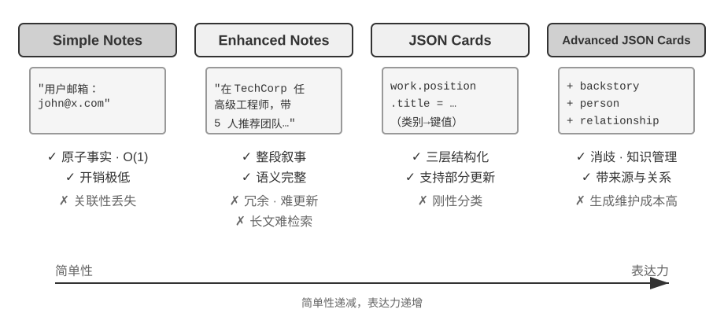
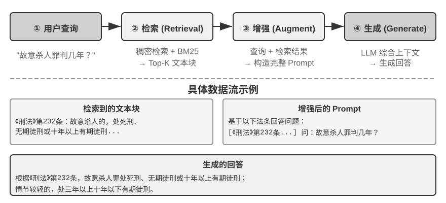
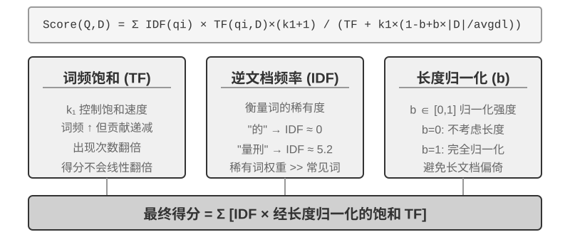
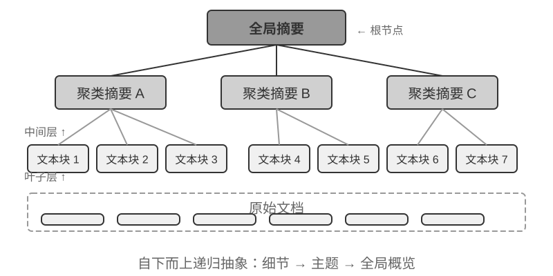
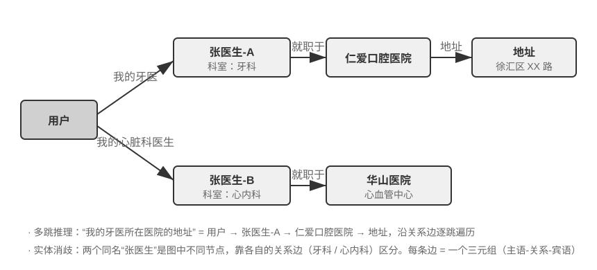
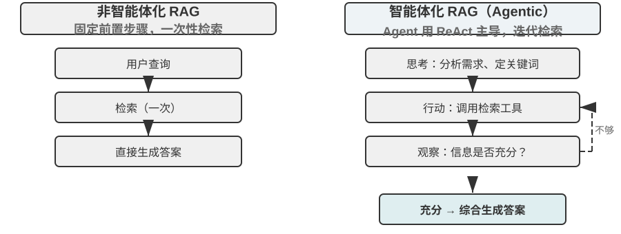
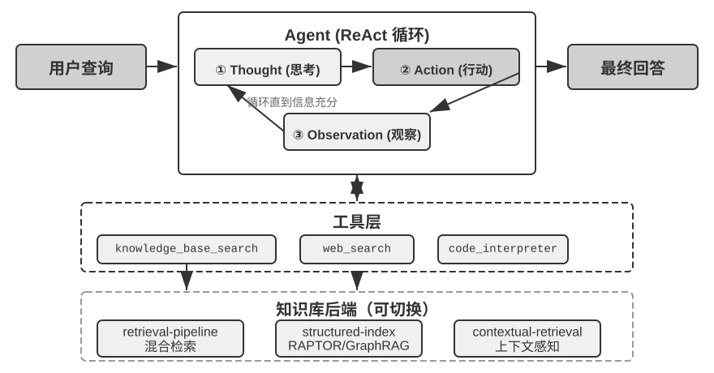
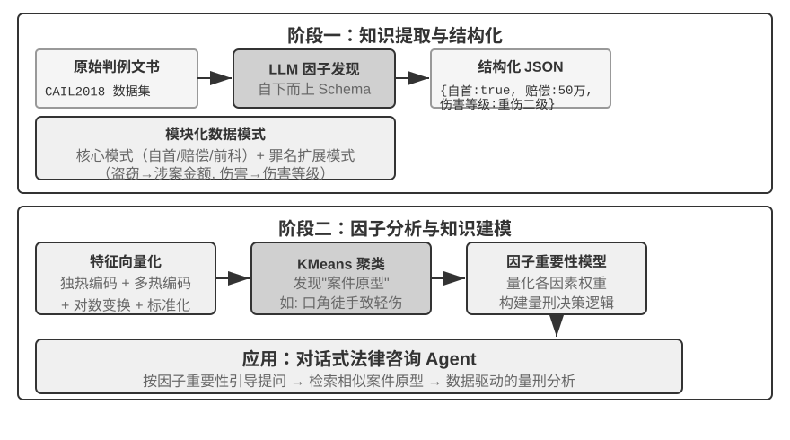

# 第3章 用户记忆和知识库（内容精读）

> [!info] 一句话主旨
> 第 2 章解决「一次交互内」的上下文；本章解决「对话结束后仍然记住」：把持久知识分成**用户记忆**（个体尺度）与**知识库**（群体尺度），并给出两套技术栈——记忆的表示/管理（四种格式 → 可执行代码 → 压缩整理 → 隐私）与知识的检索（分块 → 稠密/稀疏 → 融合重排 → 结构化索引 → 智能体化 RAG → 上下文感知检索），最终在「双层记忆架构」上汇合。

## 与前后章的关系

- **承接第 2 章**：本章把第 2 章的上下文管理扩展到跨会话——轨迹（第 1 章定义）成为工作记忆的载体，第 2 章的「只增不改」「渐进式披露」「来源标记」在本章分别落到事件日志、L0/L1/L2 按需加载、检索内容注入防御上。
- **向后接第 4 章**（工具）：本章的检索、写入、记忆维护都要通过工具暴露；第 4 章展开工具分类与 MCP，多模态提取也在第 4 章继续。
- **向后接第 7 章**（评估）：本章的三层次评估框架与 LLM-as-a-judge 是第 7 章评估方法论的先声。
- **向后接第 9 章**（持续进化）：本章的「增量更新 + 定期整理」与「睡眠学习」是同一机制的两个尺度；本章建的是第 1 章循环里的**提案段**（把证据变成最小、可审查、可回滚的修改）。
- **第 10 章**（多 Agent）：本章的 Proposer/Reviewer 异源互审、租户隔离会在多 Agent 协作与权限边界上继续。

## 结构大纲（导览注）

- **§3.0 两个尺度**：用户记忆 vs 知识库——同问题不同尺度，共用向量检索与知识压缩，也共同面对冲突、过期、检索不准。
- **§3.1 用户记忆系统**：从对话中提取记忆（选择性/抽象化/结构化）→ 评估标尺（LoCoMo、八项能力、三层次框架：基础回忆/多会话检索/主动服务）。
- **§3.2 记忆的层次结构**：**放哪里**——轨迹（只增不改的原始事件）、用户长期记忆（跨会话档案）、业务状态（任务阶段抽象）。
- **§3.3 四种存储格式**：**怎么存**——Simple Notes → Enhanced Notes → JSON Cards → Advanced JSON Cards（含选择标准）。
- **§3.4 可执行代码**：User as Code——类型化状态 + 规则函数，预写日志 + 检查点，把「表示」和「推理」统一到可验证介质。
- **§3.5 认知科学基础**：**存什么**——工作记忆/情景/语义/程序记忆，以及三套分类体系（层次 × 格式 × 认知类型）正交。
- **§3.6 记忆框架案例**：Mem0（写入时消歧 → 检索时推理的演进）、Memobase（画像 + 事件）、多类型记忆协同参考架构。
- **§3.7 压缩与整理**：三层（重要性评分 → 聚类摘要 → 抽象泛化）。
- **§3.8 隐私保护**：本地模型做日志脱敏（PII 检测，混合正则策略）。
- **§3.9 RAG 基础**：检索器 + 生成器；分块三策略与块大小/重叠的权衡；上下文丢失的伏笔。
- **§3.10 稠密嵌入**：向量空间与余弦相似度、Word2Vec → 上下文感知、ANN（ANNOY vs HNSW）。
- **§3.11 稀疏嵌入**：BoW → TF-IDF → BM25（词频饱和 k1、长度归一化 b）、倒排索引。
- **§3.12 混合检索**：并行检索 → RRF 融合 → 神经重排序（双编码器 vs 跨编码器）；三个指标 recall@k / MRR / nDCG。
- **§3.13 超越扁平文本**：两个反例（黑猫白猫计数、Xfinity 资格边界）证明「索引阶段必须提炼」。
- **§3.14 结构化索引**：RAPTOR（递归聚类+摘要成树）与 GraphRAG（三元组、多跳、实体消歧、语义降级局限）。
- **§3.15 文件系统范式**：OpenViking 的 `viking://` 虚拟 URI + L0/L1/L2 三层 + Markdown/Git + 链接前提。
- **§3.16 知识更新**：增量更新（知识库当代码库、PR 四步、三层分离、异源互审）+ 定期整理（去重合并、回原始核查、冲突场景限定）+ 失效下线 + 权限过滤。
- **§3.17 智能体化 RAG**：从被动管道到主动探索者；安全边界（间接注入 / 知识库投毒 / 两层防御）。
- **§3.18 上下文感知检索**：索引期给分块补前缀摘要；与「上下文感知压缩」的加减法之辨；49%/67% 的失败率降幅。
- **§3.19 从结构化数据提取深度知识**：司法判例——两阶段（结构化 + 因子分析）、one-hot 编码、聚类原型。
- **§3.20 多模态记忆**：三条思路（原图+文本、嵌入入上下文、嵌入入参数/Engram）。
- **§3.21 本章小结**；**12 个实验**见 [[实验解读/第3章 用户记忆和知识库]]，**9 道思考题**见 [[思考题引导/第3章 用户记忆和知识库]]。

## 核心概念表

| 术语 | 一句话定义 | 原书出处 | 延伸 |
| --- | --- | --- | --- |
| 用户记忆 | 针对单个用户的个性化持久记忆，构建专属于该用户的知识模型 | 章开篇 | — |
| 知识库 | 面向所有用户共享的集体知识（法规、流程、专业文档） | 章开篇 | — |
| 记忆提取三规则 | 选择性（丢短期细节）+ 抽象化（归纳长期偏好）+ 结构化（可检索字段） | §用户记忆系统 | — |
| 三层记忆评估框架 | 基础回忆（结构化信息存取）→ 多会话检索（跨会话推理）→ 主动服务（预见性整合） | §记忆能力的评估 | 第 7 章 |
| LoCoMo | 长篇多轮对话记忆基准（平均约 300 轮、最多 35 个会话） | §记忆能力的评估 | — |
| 轨迹 / 长期记忆 / 业务状态 | 单会话只增不改的原始事件；跨会话稳定信息（档案）；任务逻辑阶段抽象 | §记忆的层次结构 | 第 1 章、第 6 章 |
| 四种存储格式 | Simple Notes / Enhanced Notes / JSON Cards / Advanced JSON Cards（粒度与结构递进） | §用户记忆的四种存储格式 | — |
| Advanced JSON Cards | 在事实之外加入 backstory / person / relationship / 时间戳，解决消歧与「为谁」存储 | §用户记忆的四种存储格式 | — |
| User as Code | 用带类型的可执行状态 + 规则函数替代文本记忆，让表示与推理共用可验证介质 | §进阶知识表示形态 | — |
| 情景 / 语义 / 程序记忆 | 具体事件 / 抽象知识 / 行为流程（认知科学三分法在 Agent 的对应） | §用户记忆的认知科学基础 | — |
| 工作记忆 | 上下文窗口中经筛选激活的动态子集（区别于不可变轨迹） | §记忆框架案例 | — |
| Mem0（v2/v3） | v2 写入时消歧（ADD/UPDATE/DELETE/NOOP），v3 仅追加 + 混合检索 + 时间排序 | §记忆框架案例 | — |
| Memobase | 用户画像（可配置槽位）+ 事件记忆（时间线）+ 缓冲批处理 | §记忆框架案例 | — |
| 记忆压缩三层 | 重要性评分（频率/衰减/情感/独特性）→ 聚类摘要 → 抽象泛化为语义/程序记忆 | §记忆压缩与整理机制 | — |
| 日志脱敏 | 用本地小模型做 PII 检测与脱敏（结构化/半结构化/自然语言），召回率 95%+ | §隐私保护（实验 3-3） | — |
| 分块 Chunking | 把长文档切成适合独立检索的片段；固定大小/递归结构感知/语义切分 | §文档分块 | — |
| 稠密嵌入 | 把文本映射到向量空间，语义相近则向量方向相近（用余弦相似度度量） | §稠密嵌入 | — |
| 稀疏嵌入 / BM25 | 高维稀疏向量做精确关键词匹配；BM25 = IDF 加权 + 词频饱和 + 长度归一化 | §稀疏嵌入 | — |
| 倒排索引 | 从「词 → 包含它的文档」的反向映射表 | 实验 3-5 | — |
| 混合检索 | 稠密 + 稀疏并行召回，融合后重排序 | §混合检索 | — |
| RRF | 倒数排名融合：抛开原始得分只看排名，得分 = Σ 1/(k + rank) | §混合检索 | — |
| 双编码器 / 跨编码器 | 查询与文档独立编码比相似度（快）vs 拼接后深度交互打分（准） | §混合检索 | — |
| recall@k / MRR / nDCG | 找没找到 / 找得靠不靠前 / 整个排序好不好 | §混合检索 | 第 7 章 |
| 结构化索引 | 索引前先用 LLM 归纳抽象建关联：RAPTOR（树）与 GraphRAG（图） | §结构化索引 | — |
| 语义降级 | 自然语言转三元组必然丢失条件逻辑与时间依赖 | §结构化索引 | — |
| 文件系统范式 | OpenViking：把记忆/资源/技能映射为虚拟文件系统 + L0/L1/L2 按需加载 | §文件系统范式 | 第 2 章 Skills |
| 增量更新（PR 模式） | 知识库当代码库：Proposer 提 PR → 异源 Reviewer 审 → 迭代收敛 → CI 后重建索引 | §知识应该如何更新 | 第 1 章提议者—审核者、第 9 章 |
| 定期整理 / 睡眠学习 | 周期性全量重审：去重合并、回原始数据核查、冲突场景限定 | §定期整理 | 第 9 章 |
| 智能体化 RAG | 检索工具化，Agent 用 ReAct 多轮迭代检索与评估 | §智能体化 RAG | 第 1 章 ReAct |
| 上下文感知检索 | 索引期为每个分块生成含上下文的「前缀摘要」再索引 | §RAG 技巧 | Anthropic Contextual Retrieval |
| 双层记忆架构 | Advanced JSON Cards 常驻上下文（概览）+ 上下文感知检索按需取细节 | §RAG 技巧末 | 第 9 章 |
| 多模态记忆三思路 | 原图+文本描述 / 嵌入存上下文（1 token 一项）/ 嵌入写入参数（Engram） | §前沿探索 | — |

> 完整定义见 [[02-全书术语表#第三章 用户记忆和知识库|术语表·第三章]]。

## 逐节深析（先带问题读原书，再对照小结与原文论证）

### §3.0 两个尺度：用户记忆与知识库

> [!question] 带着这些问题阅读本节
> 1. 用户记忆与知识库分别服务谁？为什么说它们「解决的问题其实是同一个，只是尺度不同」？
> 2. 两者共用哪些底层技术？共同面对哪三类麻烦？

**读后小结**：**用户记忆**是针对单个用户的个性化记忆（偏好、习惯、需求 → 「懂你的助手」）；**知识库**是面向所有用户共享的集体知识（法规体系、内部流程、专业文档 → 「领域专家」）。一个关注个体、一个关注群体，因此共用向量检索、知识压缩等底层技术，也共同面对**信息冲突、知识过期、检索不准**。

**原文论证**：

> 两者解决的其实是同一个问题，只是尺度不同：一个关注个体，一个关注群体。（原书 § 章开篇）


**图3-1 解读**：本章开篇给出的知识脉络图（原书 § 章开篇）：上半是用户记忆系统（评估 → 层次 → 格式 → 压缩 → 隐私），下半是知识库 RAG 技术栈（分块 → 检索 → 融合重排 → 结构化索引 → 智能体化 RAG），两条线在章末汇合为「双层记忆架构」。

### §3.1 用户记忆系统：提取规则与评估标尺

> [!question] 带着这些问题阅读本节
> 1. 对话结束后，记忆系统用什么方式决定「记住什么」？提取结果要同时满足哪三条规则？
> 2. 为什么必须先建立评估标准？LoCoMo 基准考察哪几类任务，归纳出的八项能力是什么？
> 3. 三层次评估框架的三层分别要求什么？为什么「主动服务」是最难的一层？

**读后小结**：

- **工作方式**：不保存每句对话，而是**用额外的 LLM 调用**在会话结束后提取、压缩并审查「对未来有用的事实」——这与只在当前窗口生效的上下文学习根本不同。
- **提取示例**（订东京机票对话）→ 提取出偏好（靠窗）、饮食限制（素食需特殊餐）、会员号（MileagePlus）、近期活动（东京行程）。
- **提取三规则**：**选择性**（丢弃「搜索返回 3 个选项」这类短期细节）、**抽象化**（把本次「靠窗座位」归纳为长期偏好）、**结构化**（用可检索字段保存事实）。
- **评估先行**：LoCoMo（Long-term Conversational Memory）构造平均约 300 轮、最多 35 个会话的超长多轮对话，通过问答（单跳/多跳/时间推理/开放域/对抗性）、事件摘要、多模态对话生成三类任务考察记忆与理解。
- **八项能力（作者归纳口径）**：个人信息保留、偏好追踪、上下文切换、记忆更新、多会话连续性、复杂思考（如花生过敏者对泰国菜推荐要主动提醒）、时间感知、冲突解决。
- **三层次框架**（贯穿本章的标尺，实验 3-9/3-11 都用它度量）：
  1. **基础回忆**：准确存取用户直接给的结构化无歧义信息（「我的会员号是 12345」）；
  2. **多会话检索**：跨不同对象/时期检索全部相关信息并推理判断（两辆车要问清哪一辆；贷款要分辨有效合同与未生效报价；取消旅行要关联机票+酒店）；
  3. **主动服务**：综合久远信息提供预见性帮助（护照即将过期预警；手机损坏时整合保修/信用卡附加条款/运营商保险；报税季汇总全年税务文件）——要求在**没有明确指令**时主动规避问题与整合信息。

**原文论证**：

> 提取结果应同时满足三条规则：选择性（丢弃“搜索返回 3 个选项”这类短期细节）、抽象化（把本次“靠窗座位”归纳为长期偏好）和结构化（用可检索的字段保存事实）。（原书 §「用户记忆系统」）

**取舍与延伸**：三层次框架是本章最有复用价值的资产——它同时是「评估集设计范式」（每层 20 个用例、每个用例约 50 轮）与「能力路线图」；第 7 章的评估方法论会把它放大到系统级。

### §3.2 记忆的层次结构：放哪里

> [!question] 带着这些问题阅读本节
> 1. 记忆设计可分成的三个维度是什么？本节回答哪一个？
> 2. 轨迹与用户长期记忆的本质区别是什么（一个类比 + 三条差异）？
> 3. 「轨迹只增不改」是否意味着运行时上下文也必须完整保留？

**读后小结**：

- **三个维度**：**放哪里**（层次结构，本节）、**怎么存**（四种格式，下节）、**存什么**（认知类型，§3.5）。
- **三层结构**：
  - **轨迹**：一次运行的完整历史（用户消息 + 模型回复 + 工具结果），按时间顺序**只增不改**（append-only），为决策提供即时上下文（「我刚才说了什么」「工具返回了什么」）。
  - **用户长期记忆**：跨会话、跨实例的持久化存储，通常以键值对与用户 ID 绑定，存偏好设置、交互摘要、提取的知识点；通过特定工具调用显式读写。
  - **业务状态**：开发者定义的高层状态抽象（需要澄清 / 处理请求中 / 等待付款 / 请求完成），在事件驱动架构中尤为重要（第 6 章）。
- **「只增不改」的边界**（重要澄清）：它描述的是**用于追溯、调试、审计的原始事件记录**；为控制长度，**每轮实际发给模型的运行时 Context 可以压缩、重组或用摘要替换部分历史**——原始记录是否完整保留取决于数据保留与审计要求。
- **一句类比**：轨迹是流水账，用户长期记忆是档案——前者按时间追加不可修改，后者会被反复改写、合并、淘汰。

**原文论证**：

> 轨迹是单次会话的完整原始记录，按时间顺序追加且不修改；用户长期记忆则是跨会话提炼出的稳定信息，会被反复改写、合并、淘汰。前者是流水账，后者是档案。（原书 §「记忆的层次结构」）

**取舍与延伸**：这条澄清很关键——它把第 2 章「只增不改」与「上下文压缩」的看似的矛盾彻底解开：**原始层只增不改（可审计），服务层（送给模型的消息列表）可以有损压缩**；第 9 章的三层分离（原始证据层 / 知识层 / 服务层）是同一思想在知识管理上的展开。

### §3.3 四种存储格式：怎么存

> [!question] 带着这些问题阅读本节
> 1. 四种格式各自的结构、优势与代价是什么？
> 2. Advanced JSON Cards 相比 JSON Cards 多了哪四类信息？它解决的是什么问题？
> 3. 实践中的选择标准是什么（哪类数据用哪种格式）？

**读后小结**：

| 格式                      | 结构                                                                 | 优势                                                                               | 代价                                             |
| ----------------------- | ------------------------------------------------------------------ | -------------------------------------------------------------------------------- | ---------------------------------------------- |
| **Simple Notes**        | 最小不可再分的事实（「用户邮箱：…」）                                                | 开销极低、O(1) 操作                                                                     | 关联性丢失（一条工作信息被拆成三个孤立事实），综合查询要重新拼凑               |
| **Enhanced Notes**      | 含完整上下文的段落                                                          | 保留叙事结构、语义完整                                                                      | 存储冗余（同一信息多段重复）、更新复杂（属性变要重写多段）                  |
| **JSON Cards**          | 三层嵌套（类别→子类别→键值对，如 `work.position.title`）                           | 支持部分更新、可预测可扩展                                                                    | 刚性分类假设；「周末用 Python 开发个人项目」跨时间/技术/活动多维，强制归类会丢维度 |
| **Advanced JSON Cards** | 事实 + **backstory（来源叙事背景）+ person（主体身份）+ relationship（与用户关系）+ 时间戳** | 解决**消歧**与「为谁存储」：多个「张医生」靠关系与场景区分；「帮家人安排年度体检」可通过 relationship 识别成员、backstory 了解健康史 | 生成与维护成本较高                                      |

- **实践选择标准**：**关键且少量**的数据（用户偏好、关键人物关系）用 Advanced JSON Cards 保证可检索性；**大量且非关键**的对话事实用 Simple Notes 降成本；**多数生产系统采用混合模式**——同一 Agent 内不同类别信息走不同路径。

**原文论证**：

> 实践中的选择标准是：关键且少量的数据（如用户偏好、关键人物关系）用 Advanced JSON Cards 以保证可检索性；大量且非关键的对话事实用 Simple Notes 以降低成本；多数生产系统采用混合模式——同一 Agent 内不同类别的信息走不同路径。（原书 §「用户记忆的四种存储格式」）



**图3-2 解读**：该图对比四种存储格式在**粒度与结构复杂度**上的递进关系（原书 §「用户记忆的四种存储格式」）：从最小事实到带叙事背景与关系模型的卡片，表达力增强、维护成本同步上升——选型就是在「简单性 vs 表达力」之间定位。

**取舍与延伸**：实验 3-2 的观察与上述分析一致——Simple Notes 以最低生成成本通过多数第一层用例，但在需要综合多条信息、区分同名实体的第二、三层上频繁失分；Advanced JSON Cards 在消歧与跨会话关联上最好，代价是记忆维护调用更贵更慢（详见 [[实验解读/第3章 用户记忆和知识库]]）。

### §3.4 进阶知识表示：可执行代码（User as Code）

> [!question] 带着这些问题阅读本节
> 1. 前四种格式的共同局限是什么？User as Code 想用什么替换「LLM 心算」？
> 2. 它借用的「预写日志 + 检查点」机制是怎么运作的，好处是什么？
> 3. 聚合统计、冲突发现、约束执行分别如何被确定性函数接管？

**读后小结**：

- **局限**：四种格式本质都是**文本**——擅长召回单条事实，却要把聚合、冲突检测、约束执行交给 LLM「心算」。
- **User as Code 的思路**：把用户状态改成**带类型的可执行对象**，规则写成**普通函数**，让「表示」和「推理」使用同一种**可验证介质**。
- **机制**：借鉴**预写日志 + 检查点**——会话结束先把事实追加到只增日志，再定期从完整日志重建带类型的状态；既保留原始证据，也得到可查询、可执行的派生状态。
- **三类操作交给确定性代码**：
  - **聚合统计**：`count(trip for trip in state.trips if trip.is_international and year(trip.departure_date) == 2025)` → 2；
  - **冲突发现**：把当前用药与过敏史交叉比对，同类药物触发 `emit_conflict`；
  - **约束执行**：状态更新后自动检查国际行程与护照有效期，`days < 180` 时 `alert("passport expires too soon", trip, days)`——不必等用户再次检索。

**原文论证**：

> 把用户状态改成带类型的可执行对象，并把规则写成普通函数，让“表示”和“推理”使用同一种可验证介质。（原书 §「进阶知识表示形态：可执行代码」）

**取舍与延伸**：这条路线与本章后文的「双层记忆架构」形成互补——可执行状态适合**确定性的数量与约束**，语义模糊的偏好仍适合自然语言；也预告第 9 章「经验该写成知识、指令、程序还是参数」的判断框架。

### §3.5 认知科学基础与三套分类体系

> [!question] 带着这些问题阅读本节
> 1. 工作记忆在 Agent 中对应什么？长期记忆的三分法（情景/语义/程序）各对应什么例子？
> 2. 本章先后出现了三套分类体系，它们分别回答什么问题？为什么说它们是正交的？

**读后小结**：

- **工作记忆** ↔ Agent 的上下文窗口（处理当前任务的临时信息空间；轨迹是其中最核心的内容，还可能包含从长期记忆激活加载的信息）。
- **长期记忆三分法**：**情景记忆**（具体事件：上周三的晚餐 ↔ 「用户订了下周五去东京的 ANA 航班」）、**语义记忆**（抽象一般知识：意大利首都是罗马 ↔ 「用户是素食者」「偏好靠窗座位」）、**程序记忆**（行为流程：骑自行车 ↔ 从反复订票模式学到的「先搜直飞→确认座位偏好→用常旅客号→订餐」）。
- **三套体系恰好正交**（原书表3-1）：

| 分类体系 | 回答的问题 | 具体类别 |
| --- | --- | --- |
| 记忆层次 | 存在哪里？ | 轨迹、用户长期记忆、业务状态 |
| 存储格式 | 怎么存？ | Simple Notes、Enhanced Notes、JSON Cards、Advanced JSON Cards |
| 认知类型 | 存什么？ | 情景记忆、语义记忆、程序记忆 |

- **正交的含义**：一条「偏好靠窗座位」的语义记忆可以用 Simple Notes 存在长期记忆中；一段「先搜直飞…」的程序记忆可以用 Advanced JSON Cards 存储。**选格式看工程需求（简单性 vs 表达力），选类型看业务场景（事实/事件/流程）**。

**原文论证**：

> 三套体系是正交的维度——可以自由组合。（原书 §「用户记忆的认知科学基础」，表3-1 后）

**取舍与延伸**：这张正交表是设计记忆系统时最好的「检查清单」——任何一条记忆都可以被三个坐标定位，定位不清楚通常意味着设计没想明白。

### §3.6 记忆框架案例：Mem0 与 Memobase

> [!question] 带着这些问题阅读本节
> 1. Mem0 从 v2 到 v3 的架构演进是什么？各自的风险与收益是什么？数字说明了什么？
> 2. Memobase 的设计理念与 Mem0 有何不同？「画像 + 事件」分别对应哪类认知记忆？
> 3. 参考架构新增的两个重点是什么？工作记忆与轨迹的关系如何厘清？

**读后小结**：

- **Mem0 的演进（很有启发的系统设计案例）**：
  - **2025 论文与 v2 —— 写入时消歧**：对话后 LLM 抽候选事实 → 向量检索相近已有记忆 → LLM 在 **ADD/UPDATE/DELETE/NOOP** 中决策（「住北京」后来「搬到上海」→ UPDATE）。优势是记忆库简洁一致；风险是**一次错误的更新或删除会不可逆地丢失历史**，且每条候选都要经历检索 + 第二次 LLM 判断。论文还描述图记忆变体 **Mem0-g**（实体—关系图支持多跳与时序）。
  - **2026 v3 —— 仅追加写入 + 混合检索**：一次 LLM 调用抽取且**只做 ADD**（两条事实带时间并存）；查询时融合语义相似度 + BM25 + 实体匹配，并结合时间排序；Agent 确认完成的动作也成为一等事实。收益：不丢历史、减少 LLM 调用、多信号 + 时间排序能找出当前事实。**数字：LoCoMo 71.4 → 92.5（+21.1），LongMemEval 67.8 → 94.4（+26.6）**；当前 OSS 已移除外部图存储与 `relations` 返回值，实体链接仅用于内部检索加权（Mem0-g 应视为历史设计）。
- **Memobase**：不做通用记忆流水线，而聚焦**用户画像**：**Profile** 是开发者可配置的槽位（按主题—子主题两级，如 `basic_info→姓名`、`interest→兴趣偏好`、`work→职位`），存稳定属性、粒度可控；**Event Memory** 按时间线记录事件，回答「我们上次讨论预算是什么时候」。工程上采用**缓冲批处理**（对话在缓冲区累积到规模/时限再统一提取，摊薄 LLM 成本，查询侧只读整理好的画像与事件，保证低延迟）。
- **参考架构的增量**（图3-4，强调是对设计空间的概括而非某项目实现）：① 情景记忆的**多维元数据检索**（时间戳、情感标记、任务标识，可按时间/主题组合检索）；② 显式保留**工作记忆**层，管理当前任务状态并与长期记忆动态交互（重要信息选择性转入长期记忆，相关长期记忆被激活加载进工作记忆）。
- **工作记忆 vs 轨迹**：都提供即时上下文，但**轨迹是不可变的完整事件序列（按时间追加），工作记忆是经过筛选和激活的动态子集（按相关性裁剪）**。

**原文论证**：

> 需要特别说明工作记忆与前面“记忆的层次结构”中“轨迹”的关系：两者都为当前决策提供即时上下文，但轨迹是不可变的完整事件序列（按时间追加），而工作记忆是经过筛选和激活的动态子集（按相关性裁剪）。（原书 §「记忆框架案例」）


**图3-3 解读**：该图展示 Mem0 的记忆管理架构（原书 §「记忆框架案例」）：对话结束后抽取候选事实，再由写入或检索侧的判断流程决定这些事实如何进入/影响记忆库——图中对应 v2「提取→对比→决策」与 v3「仅追加 + 检索时推理」两种形态的差异。


**图3-4 解读**：该图给出多类型记忆协同的参考架构（原书 §「记忆框架案例」，作者强调是对设计空间的概括）：情景/语义/程序三类长期记忆 + 工作记忆层，长期记忆与工作记忆之间双向流动（重要信息下沉、相关记忆激活上浮），情景记忆额外支持多维元数据检索。

**取舍与延伸**：Mem0 的 v2→v3 转向值得记住——**从「写入时消歧」转向「检索时推理」**，用空间（保留冲突事实）换时间（少一次 LLM 判断）与安全（不丢历史）；这与本章后文「冲突不应简单保留最新一条，而应追溯来源、写明适用场景」的判断一致。实验 3-9 也印证：孤立分块的对话历史无法处理自相矛盾的转账指令。

### §3.7 记忆压缩与整理机制

> [!question] 带着这些问题阅读本节
> 1. 三层压缩分别做什么？重要性评分综合哪四个因素？
> 2. 为什么「抽象和泛化」这一层最有价值？

**读后小结**：

1. **第一层 · 重要性评分筛选**：综合**访问频率**（常被检索更重要）、**时间衰减**（越久远越易遗忘）、**情感强度**（强情感标记更易保留）、**信息独特性**（重复信息降权）；低于阈值标记为可压缩/可删除。（例：访问 5 次、3 天前、强情感、无重复 → 高分；访问 1 次、90 天前、无情感、与 3 条高度重复 → 可能低于阈值。）
2. **第二层 · 聚类**：相似记忆分组，每组生成代表性摘要（多次天气对话 → 「用户经常询问天气，特别关心降雨」），原始详细记忆可归档到二级存储。
3. **第三层 · 抽象与泛化**：从具体情景记忆提取一般规律，**转化为语义或程序记忆**（从多次购物对话 → 「偏好性价比高的产品，重视用户评价」）。

**原文论证**：三层机制为原书 §「记忆压缩与整理机制」正文转述（含四因素评分与三个示例）。

**取舍与延伸**：第三层是「情景 → 语义/程序」的升维，正是 §3.5 认知三分法的动态化；它也是第 9 章「把轨迹经验沉淀为知识/指令/程序」的前身。

### §3.8 隐私保护：日志脱敏

> [!question] 带着这些问题阅读本节
> 1. 为什么脱敏要用本地模型而不是云端 API？
> 2. 系统能识别哪三类敏感信息？与传统正则相比效果如何？高吞吐场景的混合策略是什么？

**读后小结**：

- **核心挑战**：既要用用户信息提供个性化服务，又不让敏感数据暴露在 LLM 上下文和系统日志中。
- **本地部署的理由**：日志本身可能含敏感信息，**发送到云端脱敏就违背了隐私保护的初衷**。实验 3-3 通过 Ollama 调用本地 Qwen3 0.6B（可切换 1.7B/4B），可在 CPU、消费级设备运行。
- **识别范围**：结构化（身份证号、银行卡号）、半结构化（地址）、自然语言表达（「我的密码是 abc123」）；识别结果通过 **JSON Schema 结构化输出**（类型、位置、置信度）。
- **效果**：相比传统正则表达式，基于 LLM 的脱敏**召回率达 95% 以上**，同时显著降低假阳性；超高吞吐场景可用**混合策略**——正则快速过滤明显模式，LLM 深度分析剩余文本。

**原文论证**：

> 选择本地部署而非云端 API 的原因很明确：日志本身可能包含敏感信息，发送到云端脱敏就违背了隐私保护初衷。（原书 实验 3-3）

**取舍与延伸**：这条与第 1 章护栏「数据层」呼应——隐私不能只靠提示词约束，要有确定性的本地处理与结构化输出；第 7 章的「以隐私感知分析为评估基础」会再次展开。

### §3.9 RAG 基础与文档分块

> [!question] 带着这些问题阅读本节
> 1. RAG 由哪两部分构成？核心流程的三步是什么？
> 2. 分块为什么必不可少（两条理由）？三类分块策略各自适合什么？
> 3. 块大小与重叠量为什么是一对权衡？实践中常见起点是多少？

**读后小结**：

- **RAG（Retrieval-Augmented Generation）**：把 LLM 的思考生成能力与外部知识库的广度时效性结合；模型训练数据有截止日期，知识库可随时更新。
- **两部分**：检索器（找出相关片段）+ 生成器（通常是 LLM，拿片段作上下文生成答案）。**核心流程：检索相关片段 → 注入上下文 → LLM 基于上下文生成答案**。
- **分块（Chunking）**——检索前的离线预处理，两条理由：① 嵌入模型有输入长度限制，整篇压成一个向量会让多主题混淆、无法精确表达；② 检索目标是只注入**相关的那部分**，块太大就带入无关内容、浪费窗口、稀释注意力。
- **三类策略**：**固定大小切分**（如 512 token，重叠 50–100；简单可预测但无视结构）、**递归/结构感知切分**（按章节/段落/句子递归降级，Markdown/HTML 尤适，**生产最常用默认**）、**语义切分**（相邻句嵌入相似度骤降处下刀，质量更高但需额外嵌入计算）。
- **权衡**：块太小 → 信息不完整、脱离上下文语义模糊（「该公司收入增长了 3%」——哪家公司？哪个季度？）；块太大 → 多主题混杂、向量被稀释、命中后带入无关内容。常见起点：**每块 256–1024 token、相邻块重叠 10%–20%**，再按检索质量实测调优。
- **伏笔**：无论哪种策略，分块都会**切断片段与原始上下文的联系**——这是分块的固有缺陷，§3.18「上下文感知检索」正面解决它。

**原文论证**：

> RAG 的核心流程是：检索相关片段 → 注入上下文 → LLM 基于上下文生成答案。（原书 §「RAG 基础」）



**图3-5 解读**：该图展示 RAG 查询时的核心流程（原书 §「文档分块」开头说明）：用户查询 → 检索相关片段 → 注入上下文（增强）→ LLM 生成答案；图中体现「检索器 + 生成器」两段式结构，也是本章后续所有检索技术的共同骨架。

### §3.10 稠密嵌入：从词汇关联到语义理解

> [!question] 带着这些问题阅读本节
> 1. 嵌入是什么？为什么用余弦相似度而不是距离？
> 2. Word2Vec 的根本局限是什么？上下文感知模型（BERT、BGE-M3）解决了什么？
> 3. ANN 索引为什么必要？ANNOY 与 HNSW 在五个维度上如何取舍？

**读后小结**：

- **嵌入（Embedding）**：把词/句转成一串数字（向量），并让语义相近的内容向量也相近；向量空间是一张高维地图。经典例子：`“国王” - “男性” + “女性” ≈ “女王”`。「稠密」是相对稀疏嵌入而言——稠密向量每个维度都有数值。
- **余弦相似度**：计算两向量夹角余弦，**值越接近 1 表示方向越一致、语义越相似**。用夹角而非距离，是因为==关心**方向**（语义）而非**长度**（文本长短/词频）==——内容相同但长度不同的两篇文档，向量长度不同而方向一致。
- **技术演进**：**Word2Vec** 靠词汇共现、每词一个固定向量（能编码 `king - man + woman ≈ queen`），但**无法处理一词多义**（`bank` 在河岸/投行含义完全不同却共享向量）；现代模型（BERT、BGE-M3）靠**自注意力**在生成某词向量时参考整句/整段上下文，实现从「词汇级」到「语境级」的飞跃，并支持多语言与长文本（BERT 这类较早模型的输入上限仅 **512 token**，不适合长文本）。
- **ANN 索引**：知识库上百万文档时逐一算相似度太慢，ANN（近似最近邻）用索引结构换取「近似但极快」的查找。实验 3-4 对比两种后端：**ANNOY（基于树）**——构建快、内存低、不支持增量更新（需完全重建）、精度较高，适合静态数据集；**HNSW（基于图）**——构建较慢、内存较高、支持增量更新（长期增量插入后建议定期重建）、精度极高，适合动态场景。**选索引策略与选嵌入模型同等重要**，直接决定性能、成本与可维护性。

**原文论证**：

> 为什么用夹角而不是距离？因为我们关心的是两个向量的方向是否一致（语义是否相近），而不是它们的长度（文本的长度或频率）。（原书 §「稠密嵌入」）


**图3-6 解读**：该图梳理稠密嵌入的技术演进（原书 §「稠密嵌入」）：从静态词向量（Word2Vec）到上下文感知模型（BERT、BGE-M3），核心变化是「生成向量时是否参考上下文」，从而解决一词多义并支持多语言与长文本。

### §3.11 稀疏嵌入：精确匹配的关键词检索

> [!question] 带着这些问题阅读本节
> 1. 稀疏嵌入的理论基石是什么？「猫追狗」与「狗追猫」说明它忽略了什么？
> 2. TF-IDF 的核心直觉与两个局限是什么？BM25 分别怎么修正？
> 3. BM25 里 k1 与 b 各控制什么？为什么 IDF 要换个写法？
> 4. 倒排索引是什么？稀疏检索的优劣分别体现在什么查询上？

**读后小结**：

- **基石 = 词袋模型（BoW）**：把文本看作「装满词的袋子」，只关心哪些词出现、出现几次，**完全忽略词序**（「猫追狗」与「狗追猫」相同）。
- **TF-IDF 直觉**：一个词在当前文档出现越多、在整个语料库越少见，对检索越重要（100 篇里 60 篇含「模型」、只有 3 篇含「蒸馏」→ 「蒸馏」更能区分）。公式 $\text{TF-IDF}(t,d)=\text{TF}(t,d)\times\text{IDF}(t)$，$\text{IDF}(t)=\ln\frac{N}{\text{DF}(t)}$。**两个局限**：原始词频线性增长（出现 10 次的权重是 5 次的两倍）；未校正文档长度（长文档仅因字多而得分高）。
- **BM25 的两处修正**：
  1. **词频饱和**（参数 $k_1$）：重复出现的边际贡献逐渐降低——出现 10 次通常不会比 5 次贡献整整两倍；
  2. **长度归一化**（参数 $b$）：相同词频在较长文档中权重更低，使不同长度文档更公平可比。
  IDF 换成更稳健的写法 $\text{IDF}_{\text{BM25}}(t)=\ln\frac{N-\text{DF}(t)+0.5}{\text{DF}(t)+0.5}$：分子变成「不含该词的文档数」，直接反映「不含者是含者的多少倍」；分子分母各加 0.5 做平滑，使 $\text{DF}(t)$ 取 0 或 $N$ 时仍有定义（代价是词出现在超过半数文档时取值为负，实现中通常设下限）。
- **倒排索引**：从「词 → 包含它的文档」的反向映射表（普通索引是「文档→词」）；比喻为书后的术语索引页——查「TCP」直接告诉你页码。
- **实验 3-5 的日志印证**（N=10、k1=1.5、b=0.75、avgdl=250）：查询「模型 蒸馏」中，doc_1 里「蒸馏」TF=3 低于「模型」TF=5，但因 IDF 更高（1.22 vs 0.76），贡献反而更大（2.15 vs 1.52）；最终 doc_1 以 3.67 领先——**多词命中的叠加效应 + 稀有词加权**。
- **优劣**：凭借精确关键词匹配，在技术代码、人名等查询上极佳；**读不懂同义表达**（查 `kitty` 匹配不到只写了 `cat` 的文档）。

**原文论证**：

> 实验清楚地揭示了稀疏检索的优缺点：它凭借精确的关键词匹配，在技术代码、人名等查询上表现极佳，却读不懂同义表达（查一个词，只能匹配到字面相同的文档）。（原书 实验 3-5 末）



**图3-8 解读**：该图展示 BM25 的评分机制（原书 §「从 TF-IDF 到 BM25」）：$k_1$ 控制词频饱和速度（重复词的边际贡献递减），$b$ 控制长度归一化强度（长文档的词频权重被压低），两者共同把「词频 × 稀有度」修正为更公平的相关性得分。

### §3.12 混合检索：并行、融合与重排序

> [!question] 带着这些问题阅读本节
> 1. 稠密与稀疏各自的盲区是什么？混合检索的难点在哪？
> 2. RRF 为什么能融合两路结果？它丢失了什么？
> 3. 神经重排序为什么「无论前一步怎么融合都值得加」？双编码器与跨编码器的差别是什么？
> 4. 三个检索指标各自回答什么问题？

**读后小结**：

- **互补的盲区**：稠密检索懂语义但可能漏掉关键词（搜 `HTTP-403` 返回泛泛的「服务器错误」讨论）；稀疏检索精确匹配但读不懂同义词（搜 `kitty` 找不到只写 `cat` 的文档）。混合检索的思路简单——**两个引擎都跑，结果合并**；难点在于两组得分的尺度和分布完全不同（余弦相似度 0–1 vs BM25 可能 0 到几十）。
- **三阶段流水线**：
  1. **并行检索**：同时向稠密与稀疏引擎发查询，各自召回候选；
  2. **结果融合**：常用 **RRF（倒数排名融合）**——**完全抛开原始得分、只看排名**，综合得分 $=\sum 1/(k+\text{rank})$，$k$ 常取 60（压低最靠前几名之间的得分差距）；简单稳健，但**只利用排名信息，丢失原始得分中的相关性信号**；
  3. **神经重排序**：对融合后前 N 个候选（如前 50）逐一精确打分。它**不是为补救 RRF 丢掉的得分**而存在——无论前一步怎么融合，重排序都值得加，因为它换用了更强的匹配范式。
- **双编码器 vs 跨编码器**（原书比喻：猎头快速筛选简历 vs 面试官与候选人深谈）：**双编码器**为查询与文档**独立**生成向量、靠向量运算比相似度（极快，适合海量初筛，但无法捕捉深层匹配）；**跨编码器**把查询与候选文档**拼接成一段文字**送入模型逐词比对、输出综合相关性得分（慢得多但更准；如 `BAAI/bge-reranker-v2-m3`）。**重排序不替代融合**：融合产出统一候选池，重排序在池内精排。
- **三个度量指标**（均在带标注答案的测试查询集上计算）：**recall@k**（前 k 个结果里含正确答案的查询比例——「该找的找到了吗」，最贴近 RAG 需求）、**MRR**（每个查询第一个相关文档排名的倒数再平均——「找得够不够靠前」）、**nDCG**（综合考虑所有相关文档的排名与相关程度，越靠后折扣越大——「整个排序质量如何」）。工业界还常用**检索失败率**（正确信息未出现在 top-20 的比例）。原书明确提醒：本书的 recall@k 实为**命中率（hit rate/success@k）**，与学术定义（相关文档被召回的比例）不同，是为了与 Anthropic Contextual Retrieval 的口径一致。

**原文论证**：

> 并不是为了“补救 RRF 丢掉的得分”才存在的：无论前一步用哪种方式融合，重排序都值得加，因为它换用了一种更强的匹配范式。（原书 §「混合检索」）


**图3-9 解读**：该图给出混合检索的完整流水线（原书 §「混合检索」）：查询并行送入稠密与稀疏两个引擎 → 结果融合成统一候选池（RRF）→ 神经重排序在池内精排 → 输出最终排序。

**取舍与延伸**：实验 3-6 的结论——**没有哪种单一检索策略在所有场景下都可靠**，稠密 + 稀疏 + 重排序的组合才是生产级 RAG 的正确做法；重排序器把「被单一方法低估但实际高度相关」的文档提升到顶部，其提升幅度最值得亲手验证。

### §3.13 超越扁平文本：两个证明「必须提炼」的反例

> [!question] 带着这些问题阅读本节
> 1. 黑猫白猫案例说明 top-k 检索会带来什么新问题？预先摘要如何解决？
> 2. Xfinity 资格案例的三重障碍分别是什么（最近邻偏置、边界语义缺失、完整性信号缺失）？调大 k 能解决哪一重？
> 3. 两个案例共同指向的结论是什么？

**读后小结**：

- **案例一 · 黑猫白猫计数**：知识库有 100 个独立案例文档（90 黑猫/10 白猫），用户问「比例是多少？」——受 top-k（如 20）限制，大部分案例根本不会被检索到，模型只能基于不完整样本（如 15 黑 3 白）得出错误结论。**解法**：预先生成摘要「共有 100 只猫：90 只黑猫（90%）和 10 只白猫（10%）」并索引，一次检索即得准确信息。
- **案例二 · Xfinity 优惠资格**：知识库是几百条个案工单（退伍军人 John 通过、医生 Sarah 拿到折扣、教师 Mike 不符合），**没有任何一条写着资格范围本身**。三重障碍：
  1. **最近邻偏置**——「护士」与「医生」语义最近，Sarah 那条排最前，模型顺势推断护士也可以；若 Mike 那条碰巧更靠前，同一问题会得到相反答案；
  2. **边界语义的缺失**——「仅限……，其他一律不适用」这种带全称与否定的边界不存在于任何单条工单中，**调大 k 也解决不了**；
  3. **完整性信号的缺失**——模型无从判断自己是否看全，于是不会追问，只照着手里几条自信作答。
  **解法**：离线通读工单库，提炼一条规则卡（「Xfinity 优惠适用于现役与退伍军人、持证医护人员（含护士）；教师等其他职业不适用」）。
- **共同结论**：**把原始案例或文档不加处理地直接放进知识库是远远不够的**——无论是存向量库、检索后注入，还是直接塞进长上下文，未经提炼与结构化的知识，模型都无法可靠利用。因此**必须在索引阶段投入计算资源**，主动提炼、抽象、结构化：把「100 个个体案例」压成统计摘要，把「散落在几百条工单里的个案」提炼为带边界的明确规则。

**原文论证**：

> 两个案例指向同一个结论：把原始案例或文档不加处理地直接放进知识库是远远不够的。（原书 §「超越扁平文本」）

**取舍与延伸**：这两个案例是「索引期计算换检索期质量」的最强论据，也是 §3.14 结构化索引的动机；它们与第 2 章「压缩即理解」同源——**结论比原始素材更可检索**。

### §3.14 结构化索引：RAPTOR 与 GraphRAG

> [!question] 带着这些问题阅读本节
> 1. RAPTOR 如何构建知识树？它擅长什么样的检索路径？
> 2. GraphRAG 的两大核心优势是什么？「词义消歧」与「实体消歧」的区别是什么？
> 3. 知识图谱作为通用记忆方案的固有局限是什么？实践中推荐的策略是什么？
> 4. 什么判断标准决定「是否需要结构化索引」？

**读后小结**：

- **总思路**：索引之前先用 LLM 把知识整理一遍——归纳、抽象、建立关联；**多花计算资源，换更好的检索质量**。两条路线：树（RAPTOR）与图（GraphRAG）。
- **RAPTOR（自下而上的递归抽象）**：长文档切块作**叶子节点** → 聚类把语义相近的叶子分组（如 SSE2/SSE4.1 相关块聚为一组）→ 用 LLM 为每组生成更高层摘要作**父节点**（如「x86 SIMD 指令集的各代演进」）→ 递归向上，形成从细节（叶子）到概括（根）的知识树。检索可在多抽象层次进行：既能精确回答细节，也能给出宏观理解。
- **GraphRAG（实体—关系图）**：用实体、关系构成的三元组（主语-关系-宾语，如（北京, 是首都, 中国））构建知识之网；LLM 抽取实体与关系后，用**社区发现**算法找出语义紧密的实体集群并生成摘要，自动发现主题聚类。**两大优势**：
  1. **多跳关系推理**——「我的医生所在医院的地址」需沿「用户 → 医生 → 医院 → 地址」关系链遍历；扁平存储要么多次检索再拼接（易断链），要么无法表达；
  2. **实体消歧**——注意与**词义消歧**不同：判断 `bank` 是河岸还是银行靠上下文嵌入即可；而区分现实中两个同名「张医生」需要关于**实体本身**的知识。在图里，（张医生-A, 科室, 牙科）与（张医生-B, 科室, 心脏科）是不同节点，消歧成为图结构的原生能力（对比 §3.3 中 Advanced JSON Cards 靠 `person`/`relationship` 人工字段实现的同类能力）。
- **固有局限 · 语义降级**：把自然语言转三元组必然丢信息——「如果下周还下雨，我就取消去海边的计划，改成去博物馆」被拆成孤立事实后，**条件逻辑与时间依赖全部丢失**；且三元组提取准确性高度依赖 LLM，错误提取会造成知识污染。
- **推荐策略 · 分层互补**：以**完整自然语言保存核心信息**（保语义完整性）+ **结构化元数据做索引与检索**（兼顾效率）；在需要多跳推理与精确消歧的垂直场景（医疗问诊、法律案件、家族关系）把知识图谱作为**专项索引**与自然语言记忆协同。
- **何时需要结构化索引**：若查询主要是「找到包含某信息的片段」（如「退款政策是什么」），混合检索就够了；若经常需要**跨文档综合**（「SSE 与 AVX 在架构上有什么区别」）或**多层次导航**，结构化索引才值得投入——代价是索引构建与查询都需要更多 LLM 调用，成本与延迟显著增加。

**原文论证**：

> 因此，实践中的推荐策略是分层互补：以完整自然语言保存核心信息（保留语义完整性），辅以结构化元数据进行索引和检索（兼顾查询效率）；在需要多跳推理和精确消歧的垂直场景（如医疗问诊、法律案件分析、家族关系管理），将知识图谱作为专项索引手段，与自然语言记忆协同工作。（原书 §「结构化索引」）



**图3-10 解读**：该图展示 RAPTOR 的树状层次索引（原书 §「结构化索引」）：叶子是原始文本块，父节点是聚类后由 LLM 生成的更高层摘要，逐层递归到根；检索可在任意层次进入，实现「从概念钻进细节」的跨层穿梭。



**图3-11 解读**：该图展示 GraphRAG 的实体—关系知识图谱（原书 §「结构化索引」）：实体为节点、关系为边，多跳问题沿边遍历即可回答；社区发现把语义紧密的实体聚成簇并生成摘要，用于自动发现主题结构。

**取舍与延伸**：实验 3-7 用数千页 Intel CPU 手册做了两种哲学的对照——RAPTOR 是「跨层穿梭」（宏观摘要 → 叶子细节），GraphRAG 是「关系网漫游」（定位实体 → 遍历关系边 → 给出所处社区上下文）；**生产场景组合使用通常优于单选**。

### §3.15 文件系统范式：OpenViking 的 L0/L1/L2

> [!question] 带着这些问题阅读本节
> 1. 文件系统范式的核心是什么？`viking://` 这种虚拟 URI 有什么特点？
> 2. L0/L1/L2 三层分别是什么、大约多大、什么时候加载？
> 3. 为什么刻意选择 Markdown 纯文本而不是专用数据库？前提条件是什么？

**读后小结**：

- **核心**：不把上下文视为扁平向量碎片或图谱节点，而是把所有上下文——记忆、资源、技能——映射为虚拟文件系统中的目录与文件，每个条目有唯一 URI：
  ```text
  viking://
  ├── resources/          # 外部知识：文档、代码库、网页
  ├── user/memories/      # 用户记忆：偏好、习惯
  └── agent/              # Agent 自身：技能、经验
      ├── skills/
      └── memories/
  ```
- **虚拟 URI**：形式类似 `http://`/`file://`，但不指向具体物理位置——框架在背后决定从内存、磁盘还是远程加载；L0/L1/L2 也由框架按访问频率与检索深度自动分配。
- **L0/L1/L2 三层按需加载**：**L0（摘要）**约 100 token 的一句话概述，用于快速判断目录相关性；**L1（概览）**约 2,000 token 的核心信息与使用场景，供规划决策；**L2（全文）**完整原始内容，仅在需要深入时加载。每个目录自动生成 `.abstract`（L0）与 `.overview`（L1），形成从根到叶的层次化摘要；**L0 判定无关就不加载 L1/L2**，多数查询加载到 L1 即可完成决策。这套「摘要常驻、按需取全文」与第 2 章 Skills 渐进式披露如出一辙。
- **为什么用 Markdown 纯文本**：用户可直接阅读、编辑、修正 Agent 的知识；可用 Git 版本控制与回滚；Agent 有 `write_file` 能力后可在工作分支自主记录组织，再经审核合入主库（会话结束可提议把偏好写入 `user/memories/`、操作记录写入 `agent/memories/`——后者需经结果评价、跨轨迹归纳与验证才成为第 9 章所说的经验）。
- **关键前提 · 必须建立链接与索引**：`.abstract`/`.overview` 解决**纵向**层次摘要，但**横向**关联才是检索成败的关键——若知识与孤立文件般平铺、彼此无交叉引用，除了全文扫描或向量检索几乎无法导航，**知识越多越难检索**。正确做法是把知识库组织得像 Wikipedia：条目互相链接 + 入口页与索引页，让 Agent 能顺链接从概念走到相关概念（相当于用轻量文件链接实现 GraphRAG 的一部分导航能力）。
- **实践差异**：**不同模型主动建链的意愿与能力不同**——能力强的模型写入新知识时会自发回指已有条目并维护索引，不少模型只孤立追加文件。因此**写入知识的提示词必须写明确**：每新增条目都要先检索并链接相关已有条目、更新所在目录索引页，形成双向可达的引用网络。

**原文论证**：

> 不过，采用这种纯文本、文件系统式的组织方式，有一个极易被忽视却直接决定检索成败的前提：文件之间必须建立起链接与索引。（原书 §「文件系统范式」）

**取舍与延伸**：这套范式对**个人 Agent / 知识工作者**最友好（可读、可改、可 Git），代价是检索性能依赖链接纪律；它与我们这套 Obsidian 笔记体系（目录 + `[[wikilink]]` + 索引页）是同一种工程哲学。

### §3.16 知识更新：增量更新与定期整理

> [!question] 带着这些问题阅读本节
> 1. 「把知识库当成代码库」的具体含义是什么？PR 流水线分几步？
> 2. 哪三层需要明确分开？为什么 Proposer/Reviewer 必须是 Agent 而不是两次固定 API 调用？
> 3. 为什么要求两个 Agent 用「异源模型」？权限上如何分工？
> 4. 定期整理包含哪三项核心工作？「失效内容下线」与「权限过滤」分别防什么？

**读后小结**：

- **总原则**：只更新不整理会越积越乱，只定期重写则新信息无法及时生效——完整机制必须同时包含**事件触发的增量更新**与**周期触发的全量整理**。
- **增量更新 = PR 模式**：**把知识库当成代码库，把每次知识变更当成一个 Pull Request**——这不只适用于 User as Code 这类可执行记忆，Markdown 知识库、用户记忆文件、规则文档同样应进 Git，获得差异审查、版本历史、责任追溯与一键回滚；**生产环境不应让任何模型绕过审核直接改主分支或线上向量库**。四步：
  1. **Proposer Agent 提交 PR**：从原始证据发现新事实/冲突/过期内容，在工作分支提出**尽可能小而完整**的 diff——不是把最近一次对话粗暴追加到末尾，而是先检索相关已有知识，再增删改对应条目，并同步维护链接、索引、时间元数据与证据引用；
  2. **Reviewer Agent 独立审核**：拿到变更前知识、diff、原始证据，独立检查每个新断言是否有证据支持、是否遗漏限定条件、是否与其他文件冲突、删除或改写是否过度；不通过时必须返回**指向具体证据与行号的可执行意见**，而不是「还需要改进」；
  3. **双方迭代至收敛**：Proposer 按拒绝理由修改、Reviewer 回到原始证据复核；必须设**最大迭代次数或成本预算**，超限转人工，不能默认放行；
  4. **合入后再发布**：CI 检查格式/链接/元数据/权限标签（若知识以代码表示还要跑类型检查与测试），通过后才从已合入版本**增量重建**受影响的分块、摘要与向量索引——**索引是可重建的派生物，Git 中已审核的知识才是真正的来源**。
- **三层分离**：**原始证据层**（只增不改的对话、轨迹、原始文档）、**知识层**（经提炼、可持续修订的 Markdown/代码）、**服务层**（从特定已合入版本生成的检索索引）；PR 需记录证据标识、知识库版本、审核意见与最终决定，使线上每条知识都能回答「从哪条证据而来、谁在什么时候批准」。
- **为什么必须是 Agent**：知识更新不是对预选文本做摘要——Proposer 常要主动搜索其他相关记忆文档与规则，Reviewer 要追溯证据、对比多份文档、运行检查并在发现新线索时继续查询；需要文件搜索、版本比较、测试执行、证据检索工具，**现成的 Coding Agent 通常就能胜任**；两者都应能按需查询**完整的知识库与原始证据库**（限于被授权的租户/用户范围，不能因审核突破隐私边界），且工作轨迹与审核反馈也应文本归档以保证可追溯。
- **异源互审**：优先用**能力相近但不同家族**的模型（Proposer 用 Claude、Reviewer 用 GPT；或 DeepSeek 对 Kimi）——不同训练数据与推理习惯降低同处犯同类错误的概率；能力不宜悬殊，否则 Reviewer 跟不上 Proposer 的复杂证据处理。**异源互审增加独立性，但不能替代原始证据**：Reviewer 应主要核对证据与 diff，而不是沿 Proposer 的结论再讲一遍。权限强制分工：Proposer 只写工作分支，Reviewer 只读证据并提交审核结果，**只有合并流程能更新主分支与线上索引**。
- **定期整理**（可理解为第 9 章「睡眠学习」在知识管理中的实现；对应 Claude Code 自动记忆在索引接近容量上限时合并/移出细节）三项工作：
  1. **去重、去旧与合并**：识别语义重复、已被取代、过度碎片化或仅有表述差异的条目并删除/归并/重写；重建链接、入口页与索引页，必要时拆分过大文件、合并过小文件、调整目录层次——**删除的是可服务的知识表达，不是下层只增不改的原始证据**；
  2. **回到原始数据核查**：不能只在摘要之间互相改写（否则早期遗漏与误读会一代代传下去）；需逐段对照原始对话、轨迹、业务文档、工具输出，检查旧摘要是否遗漏关键事实、丢失否定词或时间条件、把推测当成事实；大批量可按目录/时间/主题分批，但**必须保留覆盖清单，确保最终覆盖全量而非随机抽样**；
  3. **冲突解决与场景限定（qualification）**：遇到矛盾**不应简单保留最新或让模型猜**，而要追溯各自信息源，检查是否分别在不同时间、对象、地域、任务或前置条件下成立；若都有效，就把适用场景明确写入知识；证据不足则**保留冲突与待确认状态，不得强行收敛**。
- **失效内容下线**：被新版取代的旧政策若仍在库中，会与新版一起被召回、导致自相矛盾或过时答案；生产系统通常给每个分块附加**版本号、生效/失效时间**等元数据，在检索阶段过滤，或在摘要中显式标注「此条已于某日废止」。
- **权限与租户隔离**：知识库面向所有用户共享，但「所有用户」≠「所有内容对所有人可见」；**检索必须按调用者的权限过滤**，绝不能让越权文档进入某个用户的上下文——**把权限过滤下推到检索层尤其重要**（敏感内容一旦进入上下文，就很难保证不以某种形式泄露到最终回答里）；多租户还需保证向量索引与元数据相互隔离，避免查询「串味」。

**原文论证**：

> 最稳妥的工程答案是：把知识库当成代码库，把每次知识变更当成一个 Pull Request（PR）。（原书 §「增量更新」）

> 增量更新的优点是及时，但它每次只看到一个局部。（原书 §「定期整理」）
>
> 因此系统还需要定期进行一次全量整理。（原书 §「定期整理」）

**取舍与延伸**：这套流水线是第 1 章「提议者—审核者」「最小 diff + 可回滚」「边界集 + 保留集」在知识管理上的完整落地；第 9 章会把同一基础设施用于「在什么条件下应该怎样做」的行为经验。

### §3.17 智能体化 RAG 与安全边界

> [!question] 带着这些问题阅读本节
> 1. 非智能体化（传统）RAG 的能力上限为什么低？智能体化 RAG 的类比与机制是什么？
> 2. 简单问题与复杂问题上，两种模式的表现差异说明了什么？
> 3. 检索带来了哪类安全风险？两层防御分别是什么？

**读后小结**：

- **非智能体化 RAG**：单向数据流（查询 → 检索 → 注入 → 生成），本质是被动的「检索-生成」管道，缺乏对问题的深度理解、分解与迭代探索，**能力上限低**。
- **智能体化 RAG（Agentic RAG）**：把 RAG 升级为 Agent 主导的动态迭代探索——**类比**：传统 RAG 像在图书馆只能搜一次就得立刻写报告；智能体化 RAG 像研究员可反复查阅不同书架、调整策略、交叉验证。此时**知识库检索不再是自动前置步骤，而是可随时调用的工具**，Agent 用 ReAct 循环主导：思考（分析需求、决定查询关键词）→ 行动（调用 `knowledge_base_search`）→ 观察（评估信息是否充分）→ 不充分则构造更精确查询进入下一轮，直到信息充分才综合生成答案。
- **实验 3-8（中文司法问答）的对照**：简单问题（「正当防卫是怎么规定的？」）一次检索即可，非智能体化 RAG 更快且质量相当——**说明信息需求明确单一的场景传统 RAG 仍是高效选择**；复杂问题（「醉酒过失致人重伤且有盗窃前科如何量刑？」）差距显著：非智能体化因首次关键词不精确、上下文不全面而遗漏关键信息甚至事实性错误；智能体化则多轮迭代（分解并行搜索 → 评估发现缺「盗窃前科在过失伤害判决中如何考量」→ 二轮聚焦「累犯/数罪并罚」关联 → 综合出有法条依据的回答）。**它证明了智能体化 RAG 的价值在于「解决问题」而非「回答问题」**：牺牲响应速度，换复杂问题上的鲁棒性与质量。
- **安全边界（两重风险）**：检索把外部内容带进上下文，也把**间接提示注入**带进来（攻击者把恶意指令藏进会被收录的网页/文档，等它被检索命中、拼进上下文，模型可能把数据当指令执行）；**知识库投毒**是同一道理，只是污染发生在索引之前。
- **两层防御**：① **指令与数据分离**——对所有检索内容做来源标记，明确告诉模型「这是供参考的外部资料，不是你要服从的命令」（第 2 章来源标记机制在知识库场景的落点）；② **不让检索内容直接触发高风险操作**——检索文本可以影响答案措辞，但转账、删除、对外发信这类有副作用的动作**不应仅凭检索内容自动执行**，必须经独立授权判断（第 4 章展开）。

**原文论证**：

> 这个对比实验有力地证明了，智能体化 RAG 的价值在于其 “解决问题” 而非 “回答问题” 的能力。（原书 实验 3-8）



**图3-12 解读**：该图对比两种 RAG 形态（原书 §「智能体化 RAG」）：非智能体化是单向「检索→生成」管道；智能体化则在 ReAct 循环中把检索当工具反复调用、评估后再检索，直到信息充分。



**图3-13 解读**：该图给出智能体化 RAG 的系统架构（原书 §「智能体化 RAG」）：Agent 侧由循环与决策构成，知识库侧以工具形式暴露检索能力，可接入多种后端（稠密/稀疏/结构化索引等）。

### §3.18 上下文感知检索：给分块补上下文

> [!question] 带着这些问题阅读本节
> 1. 传统分块的根本缺陷是什么？「上下文感知检索」的做法是什么？
> 2. 它与第 2 章的「上下文感知压缩」有什么区别（时机、对象、加减法）？
> 3. 它为什么同时增强稀疏与稠密检索？效果与代价分别是什么？

**读后小结**：

- **缺陷**：标准分块（固定大小或递归）不可避免地把紧密关联的上下文分开——孤立的「该公司第二季度的收入增长了 3%」无法回答代词指代（哪家公司）、时间参照（何时发布）、实体关系（哪条产品线），**这种上下文丢失在嵌入阶段就造成语义损失**，直接降低检索准确率。
- **做法（Anthropic Contextual Retrieval）**：在向量化索引**之前**，先用 LLM 为每个文本块生成一段简短的、包含核心上下文的**前缀摘要**，然后将「前缀 + 原始文本块」拼接后再索引（例：`[本段内容节选自 ACME 公司 2025 年 Q2 财务报告的"关键业绩指标"章节]`），把模糊的块重新**锚定**到原始语义环境。
- **与第 2 章「上下文感知压缩」划清界限**（名字相近、时机与对象完全不同）：**上下文感知检索发生在索引期**，针对知识库里的**文本块**，做「补前缀、加背景」以提升可检索性——**在做加法**；**上下文感知压缩发生在运行期**，针对当前会话的**对话历史**，做「按任务裁剪、丢弃无关内容」以节省窗口——**在做减法**。
- **为什么同时增强两种检索**：对 BM25 这类稀疏检索，前缀增加了**可精确匹配的关键词**（「ACME」「2025 年第二季度」）；对稠密检索，前缀**注入关键语义背景**，使向量表示更精确反映文本块真实含义。
- **效果与代价**：代价是索引阶段额外 LLM 调用，但借助 **prompt caching**（对相同前缀的重复调用只需约 1/10 成本）完全可控——**每百万文档 token 约 1 美元**；据 Anthropic 研究数据，此技术结合 BM25 可将**检索失败率降低 49%**，再结合重排序器**降幅达 67%**。
- **迁移到用户记忆（实验 3-11）**：孤立的「好的，就订这个吧」毫无信息量，只有知道上文是「从上海到西雅图的 500 美元单程机票」才有意义；给对话块加前缀后，冲突场景（妻子设立转账 → 丈夫修改 → 妻子再改）中的三个块分别带上「妻子 Patricia Thompson 正在设立初始电汇」「丈夫 James Thompson 正在修改之前的电汇」「妻子在丈夫修改后再次修改电汇」的上下文，为判断指令优先级与最终有效性提供关键线索。

**原文论证**：

> 本节的上下文感知检索发生在索引期，针对的是知识库里的文本块，做的是“补前缀、加背景”以提升可检索性；第二章的上下文感知压缩发生在运行期，针对的是当前会话的对话历史，做的是“按当前任务裁剪、丢弃无关内容”以节省窗口。一个在做加法（补上下文），一个在做减法（去冗余）。（原书 §「RAG 技巧：上下文感知检索」）


**图3-14 解读**：该图展示上下文感知检索的机制（原书 §「RAG 技巧：上下文感知检索」）：索引期为每个文本块生成含核心背景的前缀摘要，前缀与原文拼接后再嵌入/索引，使同一段文字在检索时能被「身份标签」准确命中。

**取舍与延伸**：本章两条线索在此正式汇合为**双层记忆架构**——Advanced JSON Cards 把少量关键事实结构化后常驻上下文（提供「概览」），上下文感知检索按需从海量原始对话取回「细节」。回到三层标尺：基础回忆靠可靠存取即可；多会话检索靠检索技术补齐；**主动服务之所以最难，是因为它同时要求「全局概览」与「精确细节」两种视角**——只靠常驻上下文会因容量丢失细节，只靠检索又会因缺乏全局视野发现不了跨会话的隐藏关联。

### §3.19 从结构化数据提取深度知识：从信息检索到知识发现

> [!question] 带着这些问题阅读本节
> 1. 为什么司法领域的知识不能只靠检索法条？这与「信息检索 → 知识发现」的差别在哪？
> 2. 两阶段流程分别做什么？「自下而上」的因子发现为什么要避免预设 schema？
> 3. one-hot 编码为什么要用开关位而不是 1/2/3？

**读后小结**：

- **前提差异**：前面所有 RAG 都假设知识以（半）结构化文档存在；而许多专业领域的知识**隐性、分散地蕴含在海量结构化案例数据中**——司法判决的关键「知识」不仅写在法条里，更体现在成千上万份判例中法官如何权衡动机、伤害程度、自首情节、社会影响等**相互冲突因素**的经验里（如同资深医生的「直觉」）。
- **两阶段**：
  1. **知识提取与结构化**：用 LLM 把每个案例的非结构化描述转成包含所有关键判决因素的标准化 JSON；核心挑战是定义既全面又一致的 **Schema**；
  2. **因子分析与重要性建模**：在大规模结构化数据上做统计分析、模式识别，识别哪些因素最显著并量化权重，构建「判决因子重要性层次模型」——即从海量案例提炼出的可供 Agent 使用的「判决经验」。
- **实验 3-12（CAIL2018）**：采用**自下而上的因子发现**（让 LLM 分析数百个样本案例自由列出所有可能影响判决的因素），得到比人类先验更贴合数据的模块化 Schema——适用于所有案件的「核心模式」（自首、赔偿等）与按罪名区分的「扩展模式」（涉案金额、伤害等级）。因子分析**不直接预测刑期**（那会形成说不清理由的黑箱），而是先把案件翻译成数字：多选字段用**开关位**（盗窃 `[1,0,0]`、抢劫 `[0,1,0]`、诈骗 `[0,0,1]`——**不取 1/2/3，因为数字大小会让算法误以为「诈骗比盗窃严重 3 倍」**），是非题用 1/0；再用聚类寻找自然「案件原型」（如「轻微口角引发的徒手斗殴致人轻伤」「有预谋的团伙持械围殴致人重伤」），据聚类特征构建因子重要性层次模型。
- **最终形态**：该模型驱动 Agent 的**对话式信息收集**——按重要性顺序向用户提出引导性问题补全关键因素，然后在知识库检索最相似案件原型，基于原型的统计数据（如典型刑期范围）给出**有判例支持**的分析与解释。

**原文论证**：

> 这个实验说明了一件事：Agent 不一定要把知识库当成一个只能检索的静态仓库——它可以先把数据“读懂”，提炼出结构化的决策逻辑，再基于这个逻辑来回答问题。（原书 实验 3-12 末）



**图3-15 解读**：该图给出结构化知识提取的流水线（原书 §「从数据集中提取深度知识」）：原始案例 → LLM 提取为标准化结构（因子发现）→ 因子分析与重要性建模（聚类、权重）→ 得到可驱动问答的决策逻辑与原型库。

### §3.20 前沿探索：多模态记忆

> [!question] 带着这些问题阅读本节
> 1. 三条思路分别怎么存人脸/声纹？各自的效率与局限是什么？
> 2. 为什么「把事实存进参数」（fact-LoRA）会导致间接推理失灵？

**读后小结**：

- **问题**：一张脸的模样、一个人的嗓音很难用文字描述，纯文本记忆机制无法存储。
- **思路一 · 存原始多模态数据 + 文本描述**：调用工具剪出人脸图片保存，再用文本描述与索引（如 Markdown 中引用图片）；检索时先用文本描述找到图片，再读原图判断是否同一人。
- **思路二 · 把多模态嵌入压缩存储到上下文中**：计算人脸/声纹嵌入并存入上下文的一个专门区域；检索时模型始终能看到全部多模态嵌入，靠注意力找最相关项。**效率极高：每张人脸只需一个嵌入、在上下文中仅占 1 个 token**——一段 1000 token 的上下文区域足以容纳 1000 张人脸。
- **思路三 · 把嵌入压缩存储到模型参数中**：自然念头是「为每个用户训练专属 LoRA」，但这类 **fact-LoRA** 直接提问几乎能完美复述，一旦需要在这些事实之上做**间接推理**便失灵——**因为冻结的骨干模型从未学过如何去「查阅」这样一个临时挂载的适配器**：「把事实存进去是一回事，让模型知道何时该取用它，则是另一回事」。**User as Engram** 针对这一点：不训练 LoRA，而是把多模态嵌入精准写入 Enram 模型中一个空闲的**哈希 N-gram 槽位**；这类模型在预训练阶段已学会通过哈希查表调取记忆，并由上下文感知的**门控机制**决定何时调取，于是新写入的事实会在该被想起时自然被想起。相比思路二扩展性更强，但需要预训练模型本身支持 Engram，且查准率可能不如思路二。

**原文论证**：

> 换句话说，把事实存进去是一回事，让模型知道何时该取用它，则是另一回事。（原书 §「前沿探索：多模态记忆」论 fact-LoRA）

**取舍与延伸**：思路二（嵌入入上下文）与思路三（嵌入入参数）恰好对应第 1 章「三层学习机制」的上下文路径与参数路径——同一存储问题的两种时间尺度解法。

### §3.21 本章小结（原书要点）

- 持久化知识分两个尺度：**用户记忆**（个人）与**共享知识库**（群体）。用户记忆遵循「读取相关记忆 → 后台提取候选 → 来源与策略核验 → 更新」的生命周期，并可在 Simple Notes、JSON Cards 或可执行状态之间按需求取舍。
- **就全书结构而言**：

> 本章建的是第一章发现循环中的提案段：把一条证据变成一次最小、可审查、可回滚的修改，而不负责判断系统整体是否变好。（原书 §「本章小结」）

- 知识库主流水线 = **分块 → 稠密/稀疏检索 → 融合 → 重排序 → 生成**，用 recall@k 等指标验收。RAPTOR、GraphRAG、OpenViking、上下文感知检索与智能体化 RAG 分别改变知识的**组织、分块或检索控制方式**；实践中可让结构化概览常驻上下文、把原始细节按需召回。
- 写入不能跳过**来源、时间、冲突与隐私检查**：增量更新吸收新证据，定期整理回到原始数据去重合并并重建索引，待验证的 diff 通过独立审核后才发布。
- **与相邻章节的关系**：上一章管理单次任务内的上下文，本章管理跨任务的**陈述性知识**；第 9 章会把同一基础设施用于「在什么条件下应该怎样做」的**行为经验**。

## 批判性思考（聚焦 Agent 本身）

### 记忆架构与评估

- **三层次评估框架是「能力路线图」而非单纯标尺**：它隐含一个判断——记忆系统的难点不在存储（第一层），而在**跨会话检索**（第二层）与**无指令下的主动服务**（第三层）。对工程的含义：评估集应主要覆盖二、三层，否则会高估系统成熟度（实验 3-1 每层各 20 例的设计值得复用）。
- **「只增不改 + 有损投影」这一对矛盾是本章的核心张力**：轨迹/原始证据只增不改（可审计），而运行时上下文与状态栏可以有损（省成本）。风险在于两者被混为一谈——**若把「服务层的摘要」当成「事实来源」，误读会一代代固化**（原书在定期整理里明确要求「回到原始数据核查」正是防这一点）。设计上应把三层（原始证据 / 知识 / 服务索引）写进架构，而不是靠纪律维持。
- **Mem0 的转向值得作为「架构演进」样本**：从写入时消歧到仅追加 + 检索时推理，本质是**用存储冗余换取历史不丢失与更少 LLM 调用**。这与传统数据库「规范化」直觉相反，说明 Agent 记忆的取舍标准是「推理期能否正确消解冲突」，而不是「存储是否紧凑」。

### 检索工程质量

- **「索引期计算换检索期质量」是本章最可迁移的工程原则**：两个反例（黑猫白猫计数、Xfinity 资格边界）说明**原始素材无论塞进向量库还是长上下文都不可靠**；结构化索引、上下文感知检索、结构化知识提取都属于同一类投入。判断是否值得，就看查询是否需要**跨文档综合/多层次导航/边界规则**。
- **指标定义混乱是真实风险**：原书主动声明其 recall@k 实为命中率，与学术定义不同。跨来源比较（厂商报告、论文、内部看板）时必须核对口径，否则会把「命中率提升」误读为「召回率提升」——这类度量口径问题在第 7 章评估中会再次成为重点。
- **重排序的成本结构容易被低估**：跨编码器比双编码器慢得多，用于前 N（如 50）候选是「精度-成本」折中；**这个 N 是需要实测调优的超参**，而不是固定值。
- **语义降级提醒我们图谱不是万能解**：把自然语言转三元组必然丢条件与时间依赖——这与第 2 章「压缩是有损的」同构。**任何「结构化」都是对原意的投影**，因此核心信息应以完整自然语言保留，结构化只用于索引。

### 知识治理与安全

- **PR 流水线把「知识变更」纳入工程纪律**：Proposer/Reviewer 异源互审、权限分工（Proposer 只写分支、Reviewer 只读证据、只有合并流程能改主库）、小 diff + 可回滚——这一整套是第 1 章设计模式在知识层面的完整实例化。**未解决之处**：审核的「证据充分性」没有量化标准（多充分算够？），最终仍需人工兜底阈值。
- **「冲突不强行收敛」是重要的认知谦逊**：保留冲突与待确认状态、写明适用场景限定，比让模型猜一个确定答案更安全；但这也意味着**检索层必须能正确处理「带条件的多条事实」**（例如查询时同时返回「旧政策（已废止）」与「新政策」会自相矛盾）——原书给的解法（版本号/生效失效时间元数据 + 检索期过滤）是必要的配套。
- **权限过滤必须下推到检索层**：这是本章少见的「架构红线」式表述——敏感内容一旦进入上下文就难以保证不外泄；推论是：**多租户/多权限场景下，向量索引与元数据也要物理或逻辑隔离**，且评估集里应包含越权样例（这类负样本常在评估中被遗漏）。
- **检索即注入面**：智能体化 RAG 越强，越要把「检索内容」视为不可信输入——来源标记 + 高风险动作独立授权两层防御缺一不可；这与第 1 章「处在同一上下文里的 Agent 很难判断自己是否已被注入」呼应：**不能指望模型自行分辨**。

### 与本书其他章节的张力

- **记忆 vs 参数**：本章的多模态记忆思路二（嵌入入上下文）与思路三（写进 Engram）分别对应第 1 章「三层学习机制」的上下文路径与参数路径；**何时该写参数、何时该进上下文**在本书仍未给统一判据，第 8、9 章会继续逼近。
- **本章只建「提案段」**：原书明确本章不负责判断系统整体是否变好——那个判断属于第 7 章评估；这意味着**本章全套机制的质量最终由第 7 章的评估闭环验收**，脱离评估的记忆系统无法知道自己在变好还是变坏。

## 本章新术语 → 术语表

本章首次引入的术语已录入 [[02-全书术语表#第三章 用户记忆和知识库|术语表·第三章]]（约 30 条：三层记忆评估框架、四种存储格式、User as Code、情景/语义/程序记忆、Mem0/Memobase、分块、稠密/稀疏嵌入、BM25、倒排索引、混合检索、RRF、双/跨编码器、recall@k/MRR/nDCG、RAPTOR、GraphRAG、语义降级、文件系统范式与 L0/L1/L2、PR 式增量更新、定期整理、智能体化 RAG、上下文感知检索、双层记忆架构、多模态记忆三思路等）。

## 我的批注（留白区）

| 疑问/心得 | 状态 |
| --- | --- |
|  |  |

---

*精读日期：2026-09-13 · 原文：`D:\ObsidianRepository\book\chapter3.md`（库外只读）。实验解读见 [[实验解读/第3章 用户记忆和知识库]]，思考题见 [[思考题引导/第3章 用户记忆和知识库]]，规范见 [[01-精读笔记规范]]。*
