# 第6章 交互：观察与动作空间的扩展（内容精读）

> [!info] 一句话主旨
> 前五章默认「Agent 与世界轮流行动」，本章挑战的正是这个从未被写出来的前提：沿**模态**（语音、屏幕、物理传感器）与**触发时机**（世界主动推来、跨回合、可打断、可抢占）两根轴扩展观察空间与动作空间。四节（异步事件驱动 / 语音 / Computer Use / 机器人）时间尺度从秒—天一路压到毫秒，却共享同一条控制骨架与同一组原语（唤醒、安全点、取消、抢占、快慢分离）。

## 与前后章的关系

- **承接第 1 章**：第 1 章「底层模型固定时，扩展观察空间与动作空间是最主要的系统工程手段」是本章的总纲；第 1 章列出的五类工具中，**事件触发工具与用户沟通工具**在前四章一直悬空，本章第一节把它们补齐。
- **承接第 2–4 章**：第 2 章的 Agent 状态栏在本章变成「未处理事件 n/N」标记；第 3 章的上下文管理在本章变成「多线程事件如何综合」；第 4 章的感知/执行/协作三类工具都是 **Agent 主动调用**，本章补上「世界主动推来」这另一半。
- **承接第 5 章**：第 5 章的沙盒与隔离环境在本章升级为**虚拟身份 + 虚拟电脑/虚拟手机**；第 5 章的流式响应在本章语音一节变成「流式感知」；第 5 章 Coding Agent 的「回合制工具调用」在本章被指出只是**接口约定**。
- **向后接第 7 章**：移动端的 AndroidWorld 等基准、异步环境中的评估（模型是否理解变化 / 系统是否按变化执行）指向第 7 章。
- **向后接第 8–10 章**：异步训练、事件驱动下的经验沉淀、多 Agent 之间的事件互推分别通向第 8、9、10 章。本章小结明确：「接下来，第七章先回答如何判断系统构建得对不对」。

## 结构大纲（导览注）

- **§6.1 模态与触发时机的扩展**（导言）：把观察/动作空间摊成「内容 × 模态 × 时机」三维表格，给出四节的时间尺度表，并抛出本章的立论——**回合制是接口约定，不是环境性质**。
- **§6.2 异步与事件驱动**：为什么需要异步 → OpenClaw 三种内置机制与 PineClaw 的 Channel 补丁 → 事件触发工具三类（定时器 / 后台监控 / 外部通道）→ 用户沟通工具与多渠道召回 → 虚拟身份与隔离执行环境 → 事件处理机制（结构化事件 + 三种策略 + 事件路由器 + 实验 6-1）→ 同步接口的五条兼容规则与任务句柄（实验 6-2）→ GPT-6 Astra 原生异步与回合中途引导（实验 6-3）→ 可靠性的三个检查点。
- **§6.3 语音**：三种交互范式（级联 / Omni / 全双工）→ 级联流水线与流式感知（实验 6-4、6-5）→ Omni 的得失（实验 6-6）→ 全双工与交互模型 → 认知时序三方案（快慢分离与端到端统一）→ 更像人的语音合成与控制标记（实验 6-7）。
- **§6.4 Computer Use**：感知-思考-行动循环 → 动作空间三类工具（实验 6-8）→ 视觉定位三条路线与分辨率匹配（实验 6-9）→ 观察接口 AOI（关键帧 / 语音转写 / 文字化）→ 世界模型与 OSWorld-Human 效率问题 → 移动端的生态壁垒。
- **§6.5 机器人操作**：以 XLeRobot 整理桌面贯穿（硬件与算法的分工 → 控制五层结构 → 长程规划与任务分解 → VLA → VLA 的局限 → 世界模型 → sim2real），对应实验 6-10～6-14。
- **§6.6 本章小结**；**思考题 12 道**见 [[思考题引导/第6章 交互：观察与动作空间的扩展]]，实验解读见 [[实验解读/第6章 交互：观察与动作空间的扩展]]。

## 核心概念表

| 术语 | 一句话定义 | 原书出处 | 延伸 |
| --- | --- | --- | --- |
| 模态 × 时机 | 观察/动作空间的两个扩展方向：模态决定**形式**，触发时机决定**节奏** | §模态与触发时机的扩展 | 第 1 章观察/动作空间 |
| 回合制是接口约定 | 回合制来自模型与接口的交互约定，**不是环境的性质** | §模态与触发时机的扩展 | — |
| 事件驱动异步架构 | 把输入、输出、思考、外部交互统一建模为**事件流**，由事件循环驱动 | §为什么需要异步 图6-1 | 第 4 章事件触发工具 |
| 轮询 vs 推送 | 轮询是主动反复查（效率低）；事件驱动是消息到达即触发 | §为什么需要异步 | — |
| Hooks / Cron / Heartbeat | OpenClaw 三种内置事件机制；只有 Cron 与 Heartbeat 是**时间驱动** | §OpenClaw 的事件驱动机制实现 | — |
| Channel 机制 | 在 Gateway 与外部 API 间建立**实时事件通道**（PineClaw 的解法） | §OpenClaw 的事件驱动机制实现 | — |
| 事件触发工具三类 | 定时器 `set_timer` / 后台任务监控 `monitor_shell` / 外部事件通道 `connect_channel` | §事件触发工具 | 第 4 章工具分类 |
| 用户沟通工具 | Agent 用专门工具（而非 assistant 消息）异步触达用户，可带附件与推送提醒；**通知即召回** | §用户沟通工具 | 第 4 章工具分类 |
| 虚拟身份 | Agent 拥有独立通讯账号/存储/计算环境，而非直接管理用户个人账号 | §虚拟身份与隔离执行环境 | 第 1 章《Her》Samantha |
| HITL 认证 | 必须以用户身份登录时，用 VNC/RDP 让用户在可视化环境中亲自完成 | §虚拟身份与隔离执行环境 | 第 4 章人在回路 |
| 共享文件系统 | 以卷挂载（如 `/workspace/shared`）连接 Agent 与虚拟环境，**只传路径不传内容** | §虚拟身份与隔离执行环境 | 第 2 章上下文预算 |
| 安全点 | 一段推理结束或一次工具返回处，可安全消费新事件的循环边界 | §事件处理机制 | 第 5 章断点接续 |
| 结构化事件 | 每个输入建模为含**来源/渠道/内容/上下文**四维的事件 | §事件处理机制 | 第 2 章提示注入 |
| 三种事件处理策略 | 取消式（紧急）/ 队列式（常规）/ 并行式（独立轻量查询） | §事件处理机制 图6-2 | — |
| 事件路由器 | 用轻量级分类 LLM 判断事件该走哪种策略（硬编码规则的升级） | §事件处理机制 | 第 4 章工具选型 |
| 占位符 tool result | 同步接口下为未完成工具生成「正在后台执行」占位结果，保持工具配对合法 | §不支持原生异步时的兼容方案 | 第 5 章产品/训练双模式 |
| 任务句柄 | 把「启动」与「完成」解耦：`initiate_phone_call` 立即返回任务 ID，进展走事件 | §不支持原生异步时的兼容方案 | 第 4 章预检-确认 |
| 未处理事件标记 | 批处理时给每个事件加 `[未处理事件 n/N]` 并末尾汇总，防「只回应最后一条」 | §队列式处理中的注意力分散问题 | 第 2 章 Agent 状态栏 |
| 原生异步 | 模型原生支持异步工具调用与**回合中途引导**（GPT-6 Astra） | §模型原生异步 | 第 8 章异步训练 |
| 异步可靠性三检查 | 结果归属与未完成状态 / 任务恢复与动作控制 / 多条更新的综合使用 | §从「能接收异步消息」到「可靠处理异步任务」 | 第 7 章评估 |
| 三种语音范式 | 级联（VAD→ASR→LLM→TTS）/ 端到端 Omni / 全双工 | §交互时序 图6-6 | OpenAI GPT-Live 三分法 |
| VAD | 语音活动检测：判断用户是否说完（也是误切分的来源） | §范式一 | — |
| 流式感知 | ASR 边听边转 + LLM 推测执行 + 分段输出 + TTS 增量合成 | §从串行到流式感知 | 第 5 章流式响应 |
| 声学事件标记 | `speak_start/end`、`interrupt`、`emotion`、`laugh/sigh/noise` 与文字 token 统一成事件流 | §从串行到流式感知 | — |
| 全双工 / 交互模型 | 不预设轮次，持续听、持续说并持续决策；交互性内建在模型中 | §范式三 | Moshi、Thinking Machines Lab |
| 认知时序三方案 | 快回应+慢回答（会冲突）/ 快交互+慢提醒（通信间接）/ 端到端统一 | §认知时序 图6-10 | Step-Audio R1 |
| MGRD / MPS 双脑 | 模态锚定思考蒸馏（想得对）+ 构思脑/表达脑并行（说得及时） | §方案三 | — |
| 控制标记驱动 TTS | 主 LLM 输出 `THINKING`、`EMO:happy`、`SPEED:0.8x`，由 TTS 映射为停顿/韵律/语速 | §更像人的语音合成 | 第 4 章参数保真 |
| Computer Use | GUI 自动化 Agent：截图 → 多模态模型出动作 → 执行 → 再截图 | §Computer Use 图6-11 | 第 1 章 Computer Use |
| 三类动作空间 | GUI 操作工具（computer）/ 命令执行工具（bash）/ 文件编辑工具（str_replace_editor） | §动作空间设计 图6-12 | 第 5 章七工具 |
| 视觉定位 Grounding | 在截图中找到目标元素；两条思路 = 选择题（标注后选编号）vs 纯坐标预测 | §视觉定位 | — |
| Set-of-Mark | 用分割模型切候选区域并编号，模型只报编号（纯视觉，无需 DOM） | §视觉定位 | 微软研究院 2023 |
| 结构化元素索引 | 从 DOM / Accessibility Tree 枚举可交互元素并编号（SoM 在 Web 的结构化实现） | §视觉定位 图6-13 | browser-use |
| 分辨率匹配与双向缩放 | 坐标预测依赖训练分辨率；需**按宽高比**选目标分辨率并双向缩放 | §视觉定位 图6-14 | — |
| 观察接口 AOI | 把连续环境观察转成离散事件：关键帧截图 + 音量门控转写 + 画面文字化 | §能看动画、能听声音的 Computer Use Agent | — |
| Computer Use 世界模型 | 预测「桌面状态 + 动作 → 下一状态表示」，支持行动前比较与推测执行 | §Computer Use 的世界模型 | Photon-1 |
| 生态壁垒 | 移动端 Computer Use 的真正阻力是**商业模式冲突**（绕过流量与注意力变现） | §移动端 | — |
| 机器人控制五层 | 任务目标 / 长程规划 / 基本技能 / VLA 与技能策略 / 底层控制与安全层 | §机器人控制的基本结构 | — |
| 五个桌面工具 | `observe_scene`、`pick`、`place`、`verify_state`、`stop` | §长程规划与任务分解 | 第 4 章工具边界 |
| VLA | Vision-Language-Action：当前观察 + 技能指令 → 动作 | §VLA 控制 | RT-2、OpenVLA、π₀ |
| 动作分块 | 一次生成一小段未来动作，控制线程高频执行，把推理等待藏进执行时间 | §VLA 控制 | — |
| 具身推理模型 | 负责机器人观察与规划的模型（Gemini Robotics-ER 1.5），经工具契约下发技能 | §长程规划与任务分解 | — |
| 机器人世界模型 | 动作结果预测器：看懂状态 / 预测动作后果 / 交给规划器决策 | §世界模型 | V-JEPA 2、WAM |
| sim2real | 仿真到真机的差异：背景、光照、相机、摩擦、传感器噪声、执行器延迟 | §从仿真环境到真实机器人 | 实验 6-14 |
| 四类共享原语 | 唤醒、安全点、取消、抢占、快慢分离——四节在不同时间尺度上的同一组原语 | §本章小结 | — |

> 完整定义见 [[02-全书术语表#第六章 交互：观察与动作空间的扩展|术语表·第六章]]。

## 逐节深析（先带问题读原书，再对照小结与原文论证）

### §6.1 模态与触发时机的扩展（导言）

> [!question] 带着这些问题阅读本节
> 1. 观察空间与动作空间各有哪两个可扩展方向？第二至五章扩展的是哪一个，本章扩展的是哪两个？
> 2. 作者说「回合制是模型与接口的一种交互约定，不是环境的性质」，这句话想推翻的默认假设是什么？他举了哪几个反例？
> 3. 四节（异步 / 语音 / Computer Use / 机器人）分别对应什么时间尺度？观察侧与动作侧各变了什么？

**读后小结**：

- **两个方向的扩展**：**模态**决定观察与动作的**形式**（只读文本 vs 听见声音、看见屏幕、感知力矩；只输出 token vs 发声、点击、驱动关节）；**触发时机**决定**节奏**（观察是 Agent 主动去取还是世界主动推来；动作必须在一回合内做完，还是跨回合、可打断、可被抢占）。
- **三维表格**（原书）：内容（第 2–5 章：上下文工程、记忆与知识库 / 工具、代码生成）→ 模态（本章：语音、屏幕、物理传感器 / 说话、点击、关节运动）→ 时机（本章：世界主动推送、连续流 / 跨回合、可打断、可抢占）。
- **本章要挑战的前提**：前五章里「用户说完一句，Agent 想一段、调用几个工具，再回一句；在它思考的这段时间里，世界被默认为静止的」——**这个前提如此自然，以至于很少被当成一个假设写出来**。
- **反例（真实环境不会等模型）**：邮件在它思考时到达、用户在它说到一半时插话、页面在两次截图之间已经变了样、杯子在机械臂伸手的途中被碰倒。
- **四种时间尺度**（原书表格）：异步与事件驱动（秒—天，被外部事件唤醒 / 动作跨回合收尾）、语音（10 毫秒—1 秒，边说边听 / 边想边说可打断）、Computer Use（亚秒—秒，屏幕在两帧间持续变化 / 动作后必须重新确认现实）、机器人（毫秒，传感器连续回流 / 动作分块可被抢占）。

**原文论证**：

> **回合制是模型与接口的一种交互约定，不是环境的性质。** 早期工具调用接口通常按同步轮次组织消息：提问后面跟着回答，工具调用之后先补齐结果，再继续推理。真实环境却不会等模型作出反应：邮件在它思考时到达，用户在它说到一半时插话，页面在两次截图之间已经变了样，杯子在机械臂伸手的途中被碰倒。（原书 §「模态与触发时机的扩展」）

> 这个约定也正在改变：截至 2026 年 9 月，GPT-6 Astra 已提供原生异步工具调用和回合中途追加用户指令的能力。本章因此同时讨论原生支持与兼容既有同步接口的两条路线。（原书 §「模态与触发时机的扩展」）

**取舍与延伸**：这张三维表格是全书最值得背下来的一页——它把第 1 章的「观察空间/动作空间」从口号变成了可操作的清单。读到后面任何一节卡住时，都可以回来问：**这里扩展的是模态还是时机？**

### §6.2.1 为什么需要异步

> [!question] 带着这些问题阅读本节
> 1. 「同步」与「异步」的比喻各自对应什么架构形态？同步 Agent 无法应对真实助理场景的哪三项核心能力？
> 2. 事件驱动架构在技术上意味着什么（相对轮询）？
> 3. 为什么不能用「代码里用了 `asyncio`」推断「模型具备原生异步能力」？

**读后小结**：

- **比喻**：同步 = 「只会排队的柜台」，一次只服务一个顾客；异步 = 「灵活的秘书」，桌上多个待办，按紧急程度决定先后，处理到一半可切换。
- **同步模式的三项能力缺口**：① **异步执行是常态**——许多任务需长时间运行，不应阻塞用户交互；② **事件优先级的动态判断**——取消当前操作（紧急）、加入队列（常规）、并行处理（独立的轻量级查询）；③ **中断和恢复的流畅性**——被打断的对话或任务应能自然恢复。
- **技术形态**：不再反复检查「有没有新消息」（轮询，效率低），而是**在新消息到达时自动触发处理逻辑**；所有输入、输出、思考过程和外部交互统一建模为**事件流**（一条时间线上依次排列的事件记录），由图6-1 的事件队列与处理流程驱动。
- **两条路线**：有些接口要求先补齐工具结果才能继续（需要事件队列、任务句柄与兼容层）；有些已允许工具挂起、模型继续工作并在生成过程中接受用户更新（可用原生异步协议）。**两者仍都需要应用层管理事件来源、工具生命周期与结果归属**。

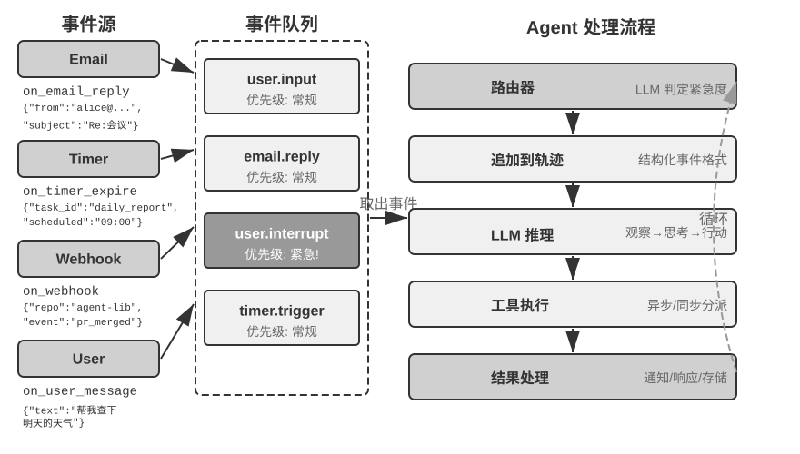

**图6-1 解读**：该图给出事件驱动异步 Agent 的整体架构（原书 §「为什么需要异步」）：展示事件源、事件队列与 Agent 处理流程之间的关系——各类输入（用户消息、工具返回、外部回调、定时触发）先汇入统一事件队列，再由事件循环驱动 Agent 的思考与行动。

**原文论证**：

> - **异步执行是常态**——许多任务需要长时间运行，不应阻塞用户交互。
> - **事件优先级的动态判断**——不是所有事件都同等重要，Agent 需要智能地选择处理策略：取消当前操作（紧急）、加入队列（常规）、还是并行处理（独立的轻量级查询）。
> - **中断和恢复的流畅性**——被打断的对话或任务应该能够自然恢复。（原书 §「为什么需要异步」）

> 两者都仍需要应用管理事件来源、工具生命周期与结果归属，不能仅凭代码用了 `asyncio`，就认定模型也具备原生异步能力。（原书 §「为什么需要异步」）

**取舍与延伸**：最后一句是本节的「反自欺」提醒——**并发原语（asyncio）属于进程，异步能力属于协议与模型**。判断一个 Agent 是否真异步，看的是「工具能否挂起后模型继续工作」，而不是看代码里有没有 `await`。

### §6.2.2 OpenClaw 的事件驱动机制实现

> [!question] 带着这些问题阅读本节
> 1. OpenClaw 的三种内置事件机制分别是什么？它们的共同局限在哪？
> 2. PineClaw 的三个真实场景（实时身份验证 / 三方通话确认 / 进展同步与决策确认）说明了什么？
> 3. 作者从 PineClaw 案例中提炼出的核心价值判断是什么？

**读后小结**：

- **三种内置机制**：**Hooks**（响应 Agent 生命周期事件，如会话创建、重置，类似 GitHub Actions 的事件触发器）、**Cron**（按 cron 表达式执行周期任务，如 `0 9 * * 5` = 每周五上午 9 点）、**Heartbeat**（每隔 N 分钟唤醒一次 Agent 检查待关注事项）。
- **真实边界**：Gateway 对内置渠道（IM、Web）的消息本身是**推送式**的；三种自动化机制里真正让 Agent「自己动起来」的只有 Cron 与 Heartbeat，而它们都是**时间驱动**的，Hooks 的事件来源是框架内部而非外部。**短板**：对第三方事件源（新邮件、外部 API 回调、紧急通知）缺乏即时接入通道，只能等下一个 Cron/Heartbeat 周期。
- **PineClaw 反例**（Pine AI 的 OpenClaw 插件，AI 代替用户拨打真实电话：协商账单、取消订阅、处理理赔）：通话中随时需要用户介入——**实时身份验证**（安全码/OTP）、**三方通话确认**（几秒内接听电话）、**进展同步与决策确认**（对方提出降价方案需用户确认）。靠 Heartbeat 轮询会让用户错过验证码，导致客服挂断、通话失败。
- **解法**：引入 **Channel 机制**——在 OpenClaw Gateway 与 Pine API 之间建立实时事件通道，电话接通、需要用户输入、通话结束等关键事件即时推送到 Agent。
- **核心价值判断**：真正的「主动服务」不仅需要 Agent 能定时检查事件，**更需要事件能主动通知 Agent**。

**原文论证**：

> 这种延迟在许多场景下是不可接受的。……如果依靠 Heartbeat 的定时轮询，用户可能在客服等待验证码时迟迟收不到通知，导致客服挂断、通话失败。（原书 §「OpenClaw 的事件驱动机制实现」）

> 这个案例揭示了事件驱动架构对 Agent 框架的核心价值：**真正的 “主动服务” 不仅需要 Agent 能定时检查事件，更需要事件能主动通知 Agent**。（原书 §「OpenClaw 的事件驱动机制实现」）

**取舍与延伸**：**时间驱动 vs 事件驱动**是这里最实用的判别线——在秒—天尺度上，「定时检查」能覆盖例行事务，但覆盖不了「几秒内必须响应」的场景；而后者的失败代价（通话挂断）是不可逆的。

### §6.2.3 事件触发工具

> [!question] 带着这些问题阅读本节
> 1. 事件触发工具为什么是「外部事件驱动 Agent 行动的入口」？没有它 Agent 会退化成什么形态？
> 2. 三类常见事件触发工具分别处理哪类事件？各自解决什么具体问题？
> 3. 设计层面有哪两条要求（原书明确给出的）？

**读后小结**：

- **为什么需要**：没有事件触发工具，Agent 只能「连续循环思考、调用工具，最后输出一个结果，然后等待用户的下一步输入」。
- **三类工具**：
  1. **定时器 `set_timer`**（依赖物理时间的事件）：**一次性定时器**用于有明确时间点的任务（当前周六 → 设置「下周一上午 10:00 致电银行」）；**循环定时器**用于周期任务（每小时查服务器健康）；**外部服务不支持主动推送时，只能用循环定时器反复查询**。OpenClaw 的 Heartbeat 正是这种机制的系统化实现，也是其「主动服务」能力的根源。
  2. **后台任务监控 `monitor_shell`**（异步执行的工具或命令行任务）：让 Agent「盯着命令行看」会浪费大量 token；等任务完全结束才思考又无法及时发现问题、卡死时无法介入。Claude Code 的解法是 monitor 工具——允许监控命令行的**新增输出**或**包含特定关键词的输出**。
  3. **外部事件通道 `connect_channel`**：把新邮件到达、API 回调、IM 消息等外部事件实时推送（PineClaw 的 Channel 机制即典型实现）。
- **设计两条要求**：触发条件与过滤规则要清晰（避免无关事件唤醒 Agent 浪费算力）；事件载荷（payload）要含足够上下文（减少被唤醒后还要额外查询的次数）。

**原文论证**：

> 事件触发工具是外部事件驱动 Agent 行动的入口。如果没有事件触发工具，Agent 只能连续循环思考、调用工具，最后输出一个结果，然后等待用户的下一步输入。（原书 §「事件触发工具」）

> 在设计层面，事件触发工具应定义清晰的触发条件和过滤规则，避免无关事件唤醒 Agent 浪费算力；事件载荷（payload）应包含足够的上下文信息，减少 Agent 被唤醒后还需要额外查询的次数。（原书 §「事件触发工具」）

**取舍与延伸**：这三类工具可以看成**唤醒信号的三种来源**：时间到点、任务有进展、外部世界有变化。三者的唤醒成本递减、信息量递增——定时器最便宜但最盲目，外部通道最贵但最精准。

### §6.2.4 用户沟通工具

> [!question] 带着这些问题阅读本节
> 1. 传统 ReAct 循环与 OpenClaw 在「Agent 怎么说话」上的差别是什么？「活人感」的来源是什么？
> 2. 用户沟通工具在设计层面应支持哪三点？
> 3. 为什么说「通知机制同时也是用户召回机制」？

**读后小结**：

- **范式差别**：许多 Agent（Claude Code、Manus）采用原生 ReAct 循环，Agent「说」的所有话（assistant 消息）都直接发给用户，用户必须打开指定会话才能对话，且能看到工具调用过程。**OpenClaw 打破这一范式**：用户无需感知会话存在、无需关心工具调用细节，双方都可以随时给对方发消息（而不是一问一答）；它**不直接把模型输出的 assistant 消息呈现给用户，而是用专门的工具发送消息**——因此很多人评价 OpenClaw 具备「**活人感**」，像秘书一样通过文本消息异步沟通。
- **能力扩展**：消息可附带图片与文件、可按紧急程度附加推送提醒；进一步有多模态沟通（结构化卡片消息、提醒邮件）与**生成式 UI**（用 HTML 等方式生成交互式界面）。
- **设计三点**：支持异步消息模式（用户不一定在线）、提供已读/未读状态追踪、多渠道场景下保持消息一致性。
- **多渠道与召回**：Agent 的响应不应局限于单一渠道，**通知机制同时也是用户召回机制**（即时通讯、短信、邮件、电话、推送）；Agent 根据**紧急程度、用户状态、内容性质、用户偏好**综合决定渠道，既不错过重要消息，又避免重复打扰。长任务完成时主动通知以召回注意力；定期任务（每日总结、周报）的通知帮用户建立固定交互习惯。

**原文论证**：

> OpenClaw 打破了这一人机沟通范式。用户无需感知会话的存在，也无需关心 Agent 调用工具的细节；用户和 Agent 都可以随时给对方发送消息，而不是用户发一条、Agent 回一条。因此，很多人评价 OpenClaw 具备 **“活人感”**，就像一个秘书一样通过文本消息与用户异步沟通。（原书 §「用户沟通工具」）

> **Agent 的响应不应局限于单一渠道，通知机制同时也是用户召回机制**。（原书 §「用户沟通工具」）

**取舍与延伸**：这一节其实是把「assistant 消息」从**输出通道**降格为**内部状态**，另立一条受控的用户触达通道——这正是第 4 章「专用工具 vs 通用执行器」的取舍在沟通场景的翻版：**专用通道换来可控制、可审计、可多渠道**。

### §6.2.5 虚拟身份与隔离执行环境

> [!question] 带着这些问题阅读本节
> 1. Agent 应该直接管理用户的个人账号，还是拥有自己的虚拟身份？作者给的判断依据是什么？
> 2. 虚拟电脑（VM/容器）与虚拟手机（Android 模拟器）带来哪三条好处？独立身份又带来哪两个现实挑战、各自的解法是什么？
> 3. Agent 与虚拟环境之间怎么交换数据？为什么强调「传路径而不传内容」？

**读后小结**：

- **架构选择**：直接管理用户账号看似便捷，但**一旦 Agent 出错或被攻破，用户的全部数字身份都会暴露**。更稳妥的是赋予 Agent 一套**独立虚拟身份**——如同秘书拥有自己的办公电话和邮箱：专属通讯账号、存储空间、计算环境。作者强调：**身份的明确性不仅没有削弱信任，反而增强了沟通的真实性**。
- **隔离执行环境的三条好处**（虚拟电脑 VM/容器、虚拟手机 Android 模拟器）：① 可全天候运行，不受用户设备联网状态影响、不影响用户正在操作的应用；② Agent 执行错误操作最多让虚拟环境崩溃，不伤真实设备；③ 隔离环境防止 Agent 随意访问用户本地文件。
- **两个现实挑战**：① **反机器人机制**——CAPTCHA 与 IP 信誉检测会拦截自动化访问，数据中心 IP 很容易被识别，实践中往往需要**住宅代理网络**；② **必须以用户本人身份登录的场景**——采用 **Human-in-the-Loop 认证**（VNC/RDP 远程桌面让用户亲自完成登录），用户能看到 Agent 正在操作的完整界面、理解为什么需要认证，认证后的会话令牌可在有效期内复用，在自主性与安全性之间取得平衡。
- **数据交换**：通过**共享文件系统**（卷挂载，如 `/workspace/shared`）连接 Agent、虚拟电脑与虚拟手机，**数据以文件路径引用传递而非内容拷贝**，避免占用上下文窗口。以数据分析任务为例：用户上传 CSV → 虚拟电脑中的 Agent 读取、分析、生成图表并保存回共享目录 → Agent 只把**图表的文件路径**返回给用户。

**原文论证**：

> 直接管理看似便捷，但一旦 Agent 出现错误或被攻破，用户的全部数字身份将会暴露。更稳妥的方案是赋予 Agent 一套独立的虚拟身份——如同秘书拥有自己的办公电话和邮箱。……身份的明确性不仅没有削弱信任，反而增强了沟通的真实性。（原书 §「虚拟身份与隔离执行环境」）

> Agent 与虚拟环境之间的数据交换通过**共享文件系统**完成：以卷挂载的方式（如 `/workspace/shared`）连接 Agent、虚拟电脑和虚拟手机，数据以文件路径引用传递而非内容拷贝，避免占用上下文窗口。（原书 §「虚拟身份与隔离执行环境」）

> 认证后的会话令牌可以在有效期内复用，避免频繁打断用户，在自主性与安全性之间取得平衡。（原书 §「虚拟身份与隔离执行环境」）

**取舍与延伸**：这一节把第 5 章「回退要可靠」的第三条（沙盒隔离）升级为**身份层**的设计——**隔离不只是防崩溃，更是"这个 Agent 是谁"的信任前提**。而「只传路径不传内容」是第 2 章上下文预算原则在多 Agent/多环境场景的直接推论。

### §6.2.6 事件处理机制

> [!question] 带着这些问题阅读本节
> 1. 事件循环的骨架是什么？「事件在每轮循环的边界被消费」与原生异步的边界差异在哪？「安全点」指什么？
> 2. 结构化事件包含哪四个维度？为什么必须结构化（原文点了哪一个安全后果）？
> 3. 三种处理策略（取消式 / 队列式 / 并行式）各自的适用事件、执行步骤与前提是什么？硬编码规则为什么不够，作者建议用什么替代？
> 4. 取消点有什么硬约束？

**读后小结**：

- **骨架 = 事件循环**：把异步 Agent 看作长期运行的循环——每轮从输入队列取出若干事件 → 追加到轨迹 → 调用一次 LLM → 执行它决定的工具 → 回到循环开头等待下一批事件（作者类比 Go 的 goroutine 从 channel 读取、`for { select { ... } }` 逐轮处理）。
- **消费边界**：传统同步接口下，**事件在每轮循环的边界被消费**——LLM 推理中、工具执行中到达的新事件先在队列等待，待本轮到达一个**安全点**（一段推理结束、一次工具返回）再处理；原生异步允许模型仍在思考或输出时接收新要求，由系统选择合适时机处理。**两者都有边界，只是边界由不同层管理**。工具取消仍需执行器响应取消信号（类似 Go 检查 `ctx.Done()`）；**接收一条「停止」消息本身不会撤销已经发生的动作**。
- **结构化事件四维**：**来源（谁）**（用户本人、联系人、陌生人、系统通知）、**渠道（方式）**（电话语音、短信、即时消息、邮件、社交媒体、定时器触发、异步工具结果、命令行监控状态更新）、**内容（什么）**（消息文本、情感色彩、紧急程度、是否需要回复）、**上下文（背景）**（是对之前某对话的回复还是新发起，与当前任务的关联）。原书给了退款请求邮件的 JSON 示例（`source` / `channel` / `content` / `context`）。
- **为什么必须结构化**（安全后果）：只有当这些维度被清晰建模，Agent 才能在多方通信中保持清晰认知，**避免将用户输入误当成工具结果，或将藏有指令的工具结果误认为用户指令而导致提示注入**；同时要理解多个对话线程之间的关联（第三方消息如何影响用户情绪、用户在对话中的角色、何时需要综合多线程信息）。
- **三种处理策略**（图6-2）：
  - **取消式（Cancellation-Based）**——用于紧急事件，本质是**为紧急事件提前制造一个安全点**：(1) 停止当前操作（推理中立即取消流式响应；同步工具发取消信号）；(2) 清空待处理队列；(3) 队列事件与紧急事件一起追加到轨迹末尾；(4) 立即重新调用 LLM 以更新后的完整轨迹评估局势。例：用户输入「停！我说错了」。
  - **队列式（Queued）**——用于常规事件：(1) 入队不打断；(2) 等当前操作完成；(3) 任何工具返回 `tool.result` 时检查队列，非空则一次性追加；(4) LLM 综合处理。实现**批量处理**，例如等待期间的「只看最近一个月的结果」与搜索结果一起呈现，避免不必要的往返。
  - **并行处理（Parallel）**——用于独立的轻量级查询（与主任务无关、需快速响应、成本低）：系统判断独立性与复杂度后，在**并行的推理会话**中独立执行，响应追加到主任务轨迹并**明确标记为「与主任务并行执行」**以避免 LLM 混淆。
- **紧急度判定**：紧急 = 用户中断 `user.interrupt`、监督指令 `supervisor.instruction`、Agent 间中断 `agent.interrupt`、标记为紧急的外部触发器（系统告警、支付失败）；非紧急 = 常规用户输入 `user.input`、Agent 输入 `agent.input`、工具结果 `tool.result`、定时器触发 `timer.trigger`、常规外部触发器。**硬编码规则有其局限性**（语义决定处理方式：「马上停下来」取消式、「今天天气怎么样」并行式、「报告需要用中文发给我」队列式），因此**建议使用轻量级的分类 LLM 作为事件路由器**。
- **硬约束**：**取消点必须是工具或推理能够安全收尾的位置；未完成的工具结果用显式占位符表示，不能伪造成功。**

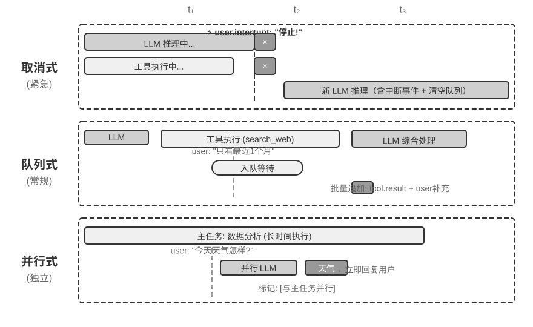

**图6-2 解读**：该图对比异步事件处理的三种策略（原书 §「事件处理机制」）：取消式（为紧急事件主动制造安全点）、队列式（等当前操作完成后批量消费）、并行式（另起推理会话处理独立轻量查询），三者对应不同的紧急度与独立性判断。

**原文论证**：

> 在传统的同步接口实现中，**事件在每轮循环的边界被消费**。当 LLM 正在推理、工具正在执行时，新事件先在队列中等待，待本轮到达一个**安全点**（一段推理结束、一次工具返回）再处理。（原书 §「事件处理机制」）

> 只有当这些维度被清晰地建模为结构化事件，Agent 才能在多方通信中保持清晰的认知，避免将用户输入误当成工具结果，或将藏有指令的工具结果误认为用户指令而导致提示注入。（原书 §「事件处理机制」）

> 取消点必须是工具或推理能够安全收尾的位置；未完成的工具结果用显式占位符表示，不能伪造成功。（原书 §「事件处理机制」）

**取舍与延伸**：三种策略其实回答的是同一个问题——**新事件该插在轨迹的哪一刀上**：取消式是「现在插」，队列式是「等这一刀切完再插」，并行式是「另开一条轨迹」。这也解释了第 5 章为什么把「断点接续」写得那么细：**插刀的位置合法性，就是轨迹结构的合法性**。

### §6.2.7 不支持原生异步时的兼容方案

> [!question] 带着这些问题阅读本节
> 1. 兼容方案的「核心思想」是什么？五条关键规则各自解决什么问题？
> 2. 以「起草邮件时用户打断问天气」为例，五条规则如何运作？占位符带来了什么语义风险、如何防？
> 3. 为什么要把「启动」与「完成」在工具名称层面解耦？`initiate_phone_call` 与 `phone_call` 的差别为什么重要？
> 4. 队列式批处理中的「注意力分散问题」是什么？两个层面的干预是什么？

**读后小结**：

- **前提**：实验 6-1 只处理串行事件；若模型/接口不支持原生异步，工具尚未返回时用户打断，就需要**在同步格式中表达异步语义**（例：正在搜索联系人时用户说「等一下，先帮我查一下明天的天气」——悬空调用无法直接携带新消息）。作者强调：**这里的限制来自所选协议与模型组合，并非所有 LLM 都必须遵循的规律**。
- **核心思想**：**在没有打断发生的常态下，让 LLM 看到标准的同步轨迹，只在打断时才插入占位符来修复格式。**
- **五条规则**：① 及时记录 API 已完成的 assistant 消息与工具调用项；服务端管理的 reasoning 状态按提供商的续接协议保留，**不自行拼接不可见的思考文本**。② **工具调用完成时才记录 tool result**，执行中轨迹处于「部分完成」状态。③ 工具执行中的打断需要**占位符**（如「工具正在后台执行，请优先处理新事件」），追加打断事件后重新调用 LLM——从 LLM 视角看 assistant message 仍有配对的 tool result。④ 在**没有原生 steering 或受支持的中途续接接口**时，取消未完成的生成，保留已确认完成的消息与工具状态，追加新事件后重新请求；**不能假定半截输出或隐藏推理可以作为合法前缀任意回灌**。⑤ 非打断事件进队列等待批处理，当前周期完成后一次性追加。
- **三步行进示例**：调用 `search_contacts` → assistant message 立即写入（规则 1）→ 用户打断，为未完成调用生成占位符 tool result 并追加天气查询、重新调用 LLM（规则 3）→天气答复后，`search_contacts` 真实结果作为新事件追加（规则 2），Agent 继续起草邮件。
- **占位符的语义风险**：模型可能把「任务已启动」误当成「任务已完成」，在真实结果返回前作出依赖该结果的判断。防御手段是**明确的任务状态与结果校验**，并在评估中检查是否编造了未到达的数据；**不能仅凭一次失败就把原因归结为某个未公开的训练过程**。
- **任务句柄**：从工具接口设计层面明确异步语义——把「启动」与「完成」解耦（`initiate_phone_call` 立即返回任务标识符与初始状态，通话进展通过 `phone_call_connected`、`phone_call_ended` 事件通知）。**关键在于工具的名称和描述本身就要传达异步的语义**（模型看到 `initiate_phone_call` 会自然推断这是「发起」而非「完成」），描述应进一步强化：「任务成功发起后立即返回任务 ID，你可以继续处理其他事项。通话结束后会收到单独的通知事件。」
- **注意力分散问题**：批量事件处理时模型可能只回应最后一个事件而遗漏前面的要求——**原生异步解决了消息能否在运行中到达，仍需检查模型是否综合使用了所有更新**。两层干预：**提示词层面**（告知模型「当收到多个连续事件时，请确保全面考虑所有信息」）与 **Agent 状态栏标记**（给每个事件加 `[未处理事件 n/4]` 显式标记，并在末尾汇总「上面有 4 个未处理事件，包括 1 个工具结果、2 条用户消息、1 个系统提醒。请确保回应涵盖所有信息」）。

**原文论证**：

> **规则 3**：工具执行中的打断需要占位符。为未完成的工具生成占位符响应（如“工具正在后台执行，请优先处理新事件”），追加打断事件，重新调用 LLM。从 LLM 的视角看，assistant message 仍然有配对的 tool result。（原书 §「不支持原生异步时的兼容方案」）

> 占位符也带来语义上的风险：模型可能把“任务已启动”误当成“任务已完成”，在真实结果返回前作出依赖该结果的判断。应通过明确的任务状态和结果校验防止这种混淆，并在评估中检查是否编造了未到达的数据。（原书 §「不支持原生异步时的兼容方案」）

> 关键在于工具的名称和描述本身就要传达异步的语义。当模型看到 `initiate_phone_call` 时，它会自然推断这是 “发起” 而非 “完成”。（原书 §「不支持原生异步时的兼容方案」）

**取舍与延伸**：这一节是第 4 章「工具描述的艺术」在时序维度的延伸——**命名与描述不只传递"能做什么"，还传递"什么时候算做完"**。而状态栏标记是第 2 章 Agent 状态栏技术的一次新应用：把「上下文里有什么」变成「上下文里还有什么没被处理」。

### §6.2.8 模型原生异步：GPT-6 Astra

> [!question] 带着这些问题阅读本节
> 1. 原生异步把哪两件事分开了？Agent 据此应如何安排工作顺序？
> 2. 回合中途引导允许用户做什么？系统保留了哪些已完成的工作？
> 3. 即使用了原生异步，运行时仍要负责哪些事（原文明确列出的）？

**读后小结**：

- **异步工具调用**把「发起行动」和「获得结果」**分开**：Agent 发起耗时查询后可继续推理、调用其他工具、或处理不依赖查询结果的部分。关键方法是**分清工作的依赖关系**——能独立推进的工作继续做，必须依据结果的决策留到结果到达之后（例：查询会议场地时先整理议程与准备清单，场地信息返回后再比较方案）。
- **回合中途引导**让用户在任务进行中修正方向：Agent 还在思考或组织回答时，用户即可追加「预算减少了」「参会人数变了」等要求；系统保留已完成的工作，把新约束带入后续处理，使 Agent 能在同一次任务中调整计划。**接受到更新与作出调整之间仍可能有延迟，但用户不必等一整轮回答结束才表达变化。**
- **系统仍需负责**：分清工具结果与用户要求的**来源**；记住哪些工作已完成、哪些还在等待；**修改计划不等于停止正在运行的工具，更不会自动撤销已经发生的动作**——实际执行、取消和状态管理仍由运行时负责。
- **选型口径**：并非所有模型都具备原生异步能力；构建 Agent 时应**根据模型的支持范围选择原生交互或兼容方案**，再检查整个系统能否正确应对延迟返回、中途修改与任务恢复。作者补充：异步训练可以继续改善这些能力，但**开发者已经可以利用现有模型构建这样的交互方式**。

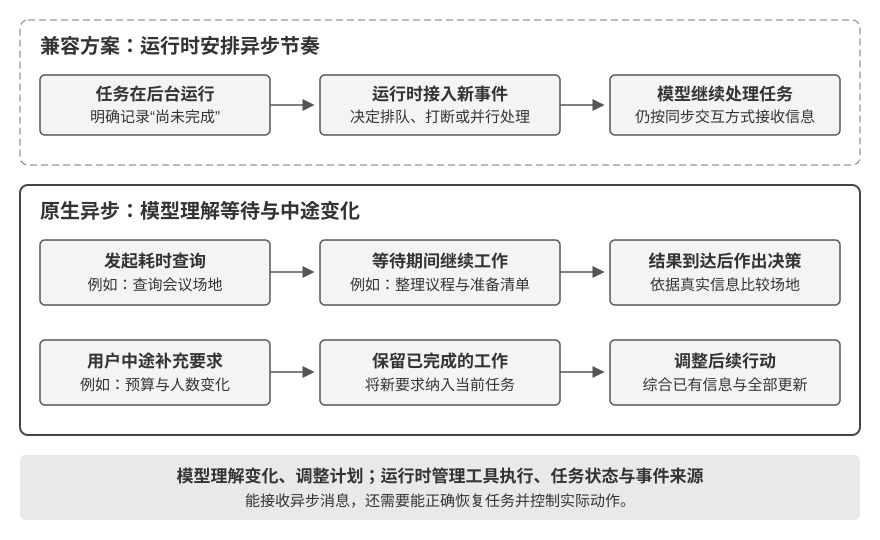

**图6-5 解读**：该图对比同步接口兼容方案与模型原生异步（原书 §「模型原生异步：GPT-6 Astra」）：兼容路线由运行时在接口外安排事件接入顺序、必要时插占位符；原生路线由模型自身理解异步节奏（工具仍在跑时可继续做别的事、回合中途可接受用户更新）。

**原文论证**：

> **异步工具调用将“发起行动”和“获得结果”分开。**……关键是分清工作的依赖关系：能独立推进的工作继续做，必须依据结果的决策留到结果到达之后。（原书 §「模型原生异步：GPT-6 Astra」）

> 修改计划也不等于停止正在运行的工具，更不会自动撤销已经发生的动作；实际执行、取消和状态管理仍由运行时负责。（原书 §「模型原生异步：GPT-6 Astra」）

**取舍与延伸**：「分清依赖关系」这条其实是一条通用的并行化准则——它既适用于工具调用，也适用于实验 6-2 里「哪个脚本先完成」的编排；能并行的前提是**依赖图可判定**。

### §6.2.9 从「能接收异步消息」到「可靠处理异步任务」

> [!question] 带着这些问题读本节
> 1. 复杂任务中的可靠性至少要检查哪三件事？
> 2. 改进这些问题有哪两条路？评估需要覆盖哪两层？

**读后小结**：

- **三检查**：① **结果归属与未完成状态**——能否把延迟到达的结果归入正确任务，在结果缺席时避免编造数据？② **任务恢复与动作控制**——能否在处理新要求后继续原任务，并区分修改计划与停止执行？③ **多条更新的综合使用**——能否同时遵守预算与人数等约束，而不是只记住最后一条消息？
- **两条改进路**：通过**异步环境中的训练**改进模型；或通过**清晰的任务状态、事件来源和执行反馈**改进系统。**评估需要覆盖两层：模型是否理解了变化，系统是否按变化正确执行。**

**原文论证**：

> 原生异步解决了消息能否在运行中到达的问题，复杂任务中的可靠性还取决于模型如何使用这些消息。（原书 §「从“能接收异步消息”到“可靠处理异步任务”」）

> 评估需要覆盖两层：模型是否理解了变化，系统是否按变化正确执行。（原书 §「从“能接收异步消息”到“可靠处理异步任务”」）

**取舍与延伸**：这三条与第 5 章的「可靠性清单」（四层故障 × 检测/恢复/接管/终止）互补——第 5 章管**故障**，本节管**语义**。

### §6.3.1 交互时序：从级联到全双工

> [!question] 带着这些问题阅读本节
> 1. 三种语音范式各自的核心结构、主要优势与主要限制是什么？
> 2. 为什么说语音的价值不只是「把文字换成声音」？
> 3. 贯穿三种范式的主线是什么？

**读后小结**：

- **语音的独特价值**：正常说话的速度约为打字的**四倍**，而且不占用双手与视线，因此天然适合把 Agent 放进持续工作、随时可能被打断的输入输出回路。作者把本节拆成两个方向：**用户对 Agent 说话**，以及 **Agent 代替用户对外部世界说话**——「语音模型决定『能回答什么』，交互架构决定『能否听清、及时回应、自然换手，并在通话中完成确认和工具调用』」。
- **三种范式**（原书表，源自 OpenAI GPT-Live 对 ChatGPT 语音三代演进的总结）：
  - **级联**：VAD → ASR → LLM → TTS；优势是模块清晰、易替换、易调试；限制是**延迟累积，副语言信息在接口处丢失**。
  - **端到端 Omni**：原生音频输入输出，按轮次交互；优势是延迟较低、能保留语气/情绪/环境声；限制是**仍依赖轮次，训练和调试成本较高**。
  - **全双工**：原生音频输入输出，持续听、说和决策；优势是支持重叠说话、自然打断和连续流；限制是**模型训练、控制和评估都更复杂**。
- **主线**：**如何摆脱「轮流说话」和 VAD 对发言权的猜测**——级联和 Omni 仍要划分轮次，**只有全双工把「该谁说话」变成模型的持续决策**。

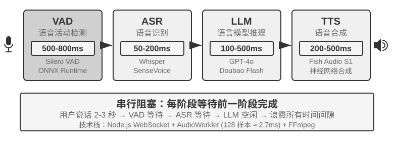

**图6-6 解读**：该图给出语音 Agent 的串行流水线（原书 §「范式一 · 级联流水线」）：VAD 判断用户何时说完 → ASR 转文字 → LLM 理解并生成回复 → TTS 念出来；每个模块可独立优化，但每一级都可能增加等待时间。

**原文论证**：

> | 级联       | VAD → ASR → LLM → TTS | 模块清晰、易替换、易调试      | 延迟累积，副语言信息在接口处丢失 |
> | 端到端 Omni | 原生音频输入输出，按轮次交互        | 延迟较低，能保留语气、情绪和环境声 | 仍依赖轮次，训练和调试成本较高  |
> | 全双工      | 原生音频输入输出，持续听、说和决策     | 支持重叠说话、自然打断和连续流   | 模型训练、控制和评估都更复杂   |（原书 §「交互时序：从级联到全双工」表）

> 级联和 Omni 仍要划分轮次，只有全双工把“该谁说话”变成模型的持续决策。（原书 §「交互时序：从级联到全双工」）

**取舍与延伸**：三种范式**不是简单的新旧替代**（原书原话），而是不同延迟、成本和可观测性约束下的取舍——这一点在 §认知时序 会再次被强调。

### §6.3.2 范式一 · 级联流水线（Cascading）

> [!question] 带着这些问题阅读本节
> 1. 完全串行的级联方案有哪三个问题？每个模块的典型瓶颈是什么？
> 2. 「流式感知」的四项优化分别做什么？其中 LLM 的「推测执行」在什么条件下会取消重来？
> 3. 为什么 Whisper 不能直接等同于流式模型？模型输出的「声学事件标记」包含哪几类？

**读后小结**：

- **模块与瓶颈**：VAD（判断是否说完｜静音阈值带来等待和误切分）、ASR（音频转文字｜识别延迟与上下文丢失）、LLM（理解、思考、生成｜首 token 延迟，开启 reasoning 后等待更长）、TTS（文字转语音｜首包合成和播放缓冲）。简短、不开启 reasoning 的回复中，四段等待**串行累积**（图6-7）；生产环境排队还会进一步放大空载延迟（图6-8，属服务容量规划，本章不展开）。
- **完全串行的三个问题**：① **延迟累积**——必须等一段静音才能确认说完；② **信息丢失**——有声/无声二值信号无法表达犹豫、情绪、附和和环境声；③ **上下文被切断**——邮箱、人名和专有名词可能被分片识别而出错。
- **流式感知四项优化**：**ASR 边听边转**（开始说话即按时间间隔调用 ASR 流式生成临时转录，说完再确认最终文本）；**LLM 推测执行**（临时转录一到就送给 LLM；**最终文本与临时内容相同则不再调用 LLM，否则取消前序推测执行的思考并重新调用**）；**LLM 分段输出**（第一段适合播报的文本生成后立即交给 TTS）；**TTS 增量合成**（持续返回音频块，让生成、合成、播放重叠）。
- **流式 ASR 的前提**：真正的流式需要模型支持——**Whisper 的解码虽是自回归的，但编码器需要完整音频段**，因此不能直接等同于流式模型。基于 LLM 的流式听觉模型可从连续音频输出文本与语义事件，把「识别」和部分「理解」放进同一个模型，并利用世界知识处理品牌、人名与专有名词。
- **端点判断**：也可以把轮次判断做进流式识别器（综合语义与静音判断一句话是否表达完整）；**训练标签必须只使用决策时刻可见的信息，否则会因「上帝视角」产生线上无法复现的判断**。
- **声学事件标记**：`speak_start/end`、`interrupt`（说话起止与打断意图）；`emotion`（情感、犹豫等状态）；`laugh`、`sigh`、`noise`（副语言和环境声）。它们与文字 token 形成**统一事件流**，Agent 可据此识别犹豫、打断和环境变化，**而不必把所有声音压成纯文本**。

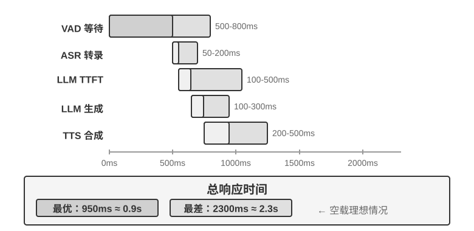

**图6-7 解读**：该图给出级联方案的延迟瀑布（原书 §「范式一 · 级联流水线」）：VAD、ASR、LLM、TTS 四段等待依次串行累加为总响应时间，用于说明为什么「流式感知」要把各阶段尽早产出增量结果。真实数值取决于输入长度、模型、硬件、网络和负载。

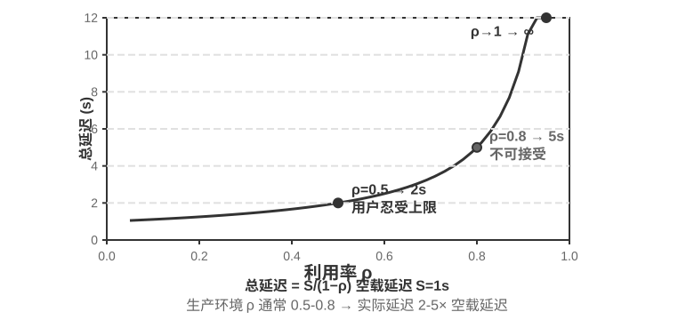

**图6-8 解读**：该图给出生产环境的排队延迟曲线（原书 §「范式一 · 级联流水线」）：服务端排队会进一步放大空载延迟；原书明确这属于服务容量规划、本章不展开排队模型。

**原文论证**：

> 图6-7描述的是 VAD+ASR+LLM+TTS 的完全串行情形，这种串行感知方案有三个问题：
> 1. **延迟累积**：必须等待一段静音才能确认说完。
> 2. **信息丢失**：有声/无声二值信号无法表达犹豫、情绪、附和和环境声。
> 3. **上下文被切断**：邮箱、人名和专有名词可能被分片识别而出错。（原书 §「从串行到流式感知」）

> 真正的流式 ASR 需要模型支持。Whisper 的解码虽然是自回归的，但编码器需要完整音频段，因此不能直接等同于流式模型。（原书 §「从串行到流式感知」）

> 端点判断的训练标签必须只使用决策时刻可见的信息，否则会因“上帝视角”产生线上无法复现的判断。（原书 §「从串行到流式感知」）

**取舍与延伸**：「推测执行 + 取消重来」是本节最工程化的一招——**用"可能白算一次"换"少等一轮"**；它与第 5 章「流式响应让第一个工具参数完整即执行」是同一种抢时间手法，只是这里抢的是 ASR→LLM 的交接时间。

### §6.3.3 范式二 · 端到端全模态模型（Omni）

> [!question] 带着这些问题阅读本节
> 1. Omni 相对级联的优势体现在哪两个方面？
> 2. Omni 为什么仍然要靠 VAD 划分发言权？这会带来什么具体误判？

**读后小结**：

- **优势**：级联即使采用流式感知，听、想、说仍通过离散接口交接，情绪、语调和环境声等信息可能在转成纯文本时丢失；Omni 用**同一个模型**直接听音频、生成回复并输出语音，因此有机会保留这些信息——**优势主要体现在延迟和非文字信息的理解与生成上**（例如理解声音中的停顿，生成唱歌、用特殊语调讲一句话等副语言信息）。代价是**训练成本更高**（图6-9）。
- **局限**：**Omni 模型仍然假设轮流说话，通常要靠 VAD 划分发言权**，因此「用户报数字时的中途停顿仍可能被误判为说完」。

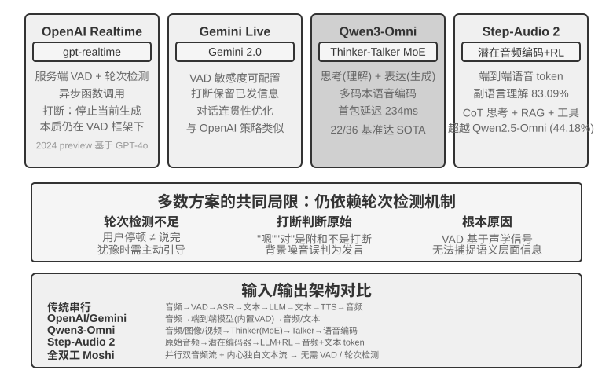

**图6-9 解读**：该图对比端到端多模态语音模型的架构（原书 §「范式二 · 端到端全模态模型（Omni）」）：同一模型直接接收音频、生成回复并输出语音，跳过 ASR/TTS 的离散文本接口，从而保留语气、情绪与环境声。

**原文论证**：

> 级联即使采用流式感知，听、想、说仍通过离散接口交接；情绪、语调和环境声等信息可能在转成纯文本时丢失。Omni 方案用同一个模型直接听音频、生成回复并输出语音，因而有机会保留这些信息，但训练的成本更高（图6-9）。（原书 §「范式二 · 端到端全模态模型（Omni）」）

> Omni 模型仍然假设轮流说话，通常要靠 VAD 划分发言权。因此，用户报数字时的中途停顿仍可能被误判为说完。（原书 §「范式二 · 端到端全模态模型（Omni）」）

**取舍与延伸**：判断 Omni 是否值得，可以只问一句：**这条业务里"非文字信息"是否承载决策依据？**（报数字被误切、情绪判断影响话术，就是承载了。）

### §6.3.4 范式三 · 全双工交互模型

> [!question] 带着这些问题阅读本节
> 1. 全双工模型为什么不预设轮次？它要持续决策什么？
> 2. Moshi、Thinking Machines Lab 的「交互模型」、OpenAI GPT-Live 三者各代表什么进展？
> 3. 「把完整对话委派给后台推理模型」这一结构的意义是什么？

**读后小结**：

- **动机**：同声传译等任务要求「用户说」与「模型说」**重叠进行**；全双工模型因此不预设轮次，而是**持续听、持续说，并不断决定继续、停顿、打断或调用工具**。
- **研究先声**：Kyutai 的 **Moshi**（2024）并行建模用户与模型的音频流，**因此重叠说话和打断可以成为模型的自然行为**。
- **交互模型（Interaction Model）**：Thinking Machines Lab 的路线——**交互性不再依靠 VAD 等外部 harness 拼装实现，而是内建在模型中**；其**微轮次机制**以短音频块持续推进，让静音、重叠和打断都作为**连续上下文**保留。交互模型还可以**把完整对话委派给后台推理模型，自己继续维持话头**；后台结果返回后，前台再在合适时机接入。
- **生产规模**：OpenAI 的 **GPT-Live** 把全双工路线带到生产规模：模型持续处理输入并生成输出，能等待用户、附和、被打断，也能处理实时翻译；它同样**把复杂任务委派给后台模型，前台继续维持对话**。

**原文论证**：

> 研究上的先声是 Kyutai 的 **Moshi**（2024）。它并行建模用户和模型的音频流，因此重叠说话和打断可以成为模型的自然行为。（原书 §「范式三 · 全双工交互模型」）

> Thinking Machines Lab 将这类路线称为**交互模型（Interaction Model）**：交互性不再依靠 VAD 等外部 harness 拼装实现，而是内建在模型中。（原书 §「范式三 · 全双工交互模型」）

**取舍与延伸**：注意「委派后台」在全双工范式里已经出现——它正是下一节「快慢分离」的雏形：**交互层与推理层不必是同一个模型**。

### §6.3.5 认知时序：实时交互与深度思考

> [!question] 带着这些问题阅读本节
> 1. 三种方案各自如何分工？方案一「快回应 + 慢回答」的根本问题是什么（原文给的例子）？
> 2. 方案二为什么比方案一稳定，却又「不能真正做到边想边说」？
> 3. 方案三的 MGRD 与 MPS 各解决什么问题？「快慢分离」在工程上有一个什么独特优势（与慢模型迭代有关）？
> 4. 原书为什么要在本节末尾澄清「端到端模型」的两个含义？

**读后小结**：

- **前提**：「交互表现」和「智能上限」是两个维度——前台模型要在用户仍然在线时回应，后台模型可以花更多时间思考。**三种方案是设计取舍，不是线性迭代**；前两种可套在级联或 Omni 上，第三种把深度思考与实时表达统一在同一模型内部。
- **方案一（快思考回应，慢思考回答）**：快模型几百毫秒内先给即时回应，慢模型在后台做更深推导。问题是简单问题被重复处理，复杂问题**可能出现前后不一致**——快模型先建议购买，慢模型随后发现套餐缺少关键功能，用户几秒内听到矛盾答案；**根本原因是两个实例各自完成了一次独立思考**。
- **方案二（快思考交互，慢思考提醒）**：后台模型通过**状态栏或专门接口**向前台提供建议，前台维持话头并决定如何表达。它比方案一稳定，但**通信仍然间接**——前台可能误解建议、看不到后台的中间思考；后台完成前用户追问时，前台仍只能靠自己的能力应答。因此「可以自然地『等结果』，但不能真正做到边想边说」。
- **方案三（端到端思考与表达统一）**：把思考能力内化进端到端音频模型。**Step-Audio R1** 用两个互补机制解决两个问题：**模态锚定思考蒸馏（MGRD）** 让模型基于声学特征思考（保证「想得对」），**MPS 双脑架构**让构思与表达并行（解决「说得及时」）。MGRD 筛选真正引用声学特征的思考过程并用这些数据训练，通过强化学习**防止模型跳过思考直接猜答案**；MPS 让**构思脑**持续产出思考片段，**表达脑**收到片段后结合已有回复立即生成语音——两者以流水线方式并行，不必等完整思考结束才让用户听到第一句话。
- **取舍**：统一模型最紧密地实现「边想边说」，**代价是思考和实时表达需要一起重新训练**；解耦路线更容易替换后台大脑，两者是取舍而非替代。**快慢分离的工程优势：直接承接慢模型的迭代红利**——更强的思考模型发布后只需替换后台模型，不必重新训练整套实时语音系统；统一路线则把推理与交互绑定在同一训练周期，每次升级都要重新兼顾智能水平、响应延迟与表达自然度。作者补了一条实证：**截至 2026 年 8 月，采用快慢思考分离架构的 Pine AI 语音 Agent 在 τ³-Voice Leaderboard 上取得第一名**，超过 Grok Voice、GPT-Realtime-2 等实时语音系统——说明在同时考察深度推理与实时对话的任务上，**解耦架构并不天然落后于端到端模型**。
- **两个「端到端」的澄清**：① **语音通路的端到端**——模型直接接收音频、生成音频，不再由多个模型通过离散文本串接（Omni 与交互模型都属此列，但 Omni 通常仍按轮次推进，交互模型可边听边说）；② **认知架构的端到端**——实时交互与深度思考是在同一模型内部共享状态、共同训练，还是拆成前台快模型与后台慢模型。**两条轴彼此独立**：一个系统完全可以在语音通路上端到端，同时在认知架构上保持快慢分离。

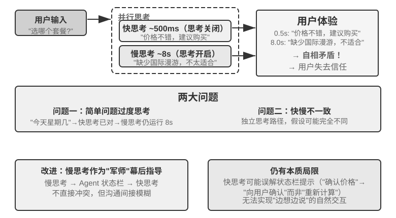

**图6-10 解读**：该图对比快思考与慢思考的架构与三种方案（原书 §「认知时序：实时交互与深度思考」）：方案一快回应 + 慢回答（两个实例各自独立思考，可能给出冲突答案）、方案二快交互 + 慢提醒（后台经状态栏/接口建议前台）、方案三端到端统一（思考内化进音频模型）。

**原文论证**：

> 它的问题是简单问题会被重复处理，复杂问题又可能出现前后不一致：快模型先建议购买，慢模型随后发现套餐缺少关键功能，用户在几秒内便听到相互冲突的答案。根本原因是两个实例各自完成了一次独立思考。（原书 §「方案一：快思考回应，慢思考回答」）

> MGRD 筛选真正引用声学特征的思考过程，再用这些数据训练模型，并通过强化学习防止模型跳过思考直接猜答案。MPS 让构思脑持续产出思考片段，表达脑收到片段后结合已有回复立即生成语音。（原书 §「方案三：端到端思考与表达统一」）

> 因此，快慢分离并不只是对延迟的妥协，也是一种让交互能力与智能上限分别演进的模块化选择。（原书 §「快慢思考分离与端到端思考的取舍」）

> 两条轴彼此独立，一个系统完全可以在语音通路上端到端，同时在认知架构上保持快慢分离。（原书 §「快慢思考分离与端到端思考的取舍」）

**取舍与延伸**：这一节是本章「原语」清单里「**快慢分离**」的正面展开，也是全书少见的**作者用自家产品成绩当论据**的地方——读时要注意区分「架构判断」与「单点排行榜证据」：排行榜说明解耦**不必然落后**，并不等于证明解耦普遍更优。

### §6.3.6 更像人的语音合成

> [!question] 带着这些问题阅读本节
> 1. 为什么「过于流畅、零停顿」的 TTS 反而容易暴露机器身份？
> 2. 控制标记有哪些例子？它们由谁输出、由谁映射成什么？

**读后小结**：

- **问题**：传统 TTS 过于流畅、零停顿，反而容易暴露机器身份——**停顿、填充词和偶尔的重复，是人类表达不确定性和思考状态的信号**。
- **做法**：让**主 LLM** 在文本之外输出**控制标记**，例如 `THINKING`、`EMO:happy`、`SPEED:0.8x`，由 **TTS** 把它们映射为停顿、韵律、语速或笑声、叹气等**非语言音频**。实现上可以自研支持控制标记的 TTS，也可以用**语音克隆**准备不同情绪和风格的参考音频。

**原文论证**：

> 传统 TTS 过于流畅、零停顿，反而容易暴露机器身份。停顿、填充词和偶尔的重复，是人类表达不确定性和思考状态的信号。（原书 §「更像人的语音合成」）

> 可以让主 LLM 在文本之外输出控制标记，例如 **THINKING**、**EMO:happy** 和 **SPEED:0.8x**，由 TTS 将它们映射为停顿、韵律、语速或笑声、叹气等非语言音频。（原书 §「更像人的语音合成」）

**取舍与延伸**：这是第 4 章「结构化输出/参数保真」在语音通道的复用——**把"怎么说"显式化为可解析的字段，而不是指望模型在自然语言里暗示**。

### §6.4.1 Computer Use：GUI 自动化 Agent（导言）

> [!question] 带着这些问题阅读本节
> 1. 语音场景强调「何时开口」，Computer Use 强调什么？它多出了一个语音交互中不存在的问题是什么？
> 2. 感知-思考-行动循环的四步是什么？
> 3. 作者为什么要区分「看懂界面」与「完成任务」？这个循环有三个关键设计维度，分别是什么？

**读后小结**：

- **问题迁移**：语音把时机轴推到毫秒级，但观察仍是一维声音流；Computer Use 把同一个问题搬上**二维屏幕**——观察变成持续变化的像素，动作变成坐标上的点击与输入。它强调「**下一步点哪里**」，以及一个语音交互中不存在的问题——**动作执行之后，现实是否还与计划一致**。
- **感知-思考-行动循环四步**：① Agent 截取当前屏幕画面；② 多模态模型接收截图和任务指令，输出一段思考和一个具体动作；③ 执行层在真实环境中执行该动作（移动鼠标、点击、输入文字等）；④ 等待界面响应后**再次截图**，进入下一轮循环。
- **「看懂界面」≠「完成任务」**：前者更接近多模态理解能力，可用一次截图问答测量；后者要求模型把理解和生成动作放进闭环，处理**页面加载、状态变化、误操作和不可逆后果**。**Computer Use 的难点因此不只是让模型在截图上答对，而是让它在每一步之后重新确认现实是否仍符合计划。**
- **三个关键设计维度**：**动作空间**（Agent 能执行哪些操作）、**视觉定位**（如何在截图中找到目标元素）、**模型架构**（如何从截图生成正确动作）。

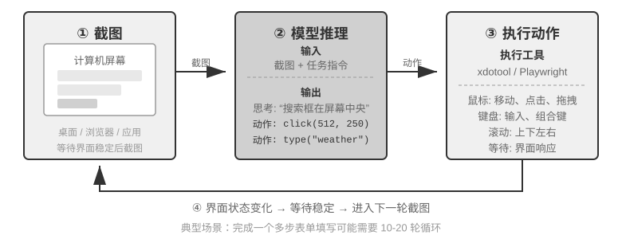

**图6-11 解读**：该图给出 Computer Use Agent 的感知-思考-行动循环（原书 §「Computer Use：GUI 自动化 Agent」）：截取当前屏幕画面 → 多模态模型接收截图与任务指令并输出思考与具体动作 → 执行层在真实环境执行（移动鼠标、点击、输入文字）→ 等待界面响应后再次截图进入下一轮。

**原文论证**：

> 这里要区分“看懂界面”和“完成任务”。前者更接近多模态理解能力，可以用一次截图问答来测量；后者则要求模型把理解和生成动作放进闭环，处理页面加载、状态变化、误操作和不可逆后果。（原书 §「Computer Use：GUI 自动化 Agent」）

> Computer Use 的难点因此不只是让模型在截图上答对，而是让它在每一步之后重新确认现实是否仍符合计划。（原书 §「Computer Use：GUI 自动化 Agent」）

**取舍与延伸**：「每一步之后重新确认现实」这句话贯穿本章后半段——它同时是 Computer Use 的效率瓶颈（§世界模型）与机器人的验收纪律（`verify_state`）。

### §6.4.2 动作空间设计

> [!question] 带着这些问题阅读本节
> 1. Anthropic 参考实现把交互能力分成哪三类工具？各自覆盖哪些操作？
> 2. 为什么作者强调这套设计「不是模型供应商必须遵守的私有协议」？

**读后小结**：

- **三类工具**（图6-12）：
  - **GUI 操作工具（computer tool）**：鼠标——移动（`mouse_move`）、左/右/中键点击、双击/三击、拖拽（`left_click_drag`）、更精细的按下/松开（`left_mouse_down/up`）；滚动（`scroll`）支持四个方向并可配合修饰键；键盘——逐字输入（`type`，**每个字符间隔 12ms 模拟真实打字**）、组合键（`key`，如 Ctrl+C）、长按（`hold_key`）；感知动作——截图（`screenshot`）、获取光标位置（`cursor_position`）、等待（`wait`）。
  - **命令执行工具（bash tool）**：持久的 bash 终端会话，**120 秒超时**，通过**哨兵字符串**检测命令是否执行完毕，多次调用之间保持环境状态（`cd` 后下次调用还在那个目录）。
  - **文件编辑工具（`str_replace_editor`）**：通过**字符串匹配**实现安全编辑，支持查看、创建、替换、插入和撤销，比直接覆盖整个文件更精确，不易误改其他内容。
- **非私有协议**：这是一个清晰的动作空间设计，但**不是模型供应商必须遵守的私有协议**——只要 Harness 能把同样的截图、动作约束和执行结果转换成目标模型支持的消息与结构化输出，Claude、开放权重视觉模型和自托管端点都可以驱动同一个感知-思考-行动循环。

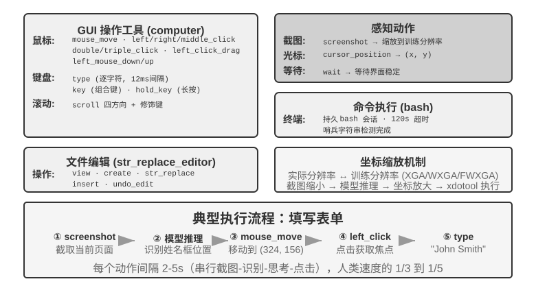

**图6-12 解读**：该图给出 Computer Use 的动作空间设计（原书 §「动作空间设计」）：GUI 操作工具（鼠标/键盘/滚动/截图）、命令执行工具（持久 bash 会话）与文件编辑工具（字符串匹配编辑）三类，共同构成 Agent 在真实桌面上的可执行动作集合。

**原文论证**：

> Anthropic 的参考实现把完整交互能力分成三类工具（图6-12）。这是一个清晰的动作空间设计，但不是模型供应商必须遵守的私有协议：只要 Harness 能把同样的截图、动作约束和执行结果转换成目标模型支持的消息与结构化输出，Claude、开放权重视觉模型和自托管端点都可以驱动同一个感知-思考-行动循环。（原书 §「动作空间设计」）

**取舍与延伸**：`type` 每字符 12ms、bash 120 秒超时、哨兵字符串——这些**看起来琐碎的参数其实是 Harness 层的"物理常数"**：它们把模型的抽象动作翻译成真实软件的时序要求（第 4 章「参数保真」的同一关切）。

### §6.4.3 视觉定位（Grounding）

> [!question] 带着这些问题阅读本节
> 1. 视觉定位的两大思路是什么？「选择题」思路又有哪两种实现方式？它们的共同优势是什么？
> 2. Set-of-Mark 与结构化元素索引（DOM/Accessibility Tree）的做法与适用面分别是什么？
> 3. 纯坐标预测为什么对分辨率敏感？原书给的双向缩放例子中，2560×1440 该选哪一档、为什么？
> 4. 三条路线的选择逻辑是什么？

**读后小结**：

- **两大思路**：把定位变成**选择题**（先标注界面元素编号，模型从中选一个）vs **纯坐标预测**（模型直接「看」着截图报坐标）。
- **选择题的两种实现**：**纯视觉标注**（原始 **Set-of-Mark**，用分割模型在像素上切出候选区域）与**结构化元素索引**（DOM/Accessibility Tree，直接读取界面自带的结构）。**共同优势是把开放式的「在截图中找到按钮并预测坐标」转化为封闭式的「从已标注好的元素中选一个」**——像选择题比填空题更容易答对；**输出坐标对模型挑战尤其大**，需要大量训练才能做准，而且在不同屏幕分辨率下很容易出错。
- **Set-of-Mark（SoM）**：微软研究院 2023 年提出，最初为释放 GPT-4V 的视觉定位能力。**纯视觉方法**——用图像分割模型（SAM、SEEM 等）在截图上自动切出候选区域并叠加编号，模型只需报出编号，由系统换算成区域中心坐标。**不需要 DOM，也不需要界面内部结构**，因此原生桌面软件、游戏界面同样适用——只要分割模型能切出候选区域。
- **结构化元素索引**（SoM 思想在 Web 的结构化实现）：现代网页在渲染前已定义完整元素结构（DOM 树）与语义角色，无障碍接口（Accessibility Tree）为许多桌面应用提供类似信息。以 **browser-use** 为代表的方案流程四步：① 通过 CDP（Chrome DevTools Protocol）获取结构化表示与无障碍信息；② 自动检测可交互元素（按钮、输入框、链接等）；③ 为每个可交互元素标注唯一 ID 并在截图上绘制边界框；④ 同时生成描述每个 ID 对应元素的**文本列表**。**模型只需输出一个 ID**，系统用该元素中心坐标执行点击。这类方案**不省 token**（所有标注信息都要发给模型），但定位准确稳定，还免去了分割模型可能引入的漏检和误检。
- **纯坐标预测**：不做任何标注，直接让模型输出坐标——以 **SeeClick** 和 **Claude 的 computer use** 为代表，在海量 GUI 截图与元素位置配对数据上训练视觉模型，把自然语言描述映射到精确坐标。
- **分辨率依赖**：Claude 训练使用 XGA（1024×768）、WXGA（1280×800）、FWXGA（1366×768）；输入分辨率不匹配时坐标会**系统性偏移**。因此需要在工具层实现**双向坐标缩放**，而且要**按宽高比选目标分辨率**，避免非等比拉伸把画面压变形、连带把坐标判断带偏。原书例子：真实屏幕 2560×1440（16:9）→ 三档里最匹配的是 **FWXGA（1366×768）**；缩放到 1366×768 送入，模型输出 (683, 384) → 反向映射为真实坐标 (683×2560/1366, 384×1440/768) ≈ (1280, 720)。反之硬把 16:9 拉伸进 4:3 的 1024×768，画面被横向压扁，坐标就会系统性偏移。
- **选择逻辑**：**结构化信息可得时优先用 DOM/Accessibility Tree 索引**（最精确稳定）；**不可得时**（Photoshop 等原生桌面软件、Canvas/WebGL 渲染界面、游戏）**既可以用视觉标注（原始 SoM），也可以用坐标预测**——视觉标注把定位变成选择题，对未经专门训练的通用模型更友好；坐标预测省去标注步骤，对做过 GUI 定位训练的模型更直接。**两者在小元素和密集界面上的精度都仍有差距。**

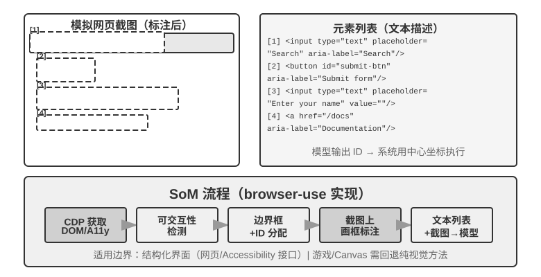

**图6-13 解读**：该图对比 Set-of-Mark 的视觉标注与 browser-use 的结构化元素索引（原书 §「视觉定位（Grounding）」）：前者用分割模型在像素上切区域并编号，后者从 DOM/无障碍树枚举可交互元素、标 ID 与边界框并附文本列表，两者都把开放式坐标预测转成封闭式编号选择。

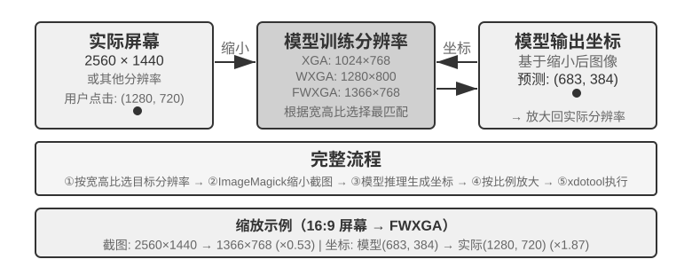

**图6-14 解读**：该图说明坐标预测对训练分辨率的依赖与双向坐标缩放（原书 §「视觉定位（Grounding）」）：截图需按**宽高比**等比缩放到模型训练使用的分辨率档位，模型输出的坐标再反向映射回真实屏幕坐标，避免非等比拉伸造成的系统性偏移。

**原文论证**：

> 选择题思路的共同优势，是把开放式的“在截图中找到按钮并预测坐标”转化为封闭式的“从已标注好的元素中选一个”。就像考试中选择题比填空题更容易答对一样，模型只需说“点击 [123]”而不是“点击屏幕 (350, 464) 处的按钮”。（原书 §「视觉定位（Grounding）」）

> 因此，需要在工具层实现双向坐标缩放机制，而且要**按宽高比选目标分辨率**，避免非等比拉伸把画面压变形、连带把坐标判断也带偏。（原书 §「视觉定位（Grounding）」）

> 这类方案不省 token（因为要把所有标注信息都发给模型），但定位准确稳定，还免去了分割模型可能引入的漏检和误检。（原书 §「视觉定位（Grounding）」）

**取舍与延伸**：这一节把**「把开放问题改写成封闭问题」**确立为一条可迁移的 Harness 设计技巧——它与第 5 章「让规则可以用代码强制」、第 4 章「用设计消除误用」是同一族手段：**降低模型的输出空间，比提升模型的输出能力更划算**。

### §6.4.4 能看动画、能听声音的 Computer Use Agent

> [!question] 带着这些问题阅读本节
> 1. 之前的 Computer Use 感知建立在一个什么隐含假设上？它漏掉了什么？
> 2. 作者认为真正该被重新设计的是「动作接口」还是「观察接口」？AOI 的三项关键技术分别解决什么？

**读后小结**：

- **隐含假设**：**屏幕是静止的**——截一张图、想一步、点一下、再截下一张图。可现实里的屏幕会放视频、会弹出转瞬即逝的通知、会播放会议里的人声；**一个每 3–5 秒才睁一次眼、而且完全没有耳朵的 Agent，对这些「两帧之间发生的事」既看不见也听不到**。
- **重新设计的对象**：不是「动作接口」，而是「**观察接口**」——构建 **Agent–电脑观察接口（AOI）**，把连续的环境观察转换成模型便于处理的**离散事件**。
- **三项关键技术**：① **屏幕关键帧截图**——用一个小模型判断屏幕是否发生了有意义的变化，只在显著变化时截图；**变化频繁时每秒截图 1 次就能有不错的效果**；② **音量门控的语音转写**——有声音时调用语音识别，把识别出的文字放入上下文，让 Agent 能够听到声音；③ **用文字描述画面**——让模型把捕获的截图描述成一句话，这样即使原图之后被清理出上下文，这句文字仍留在上下文里，**实现了多模态交互历史压缩的效果**。

**原文论证**：

> 到目前为止，Computer Use 的感知都建立在一个隐含假设上：**屏幕是静止的**……一个每 3–5 秒才睁一次眼、而且完全没有耳朵的 Agent，对这些“两帧之间发生的事”既看不见也听不到。（原书 §「能看动画、能听声音的 Computer Use Agent」）

> 这里真正该被重新设计的，不是“动作接口”，而是“**观察接口**”。（原书 §「能看动画、能听声音的 Computer Use Agent」）

**取舍与延伸**：第三项技术（把画面文字化）值得单独记住——它是第 2 章「上下文压缩」在多模态场景的落点：**压缩的目标不是省 token，而是让信息在被清出上下文后仍以可检索的形式留存**。

### §6.4.5 Computer Use 的世界模型

> [!question] 带着这些问题阅读本节
> 1. OSWorld-Human 的效率研究指出了什么？「准确率达到人类水平」为什么不等于「足够实用」？
> 2. 人类操作电脑时的「推测执行」机制是什么？一个可用于 Computer Use 的世界模型至少要能做什么？
> 3. 世界模型要预测的是「逼真的未来截图」还是别的东西？Photon-1 的做法与规模是什么？

**读后小结**：

- **效率问题**：观察接口解决的是「屏幕中间发生了什么」，但**不会消除规划延迟**——Agent 仍是串行的「截图—思考—点击」循环。**OSWorld-Human** 的效率研究显示：**即使任务最终成功，Agent 的操作步骤仍明显多于人类，等待时间也更长；准确率达到人类水平，并不等于已经足够实用。**
- **人类的推测执行**：人不是点击之后才开始想下一步，而是会**先对动作后果作出预测**——如果实际变化与预期一致，就沿原定计划继续执行；只有发现页面状态偏离预期，才停下来重新观察和规划。世界模型让 Agent 能在行动前预测桌面可能变成什么，从而实现这种「推测执行」，**大大提高效率**。
- **状态与动作的范围**：桌面状态不只是一张像素图，还包括**窗口、焦点、滚动位置、输入框内容、加载状态、权限和网络返回**；动作包括点击、键盘输入、滚动、拖拽和等待。世界模型至少要能**编码当前状态、预测候选动作造成的状态变化，并把预测交给规划器决定下一步**（原书给出 `桌面状态 + click/type/scroll/wait ──> 下一状态的表示`）。
- **用途举例**：任务「在 VS Code 新建 Python 文件并写入 hello world」——模型可先预测文件树与编辑器在成功后的关键状态，再选择点击、输入和保存动作；若是删除文件，则可先在**隔离的虚拟桌面**中预测是否会出现不可逆确认框，必要时请求用户确认。**重点不是生成一张逼真的未来截图，而是预测完成任务所需的、可检查的状态差异。**
- **Photon-1**：2026 年 7 月 Induction Labs 公布，**仅用 3 万小时的 H200 GPU 时间**完成 computer use 世界模型的预训练；把每帧压缩为**离散的潜在 token**，自回归预测动作之后的**下一状态表示**，而不是在预训练阶段逐像素生成截图；接入的图像生成器只用于把潜在表示可视化，**并非推理必需组件**。给定种子截图与后续动作，模型可连续「想象」桌面状态，再通过虚拟机上的在线训练学会输出 computer-use 动作。

**原文论证**：

> **OSWorld-Human** 的效率研究显示，即使任务最终成功，Agent 的操作步骤仍明显多于人类，等待时间也更长；准确率达到人类水平，并不等于已经足够实用。（原书 §「Computer Use 的世界模型」）

> 这里的重点不是让模型生成一张逼真的未来截图，而是预测完成任务所需的、可检查的状态差异。（原书 §「Computer Use 的世界模型」）

**取舍与延伸**：把「世界模型」理解为**状态差异预测器**而非「视频生成器」，是本节最省事的判别标准——它同时解释了 Photon-1 为什么不需要图像生成器，也预告了机器人一节里「会生成视频 ≠ 能指导动作」的那句话。

### §6.4.6 移动端：生态壁垒比技术更难

> [!question] 带着这些问题阅读本节
> 1. 移动端与桌面在动作空间、交互方式上有哪些技术差异？坐标语义发生了什么变化？
> 2. 作者认为真正卡住移动端的是什么？封杀背后的根本商业逻辑是什么？

**读后小结**：

- **技术差异**：动作空间通常不再是「鼠标坐标 + 键盘」，而是接入系统的**无障碍服务 API**（如 Android 的 `AccessibilityService`）来读取界面元素、下发点击与文本输入；交互方式从鼠标指针变成**触摸手势**，**坐标的语义随之改变**——同一个 (x, y) 到底是单击、长按还是滑动手势的起点，需要额外的**手势类型**来界定。第七章介绍的 AndroidWorld 等移动端基准正是在这样的动作空间上评测 Agent 完成真实应用内任务的能力。
- **真正的阻力 = 生态壁垒**：曾有手机厂商尝试在消费级手机中集成 AI 助手自动操作微信、淘宝、支付宝等日常应用，很快遭遇平台限制。**根本原因是商业模式冲突**——传统互联网应用的核心变现逻辑是**流量与注意力**（刷信息流看广告、搜索跟推荐、浏览产生冲动消费）；而当 Agent 代替用户操作时，这条变现链路**被彻底绕过**：AI 不会关注广告，也不会冲动消费，**直奔目标完成任务就走**。对靠广告和流量变现的平台来说，Agent 的每一次操作都在侵蚀其商业模式的根基。
- **结论**：Computer Use 面对的不只是 CAPTCHA 等技术对抗，更是**结构性的利益冲突**；这一矛盾短期内难以调和，让 Computer Use 在消费级场景中的落地面临比纯技术问题更棘手的挑战。

**原文论证**：

> 交互方式也从鼠标指针变成触摸手势，坐标的语义随之改变——同一个 (x, y) 到底是手指的单击、长按，还是滑动手势的起点，需要额外的手势类型来界定。（原书 §「移动端：生态壁垒比技术更难」）

> 这意味着 Computer Use 面对的不仅是 CAPTCHA（验证码）等技术层面的对抗，更是一个**结构性的利益冲突**。（原书 §「移动端：生态壁垒比技术更难」）

**取舍与延伸**：本节是本章唯一**以非技术约束定胜负**的小节。它的工程含义很直接：**Computer Use 的选型要先把"目标应用是否欢迎被自动化"当成一等的可行性条件**，而不是等做完技术方案再撞墙。

### §6.5.1 机器人操作：以 XLeRobot 整理桌面为例（导言）

> [!question] 带着这些问题阅读本节
> 1. 机器人操作比「看图回答问题」难在哪？XLeRobot 这个例子的巧妙之处是什么？
> 2. 本节用五个实验贯穿同一个任务，五个实验分别测量什么？
> 3. 一个能用的机器人系统至少要回答哪四个问题？四种技术各自负责什么？

**读后小结**：

- **难点**：模型不但要看懂画面，还要在真实世界里**连续做出动作**，而且**每个动作都会改变下一刻的情况**。XLeRobot 把区别变得具体：同一台机械臂既可以由人通过键盘、手柄或 VR 遥操作，也可以把摄像头观察和一组受约束的动作工具交给 Agent 自主调用——**硬件和任务都不变，改变的只是操作者**。
- **贯穿任务**：「把红色杯子放进托盘，把黄色废纸放进垃圾盒，最后重新观察并确认桌面状态」。五个实验的递进：先让人遥操作真机（实验 6-10，测量真机在足够强操作者下的上限）→ 再在模拟器建立理想控制上限（实验 6-11）→ 让 Agent 自主控制真机（实验 6-12）→ 把相同工具契约放进模拟器批量比较开环/逐步检查/世界模型三策略（实验 6-13）→ 改变背景、物体外观、光照与视觉噪声，检验视觉策略能否适应新环境（实验 6-14）。**真机与模拟会明确分开报告，但任务目标、动作语义和成功条件保持一致。**
- **瓶颈判断**：这里的瓶颈**不是再给模型增加一个静态问答基准，而是让它在有限的感知和控制带宽下持续完成闭环**。
- **四个必须回答的问题**：① 人想完成什么任务？② 接下来先做哪个子任务？③ 当前技能具体输出哪些动作？④ 动作执行后，现实是否仍符合原来的计划？
- **四种技术的分工**：**长程规划**安排先处理杯子还是废纸；**VLA 或动作原语**完成抓取和放置；**世界模型**估计动作后果；**从仿真迁移到现实**处理训练画面与真实摄像头、执行器之间的差异。原书补了一句判断：**即使高层模型已经具备足够的知识和规划能力，只要缺少其中任何一个反馈环节，系统仍可能无法把任务做完。**

**原文论证**：

> 机器人操作比“看图回答问题”难得多。模型不但要看懂画面，还要在真实世界里连续做出动作，而且每个动作都会改变下一刻的情况。（原书 §「机器人操作：以 XLeRobot 整理桌面为例」）

> 这里的瓶颈通常不是再给模型增加一个静态问答基准，而是让它在有限的感知和控制带宽下持续完成闭环。（原书 §「机器人操作：以 XLeRobot 整理桌面为例」）

> 即使高层模型已经具备足够的知识和规划能力，只要缺少其中任何一个反馈环节，系统仍可能无法把任务做完。（原书 §「机器人操作：以 XLeRobot 整理桌面为例」）

**取舍与延伸**：「固定硬件、替换操作者」这个实验设计本身就是方法论——**它把"算法不行"与"硬件不行"这两种常见归因分离开了**，读者可以把它套用到自己的 Agent 评测上。

### §6.5.2 硬件与算法的分工

> [!question] 带着这些问题阅读本节
> 1. 「几百美元的机械臂通过遥操作能完成多步桌面任务」这一事实，作者把它当成什么证据？
> 2. 诊断方法为什么不换任务、而只换操作者？人类操作者自然地做了哪些算法必须显式实现的事？
> 3. 这个判断的适用边界是什么？

**读后小结**：

- **关键事实**：**像 XLeRobot 这样成本只有几百美元的机械臂，通过遥操作已经能够完成本节这种连续的多步桌面任务**——人看着摄像头画面，抓起红色杯子放进托盘，再把黄色废纸放进垃圾盒，最后重新确认状态。
- **诊断价值**：这不只是说明「硬件勉强具备可行性」，更是一个明确的诊断证据：**对于这个任务，硬件本体不是瓶颈，算法才是瓶颈。**
- **诊断方法**：保持摄像头、机械臂、夹爪、桌面布置和成功条件不变，**先让人接管闭环**——人类会持续修正物体定位、动作选择和时机控制，并处理抓取失败；**自主系统与人的差距，正体现在这些闭环能力上**。
- **适用范围**：这个判断**仅限于本节的桌面任务**——它说明硬件已经跨过了完成该任务所需的负载、精度和工作空间门槛，**并不意味着几百美元的机械臂能够胜任所有开放环境或更高难度的操作**。
- **人类的自然行为**：XLeRobot 支持键盘、Xbox 手柄、Switch Joy-Con 和 VR 设备等遥操作入口；人类操作者会自然地做很多算法必须显式实现的事——夹爪靠近杯子时**减速**、杯子滑动时**修正抓取点**、第一次没夹住纸张时**重新观察**、物体放入目标区域后**检查结果**。**遥操作因此不只是收集演示数据，也是一种「固定硬件、替换操作者」的诊断实验。**

**原文论证**：

> 这一结果不只是说明“硬件勉强具备可行性”，更是一个明确的诊断证据：**对于这个任务，硬件本体不是瓶颈，算法才是瓶颈。**（原书 §「硬件与算法的分工」）

> 当然，这个判断仅限于本节的桌面任务：它说明硬件已经跨过了完成该任务所需的负载、精度和工作空间门槛，并不意味着几百美元的机械臂能够胜任所有开放环境或更高难度的操作。（原书 §「硬件与算法的分工」）

**取舍与延伸**：**「先证明硬件能做到，再把操作者换掉」**是一条极其实用的归因纪律；它的反面写法（一上来就调算法）会让团队在错误的地方反复优化。

### §6.5.3 机器人控制的基本结构

> [!question] 带着这些问题阅读本节
> 1. 五层结构各自回答什么问题、输出什么、典型时间尺度是多少？
> 2. 为什么必须把「任务顺序」和「眼前动作」分开？对 XLeRobot 来说，模型不应该直接输出什么？

**读后小结**：

- **五层结构**（原书表格）：**任务目标**（人想完成什么｜「把杯子和废纸归位」｜分钟级）→ **长程规划**（先做什么后做什么｜先杯子、再废纸、最后检查｜秒到分钟）→ **基本技能**（当前要完成哪个状态变化｜`pick(red_cup)`、`place(red_cup, tray)`｜约 1—3 秒）→ **VLA / 技能策略**（这个技能具体怎么动｜夹爪的一小段动作或连续轨迹｜约 1—10 Hz 推理）→ **底层控制与安全层**（如何稳定及时地执行｜关节或末端控制量、限速与急停｜约 50—1000 Hz）。
- **这是常见工程分工，不是唯一架构**：VLA 可以承担一部分高层判断，规划器也可以是规则程序、VLM 或优化器。**无论哪种实现，都应该把「任务顺序」和「眼前动作」分开**，否则高层模型的推理延迟会拖慢底层控制，底层的高频控制也会让高层模型处理大量无关细节。
- **对 XLeRobot 的硬约束**：**模型不应直接输出任意关节角**；它只选择 `pick`、`place`、`verify_state` 或 `stop` 等**有边界的技能**，经过**标定、限速并带超时的执行器**再把技能变成真实机械臂动作。

**原文论证**：

> 这是一种常见的工程分工，不是唯一的模型架构。……无论采用哪种实现，都应该把「任务顺序」和「眼前动作」分开，否则高层模型的推理延迟会拖慢底层控制，底层的高频控制也会让高层模型处理大量无关细节。（原书 §「机器人控制的基本结构」）

> 对 XLeRobot 来说，模型不应直接输出任意关节角；它只选择 `pick`、`place`、`verify_state` 或 `stop` 等有边界的技能，经过标定、限速并带超时的执行器再把技能变成真实机械臂动作。（原书 §「机器人控制的基本结构」）

**取舍与延伸**：这张五层表是**「时间尺度分离」**原则最清晰的一次表述——它与语音一节的「快慢分离」、异步一节的「安全点」是同一个思想在三个数量级上的复现。

### §6.5.4 长程规划与任务分解

> [!question] 带着这些问题阅读本节
> 1. 「把桌面整理干净」为什么不能直接交给动作模型？规划器要先做什么？
> 2. 一个技能完成后得到什么？抓取失败、物体被挪动、用户改变目标时各自应如何处理？
> 3. 给智能体的工具应满足哪几条（原书原话）？

**读后小结**：

- **规划器职责**：先列出场景中的物体和目标，再决定先后顺序，并为每一步写清楚**开始条件、完成条件和风险限制**。原书给了一个两级分解：`处理红色杯子 → 清理黄色纸张 → 检查桌面`；其中「处理红色杯子」继续拆成 `pick(red_cup) → place(red_cup, tray) → verify_state()`。
- **可检查节点**：**每完成一个技能，就得到一个可以检查的节点**——抓取失败只重试当前这一步；物体被人挪动或用户改变目标时，**只需要重新规划受影响的后续步骤，不必把旧计划全部重做**。这正是**最小 diff** 思想在动作层的体现。
- **对工具的要求**：**一次调用只做一件事，动作范围固定，有超时限制，执行后立即重新观察。**

**原文论证**：

> 每完成一个技能，就得到一个可以检查的节点。如果抓取失败，只重试当前这一步；如果物体被人挪动了，或者用户改变了目标，只需要重新规划受影响的后续步骤，不必把旧计划全部重做。（原书 §「长程规划与任务分解」）

> 给智能体的工具也应该足够简单：一次调用只做一件事，动作范围固定，有超时限制，执行后立即重新观察。（原书 §「长程规划与任务分解」）

**取舍与延伸**：`verify_state()` 被显式写进计划序列而不是当"额外保险"——这条纪律值得搬到任何长流程 Agent 上：**把"确认"作为计划里的一个正式步骤，而不是事后补救**。

### §6.5.5 VLA 控制

> [!question] 带着这些问题阅读本节
> 1. VLA 是什么的缩写？它接收什么、输出什么？工具调用与 VLA 的分工在哪？
> 2. 离散 token（RT-2、OpenVLA）与连续轨迹（π₀）两条路线各适合什么？
> 3. 什么是「动作分块」？它为什么能加速、代价是什么？

**读后小结**：

- **定义**：**VLA = Vision-Language-Action**，中文可理解为「视觉—语言—动作模型」，接收当前画面和一条技能指令，输出机器人接下来要执行的动作（`当前观察 + 技能指令 → 动作`）。
- **与工具调用的分工**：高层规划器只提交 `pick(red_cup)`；VLA 或技能策略还要根据当前画面决定**从哪个方向接近杯子、夹爪何时闭合、手臂以什么轨迹抬起**。执行层完成这一小段运动后，系统会重新拍摄桌面；**只有确认杯子确实被夹住，规划器才允许提交 `place(red_cup, tray)`**。因此：**工具调用定义的是期望的状态变化，VLA 定义的是如何通过连续动作实现这个状态变化。**
- **两条技术路线**：**RT-2 和 OpenVLA** 把连续动作切成**离散 token** 再像生成文字一样逐个输出；**π₀** 代表另一条路线，直接生成**连续、平滑的动作轨迹**。两种方法**没有简单的高下之分**：离散 token 更容易和语言模型结合，连续轨迹通常更适合表达平滑运动。
- **频率失配与动作分块**：大模型每秒通常只能推理 **1—10 次**，而传统控制器每秒要更新**几十到上千次**。工程上常用**动作分块**——模型一次生成一小段未来动作，控制线程按较高频率执行这一小段，模型在后台准备下一段，从而**把一部分推理等待藏在动作执行时间里**。**代价是**：动作段越长，运动越平滑，但模型在这段时间里看到的**新画面越少**——如果 XLeRobot 伸手抓杯子时杯子被碰动，它可能仍在执行根据旧画面生成的动作。**因此动作分块是在平滑性和反应速度之间做取舍，而不是没有代价的加速。**

**原文论证**：

> 因此，工具调用定义的是期望的状态变化，VLA 定义的是如何通过连续动作实现这个状态变化。（原书 §「VLA 控制」）

> 两种方法没有简单的高下之分：离散 token 更容易和语言模型结合，连续轨迹通常更适合表达平滑运动。（原书 §「VLA 控制」）

> 因此，动作分块是在平滑性和反应速度之间做取舍，而不是没有代价的加速。（原书 §「VLA 控制」）

**取舍与延伸**：动作分块与语音的「流式感知」、异步的「队列式批处理」共享同一个形状——**用"批量"换吞吐，用"批量"牺牲时效**；唯一的调参依据是**环境变化的速度**（这正是第 12 题的核心）。

### §6.5.6 VLA 的局限

> [!question] 带着这些问题阅读本节
> 1. 「长程规划 + VLA」这个基本方案有哪四个容易被忽略的问题？
> 2. 为什么「语言模型知道杯子是什么」不等于「知道摩擦与接触会怎样改变未来状态」？

**读后小结**：

- **四个局限**：① **训练数据有限**——机器人演示远少于互联网文本和图像数据；**模型见过「杯子」这个词，不代表它见过各种材质和摩擦条件下的杯子**。② **只学会模仿，不一定懂后果**——行为克隆主要学「示范者下一步怎么做」，并没有明确要求模型回答「这个动作会造成什么结果」。③ **机器人各不相同**——不同机器人有不同的自由度、坐标系、夹爪和执行器延迟，同一个动作不一定能直接搬到另一台机器人上。④ **观察可能过时**——动作块开始执行后，物体可能被移动、遮挡或碰倒，但模型仍在依据上一帧画面做决定。
- **结论**：VLA 主要回答「现在应该做什么」，还需要**另一类模型帮助判断「做了之后可能发生什么」**。

**原文论证**：

> 所以，语言模型知道“杯子”是什么，并不代表它知道摩擦、接触、液体晃动和电源线会怎样改变未来状态。VLA 主要回答“现在应该做什么”，还需要另一类模型帮助判断“做了之后可能发生什么”。（原书 §「VLA 的局限」）

**取舍与延伸**：这四条正好一一对应第 7 章的数据/评估问题、第 8 章的训练问题与本节的世界模型——**每条局限都指向一个已命名的解法**，这张表可以当成机器人 Agent 的选型 checklist。

### §6.5.7 世界模型

> [!question] 带着这些问题阅读本节
> 1. 机器人世界模型至少要做好哪三件事？「只会描述视频的 VLM」或「只会生成画面的模型」为什么不够？
> 2. 世界模型在实际系统中有哪三种用法？
> 3. 回到 XLeRobot 的桌面任务，世界模型需要生成逼真的机器人视频吗？它的预测能代替验收吗？
> 4. 世界模型的局限是什么（原书给了哪两条）？

**读后小结**：

- **定义**：可以把世界模型理解成一个「**动作结果预测器**」——学习「在当前状态下采取某个动作，下一刻的状态可能怎样变化」，流程为：当前状态 + 候选动作 → 预测下一状态或未来片段 → 比较候选结果 → 选择动作、重新规划或安全停止。
- **三件事**：看懂当前状态；预测不同动作可能带来的结果；把这些预测**交给规划器或控制器**，帮助它们做选择。
- **关键限定**：**只会描述视频的 VLM，或者只会生成画面的模型，并不会自动变成可靠的机器人世界模型**——它还必须知道动作是什么，并且能预测动作对物体和环境的影响。**V-JEPA 2** 代表在内部状态中预测未来的一条路线，**World-Action Model** 则明确学习「动作—未来观察」的关系；这些模型可以和 VLA **配合使用，不需要取代 VLA**。
- **三种用法**：① **动手前**——比较抓取、推动、等待等候选动作，优先选择风险更小的方案；② **执行时**——把真实观察和预测结果对照，发现偏差就缩短动作、停止或重新规划；③ **训练时**——利用视频、仿真数据和失败轨迹学习状态变化，减少真机上的试错次数。
- **XLeRobot 的例子**：如果黄色废纸被红色杯子部分遮住，系统可以比较「先抓纸」「先移动杯子」「换一个抓取方向」几个候选技能；世界模型**不需要生成一段逼真的机器人视频**，只要能预测哪些候选动作更可能让纸张变得可抓取、哪些可能碰倒杯子，就已经能帮助规划器排序。**动作执行后，真实摄像头观察仍然是最终事实；预测只能帮助选择，不能代替验收。**
- **局限**：世界模型给出的**不是确定答案，而是「如果这样做，可能会发生什么」的可比较预测**——预测得越远，误差通常越大；一段看起来逼真的未来画面，也可能不符合真实的接触和摩擦规律。因此实际系统仍然需要**短期预测、实时观察、对不确定性的估计，以及独立的硬件安全控制器**。生成式世界模型可以用来做交互式仿真或可视化，**但不能把「会生成视频」和「能指导机器人动作」混为一谈**。

**原文论证**：

> 只会描述视频的 VLM，或者只会生成画面的模型，并不会自动变成可靠的机器人世界模型。它还必须知道动作是什么，并且能预测动作对物体和环境的影响。（原书 §「世界模型」）

> 动作执行后，真实摄像头观察仍然是最终事实；预测只能帮助选择，不能代替验收。（原书 §「世界模型」）

> 世界模型给出的不是确定答案，而是“如果这样做，可能会发生什么”的可比较预测。（原书 §「世界模型」）

**取舍与延伸**：「预测只能帮助选择，不能代替验收」是本章**验证纪律**的第三次出现（前两次是 `verify_state` 与「动作后必须重新确认现实」）——三条合起来构成一条通则：**在闭环系统里，任何内部推断都不能充当外部事实**。

### §6.5.8 从仿真环境到真实机器人

> [!question] 带着这些问题阅读本节
> 1. 实验 6-13 在模拟器里稳定，为什么不能直接推出实验 6-12 真机会成功？
> 2. 训练与部署各可以使用/遇到哪些数据与环境差异？
> 3. 实验 6-14 要回答的「更窄的问题」是什么？即使结果改善，真机部署仍需要什么？

**读后小结**：

- **不能外推的理由**：从仿真走到真机**并不是再换一种控制器，而是要处理两个环境之间的差异**。训练时可以使用遥操作数据、视频数据或仿真交互数据；真正部署时，**同一个红色杯子、黄色废纸、托盘和垃圾盒会出现在不同的背景、光照、相机位置和遮挡关系中，机械臂还会遇到不同的摩擦、传感器噪声和执行器延迟**。只要这些差异足够大，模拟中学会的动作就可能在现实中失效。
- **实验 6-14 的窄问题**：它要回答的**不是「模拟器是否已经等于 XLeRobot 真机」**，而是**训练时主动扩大画面变化范围，是否有助于同一个杯子—托盘、废纸—垃圾盒任务适应新的摄像头画面**（四种结构相同的视觉策略：只看固定画面 / 改变背景 / 改变物体外观 / 同时改变背景、外观、光照和噪声，在原始环境与变化后的新环境中分别测试）。
- **边界**：**即使结果改善，真机部署仍然需要真实相机标定、执行器测试和完整的安全闭环。**

**原文论证**：

> 从仿真环境走到真实机器人，并不是再换一种控制器，而是要处理两个环境之间的差异。（原书 §「从仿真环境到真实机器人」）

> 这个实验要回答的不是“模拟器是否已经等于 XLeRobot 真机”，而是一个更窄的问题：训练时主动扩大画面变化范围，是否有助于同一个杯子—托盘、废纸—垃圾盒任务适应新的摄像头画面。（原书 §「从仿真环境到真实机器人」）

**取舍与延伸**：把大问题**改写成可证伪的窄问题**，是全书实验设计里反复出现的纪律（第 5 章实验 5-1 要求「如实记录负面结果」也是同源）。

### §6.6 本章小结（原书要点）

> [!question] 带着这些问题阅读本节
> 1. 四节分别在做什么、各自的主线是什么？
> 2. 四节共享的控制骨架是什么？共享的原语有哪几个？

**读后小结**：

- **四节主线**：
  - **异步与事件驱动**——把观察从「Agent 主动去取」扩展为「世界主动推来」，把动作从「回合内做完」扩展为「先发起、后续靠事件收尾」；**模态没变，变的只有时机**。
  - **语音**——把尺度压到毫秒；级联、端到端 Omni 与全双工三种范式的演进主线，就是**从「轮流说话」逐步走向持续听说**，并在前台实时交互与后台深度思考之间做出分工。
  - **Computer Use**——把同一个闭环搬到屏幕上，**瓶颈已从「能否完成任务」扩展到操作效率、连续视觉理解和动作后的状态确认**。
  - **机器人**——把它推到物理世界，**动作分块在平滑性与反应速度之间取舍**，而**最终是否完成，仍必须由新的观察来判定**。
- **共享控制骨架**：持续感知 → 判断当前状态与时机 → 选择回复或动作 → 让输出进入环境 → 观察反馈 → 继续、修正、重试、停止或重新规划。
- **共享原语**：**唤醒、安全点、取消、抢占、快慢分离**。
- **本章的位置**：「本章完成了『构建 Agent』这一部分的最后一块：观察与动作空间在内容、模态和时机三个方向上都已经展开。」接下来第 7 章回答如何判断系统构建得对不对，第 8 章讨论如何通过后训练更新模型参数，第 9 章把运行轨迹、评估与多种更新载体组织成持续进化闭环，第 10 章转向多 Agent 协作。

**原文论证**：

> 顺着**模态**和**执行时机**两根轴看，**异步与事件驱动**把观察从“Agent 主动去取”扩展为“世界主动推来”，把动作从“回合内做完”扩展为“先发起、后续靠事件收尾”，模态没变，变的只有时机。（原书 §「本章小结」）

> 也共享同一组原语——唤醒、安全点、取消、抢占、快慢分离。（原书 §「本章小结」）

**取舍与延伸**：这五个词值得抄进任何 Agent 框架的设计文档——**它们是本章唯一可以脱离具体模态复用的部分**。

## 批判性思考（聚焦 Agent 本身）

### 架构判断的条件性

- **「回合制是接口约定」这条立论有明确的时间前提**：原书自己标注「截至 2026 年 9 月，GPT-6 Astra 已提供原生异步工具调用和回合中途引导」。含义是：**本章的兼容方案（五条规则、占位符、任务句柄）是"过渡期工程"，它的价值随原生支持普及而下降**——但**状态归属、取消语义、结果校验这三件事不会消失**，它们只是从运行时上移到模型与协议。
- **快慢分离 ≠ 落后**：原书用 Pine AI 在 τ³-Voice Leaderboard 第一名作证，这是**单点排行榜证据**（作者本人所在公司），只能推出「解耦不必然落后」，不能推出「解耦普遍更优」。真正的判据是原书给的那条工程优势——**能否直接承接慢模型的迭代红利**。在思考模型仍快速演进的阶段，这条优势是**可预期的复利**；一旦思考模型的迭代节奏放缓，统一路线的训练成本劣势也会同步减弱。
- **「端到端」是个歧义词，必须带上轴的名字**：语音通路的端到端与认知架构的端到端彼此独立（原书明确澄清）。工程讨论中若不指明是哪一条轴，会出现大量伪争论——例如「Omni 是不是端到端」与「该系统有没有后台慢模型」其实是两个问题。

### 可靠性与工程纪律

- **事件处理的三种策略，本质是"新事件插在轨迹的哪一刀上"**：取消式（现在插）、队列式（等这一刀切完）、并行式（另开轨迹）。由此可以推出一条验收纪律：**任何一次插入都必须让轨迹结构合法**（工具配对完备）——这正是同步兼容方案五条规则存在的全部理由，也是「取消点必须是能安全收尾的位置」的由来。
- **「硬编码紧急度规则」被作者主动放弃，改用事件路由器（轻量级分类 LLM）**：这是一个**用模型换规则**的取舍。它的代价是引入一个新的失败点（路由器误判），因此工程上必须配套：**默认降级路径**（不确定时按队列式处理更安全）、**路由器自身的可观测性**，以及**不得让路由器拥有执行权**（它只决定排队方式，不决定动作）。
- **占位符是"必需的谎言"，必须配反制**：占位符修好了格式，却可能让模型把「已启动」当「已完成」。原书给的防御是明确任务状态 + 结果校验 + 评估中检查是否编造未到达的数据。这可推广为一条原则：**凡是为了格式合法而注入的合成内容，都必须同时注入"它是合成的"这一元信息**——否则它就变成了幻觉的合法来源。
- **「评价提到达人水平 ≠ 实用」是本章最硬的效率论断**：OSWorld-Human 的结论说明，**成功率和效率是两个独立指标**。任何 Agent 评估体系如果只测成功率，就会系统性地漏掉 Computer Use 与机器人场景的核心缺陷（步骤数、等待时间、动作后的确认开销）。

### 感知与动作空间的边界

- **「把开放问题改写成封闭问题」是本章最可迁移的 Harness 技巧**：视觉定位的选择题化（SoM / DOM 索引）、机器人只开放五个有边界的技能、控制标记替代模糊的自然语言描述——三者是同一手段的三种形态：**缩小模型的输出空间，比提升模型的输出能力更划算**。它的代价同样明确：选择题依赖"候选项的生成质量"（分割漏检 / DOM 不全），所以原书补了「不可得时回退到坐标预测」的第二条路。
- **观察接口比动作接口更值得投资（AOI 的启示）**：当 Agent 与环境的时间尺度失配时，**先改观察（关键帧、声音、文字化），往往比改动作更划算**——因为动作的精度受硬件与接口约束，而观察的组织方式完全由 Harness 决定。第三项技术（把画面描述成一句话）还有额外收益：**多模态信息被文本化后就不再依赖原始图像的存活**，等于给上下文压缩留了后路。
- **「世界模型」这个词正在被滥用**：原书对它的限定非常具体——**编码状态、预测候选动作的后果、交给规划器**，而且**不需要生成逼真画面**。判别标准可以写成一句话：**不能预测动作后果的模型，无论多会生成视频，都不是世界模型。**

### 物理世界与生态的硬约束

- **sim2real 的诚实边界被作者自己划出**：实验 6-14 只回答「扩大画面变化范围是否有助适应新摄像头画面」，**不等于真机可行**；真机部署仍需相机标定、执行器测试与安全闭环。工程含义：**仿真实验的结论只能用于"排除"，不能用于"承诺"**。
- **安全层必须独立于模型**：机器人一节点明了「独立的硬件安全控制器」与「限速、急停」，世界模型也强调「预测只能帮助选择，不能代替验收」。这是第 1 章三层护栏在物理世界的落地——**最可靠的一层永远是不依赖模型判断的那一层**。
- **商业模式可以否决技术方案**：移动端一节说明，**结构性利益冲突是 Computer Use 的一等可行性约束**。这对工程选型的启示是：`能否自动化` 与 `被自动化方是否接受` 必须分开评估；对消费级应用的 GUI 自动化，**优先选择"平台自身提供 API/开放自动化"的路径**（第 5 章「能用代码完成就不要用 GUI」也是同一条结论）。

## 本章新术语 → 术语表

本章首次详细引入的术语已录入 [[02-全书术语表#第六章 交互：观察与动作空间的扩展|术语表·第六章]]（约 36 条：模态 × 时机、回合制是接口约定、事件驱动异步架构、Hooks/Cron/Heartbeat、Channel 机制、事件触发工具三类、用户沟通工具、虚拟身份、HITL 认证、共享文件系统、安全点、结构化事件、三种事件处理策略、事件路由器、占位符 tool result、任务句柄、未处理事件标记、原生异步、异步可靠性三检查、三种语音范式、VAD、流式感知、声学事件标记、全双工/交互模型、认知时序三方案、MGRD/MPS 双脑、控制标记驱动 TTS、三类动作空间、视觉定位与 SoM/结构化索引、分辨率匹配、观察接口 AOI、Computer Use 世界模型、生态壁垒、机器人控制五层、五个桌面工具、VLA、动作分块、机器人世界模型、sim2real、四类共享原语等）。

## 我的批注（留白区）

| 疑问/心得 | 状态 |
| --- | --- |
|  |  |

---

*精读日期：2026-10-04 · 原文：`D:\ObsidianRepository\book\chapter6.md`（库外只读）。实验解读见 [[实验解读/第6章 交互：观察与动作空间的扩展]]，思考题见 [[思考题引导/第6章 交互：观察与动作空间的扩展]]，规范见 [[01-精读笔记规范]]。*
