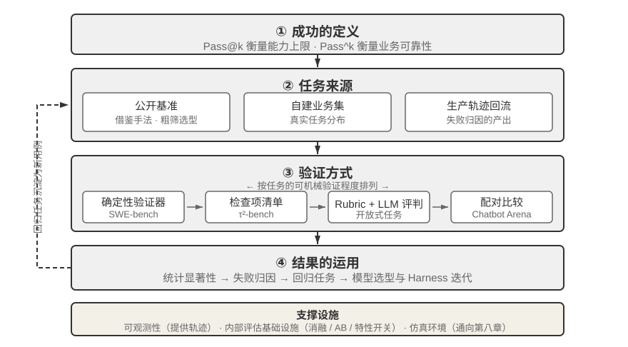
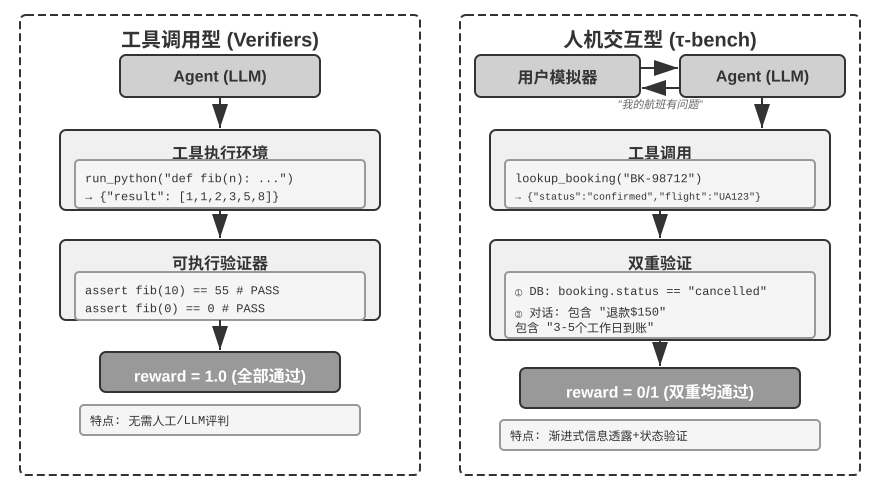
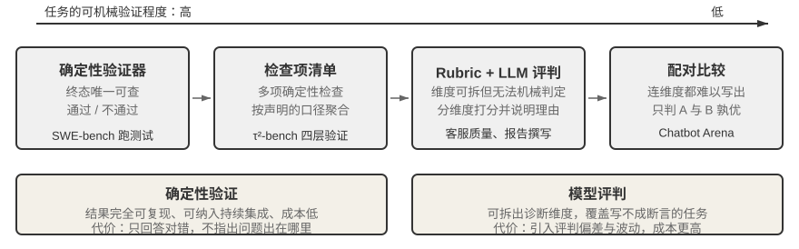
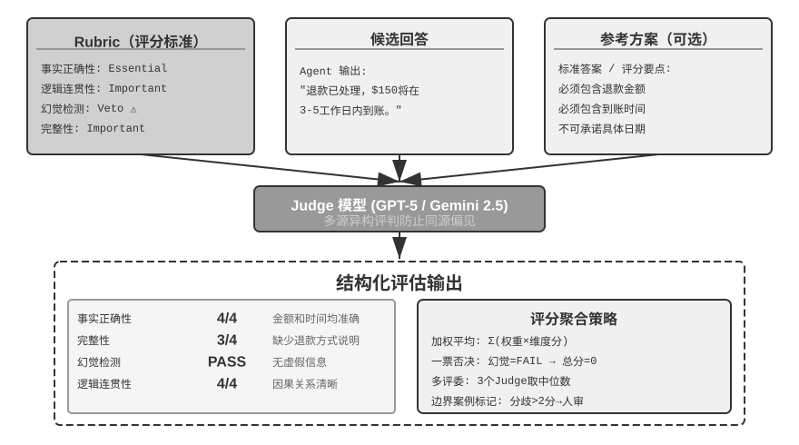
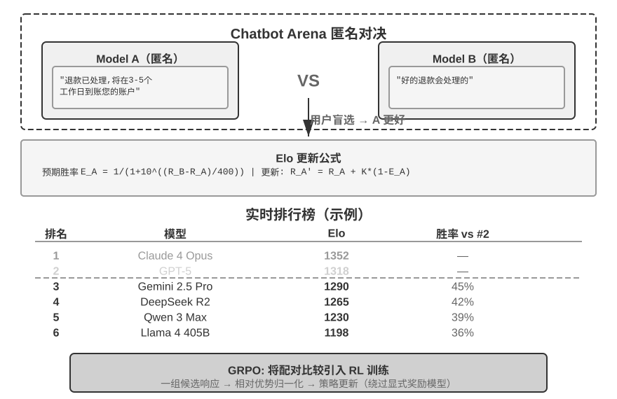
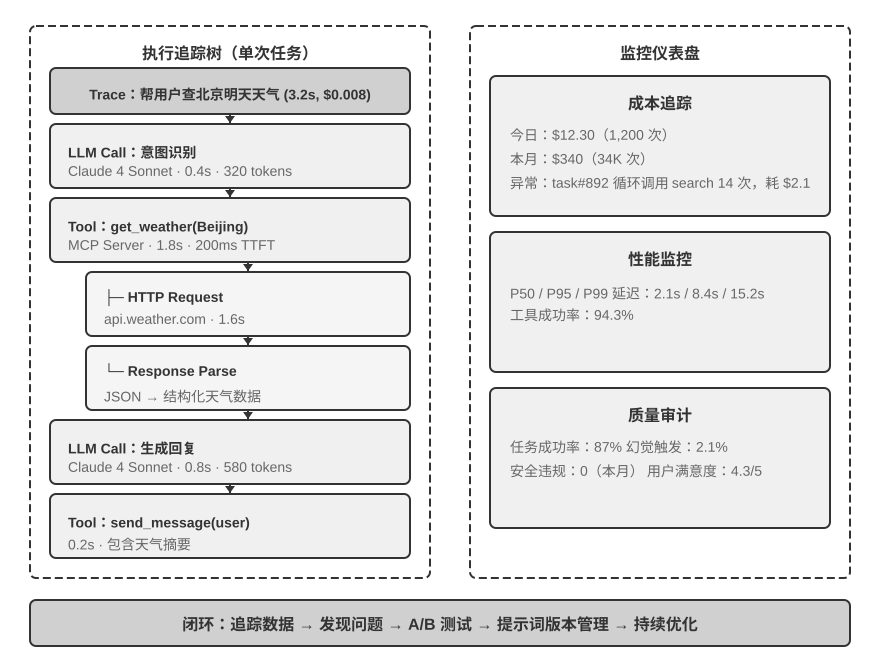
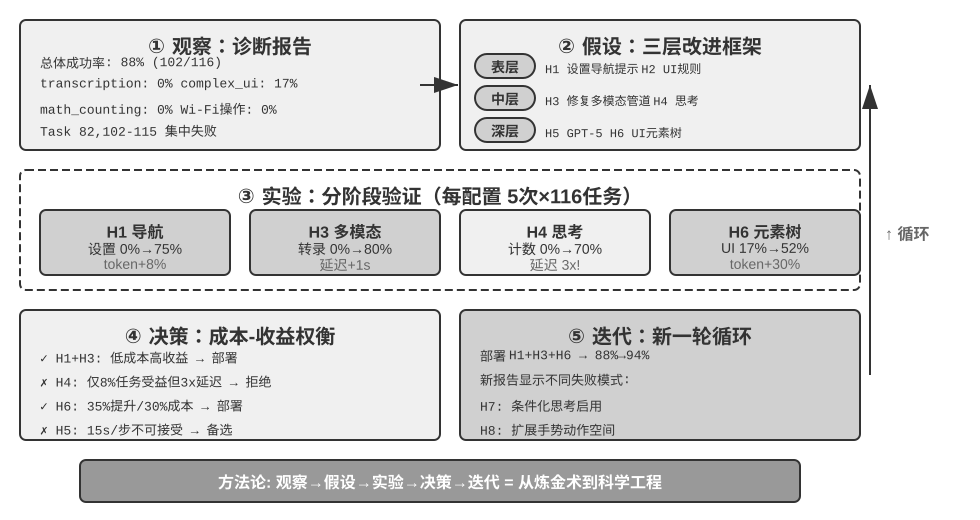
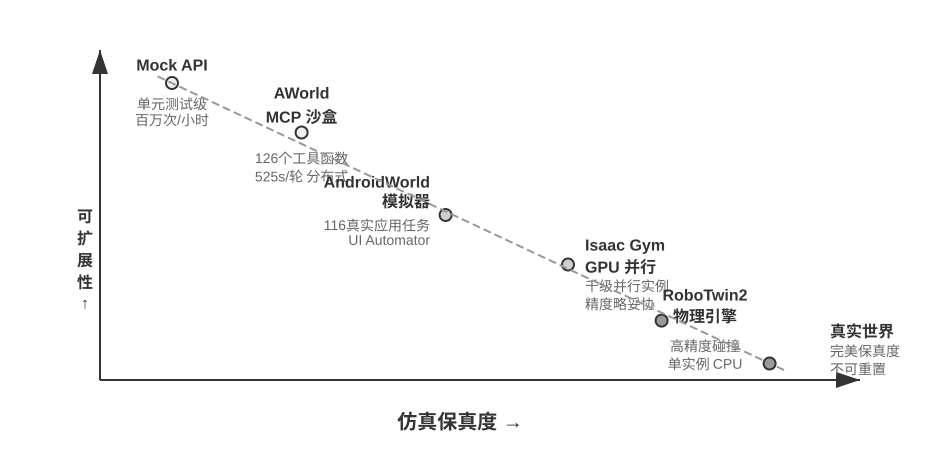

# 第7章 Agent 的评估（内容精读）

> [!info] 一句话主旨
> 「构建完成」不等于「构建正确」——本章建的是第一章发现循环中的**证据**段。一套评估体系由四个环节构成：**什么算成功**（Pass@k / Best@k / Pass^k 口径不同）、**任务从何而来**（公开基准 / 自建业务集 / 生产轨迹回流）、**由谁验证**（确定性验证器 → Rubric + LLM-as-a-Judge → 配对比较）、**分数如何转化为决策**（统计显著性 → 失败归因 → 回归任务 → 模型选型 → 内部评估基础设施）。核心认识是：**评估对象不是模型，而是模型与 Harness 的组合体。**

## 与前后章的关系

- **承接第 1 章**：第 1 章的「发现 → 提案 → 验证 → 更新」循环里，本章是**验证段与证据来源**；第 1 章的消融实验、边界集与保留集在本章变成可操作的评估方法。
- **承接第 2–4 章**：第 2 章的 KV Cache 与上下文压缩在本章的成本分析里被量化（表7-4）；第 4 章的工具可观测性在本章扩展为完整的 trace/span 体系；第 3 章的用户记忆在本章成为 Rubric 与轨迹前缀评估的实例。
- **承接第 5 章**：第 5 章「同一模型换 Harness 结论可能截然不同」在本章升格为**模型替换实验（model swap）**；第 5 章的失败归因需求在本章成为一等方法论；AndroidWorld T3A 案例的根因判定（观察通道缺失，而非模型不会 OCR）正是第 5 章「先检查输入，再怀疑模型」的实证。
- **承接第 6 章**：第 6 章的 TTS、Computer Use、AndroidWorld 与应用策略在本章被纳入评估（多模态 Judge、UI 评估、TTS 四维 Rubric、动作分块）。
- **向后接第 8 章**：本章末节把评估环境升级为**仿真环境**，并指出「验证脚本直接就是奖励脚本」（RLVR）、以及训练额外的 **reset 语义**与**吞吐**要求，直接交给第 8 章的后训练。
- **向后接第 9 章**：生产轨迹的多维评价转化为知识、指令、程序的更新，是第 9 章持续进化的输入。

## 结构大纲（导览注）

- **§7.1 导言**：评估的定位（Harness 的验证功能）、评估对象是「模型 + Harness」组合体、模型替换实验 vs 消融实验、四环节总图（图7-1）。
- **§7.2 一条评估任务的解剖**：τ²-bench telecom 领域的一条任务（四组成部分）→ 一次真实运行的轨迹（双控机制、满分轨迹里的隐藏问题、失败轨迹的分析价值）。
- **§7.3 评估指标：成功的定义**：Pass@k / Best@k（能力上限，「技术奇观」）↔ Pass^k（业务可靠性），以及两者与单次成功率 $p$ 的关系与口径要求。
- **§7.4 评估环境**：五个组成要素（数据集 / 环境状态 / 工具接口 / 评分标准 / 执行协议）→ 人机交互型与工具调用型两类环境（表7-1 Verifiers 四类）。
- **§7.5 评估数据集的设计**：基准横向对照（表7-2）→ 验证器的三种深度（SWE-bench / OSWorld / Terminal-Bench）→ 难度划分的诊断价值 → 数据泄漏防范三法 → 质量控制与长期维护（τ²-bench 五处重设计、SWE-bench 淘汰 71%、OSWorld 300+ 问题）→ 评估集的三个来源。
- **§7.6 自动化评估方法**：验证方式谱系（图7-4）→ LLM-as-a-Judge 与 Rubric 四准则（含完整 Rubric 示例、同源模型与多源异构评判、多模态评判）→ 失败归因（九类错误表 + 三类典型错误）→ 端到端与轨迹前缀回归任务 → 配对比较与模型排名（Elo / Bradley-Terry / 位置偏差）。
- **§7.7 评估驱动的模型选型**：选型五维（吞吐/延迟、成本、性能、速率限制、预算—能力曲线）→ 模型的行为策略（行动阈值与实验 7-9）→ 成本分析与优化策略（表7-4）→ 评估驱动的持续迭代案例。
- **§7.8 评估结果的统计显著性**：标准误、置信区间、配对分析、多种子、多重比较。
- **§7.9 Agent 的可观测性**：trace/span 模型、OpenTelemetry / OpenInference、LangSmith、可观测性数据回流为评估资产。
- **§7.10 从 Benchmark 报告到系统改进**：先检查评测系统、再动 Agent → 读懂报告 → 构建假设（H1/H5/H5C）→ 数据驱动决策（表7-5）→ 持续迭代的尺度纪律。
- **§7.11 从外部评估到内部评估**：消融基础设施、AB 测试方法论、双层特性开关、提示词敏感性评估、隐私感知分析。
- **§7.12 仿真环境：从评估到后训练的桥梁**：仿真 vs 评估的三点差别、RLVR、reset 与吞吐、数字环境（AWorld）与具身环境（RoboTwin2）→ 保真度权衡与领域随机化。
- **§7.13 本章小结**；**思考题 9 道**见 [[思考题引导/第7章 Agent 的评估]]，实验解读见 [[实验解读/第7章 Agent 的评估]]。

## 核心概念表

| 术语 | 一句话定义 | 原书出处 | 延伸 |
| --- | --- | --- | --- |
| 评估的对象是组合体 | 评估的对象不应只是模型，而应是**模型与 Harness 的组合体** | §导言 | 第 1 章 Harness 五要素 |
| 模型替换实验 | 固定 Harness 只换模型，看分数变化幅度：涨幅小→瓶颈在 Harness | §导言 | 第 5 章行为策略 |
| 消融实验（对比） | 关闭 Harness 的某个组件看整体性能变化，定位内部哪个部件重要 | §导言 | 第 1 章消融 |
| 评估四环节 | 什么算成功 / 任务从何而来 / 由谁验证 / 分数如何转化为决策 | §导言 图7-1 | — |
| 为未来的模型开发产品 | 当前模型不够用也先建评估集，持续追踪新模型，达门槛即上线 | §导言 | — |
| 任务定义四要素 | 工单 / 用户行为规范（`known_info` + `task_instructions`）/ 初始状态 / 评分标准 | §一条评估任务的解剖 | — |
| 渐进式信息透露 | 把用户的知识范围建模为独立字段，Agent 必须通过提问获取 | §任务定义的四个组成部分 | 第 2 章渐进式披露 |
| 事实锚定 | 模拟用户对设备状态的回答必须基于工具返回，否则评估退化为两个模型相互确认 | §任务定义的四个组成部分 | — |
| 双控（Dual-Control） | 模拟用户拥有独立工具集（`check_status_bar`、`toggle_airplane_mode`…），双方都能改环境 | §一次真实运行的轨迹 | — |
| 二元奖励的固有代价 | 以过程颗粒度换取跨模型可比的单一数字 | §一次真实运行的轨迹 | — |
| Pass@k / Best@k | 同一任务运行 $k$ 次，至少一次通过即通过（连续得分取最好） | §技术奇观 | — |
| 技术奇观 | 大量尝试与人工筛选下展示的能力上限；Manus 的虚拟电脑、OpenClaw 的「活人感」是其产品化形态 | §技术奇观 | — |
| Pass^k（Pass consecutive k） | 连续运行 $k$ 次**每次都必须通过**，且不能触发安全/合规/幻觉一票否决 | §业务可靠性 | — |
| 两类指标的关系 | $\mathrm{Pass@}k=1-(1-p)^k$，$\mathrm{Pass}^k=p^k$；$p=0.6,k=5$ 时约 99.0% 对 7.8% | §业务可靠性 | — |
| 评估五要素 | 数据集 / 环境状态 / 工具接口 / 评分标准 / 执行协议 | §五个组成要素 | — |
| 原子工具要求 | 两套工具都是原子操作，不提供「解决用户的上网问题」这类高层抽象 | §五个组成要素 | 第 4 章 ACI |
| Verifiers 四类环境 | SingleTurnEnv / ToolEnv / StatefulToolEnv / SandboxEnv（表7-1） | §人机交互型与工具调用型 | — |
| 两类环境验证什么 | 工具调用型验证**行动**（可观测状态变更的正确性）；人机交互型验证**引导**（沟通策略的合理性） | §人机交互型与工具调用型 | — |
| 验证器的三种深度 | SWE-bench 双命题检验 / OSWorld 134 个评估函数 / Terminal-Bench 真实执行不可伪造 | §验证器 | — |
| FAIL_TO_PASS 与 PASS_TO_PASS | 「已修复」与「未破坏」必须成为两个各自可证的结论；还需排除 flaky test | §验证器 | — |
| 难度的诊断价值 | GAIA 三级分层：L1 指向工具使用、L2 指向多步规划、L3 指向长序列管理 | §任务的难度划分 | — |
| 陷阱任务 | 用户声称「客服已批准取消」而实际不符合政策，检验压力下的判断 | §任务的难度划分 | — |
| 抗泄漏三法 | 组合多源 + 专有附件（GAIA）/ 模板参数化实例化（AndroidWorld）/ canary GUID 可检测（Terminal-Bench） | §数据泄漏防范 | — |
| 质量维护的代价 | SWE-bench 2294→500（淘汰 71%，评估成本降约 80%）；OSWorld 15 个月暴露 300+ 问题 | §质量控制与长期维护 | — |
| 评估集三来源 | 公开基准（粗筛）/ 自建业务集（决策依据）/ 生产轨迹回流（成本最高、最准） | §评估集的三个来源 | — |
| 验证方式谱系 | 横轴是任务的可机械验证程度；能写成断言的检查都应继续用断言 | §自动化评估方法 图7-4 | — |
| Rubric 四准则 | 基于专家指导 / 全面覆盖（含 Pitfall）/ 按重要性加权（含 Veto）/ 评价标准自包含 | §LLM-as-a-Judge | Scale AI |
| 一票否决（Veto） | 幻觉等维度一旦触发总分归零；同时防范关键词堆砌式奖励作弊 | §LLM-as-a-Judge | — |
| 长度偏差 | 评判模型偏好更长更详尽的回复；三种防范手段（惩罚冗长/控长配对/审计相关性） | §LLM-as-a-Judge | — |
| 古德哈特定律 | 当一个度量指标变成优化目标时，它就不再是好的度量指标 | §同源模型问题 | — |
| 多源异构评判 | 用不同模型家族分别评判，偏见正交，Agent 难以同时欺骗所有评判者 | §同源模型问题 | 第 1 章提议者—审核者 |
| 参考物即评估设计 | 「选什么参考答案/图片/音频，本身就是评估设计」 | §多模态 LLM-as-a-Judge | — |
| 失败归因 | 定位轨迹中**首个导致任务偏离的错误**，区分根因与后果，输出结构化记录 | §失败归因 | — |
| 规则先筛 + LLM 定位 | 先用规则筛出嫌疑轨迹，再交 LLM 定位首错，比全量喂 LLM 更便宜也更准 | §失败归因 | — |
| 「做对了但说错了」 | 环境状态正确但信息告知错误；τ²-bench 中占全部失败的三分之一（80/240） | §「做对了但说错了」问题 | — |
| 作用域敏感修改 | 把文档解析为带作用域的片段（`ZH_PROSE`/`CODE_BLOCK`/`JSON_OR_SCHEMA`…），每种片段有自己的允许变换集合 | §作用域敏感的文档格式错误 | — |
| 精确复制链路 | 字节 → 工具返回 → 序列化 → 上下文 → token → 解码 → 解析 → 匹配；只有首个差异出现在模型输出时才算模型问题 | §精确复制错误 | 第 2 章参数保真 |
| 端到端回归任务 | 从初始状态跑完整任务，检查最终状态与安全条件 | §端到端回归任务 | — |
| 轨迹前缀回归任务 | 冻结上下文与状态，只验证那个决策边界是否被修好；答案定义为**可接受动作集合** | §端到端回归任务 | 第 1 章边界集 |
| 配对比较与 Elo | 用大量两两对决量化相对能力；统计基础是 Bradley-Terry 模型 | §配对比较与模型排名 | — |
| 位置偏差 | 评判模型系统性偏向某个位置的候选；缓解方法是**交换顺序各评一次** | §配对比较与模型排名 | — |
| 选型五维 | 吞吐量/延迟（TTFT、p95）/ 成本 / 性能（Pass@1、Pass^k）/ 速率限制与可靠性 / 预算—能力曲线 | §选型的关键维度 | — |
| 预算—能力曲线 | 固定预算的单点成绩不能外推长程能力；RE-Bench：2 小时 Agent 约人类 4 倍，8 小时人类反超 | §选型的关键维度 | — |
| 行动阈值 | 模型默认在「继续收集信息」与「开始修改」之间的取舍，是模型的行为策略 | §模型的行为策略 | 第 5 章、第 8 章 |
| 成本三层次 | 模型推理成本（上下文累积 + 思考 token）/ 工具调用成本 / 基础设施成本 | §Agent 系统的成本分析 | 第 2 章 |
| 优化的不可加性 | 仅稳定前缀省 28.3%、仅压缩历史省 17.5%，合用只省 30.0%——必须在完整任务中一起实测 | §Agent 系统的成本分析 表7-4 | — |
| 统计显著性 | $\mathrm{SE}(p)\approx\sqrt{p(1-p)/n}$；100 用例 70% 时置信区间约 ±9 个百分点 | §评估结果的统计显著性 | — |
| 配对分析 | 同一批任务逐题比较，用 McNemar 或配对 bootstrap；每个配置用 3–5 个种子 | §评估结果的统计显著性 | — |
| 可观测性 | 通过日志、指标、追踪数据推断系统内部状态 | §Agent 的可观测性 | 第 4 章工具可观测性 |
| Trace / Span | 一次任务执行 = 一条 trace；每次 LLM 调用/工具调用/检索 = 一个 span，父子关系构成执行树 | §Agent 的可观测性 | — |
| 标准协议 | OpenTelemetry（分布式追踪标准）+ OpenInference（LLM 语义约定）；采集与分析解耦 | §Agent 的可观测性 | — |
| 评估资产回流 | 生产轨迹 → 筛选失败与可疑案例 → 脱敏 → 沉淀为评估集与回归测试 | §Agent 的可观测性 | — |
| 先查评测系统 | 看到 Agent 表现下降，应先检查评测系统本身，再动 Agent | §从 Benchmark 报告到系统改进 | — |
| 三层改进假设 | 表层（提示词）→ 中层（输入表示）→ 深层（能力缺陷），一轮只改一个变量 | §从数据到假设 | — |
| 一轮证据的尺度纪律 | 一轮证据只支持与它规模相称的下一步；子集 4/4 不能写成系统整体 100% | §持续迭代 | — |
| 消融基础设施 | 内置总开关禁用多个主要特性，创造「裸模型」基线；必须在启动路径极早期注入 | §消融基础设施 | 第 1 章消融 |
| 特性债务 | 曾经有效但随模型进化已不再必要的特性；定期消融可发现 | §消融基础设施 | — |
| 机制指标 vs 目标指标 | 最易犯的错误是把你正在改变的东西当作优化目标 | §AB 测试方法论 | — |
| 护栏指标 | 目标指标改善但满意度下降/错误率上升时，实验也应停止 | §AB 测试方法论 | — |
| 双层特性开关 | 编译时开关（物理移除代码，兼作干净消融）+ 运行时开关（服务端下发 + 本地缓存） | §双层特性开关系统 | — |
| 提示词敏感性评估 | 系统提示应能确定性渲染、版本化快照、每次变更跑评估集回归（像 CI 一样） | §提示词敏感性评估 | 第 2 章 |
| 隐私感知分析 | 用类型系统把隐私约束变成编译期强制；先设计隐私，再谈评估 | §以隐私感知分析为评估基础 | — |
| 仿真环境 | 从评估环境演化而来：交互频率高数百万倍、需要随机化、必须提供即时反馈 | §仿真环境 | 第 8 章 |
| RLVR | 可验证奖励：定义清晰的 Rubric 或验证器本质就是奖励函数，**验证脚本直接就是奖励脚本** | §仿真环境 | 第 8 章 |
| 训练额外要求 | 可靠的 reset 语义（每个 episode 都能回到干净初始状态）+ 远高于评估的吞吐 | §仿真环境 | — |
| 领域随机化 | 在物理参数、视觉外观、传感器噪声上大范围随机，以缩小 sim-to-real gap | §保真度权衡 | 第 6 章 sim2real |

> 完整定义见 [[02-全书术语表#第七章 Agent 的评估|术语表·第七章]]。

## 逐节深析（先带问题读原书，再对照小结与原文论证）

### §7.1 导言：为什么评估的对象是「模型 + Harness」

> [!question] 带着这些问题阅读本节
> 1. 为什么说 Agent 在评估中表现不佳时，改进方向可能不是换模型？作者给的关键认识是什么？
> 2. 区分「模型能力不足」与「Harness 设计缺陷」的常见手段是什么？它与消融实验的区别在哪？
> 3. 一套评估体系可以拆成哪四个环节？

**读后小结**：

- **评估的定位**：从第 1 章的 Harness 工程视角看，评估在 Harness 中扮演「验证」功能的核心角色。**关键认识：评估的对象不应只是模型，而应是模型与 Harness 的组合体**——同一个模型在不同 Harness 中可能表现差异悬殊；有些团队**仅通过优化 Harness** 就显著提升了同一模型在终端类任务上的表现（第 5 章）。因此完善的评估体系应能区分「模型能力不足」与「Harness 设计缺陷」这两类本质不同的问题。
- **区分手段：模型替换实验（model swap）**——固定 Harness，只更换更强/更弱的模型，观察分数变化幅度：换强模型分数**不涨** → 瓶颈在 Harness；换弱模型分数**大跌**（分数随模型能力大幅波动）→ 瓶颈在模型能力本身、当前表现主要由模型决定（至于这是任务本身难，还是 Harness 过度依赖模型先验，需进一步分析）。**注意它与消融是两种不同方法**：消融是**关闭 Harness 的某个组件**看整体性能变化（定位内部哪个部件重要）；模型替换是**固定 Harness、只换模型**（区分瓶颈在模型还是在 Harness）。
- **为什么现在更重要**：模型快速演进时，**新模型在公开基准上更好，并不意味着在你的特定任务上也更好**，反而可能出现性能退化（regression）。只有在自己评估集上完整测试，才能做数据驱动的升级决策。更进一步，完善的评估体系使 **「为未来的模型开发产品」** 成为可行策略——当前模型不足以商用也可以先完成产品开发并建立评估集，持续追踪新模型，**一旦达到门槛就立即上线**。
- **四环节**（图7-1）：什么算成功、任务从何而来、由谁验证、分数如何转化为决策。本章的做法是「先完整解剖一条真实任务，再依次展开」。
- **评估与对比的方法论**：通过系统性的**对比实验**（改变一个变量，观察效果变化）和**消融实验**（逐一关闭某个组件）区分真正的能力提升与表面波动；没有可重复的评估体系，迭代方向只能靠直觉。

**图7-1 解读**：该图给出 Agent 评估体系的四个环节（原书 §导言）：什么算成功、任务从何而来、由谁验证、分数如何转化为决策——四个环节依次衔接，构成「评估 → 决策 → 改进」的闭环。

**原文论证**：

> 一个关键认识是：**评估的对象不应只是模型，而应是模型与 Harness 的组合体**。……完善的评估体系应能区分 “模型能力不足” 和 “Harness 设计缺陷” 这两类本质不同的问题。（原书 §导言）

> 一套评估体系可以拆成四个环节：什么算成功、任务从何而来、由谁验证、分数如何转化为决策，如图7-1 所示。（原书 §导言）

> 只有在自己的评估数据集上完整测试，才能做出数据驱动的升级决策。（原书 §导言）

**取舍与延伸**：把「model swap」和「消融」当作**两条正交的诊断轴**记下来——一条回答「瓶颈在哪一层」，另一条回答「这一层里哪个部件重要」。第 7.11 节的「消融基础设施」正是把后者做成了产品级设施。

### §7.2.1 任务定义的四个组成部分

> [!question] 带着这些问题阅读本节
> 1. τ²-bench 一条任务由哪四部分组成？`known_info` 与 `task_instructions` 为什么要分成两栏？
> 2. 为什么模拟用户必须有「事实锚定」要求？缺少它会退化成什么？
> 3. 「模拟用户和 Agent 都不具备完全信息」这个设计带来了什么？
> 4. `evaluation_criteria` 检验哪四个维度？

**读后小结**：

- **四组成部分**（以 `tasks_small.json` 中一条任务为例）：① 提供给 Agent 的**工单**（ticket）；② 提供给用户模拟器的**行为规范**（`user_scenario`：`known_info` / `unknown_info` / `task_instructions`）；③ 运行前把两侧状态重置到同一起点的 **`initial_state`**（`initialization_actions`）；④ **评分标准**（`evaluation_criteria`：`actions` / `env_assertions` / `communicate_info` / `nl_assertions` / `reward_basis`）。
- **显式建模用户的认知边界**：`known_info` 只包含姓名、号码与所在国家——飞行模式开启、数据漫游关闭这两项**真正的故障原因不在其中**，用户并不知情、无法主动陈述，Agent 只能通过提问和引导用户查询来获取。这就是**渐进式信息透露（Progressive Information Disclosure）在任务定义层面的实现方式**：不靠「不要一次说完」的提示词去约束模拟器，而是把用户的知识范围建成独立字段。**多数基准在任务开始时即给出完整需求，而真实用户的初始表述往往只是「我上不了网」——把需求澄清到可执行的程度，本身就是 Agent 必须具备的能力。**
- **防止用户模拟器被 Agent 忽悠**：`task_instructions` 含三类约束——**情绪设定**（首次修复失败后表现轻度不满）、**验收口径**（仅当测速 excellent 才认定解决，poor/fair/good 均不接受）、**事实锚定**（关于设备状态的任何回答必须以工具返回为依据）。**缺少事实锚定约束时，模拟用户会顺应 Agent 的引导确认问题已解决，评估随之退化为两个模型之间的相互确认。**
- **双方都不具备完全信息**：飞行模式与漫游开关属于用户侧，运营商侧的 `enable_roaming` 属于 Agent 侧。这一划分决定故障形态——**运营商侧漫游已开通、用户设备侧却关闭**，Agent 查数据库只能得到「配置正常」，**故障位于数据库不可见的一侧，只有引导用户查询才能发现**。
- **四个校验维度**：`env_assertions` 检验终态（移动数据可用、测速 ≥200 Mbps 且 excellent）、`actions` 检验关键动作是否发生、`communicate_info` 与 `nl_assertions` 检验必要信息是否已告知用户；每个任务可检查其中一或多个维度。

**原文论证**：

> 这就是**渐进式信息透露（Progressive Information Disclosure）** 在任务定义层面的实现方式：它并非依靠一句 “不要一次说完” 的提示词去约束模拟器，而是将用户的知识范围建模为一个独立字段。（原书 §「任务定义的四个组成部分」）

> 缺少事实锚定约束时，模拟用户会顺应 Agent 的引导确认问题已解决，评估随之退化为两个模型之间的相互确认。（原书 §「任务定义的四个组成部分」）

> 故障位于数据库不可见的一侧，只有引导用户查询才能发现。（原书 §「任务定义的四个组成部分」）

**取舍与延伸**：「把用户的知识范围建模成字段」这一招可以搬到任何自建评估集：**它把「Agent 会不会主动澄清需求」从一句提示词的期望，变成了任务定义里的硬约束。**

### §7.2.2 一次真实运行的轨迹

> [!question] 带着这些问题阅读本节
> 1. 什么是双控（Dual-Control）机制？它给评估增加了什么维度？
> 2. 那条满分轨迹里还藏着什么问题？为什么验证器没有捕获它？
> 3. 失败轨迹的失败形态说明了什么？

**读后小结**：

- **双控机制**：模拟用户拥有**一套独立的工具集**（`check_status_bar`、`toggle_airplane_mode`、`reseat_sim_card`、`run_speed_test` 等）。轨迹中的关键转折是**用户而非 Agent 发出工具调用**：用户调用 `check_network_status()` / `check_status_bar()`，得到 `Airplane Mode: ON | Cellular Connection: no_service | Data Roaming Enabled: No`，随后主动说出自己的观察。
- **成功轨迹的走向**：前十余轮为账户识别阶段；第 17 条 Agent 基于 L1001 一条线路给出错误结论（「号码不在您的活跃线路中」），用户坚持后 Agent 才查到 L1002；第 30 条用户侧工具调用暴露真正故障；随后关飞行模式、开漫游、测速 275 Mbps / Excellent，两条 `env_assertions` 通过，`reward = 1.0`。
- **满分轨迹里的隐藏问题**：telecom 的 Agent 政策首段规定「You should only make one tool call at a time」，而第 4 条消息 Agent 一次发出两个调用；**验证器没有判定出错，因为本题 `reward_basis` 只考虑最终状态**。作者明确这不是疏漏，而是**二元奖励的固有代价：它以过程颗粒度换取跨模型可比的单一数字**——但生产环境往往需要更多：不仅判定对错，还要指出问题出在哪里。
- **失败轨迹的价值**：用户号码为 555-123-2002，Agent 却选定 L1001 并以它的用量推进；`get_details_by_id(L1001)` 明确返回 555-123-2001，**Agent 读取了却未修正判断**，此后在无关排查上消耗数十条消息，最终转接人工。它完成了任务的一半（引导用户关闭省流模式，用户侧动作真实发生并被环境验证），但**线路选择错误导致 2 GB 充值未执行，三条终态断言全部失败**。作者指出：这一失败形态与后文失败归因里的 AndroidWorld 案例高度相似——**修正判断所需的证据已进入上下文，Agent 未据此回溯。**

**原文论证**：

> 发出工具调用的是**用户**而非 Agent。这就是**双控（Dual-Control）** 机制：模拟用户拥有一套独立的工具集。（原书 §「一次真实运行的轨迹」）

> 这并非 τ²-bench 的疏漏，而是二元奖励的固有代价：它以过程颗粒度换取跨模型可比的单一数字。但生产环境中的评估系统往往需要更多：不仅要判定对错，还要指出问题出在哪里。（原书 §「一次真实运行的轨迹」）

> 这一失败形态与后文 “失败归因” 一节讨论的 AndroidWorld 案例高度相似：修正判断所需的证据已进入上下文，Agent 未据此回溯。（原书 §「一次真实运行的轨迹」）

**取舍与延伸**：双控机制给评估加了一个新维度——**用户改变状态后，Agent 必须重新调用工具才能获知结果**，于是评估顺带覆盖了「Agent 是否真的读到了用户侧的操作结果」。这与第 6 章「动作执行后必须重新确认现实」是同一条纪律。

### §7.3.1 技术奇观：用 Pass@k 看能力上限

> [!question] 带着这些问题阅读本节
> 1. 「技术奇观」指什么？Pass@k 与 Best@k 的口径是什么？
> 2. 这类指标适合评价什么样的任务？
> 3. 为什么 Manus 与 OpenClaw 的早期高成本低成功率仍然算成功？

**读后小结**：

- **技术奇观**的定义：在**大量尝试、充足时间和人工筛选**下展示出的**能力上限**——只要其中一次成功，就足以证明「这件事原则上做得到」。**Pass@k** 的逻辑：同一任务运行 $k$ 次，至少一次通过即算通过；若输出是连续得分则取最好的一次，记为 **Best@k**。
- **适用场景**：对**科研发现、漏洞挖掘、开放式创作**等任务，这种能力上限本身就很有价值——**人类可以从 $k$ 条候选轨迹中挑出那一条最好的**。Anthropic 对长时运行 Agent 的讨论是典型：让 Agent 自主工作一周写出一个 C 编译器、持续探索直到找到重要数学猜想的反例、反复审查开源软件发现几十年的重大安全漏洞。
- **产品侧的证据**：Manus 让此前对 Agent 没有直观概念的人发现 AI 可以像人一样操作电脑、持续工作半小时到一小时；OpenClaw 让人第一次感到「活人感」（通过 IM 分配任务、访问全部文件与在线服务、主动反馈或索取信息、主动唤醒自己处理邮件）。**早期的 Manus 和 OpenClaw 复杂任务成功率并不高、token 成本也非常高**，但由于框架通用性，配最强模型时 Pass@k 较高，展现出很高的技术上限；**这些「技术奇观」在社交网络上被大量分享，是产品成功的关键。**

**原文论证**：

> 这里的 “奇观” 是指在大量尝试、充足时间和人工筛选下展示出的能力上限：只要其中一次成功，就足以证明 “这件事原则上做得到”。这正是 **Pass@k** 的逻辑——在同一任务上运行 $k$ 次，只要至少有一次通过，任务就算通过。（原书 §「技术奇观：用 Pass@k 看能力上限」）

> 对于科研发现、漏洞挖掘、开放式创作等任务，这种能力上限本身就很有价值：人类可以从 $k$ 条候选轨迹中挑出那一条最好的。（同上）

**取舍与延伸**：这段其实在解释一个**反直觉的商业现象**——产品成功可以来自「技术上限的可见性」而非「可靠性」。对工程团队的含义是：**先分清你要卖的是哪一种东西**，再决定优化哪个指标。

### §7.3.2 业务可靠性：关注 Pass^k

> [!question] 带着这些问题阅读本节
> 1. Pass^k 的定义与它额外排除了什么？
> 2. 两类指标与单次成功率 $p$ 的关系式是什么？$p=0.6,k=5$ 时两个数字各是多少？
> 3. 评估报告必须写清 $k$ 次尝试的哪种口径？对会产生副作用的操作有什么额外要求？

**读后小结**：

- **Pass^k**（Pass consecutive k）：同一任务**连续运行 $k$ 次，要求每一次都通过**，且不能触发安全、合规或幻觉等**一票否决项**。它回答的是「Agent 能否稳定可靠地交付」，而不是「能否偶尔创造奇迹」。
- **两个公式**：$\mathrm{Pass@}k=1-(1-p)^k$、$\mathrm{Pass}^k=p^k$。**例**：$p=0.6$、$k=5$ 时，Pass@5 $=1-0.4^5\approx99.0\%$（看起来几乎总能至少成功一次），而 Pass^5 $=0.6^5\approx7.8\%$（连续五次都不出错仍然很难）。**前一个数字适合衡量探索时的能力天花板，后一个数字才接近支付、退款、权限变更、生产部署等场景的可靠性要求。**
- **口径必须写清**：是**同一任务的 $k$ 次独立采样**，还是**生产流水线上连续 $k$ 个任务**。对于会产生副作用的操作，不能简单「重试直到成功」，而应在**沙盒或可回滚环境**中采样，并把**每一次失败都记入可靠性指标**。

**原文论证**：

> 真实业务通常更关心另一件事：在多次尝试中一次错都不能犯。我们把这个目标称为 **Pass^k**（可以读作 **Pass consecutive k**）：同一任务连续运行 $k$ 次，要求每一次都通过，且不能触发安全、合规或幻觉等一票否决项。（原书 §「业务可靠性：关注 Pass^k」）

> 对于会产生副作用的操作，不能简单地 “重试直到成功”，而应在沙盒或可回滚环境中采样，并把每一次失败都记入可靠性指标。（同上）

**取舍与延伸**：这组公式是全书**最便宜也最容易被忽略**的一条工程结论：**把单次成功率当成业务可用性来汇报，几乎必然高估系统的可靠性。** 它也解释了为什么「重试」不是可靠性问题的解——重试会改变副作用与成本结构。

### §7.4.1 五个组成要素

> [!question] 带着这些问题阅读本节
> 1. 一个可重复运行的评估环境需要哪五个组成部分？
> 2. 为什么工具必须是原子操作？抽象层次过高会退化成什么？
> 3. 执行协议规定什么？终止信号有哪些？

**读后小结**：

- **五个组成要素**（以那条 telecom 任务为参照）：
  1. **数据集（Dataset）**：初始状态、给 Agent 的工单、给模拟器的行为规范与验收标准打包为一条记录，**一条记录即一个用例**。
  2. **环境状态（Environment State）**：数据库中的客户、线路、套餐与账单，加上设备侧的飞行模式、漫游、省流开关与剩余流量。**必须可重置**（`initialization_actions` 即重置脚本）；真实性要求状态变化符合业务逻辑，可控性要求每次运行前都能回到同一起点。
  3. **工具接口（Tools）**：分属两侧——Agent 可调用查询客户、查询用量、充值流量、转接人工等运营商侧操作；用户可调用设备侧开关。**两套工具均为原子操作，不存在「解决用户的上网问题」这类高层抽象——抽象层次过高会使评估退化为对单次函数调用的考察，规划与推理环节被工具本身吸收。**
  4. **评分标准（Rubric）**：`evaluation_criteria` 的四层检查，加上 `reward_basis` 这一聚合规则。
  5. **执行协议（Interaction Protocol）**：规定交互顺序与终止条件。正常终止信号为模拟用户输出 `###STOP###`，此外还有**轮数上限**，以及**模拟用户因耐心耗尽而主动结束对话——沟通效率过低本身即计为失败**。
- **缺一不可**：五个要素缺其一，评估便无法构成可重复的循环；后文考察其他基准时仍以这五项作为对照框架。

**原文论证**：

> 两套工具均为原子操作，不存在 “解决用户的上网问题” 这类高层抽象——抽象层次过高会使评估退化为对单次函数调用的考察，规划与推理环节被工具本身吸收。（原书 §「五个组成要素」）

> 五个要素缺其一，评估便无法构成可重复的循环。（同上）

**取舍与延伸**：这五项可以直接当成**自建评估集的检查表**。特别注意「工具原子性」这一条——它和第 4 章的 ACI 原则是倒过来的要求：给 Agent 的工具要易用，给评估的工具要**难作弊**。

### §7.4.2 人机交互型与工具调用型评估环境

> [!question] 带着这些问题阅读本节
> 1. 工具调用型环境省去了什么？其余四个要素变成什么样？
> 2. Verifiers 按哪两个维度分层？四类环境各自适合什么任务？
> 3. 两类环境分别在验证什么？

**读后小结**：

- **工具调用型环境**：代码生成、数据分析、数学求解等任务**不存在对话对方**，Agent 自始至终只与工具交互，正确性由能否通过执行验证决定，**既不需要人工标注，也不需要模型评判**。它省去用户模拟器，其余四要素形态更简单：环境状态是文件系统或数据库，评分标准是一段测试代码，执行协议退化为「持续调用工具，直至给出答案或耗尽轮次」。
- **Verifiers 的两个分层维度**：**任务是否需要保持跨轮状态**、**是否需要隔离**。四类环境（表7-1）：`SingleTurnEnv`（无状态、无工具，单轮问答/数学题）、`ToolEnv`（无状态、多轮，搜索+信息综合）、`StatefulToolEnv`（有状态、多轮，修改数据库记录）、`SandboxEnv`（有状态+隔离、多轮，代码执行与测试）。
- **框架能力**：支持并行采样与轨迹缓存，每次评估的完整轨迹（观察、行动、奖励）都会保存，便于分析与回放；**工具的执行效果取决于当前状态，因此失败时应返回清晰的错误信息而非单一的失败标志**，使 Agent 能据此调整策略。
- **两类环境在验证不同的东西**：工具调用型评估考察**可观测状态变更的正确性**，人机交互型评估考察**沟通策略的合理性**——**前者验证行动，后者验证引导**。

**图7-2 解读**：该图对比工具调用型与人机交互型评估环境（原书 §「人机交互型与工具调用型评估环境」）：前者 Agent 只与工具交互、由执行结果验证行动；后者引入用户模拟器，验证的是引导与沟通策略，两者共用数据集、环境状态、评分标准与执行协议四项要素。

**原文论证**：

> 工具调用型评估考察的是可观测状态变更的正确性，人机交互型评估考察的则是沟通策略的合理性——前者验证行动，后者验证引导。两类环境的结构对比见图7-2。（原书 §「人机交互型与工具调用型评估环境」）

**取舍与延伸**：「前者验证行动，后者验证引导」这十个字是本节的判别句。它也提示了一条成本原则：**能不引入用户模拟器就不引入**——用户模拟器本身是一个需要被评估的模型（见思考题 4）。

### §7.5.1 基准设计的横向对照

> [!question] 带着这些问题阅读本节
> 1. 表7-2 从哪几个维度对照基准？各基准的环境扮演者与验证器分别是什么？
> 2. 从这张表能看出「验证深度」的哪些差异？

**读后小结**：

- **对照维度**：被测能力、任务来源、环境扮演者、验证器（表7-2）。
  - **τ²-bench**：客服场景的人机交互与工具调用｜人工编写 + 组合生成｜用户模拟器 + 业务数据库｜四层检查按 `reward_basis` 聚合为二元。
  - **SWE-bench Verified**：软件开发/coding｜GitHub 真实 issue 人工筛选｜代码仓库 + 测试套件｜FAIL_TO_PASS / PASS_TO_PASS 双重验证。
  - **AndroidWorld**：操作 Android 手机 GUI｜参数化模板实例化｜真实 Android 模拟器｜最终 UI 状态断言。
  - **OSWorld**：操作 Linux 桌面 GUI｜从预置的中间状态启动｜真实虚拟机｜134 个独立评估函数。
  - **Terminal-Bench**：操作 Linux 终端/coding｜人工编写｜Docker 容器｜文件系统检查 + 真实执行。
  - **GAIA**：搜集信息的通用 AI 助手｜人工编写 + 专有附件｜开放互联网｜精确字符串匹配。
- **读法**：这张表的真正价值是**横向比较「验证器能核实到什么深度」**——精确字符串匹配（浅）→ UI 状态断言 / 文件系统检查（中）→ 双重命题检验 / 真实执行 / 多函数深查（深）。

**原文论证**：

> 上一节区分的有无交互对象只是环境层面的第一层差异，数据集层面的分歧更能体现设计取舍。表7-2 将几个常被引用的基准并列。（原书 §「基准设计的横向对照」）

**取舍与延伸**：做自建评估集时，**先在这张表里找到与自己任务最像的一行**，再借它的验证器设计，比从零想快得多。

### §7.5.2 验证器

> [!question] 带着这些问题阅读本节
> 1. SWE-bench Verified 把「修复完成」拆成哪两个命题？只检验其中一个会怎样？
> 2. OSWorld 的验证器能发现什么？举两个任务的例子。
> 3. Terminal-Bench 的 `build-linux-kernel-qemu` 为什么无法伪造？

**读后小结**：

- **总原则**：Agent 很容易写一篇洋洋洒洒的报告说任务已完成，但事实上根本没有完成。**评估框架必须核实机器可独立复核的事实，而非 Agent 的自我陈述。**
- **SWE-bench Verified 的双命题**：**FAIL_TO_PASS**（修复前失败、修复后通过，证明问题确已解决）+ **PASS_TO_PASS**（修复前后均通过，证明未引入新缺陷）。**只检验前者，Agent 可以通过删改妨碍通过的断言蒙混；只检验后者，则等同于未作检验**；两组同时检验，才使「已修复」与「未破坏」成为两个各自可证的结论。它还额外确认测试自身的稳定性，**排除 flaky test**。
- **OSWorld 的深查**：134 个独立评估函数 + 完整操作系统访问权限，能检查文件系统结构、进程状态、网络连接与应用内部状态。数据库操作任务中不仅确认报告文件存在，**还会连接数据库核实 SQL 是否正确执行**；浏览器任务中会**分析 DOM 树、检查 cookie 与 localStorage、向后端发送验证请求确认表单确已生效**。
- **Terminal-Bench 的不可伪造**：任务 `build-linux-kernel-qemu` 要求从源码构建 Linux 内核 6.9、在 `start_kernel` 中加入自定义 printk、生成 initramfs 并在 QEMU 中运行，**成功标准是启动日志中出现该自定义消息**——Agent 无法伪造输出，只能真正完成整个流程。

**原文论证**：

> Agent 很容易写一篇洋洋洒洒的报告，说任务已经全部完成，但事实上根本没有完成。评估框架必须核实机器可独立复核的事实，而非 Agent 的自我陈述。（原书 §「验证器」）

> 只检验前者，Agent 可以通过删改妨碍通过的断言蒙混；只检验后者，则等同于未作检验。两组同时检验，才使 “已修复” 与 “未破坏” 成为两个各自可证的结论。（同上）

**取舍与延伸**：这三种验证器对应三种**加深验证**的手段——**双向命题**（正反各证一次）、**旁证核查**（不看声明看数据库与后端）、**真实执行**（让伪造的成本高于真做）。它们与第 6 章「预测不能代替验收」是同一条纪律的不同形态。

### §7.5.3 任务的难度划分

> [!question] 带着这些问题阅读本节
> 1. GAIA 三级分层的人类与 GPT-4 分数差说明了什么？分层除了标难度还有什么价值？
> 2. τ²-bench 的「陷阱任务」检验什么？

**读后小结**：

- **为什么需要难度分层**：评估任务集需要包括不同难度的任务，**这样当模型能力提升时，评估任务集不会快速过时**。
- **GAIA 的三级**（全套 466 题）：Level 1 只需一至两个工具（人类 93.9%，GPT-4 30.3%）；Level 2 需要多步思考（91.8% 对 9.7%）；Level 3 需要复杂组合（87.3% 对 0%）。**这一分层不止标注难度，更具备诊断价值**：Level 1 失败指向基础工具使用，Level 2 指向多步规划与信息整合，Level 3 指向长序列思考与复杂性管理——**三者对应的改进方向各不相同**。
- **Terminal-Bench 的跨度**：从简单的 mlflow 模型注册，到中等的 7z 密码破解，到困难的 git 服务器与 webserver 多组件集成，再到最高难度的 FEAL 差分密码分析。
- **陷阱任务**：τ²-bench 专门设计——用户声称「客服已批准取消」而实际并不符合政策，**用以检验 Agent 在压力与误导下能否维持正确判断**。

**原文论证**：

> 这一分层不止标注难度，更具备诊断价值：Level 1 失败指向基础工具使用，Level 2 指向多步规划与信息整合，Level 3 指向长序列思考与复杂性管理，三者对应的改进方向各不相同。（原书 §「任务的难度划分」）

> τ²-bench 还专门设计了**陷阱任务**，即用户声称 “客服已批准取消”，实际并不符合政策，用以检验 Agent 在压力与误导下能否维持正确判断。（同上）

**取舍与延伸**：「分层即诊断」这条把一个成本问题（任务集会过时）转成了一个收益问题（**失败位置直接告诉你去改哪一层**）——这也是第 7.10 节「读懂 Benchmark 报告」的同一思路。

### §7.5.4 数据泄漏防范

> [!question] 带着这些问题阅读本节
> 1. GAIA 靠哪两点让答案无法直接检索？「严格格式」在其中起什么作用？
> 2. AndroidWorld 的参数化模板带来哪三方面收益？
> 3. Terminal-Bench 的 canary GUID 与其他两法有什么不同？

**读后小结**：

- **GAIA：让答案无法从互联网直接检索。** 任务是「概念简单而路径开放」的组合题（例如：从某日 NASA 每日天文图片出发 → 识别图中宇航员 → 查出其所属宇航员组 → 计算该组中在太空停留时间最短者），并要求**严格按「姓氏，分号分隔，千位分隔符」的格式输出**，通过**精确字符串匹配**判定。防泄漏依靠两点：其一**问题必须组合多个信息源**才能作答，单一网页无法直接给出答案；其二**部分任务配有专门制作的附件**（互联网上不存在的 PDF、音频、图片）。
- **AndroidWorld：以单个模板派生大量实例。** 任务不是静态文本而是可动态实例化的模板（如「将联系人 `[CONTACT_NAME]` 的电话改为 `[NEW_PHONE]`」），每次评估随机生成参数值。三方面收益：**参数每次不同，回放固定操作序列失效**；**单个模板可生成近乎无限的实例**；**固定部分参数、只改变其余参数，可精确测量特定因素的影响**。
- **Terminal-Bench：在题面中嵌入金丝雀标识符。** 每道题携带一个 canary GUID，**若模型能够输出含该 GUID 的内容，即说明基准数据已进入训练集**——**它不阻止数据泄漏，但使泄漏可被检测**。

**原文论证**：

> 防泄漏依靠两点：其一，问题必须组合多个信息源才能作答，单一网页无法直接给出答案；其二，部分任务配有专门制作的附件（互联网上不存在的 PDF、音频、图片）。（原书 §「数据泄漏防范」）

> 每道题携带一个 canary GUID，若模型能够输出含该 GUID 的内容，即说明基准数据已进入训练集。它不阻止数据泄漏，但使泄漏可被检测。（同上）

**取舍与延伸**：三种手段解决三个不同问题——**GAIA 提高泄漏的难度，AndroidWorld 让记忆的收益归零，canary 让泄漏变得可观测**。第三种的思路尤其可迁移：**当一个风险无法被阻止时，退一步让它变得可检测。**

### §7.5.5 质量控制与长期维护

> [!question] 带着这些问题阅读本节
> 1. 从 τ-bench 到 τ²-bench 的五处重新设计分别解决什么问题？
> 2. SWE-bench Verified 的淘汰率是多少？换来了什么？
> 3. OSWorld 暴露出的四类问题分别怎么修？

**读后小结**：

- **总判断**：做一个高质量的评估集非常困难；上面几个基准的现行形态，**多数是在初版投入使用、暴露问题之后逐轮修补的结果**。
- **τ-bench → τ²-bench 的五处重设计**：① **任务指令过于笼统、答案可被猜测** → 拆成 `known_info` 与 `task_instructions` 两栏，用户不知悉的信息 Agent 无从推测；② **成功条件不够精确、验证误判**（「网络已恢复」缺可核实边界）→ 改为「测速 excellent 才算解决，poor/fair/good 均不接受」，针对的是**敷衍性修复**（压制症状而不解决根因）；③ **用户模拟器行为过于机械** → 补充情绪、耐心上限、事实锚定；④ **用户不仅参与对话，也参与操作** → 引入双控环境，并顺带验证「Agent 是否真的读到了用户侧的操作结果」；⑤ **任务实例动态生成** → 参数化批量生成，同时改善覆盖率与抗泄漏能力。
- **SWE-bench Verified：发布前淘汰 71% 的原始任务。** OpenAI 从原始 **2294** 个任务中随机抽取 **1699** 个进行人工评估，招募 **93** 名精通 Python 的开发者逐条检查（问题描述是否清晰、测试是否覆盖边界、测试是否稳定、参考 patch 是否引入新错误、难度是否合理），**最终仅 500 个通过**。高淘汰率带来更高信噪比，**评估成本也下降约 80%**——复杂 Agent 任务动辄数分钟至数小时，用前沿模型完整跑完一个评估数据集往往需要数千美元。
- **OSWorld：发布后 15 个月中暴露出 300 余个问题。** 四类问题及修法：**环境问题**（网站反爬、CAPTCHA、动态内容变化）→ 锁定版本与离线备份；**任务描述问题**（表述歧义）→ 改写歧义表述；**验证逻辑问题**（过严或过松）→ 人工建立正确基线并调整条件；**初始状态问题**（配置不完整）→ 增加完整性校验。香港大学团队组建约 10 人小组，与 MoonShot AI、OpenAI、ByteDance Seed TARS、Anthropic、Simular 等合作两个月完成系统性修复。

**原文论证**：

> 做一个高质量的评估集是非常困难的。上面几个基准测试的现行形态，多数是在初版投入使用、暴露问题之后逐轮修补的结果。（原书 §「质量控制与长期维护」）

> 高淘汰率带来的是更高的信噪比，评估成本也下降约 80%。（同上）

**取舍与延伸**：这一段在纠正一个隐含预期——**评估集不是「做出来就用」的资产，而是需要长期维护的产品**。预算里应当为「标注返工 + 歧义改写 + 环境锁定」留出与建模同等量级的份额。

### §7.5.6 评估集的三个来源

> [!question] 带着这些问题阅读本节
> 1. 公开基准在该不该用于产品决策上有何结论？为什么？
> 2. 自建业务集的价值与起点是什么？
> 3. 生产轨迹回流为什么「成本最高、准确性也最高」？

**读后小结**：

- **公开基准**：用于**粗筛模型与借鉴设计手法**，一般不用于产品决策——它的任务分布与实际业务不一致，**在 GAIA 上提升两个百分点，与退款成功率之间不存在必然关系**。
- **自建业务集**：覆盖真实的任务分布，可作模型选型与 Harness 设计决策的依据。例如 **τ²-bench 可以作为需要仿真用户的评估系统骨架，替换领域数据与工具集即可**。
- **生产轨迹回流**：来自线上的真实失败用例——**用户明确纠正、用户点踩，以及事后通过状态检查、规则验证器或 LLM 评审发现的问题案例**，经失败归因后沉淀为回归用例。**这一来源成本最高、准确性也最高，因为它直接来自用户实际遇到的问题。**
- **演化路径**：起步阶段通常只有公开基准与少量手写的自建业务集；**系统上线运行一段时间后，生产轨迹回流的用例会成为主体**。

**原文论证**：

> 在 GAIA 上提升两个百分点，与退款成功率之间不存在必然关系。（原书 §「评估集的三个来源」）

> 起步阶段通常只有公开基准与少量手写的自建业务集；系统上线运行一段时间后，生产轨迹回流的用例会成为主体。（同上）

**取舍与延伸**：这条演化路径给了一个可执行的判断：**如果评估集里没有生产回流用例，说明评估还停在「能不能用」的阶段，而非「稳不稳」的阶段。**

### §7.6.1 LLM-as-a-Judge：自动化评估的核心

> [!question] 带着这些问题阅读本节
> 1. 为什么确定性验证器不够？它缺的是什么信息？生产场景的另一重困难是什么？
> 2. Rubric 四准则分别是什么？「陷阱（Pitfall）」与「一票否决（Veto）」怎么用？
> 3. 长度偏差如何检测与防范？
> 4. 同源模型问题为什么危险？古德哈特定律在这里怎么表述？缓解策略是什么？
> 5. 多模态评判覆盖哪些模态？原书点出的「评估设计」提醒是什么？

**读后小结**：

- **确定性验证器的代价**：它不引入额外模型开销、结果完全可复现、可像单元测试一样纳入 CI、便于排名——但**只能评估最终结果对不对，不能给出错误原因**。τ²-bench 那条失败任务得 0 分，**这个 0 分不会说明 Agent 是在线路选择环节出错、还是漏掉了流量充值步骤，更不会指出下一步该改什么**。
- **生产场景的另一重困难**：许多判断根本无法写成可检查的断言——一封投诉回复是否得体、一份调研报告是否遗漏关键信息、一次记忆检索是否弄错人物关系，**既没有唯一终态可供查询，也无法靠关键词匹配判定**。
- **验证方式的谱系**（图7-4）：横轴是任务的**可机械验证程度**；向右移动用 **Rubric** 把笼统的「好不好」拆成可分别打分的维度，用 **LLM-as-a-Judge** 在缺乏确定性判据时打分。**但向右移动并不意味着放弃左侧——凡是能写成程序化断言的检查都应当继续用断言**，确定性检查更便宜、更稳定、更适合作为回归测试长期运行。
- **长度偏差**（最典型偏见）：倾向给更长、更详尽的回复打高分（像考试时对不会的题长篇大论）。三种防范：**在 Rubric 里显式惩罚冗长、对同类任务规定长度上限**；**配对比较时先把两个候选的长度控制到相近再评**；**定期审计评分与回答长度的相关性**——高分几乎总是伴随长回答，就说明评判已被带偏。
- **Rubric 四准则**（Scale AI，"Rubrics as Rewards"）：① **基于专家指导**——必须反映领域知识、捕捉核心事实与推理步骤（医疗问答需含诊断标准与必须避免的医学错误）；② **全面覆盖**——事实准确性、逻辑连贯性、完整性、安全性，且不仅定义正面标准，还要明确**陷阱（Pitfall）**即高风险的常见错误；③ **按重要性加权**——必要项/重要项/可选项/陷阱项，支持**一票否决（Veto）**（客服场景中幻觉是典型否决维度：无论其他维度多优秀，只要出现虚假信息就必须否决；这也有助于防范关键词堆砌式作弊）；④ **评价标准自包含**——每个评价项独立可操作，避免「回应展示了深刻理解」这类抽象标准，改为「引用了至少两个权威理论并准确解释如何支持结论」这类可验证标准。
- **关键实践**：为每个维度定义客观可验证的**评分档次**、提供具体示例与**边界案例**；主动防范**奖励作弊（Reward Hacking）**——明确惩罚幻觉、讨好用户、关键词堆砌、回避棘手问题；**Rubric 需要不断迭代**，最终从抽象准则演化为**详尽的判例集**。
- **完整 Rubric 示例**（用户记忆 Agent，测试问题「我女儿的儿科医生是谁？」，需跨两次对话关联「女儿叫 Lily」与「带 Lily 去看了 Dr. Chen」）：四个维度——**事实正确性**（essential，四档从「准确回答 Dr. Chen 且关联到 Lily」到「给出错误医生名或不知道」）、**信息完整性**（important）、**思考正确性**（important，4 档正确关联两条跨会话信息）、**幻觉检测**（**veto**：一旦触发总分归零），外加两条 `edge_cases`（多个女儿应追问是哪个；「Dr. Chen」与「陈医生」应识别为同一人）。**好 Rubric 与坏 Rubric 的分界**：每个评分档给出**可验证的具体行为**，而非无法客观判定的描述。
- **同源模型问题与多源评判**：当 Agent 与评判模型来自同一家族时，**Agent 可能学会利用评判模型的偏好和盲点**——这正是**古德哈特定律：当一个度量指标变成优化目标时，它就不再是好的度量指标**；更隐蔽的是，Agent 会逐渐学会**避开评判模型不擅长检测的错误类型**，让评分系统看起来一切正常。**缓解策略是多源异构评判**——用不同模型家族的多个 LLM 分别评判（如 Agent 用 Claude，评判用 GPT-5 与 Gemini），**不同家族的偏见往往是正交的**，Agent 很难同时欺骗所有评判者；用相同 Rubric 确保大家评判同一目标，通过**加权平均或一致性检查**聚合；部署阶段可用单一模型快速评估，但**应定期用完整的多源评判做质量审计**。
- **多模态 LLM-as-a-Judge**：**TTS 评估**（准确性、自然度、音色一致度、情感表达——能发现 WER 难以捕捉的韵律问题）；**ASR 评估**（做语义影响判断：「今天天气」识别错无伤大雅，「转账一千」变成「一万」可能造成严重后果）；**UI 评估**（采用第 1 章命名的**提议者—审核者**模式，检查文字溢出、颜色对比度、按钮位置——**这里作为评估方法使用，与第 5 章作为生成系统组件的用法不同，但核心机制相同**）；**视频剪辑评估**（通过关键帧验证剪辑起止点与特效）。
- **TTS 实测的启示**：OpenAI 与 Fish Audio 各生成四类音频，8 条由 Voxtral 按四维评分——两者准确性与自然度都得 5.00 和 4.00，**Fish Audio 在情感表达与音色一致性上得 4.00/3.00，OpenAI 则是 3.75/2.75**。四个维度分开后差别才显出来。**但这组分数不能用来判断哪家 TTS 更好**：每家只有四条音频，更关键的是**固定参考音频来自 Fish S1，拿它比音色本来就偏向 Fish Audio**。作者由此给出本节最硬的一句：**「选什么参考答案、参考图片或参考音频，本身就是评估设计，而不是评估开始前无关紧要的准备工作。」** 若要比较通用 TTS 就不该把「像不像 Fish 参考音色」算进总分；若要比较声音克隆，则应让所有方案模仿同一目标说话人，并用**人工盲听校准模型评分**。
- **规模扩大后的替代**：人工编写 Rubric 适合快速建立诊断维度；规模再扩大时可以训练专门的**生成式奖励模型**来自动打分（相关训练方法在第 8 章）。

**图7-4 解读**：该图给出验证方式的谱系（原书 §「自动化评估方法」）：横轴是任务的可机械验证程度，从确定性验证器（测试套件、状态断言、字符串匹配）逐步过渡到检查项清单、Rubric 加 LLM 评判，直至配对比较；向右移动用于补足确定性验证无法覆盖的开放式维度，但能写成断言的检查仍应保留在左侧。

**图7-5 解读**：该图给出 LLM-as-a-Judge 的流水线（原书 §「LLM-as-a-Judge」）：候选回答与专家定义的 Rubric 一起送入评判模型，逐维度打分并给出理由，汇总后回看低分轨迹，把笼统的失败率拆解为可着手修复的具体问题。

**原文论证**：

> 代价是它只能评估最终结果对不对，但不能给出错误原因。……这个 0 分不会说明 Agent 是在线路选择环节出错、还是漏掉了流量充值步骤，更不会指出下一步该改什么。（原书 §「自动化评估方法」）

> **这正是古德哈特定律（Goodhart's Law）所说的：当一个度量指标变成优化目标时，它就不再是好的度量指标。**（原书 §「同源模型问题与多源评判」）

> 不同家族的偏见往往是正交的，Agent 很难同时 “欺骗” 所有评判者。（同上）

> 选什么参考答案、参考图片或参考音频，本身就是评估设计，而不是评估开始前无关紧要的准备工作。（原书 §「多模态 LLM-as-a-Judge」）

**取舍与延伸**：这一节的三个「不」值得记住——**右移不等于放弃左侧的确定性检查**；**同源评判不等于可信评判**；**参考物选择不是准备工作而是设计决策**。三条都指向同一个态度：**评估本身就是一个需要被质疑的系统。**

### §7.6.2 失败归因：从整条轨迹定位首个错误

> [!question] 带着这些问题阅读本节
> 1. 失败归因的对象是哪一个错误？为什么不能把最后一个报错当根因？
> 2. 归因记录需要结构化到什么程度？「规则先筛、LLM 再定位」怎么做？
> 3. 九类错误里，哪三类可以先用规则筛出嫌疑轨迹？

**读后小结**：

- **定义与对象**：**失败归因（failure attribution）**要求标出主要错误类别、**首次出现不可接受行为的步骤**、对应的工具调用或模型输出，并附可复核的证据。**归因对象是轨迹中的首个导致任务偏离的错误**——后续错误往往只是连锁反应，**不能把最后一个报错简单当成根因**。
- **三类信号来源**：用户明确纠正（「不要这么做」）、用户点踩或负面反馈、以及事后通过状态检查/规则验证器/LLM 评审发现 Agent 做了不该做的事。
- **纪律**：构建失败归因系统**需要开发者耐心阅读并分析生产轨迹**；这个过程可以借助 LLM，**但不能完全依赖 LLM**，因为**失败归因往往反映了产品问题，不止是技术问题**。随着产品完善，错误分类可能包含多个大类、每大类下多个小类，**最终多达数百种**——这些类别与归因方式可作为归因标注 Agent 的提示词或 Skill。
- **九类错误的「首个错误定位方式」**（原书表，Coding Agent 场景）：需求理解与歧义处理（用 LLM 把原始需求与实际做的事逐条对照，先定位第一处偏离，再回溯到造成它的那次调用）、流程与规范缺失（找到第一次违反流程约定的动作，回看它之前有没有读过约定来源）、工具调用错误（记录第一次失败的编辑/工具及原始请求与错误返回，**重复失败属于后续症状**）、hack 验证环境（取第一次改动测试或验证逻辑的 message，再把完成声明与真实执行过的命令交叉核对）、修改不完整（把声称的影响面与真实影响面做集合差）、对用户的信息反馈错误（把答复里的每个事实断言与工具返回值逐条对齐）、非功能性回归、模型执行异常、过早停止任务。
- **结构化与主因判定**：归因记录采用 **JSON 或 YAML**，引用具体步骤号、工具名与观察证据；**区分根因与后果**、判断是否可恢复并给出置信度。示例：`edit_file` 返回 `old_string` 匹配失败，之后连续三次重试仍未写入——**主因是「文件编辑与工具调用错误」，三次重试是后果而非三个独立根因**。多个类别同时出现时，按「**最早且能解释后续失败**」的原则选主因，其余保留为次因。
- **规则先筛、LLM 再定位**：至少三类可先用规则筛出嫌疑轨迹——**完成声明与实际执行命令的交叉核对、diff 是否触及测试断言与 skip 标记、diff 是否改动公开 API 或 schema 而无迁移文件**。**规则先筛、LLM 再定位，比把全部轨迹喂给 LLM 更便宜也更准。**
- **保存范围**：除归因记录外，还应把**任务目标、环境状态、Agent 版本、工具集版本和完整轨迹**一起保存，以便回归测试。

**原文论证**：

> 归因对象是轨迹中的**首个导致任务偏离的错误**，后续错误往往只是连锁反应，不能把最后一个报错简单当成根因。（原书 §「失败归因」）

> 这个过程可以借助 LLM，但不能完全依赖 LLM，因为**失败归因往往反映了产品问题**，不止是技术问题。（同上）

> 若多个类别同时出现，按 “最早且能解释后续失败” 的原则选主因，其余保留为次因。（同上）

**取舍与延伸**：「首个导致偏离的错误」这条定义解释了为什么失败归因必须读轨迹而不能只看结论——**最后一个报错往往离根因最远**（这与第 5 章「错误处理的边界是整个恢复循环」是同一件事的两面）。

### §7.6.3 「做对了但说错了」问题

> [!question] 带着这些问题阅读本节
> 1. 这类错误为什么容易被整体成功率掩盖？原书给的比例是多少？
> 2. AndroidWorld T3A 案例中首个错误落在第几步？它为什么不是一次工具调用？
> 3. 这个案例的根因归属容易怎么分析错？

**读后小结**：

- **为什么容易被掩盖**：**多数评估只检查环境状态**。τ²-bench 公开基线中，带有信息告知要求的 **704 次运行共失败 240 次，其中 162 次的信息告知出错；有 80 次（占全部失败的三分之一）环境状态正确但信息告知错误**。
- **T3A 案例**：任务是把图库中 `expenses.jpg` 里的开销录入记账应用。Agent 用 **32 步**完成授权、搜索、打开图片、逐条填写和保存，**没有任何一步返回错误**，最后自行宣告完成，**验收却报告应当写入的记录不存在**（日志给出的那条是 `Dress`、¥436.35，与它写进去的四条毫无关系）。
- **逐步回看定位首错**：**第 8 步**的思考里写着「I cannot actually see the content/details of the expenses in the image」——**它自己已经知道没拿到数据，却既没有停下也没有报告，而是继续推进**；到第 11 步，四条开销数据（Coffee $4.50、Lunch $12.75……）**凭空出现在它的记录里**；此后的每一次输入和保存都基于这四条幻觉编造的数据。**首个错误落在第 8 步，而那一步既没有报错，也不是一次工具调用。**
- **根因归属容易分析错**：T3A 是**纯文本 Agent**，观察空间里只有元素树、**根本没有图像像素**，所以根因**不是「模型不会 OCR」，而是 Harness 的观察通道缺失**。**如果记成模型能力问题，接下来就会去换模型或做 OCR 训练；但真正该做的是补观察通道。**

**原文论证**：

> 在 τ²-bench 公开的基线结果中，带有信息告知要求的 704 次运行共失败 240 次，其中 162 次的信息告知出错；有 80 次（占全部失败的三分之一）的环境状态正确，但信息告知错误。（原书 §「“做对了但说错了” 问题」）

> 它的根因归属容易分析错：T3A 是纯文本 Agent，观察空间里只有元素树、根本没有图像像素，所以根因不是 “模型不会 OCR”，而是 Harness 的观察通道缺失。（同上）

**取舍与延伸**：这是全书**「归因错误比错误本身更贵」**的最好例证——同一个失败，记成「模型能力」会得到换模型的处方，记成「观察通道」会得到补 Harness 的处方，而**只有后者是对的**。

### §7.6.4 作用域敏感的文档格式错误

> [!question] 带着这些问题阅读本节
> 1. 为什么「引号格式不对」不能直接转成全局字符替换？同一字符在不同作用域承担什么角色？
> 2. 评估数据应把文档解析为哪些带作用域的片段？
> 3. 规则无法确定作用域时该怎么办？

**读后小结**：

- **问题**：用户说「引号格式不对」时，**不能直接把它转成全局字符替换**——至少要区分 **ASCII 直引号**（`"`、`'`）、**中文弯引号**（`“”`、`‘’`）与 **Markdown 反引号**（`` ` ``）；**同一字符在中文自然语言、英文原文、行内代码、代码块、代码注释、JSON 和路径中承担的语法角色不同**。
- **做法**：评估数据应先把文档解析为**带作用域的片段**，例如 `ZH_PROSE`、`EN_PROSE`、`QUOTED_SOURCE`、`INLINE_CODE`、`CODE_BLOCK`、`CODE_COMMENT`、`JSON_OR_SCHEMA`；**每个片段保存允许变换集合、必须保护的字符以及修改后的验证器结果**。
- **最小修改 + 多重校验**：轨迹前缀回归应要求模型做**最小修改**，并同时检查**中文文档风格、英文原文保持率、代码和 JSON 语法，以及非目标文本的编辑距离**。
- **兜底**：**规则无法确定作用域时，应允许模型保留原文并请求澄清，而不是把猜测性修改算作通过。**

**原文论证**：

> 同一字符在中文自然语言、英文原文、行内代码、代码块、代码注释、JSON 和路径中承担的语法角色不同。（原书 §「作用域敏感的文档格式错误」）

> 规则无法确定作用域时，应允许模型保留原文并请求澄清，而不是把猜测性修改算作通过。（同上）

**取舍与延伸**：「保留原文并请求澄清」被算作**正确行为**——这一条设计把「不确定时怎么办」从扣分项变成了得分项，与第 7.6.6 节「把『先澄清』列入可接受动作」完全一致。

### §7.6.5 精确复制错误：从 `old_string` mismatch 到逐层定位

> [!question] 带着这些问题阅读本节
> 1. 为什么 `old_string` 失败不能只归因于「模型抄错了」？差异定位链路是什么？
> 2. 评估探针要覆盖哪些情形？指标有哪些？
> 3. 什么情况下才应把案例转成训练数据？

**读后小结**：

- **链路**：应对同一个字符串保存**原始字节哈希、Unicode code point 序列和 tokenizer token ID 序列**，沿以下链路寻找首个差异：**文件原始字节 → 工具返回 → Harness 序列化 → 模型上下文 → 模型 token 输出 → 解码字符串 → JSON/tool-call 解析 → 工具匹配**。
- **最小化评估探针**覆盖：直接复述、从长上下文抽取、放入工具参数、相似字符串选择，以及**空格、换行、反斜杠、Unicode 组合字符和低频 token**。
- **指标**：byte-exact match、code-point-exact match、token-exact match、首次分歧位置、真实工具成功率。
- **处方判据**：**若模型在直接探针测试中输出正确而工具调用失败，应修复 tokenizer、序列化、Harness 或工具协议；只有首个差异出现在模型输出时，才把该案例转成第八章的复制训练数据。**

**原文论证**：

> `old_string` 失败也不能只归因于“模型抄错了”。（原书 §「精确复制错误」）

> 若模型在直接探针测试中输出正确而工具调用失败，应修复 tokenizer、序列化、Harness 或工具协议；只有首个差异出现在模型输出时，才把该案例转成第八章的复制训练数据。（同上）

**取舍与延伸**：这条链路是「**先定位、再决定要不要训模型**」的范例——它把「换模型」这个最贵的处方放到了最后，与导言的 model swap 逻辑互为补充。

### §7.6.6 端到端回归任务与轨迹前缀回归任务

> [!question] 带着这些问题阅读本节
> 1. 两类回归任务各自验证什么？为什么说轨迹前缀往往更重要？
> 2. 轨迹前缀任务的答案为什么定义成「可接受动作集合」？
> 3. 失败归因之后怎么把它转成评估数据集？

**读后小结**：

- **端到端回归任务**：从初始状态和用户请求开始，让 Agent 完成整个任务，检查**最终状态、必要输出和安全条件**。它最接近生产结果，**却难以判断失败究竟发生在哪一步**；一般用于验证 Agent 在各个领域的能力符合预期（OSWorld、AndroidWorld、τ²-bench 等标准评测集都是端到端回归任务）。
- **轨迹前缀（trajectory prefix）回归任务**：把**已有的上下文、对话、工具返回和环境状态冻结下来**，只要求 Agent 思考并执行**下一步或下几步可观察动作**；成本更低，也能**隔离单个策略或工具问题**。**对于需要高可靠性的生产级 Agent，构建轨迹前缀回归任务集往往比端到端回归任务集更重要**，也需要耐心建立失败分类体系与失败归因系统。
- **答案的形式**：应定义为**可接受动作集合**，而不是唯一的动作或答案——可以要求「先读仓库规则」「先询问用户」或「拒绝危险操作」，同时**列出禁止动作**。
- **从归因到数据集**（Coding Agent 例）：流程缺失 → 生成带计划文档与测试验收条件的端到端回归任务；工具调用错误 → 把出错前缀截断编辑成边界任务；执行异常 → 加入截断、超时和工具故障的恢复场景；完成度与逻辑错误 → 加入多目标清单、剩余任务提醒与「尚未证明不可能」的边界；需求理解与歧义 → 把有多种合理解释的任务冻结成前缀，把「先澄清」列入可接受动作；**症状修复与验证造假 → 验收里补上「不得修改测试断言」和「完成声明必须附带真实执行过的命令输出」两条硬约束**；信息反馈类 → **在验收里对答复内容本身设断言，而不只检查环境状态**。
- **地位**：**评估数据集是第八章模型后训练和第九章 Agent 自我进化的基础。**

**原文论证**：

> 对于需要高可靠性的生产级 Agent，构建轨迹前缀回归任务集往往比端到端回归任务集更重要，也需要开发者耐心建立上一节所述的失败分类体系和失败归因系统。（原书 §「端到端回归任务与轨迹前缀回归任务」）

> 轨迹前缀回归任务的答案应定义为**可接受动作集合**，而不是唯一的动作或答案。（同上）

**取舍与延伸**：两类任务的差别可以记成一句：**端到端问「还能不能做完」，轨迹前缀问「这一步会不会做错」。** 前者防退化，后者防复发——而「防复发」才是生产系统的主要成本。

### §7.6.7 配对比较与模型排名

> [!question] 带着这些问题阅读本节
> 1. Elo 评分的机制与统计基础是什么？爆冷为什么带来更大的分数调整？
> 2. Chatbot Arena 的优势与局限分别是什么？
> 3. 位置偏差如何缓解？

**读后小结**：

- **Elo 评分**：通过大量两两对决量化相对能力——分差越大，强者的预期胜率越高（A 1200、B 1000 时预测 A 胜率约 **76%**）。**如果 B 意外获胜，B 加分较多、A 减分较多——爆冷的结果会带来更大的分数调整**，这种机制让排名快速收敛到真实水平。统计基础是 **Bradley-Terry 模型**：每个模型抽象为一个潜在的「实力分数」，两两胜负概率由分数差决定，**Elo 是该模型在线更新形式的一种工程实现**。
- **Chatbot Arena**：采用**匿名随机对决**（用户在不知模型身份时盲选更优回应），通过数百万次投票得出排名。**优势是不需要定义「绝对标准」，只需要人类判断「A 和 B 哪个更好」**。**局限**：排名取决于用户提了什么问题——**如果大量用户恰好都问编程题，擅长编程的模型排名就会偏高**，未必反映它在其他任务上的真实水平。
- **位置偏差（Position Bias）**：当配对评判由 LLM 完成时，评判模型会系统性偏向出现在某个位置（通常是先出现）的候选，**即使两个候选内容完全对调，判决也可能不变**。标准缓解方法是**交换顺序各评一次**（A 在前评一次、B 在前再评一次，取平均）；更严格的做法是**只有两次判决一致时才计入，不一致则记为平局或送人工复核**。Chatbot Arena 的做法本质相同——**随机化展示位置，让位置偏差在大样本下相互抵消**。

**图7-6 解读**：该图说明 Elo 评分与配对比较排名（原书 §「配对比较与模型排名」）：以大量两两对决的胜负结果迭代更新「实力分数」，分差决定预期胜率，爆冷带来更大调整；其统计基础是 Bradley-Terry 模型，工程实现为在线增量更新的 Elo。

**原文论证**：

> 如果 B 意外获胜，B 加分较多、A 减分较多——爆冷的结果会带来更大的分数调整，这种机制让排名快速收敛到真实水平。（原书 §「配对比较与模型排名」）

> 排名结果取决于用户提了什么问题——如果大量用户恰好都问编程题，擅长编程的模型排名就会偏高，这未必反映它在其他任务上的真实水平。（同上）

**取舍与延伸**：「不需要绝对标准」既是配对比较的最大优势，也是它的最大陷阱——**它把「定义什么算好」这件事偷偷外包给了投票者的构成**。这恰好是第 7.5.6 节「公开基准不用于产品决策」在排名层面的翻版。

### §7.7.1 选型的关键维度

> [!question] 带着这些问题阅读本节
> 1. 吞吐量与延迟为什么容易混淆？Prefill 与 Decode 各决定什么？
> 2. p95 尾部延迟为什么比平均值更能反映体验？
> 3. 为什么「便宜但成功率低的模型」实际可能更贵？
> 4. 预算—能力曲线想纠正什么误判？RE-Bench 的数据说明了什么？

**读后小结**：

- **吞吐量与延迟的区分**（大模型推理两阶段）：**Prefill（预填充）**一次性读入完整上下文，决定用户按下回车到第一个字出现的**首字延迟（TTFT）**——上下文越长 prefill 越慢、TTFT 越大；**Decode（解码）**逐 token 生成，决定后续出字速度（tokens/秒），也直接决定思考时长——**一个 50 tokens/s 的模型生成 2000 个思考 token，光思考就要 40 秒**。
- **五个指标**：**输入吞吐量/输出吞吐量**（分别对应 Prefill 与 Decode）；**TTFT**（= 排队时间 + Prefill 时间，是用户感知的「反应快慢」）；**思考延迟**（不同模型生成的思考 token 数差异可达数倍，**且思考长度与任务效果不一定正相关**——应在自己的工作负载上实测思考 token 用量与对应收益，而非仅凭公开榜单推断）；**p95 尾部延迟**（**比平均值更能反映真实用户体验——均值会被大量快速请求拉低，掩盖少数用户遭遇的严重卡顿**）。
- **成本**：输入/输出/缓存 token 定价。**一个便宜但成功率低的模型，因为需要频繁重试，实际花费可能反而更高**；需要计算每个任务的平均成本与成本-性能比。
- **性能**：Pass@1（$k=1$ 的 Pass@k，单次平均成功率，日常场景最常用）、Pass^k（关键操作场景，「每次都别出错」）、Pass@k / Best@k（探索性任务，给足机会后的能力上限）。
- **速率限制与可靠性**：RPM/TPM 影响并发能力，某些 API 高峰期还会动态调整限额；鲁棒性方面需关注分布外数据、对抗性输入、长时运行稳定性（模式崩溃、注意力分散）。
- **预算—能力曲线**：**固定预算下的单点成绩不足以判断 Agent 能否胜任长程任务**；除成功率外还应报告性能随墙钟时间、token、工具调用次数或算力预算变化的曲线。**RE-Bench 的人机对照**：每个环境 2 小时总预算下，最佳 Agent 得分约为人类专家的 **4 倍**；但**人类从增加时间预算中获得的收益更大**——8 小时时已略微超过最佳 Agent，跨多次尝试合计 32 小时时得分约为其 **2 倍**。**因此短预算领先不能直接外推成长时间运行能力**，选型时必须在接近真实任务时长的多个预算点上比较。
- **多模型协同**：用轻量模型处理简单请求、强模型处理复杂任务，或用专门模型处理特定子任务，通过子 Agent 机制协作——**这种异构组合需要通过评估来验证**，确认整体效益是否超过所增加的系统复杂度，以及是否会在一些场景下出现性能回退（**例如把「9.9 跟 9.11 哪个大」「要洗车，家离洗车店 50 米，是走路去还是开车去」视为简单问题交给轻量模型，导致决策错误**）。

**原文论证**：

> **p95 尾部延迟**：95% 的请求都不会超过的延迟。它比平均值更能反映真实用户体验——均值会被大量快速请求拉低，掩盖少数用户遭遇的严重卡顿。（原书 §「选型的关键维度」）

> 因此，短预算领先不能直接外推成长时间运行能力，选型时必须在接近真实任务时长的多个预算点上比较。（同上）

**取舍与延伸**：RE-Bench 那条对照是本章最反直觉的数据之一——**它说明「Agent 已经超过人类」这类结论高度依赖预算口径**。工程含义：报告任何对比时，**必须把预算写进结论里**。

### §7.7.2 模型的行为策略

> [!question] 带着这些问题阅读本节
> 1. 「行动阈值」指什么？两种倾向各自把什么风险估得更高？
> 2. 这些倾向的两个来源是什么？后训练如何塑造它？
> 3. 实验 7-9 的发现支持什么结论、不支持什么结论？

**读后小结**：

- **行动阈值**：**面对同一个代码任务，有的模型会先广泛探索仓库再修改；有的模型则凭较少的局部证据快速定位，先改再用测试反馈补齐认识。** 前者把**过早修改的风险**估得更高，后者把**「再读一个文件」的机会成本**估得更高。
- **两个来源**：**Harness 中的系统提示词**与**模型的行为策略**。后训练是行为策略的关键来源——**SFT 轨迹会示范「先读到什么程度再动手」，过程奖励会奖励或惩罚某种工具路径，结果奖励又会强化最终成功的整套策略**。久而久之，**模型学到的不只是如何写代码，也包括工程习惯**。
- **实验 7-9 的设计与发现**：固定系统提示、工具 Schema、任务仓库、测试命令和最大轮次（中性提示既不要求读够若干文件，也不要求尽快编辑）；三个小型代码库覆盖局部 bug、跨模块身份规范化、公共契约敏感的缓存修复；每模型每题独立运行三次，共 **18 条轨迹**。
  - **GPT-5.6-sol 在第一次修改前平均调用工具 6.89 次、读取 4.67 个文件；Claude Sonnet 5 分别为 4.56 次和 3.56 个文件。**
  - **差距在局部任务中最明显，而在明确跨模块的任务中几乎收敛（7.00 对 6.67 个文件）。**
  - **两者的首个受测补丁和最终测试均为 100% 通过**，因此这个小实验支持的是「**行动策略随模型而变**」，而**不是「多读或早改必然更好」**。
  - **时间到首次修改也几乎相同（15.01 秒对 14.48 秒）**，提醒我们**工具步数、并行调用和模型延迟必须分开看**。
- **因果判断的纪律**：中性实验回答「同一 Harness 下，行为是否随模型变化」；若要测 Harness 的调节作用，应另跑一组 `--policy explore-first`，**不要把两种 policy 混在同一模型比较里**。**若更换模型时行为改变、而同一模型跨 Harness 保持倾向，则证据更支持模型效应；反之则更支持 Harness 效应。**

**原文论证**：

> 模型选型不只是在比较 “能不能做成”，还要比较模型默认会怎样做。（原书 §「模型的行为策略」）

> 久而久之，模型学到的不只是如何写代码，也包括工程习惯。（同上）

**取舍与延伸**：这个实验的方法论价值高于它的数字——**它示范了怎么把一个「感觉」变成可测量的量**（工具调用次数、读取文件数、时间到首次修改），并且**诚实地报告了「没有发现优劣差异」**。

### §7.7.3 Agent 系统的成本分析

> [!question] 带着这些问题阅读本节
> 1. 成本分哪三个层次？「上下文累积效应」的算术是什么？
> 2. 表7-4 四组对照的结论是什么？为什么两项优化合用不等于相加？
> 3. 除上下文优化外，还有哪两项与评估和运维直接相关的手段？

**读后小结**：

- **三层次成本**：
  1. **模型推理成本**——两个常被忽视的放大因素：**上下文累积效应**（每轮都把之前所有对话历史和工具返回一起发送——第 1 轮 1000 token、第 2 轮 2000、第 3 轮 3000，总量是 **6000 而非 3000**，轮次越多差距越大，除非利用 KV Cache）；**思考 token 成本**（不展示给用户，但同样计费）。
  2. **工具调用成本**——外部 API 费用、代码执行沙盒资源，以及间接成本：**工具返回注入上下文后产生的 token 费用**（一次网页搜索返回可能占 **2000–5000** token，且在后续每轮推理中反复计费）。
  3. **基础设施成本**——向量数据库、消息队列、关系型数据库、日志与追踪存储等运维开销。
- **八轮客服退款任务的四组对照**（表7-4，gpt-4o-mini）：无缓存无压缩输入 20,700 token、$0.003776；**仅稳定前缀** 20,386 / 缓存 13,568 / $0.002707（**省 28.3%**）；**仅压缩历史** 16,177 / $0.003115（**省 17.5%**）；**两者同开** 16,035 / 缓存 6,144 / $0.002643（**省 30.0%**）。基线组中每轮输入从 **1,113 token 涨到 3,668 token**；工具返回跟着历史反复进入后续请求，**八轮累计占 9,544 个输入 token**，两项优化同开后降到 **5,248**，总费用下降 **30%**。
- **不可加性（本节最实用的一条）**：仅稳定前缀省 28.3%、仅压缩历史省 17.5%，**两者一起却只省 30%，并不是二者相加**——**原因是压缩历史的同时也缩短了可以命中缓存的前缀**。因此**几项上下文优化同时使用时，必须在完整任务中一起实测，不能把各自的节省比例直接相加**。
- **优化策略**：输入侧三类——**复用 KV Cache**（尽量保持前缀不变）、**压缩上下文**、**分层选择模型**；强调**这些能力最好都能独立开关**，既能看清每项作用，也能检查合用时是否互相抵消。另有两项与评估/运维直接相关：**异步批处理**（波谷批量定价折扣 / 提高本地 GPU 利用率）与**成本监控与预算控制**（按任务类型、模型、用户追踪 token 与费用；**设置每个任务的成本上限——当 Agent 陷入循环或探索过深时自动终止**）。

**原文论证**：

> 两项优化同时开启后，这个数字降到 5,248，总费用下降 30%。（原书 §「Agent 系统的成本分析」）

> 原因是压缩历史的同时，也缩短了可以命中缓存的前缀。因此，**几项上下文优化同时使用时，必须在完整任务中一起实测，不能把各自的节省比例直接相加。**（同上）

**取舍与延伸**：表7-4 的四组对照本身就是一次**消融实验的商业版**——它证明了第 7.1 节那条原则：**优化项之间存在耦合，只有组合实测才作数。**

### §7.7.4 评估驱动的持续迭代

> [!question] 带着这些问题阅读本节
> 1. 面对「新模型公开基准更好且更便宜」，正确的问题应该怎么问？
> 2. 拥有评估体系的团队能在数小时内得到什么结论？决策形态会变成什么？

**读后小结**：

- **问题的正确问法**：不是「Gemini 是否比 Claude 强」，而是「**在我的特定任务上，Gemini 是否比 Claude 好？好多少？切换成本是什么？**」
- **数小时内的结论**：在自己评估集上跑新模型，对比**任务成功率、工具调用正确率、延迟和成本**。可能的发现是——**新模型在简单任务上确实更优且更便宜，但在复杂多轮工具编排的核心场景中成功率反而下降 5%**。
- **决策形态**：在确认这一差异**超出噪声带宽**之后（见 §统计显著性），决策变成差异化策略——**简单任务迁移到新模型以降低成本，复杂任务保留原模型以确保质量**，而非盲目全量切换。**这种精细化的数据驱动决策，只有在预先构建好评估体系的前提下才可能实现。**

**原文论证**：

> 此时你面临的问题不是 “Gemini 是否比 Claude 强”，而是 “**在我的特定任务上，Gemini 是否比 Claude 好？好多少？切换成本是什么？**”（原书 §「评估驱动的持续迭代」）

> 在确认这一差异超出噪声带宽之后（见下文 “评估结果的统计显著性”），你的决策就变成了 “简单任务迁移到新模型以降低成本，复杂任务保留原模型以确保质量” 的差异化策略，而非盲目的全量切换。（同上）

**取舍与延伸**：这条案例把「评估」从成本中心变成了**决策加速器**——评估集的价值不是分数本身，而是**把一次需要数周的选型争论压缩成数小时的数据结论**。

### §7.8 评估结果的统计显著性

> [!question] 带着这些问题阅读本节
> 1. 标准误的近似公式是什么？100 个用例、70% 成功率时置信区间多宽？
> 2. 为什么优先做配对分析而不是直接相减？配对的含义是什么？
> 3. 多种子与多重比较分别要注意什么？

**读后小结**：

- **标准误**：$\mathrm{SE}(p)\approx\sqrt{p(1-p)/n}$。**例**：100 个用例、成功率 70% 时，95% 置信区间约为 **$70\%\pm9$** 个百分点——**「新模型 73% 对旧模型 70%」不足以支持切换**。
- **配对分析**：同一批任务比较两个配置时，应**逐题记录谁胜出**，用 **McNemar 检验**或**配对 bootstrap** 判断差异，**而不是直接相减两个独立成功率**。**配对的含义是让两组共享任务与随机条件，而不是分别抽两批样本再比较平均值。**
- **多种子**：由于 Agent 每次运行也可能不同，**每个配置最好用多个随机种子（如 3–5 次）**，报告均值和波动范围；**单次运行只能用来筛选方向**。
- **样本量**：**若预期收益只有 2–3 个百分点，而评估集只有几十题，应该先扩大样本，标准误会按 $1/\sqrt{n}$ 缩小。**
- **多重比较**：并行验证多个假设时还要考虑多重比较——**收紧显著性阈值，或对正向结果做独立复跑**。**实务上的判断标准很简单：分差要超过噪声、在配对分析中成立，并且能够复现，才值得据此切换模型或发布改动。**

**原文论证**：

> 例如 100 个用例、成功率 70% 时，95% 置信区间约为 $70\%\pm9$ 个百分点；“新模型 73% 对旧模型 70%”不足以支持切换。（原书 §「评估结果的统计显著性」）

> 配对的含义是让两组共享任务与随机条件，而不是分别抽两批样本再比较平均值。（同上）

**取舍与延伸**：这一节给出了本章最简单也最容易被违反的纪律——**「分差要超过噪声」**。多数「某模型提升 3 个百分点」的结论，在几十题的评估集上都过不了这道门。

### §7.9 Agent 的可观测性

> [!question] 带着这些问题阅读本节
> 1. 可观测性的四种价值分别是什么？
> 2. Trace 与 Span 的关系是什么？标准协议带来什么好处？
> 3. 可观测性数据最有价值的去向是什么？闭环的步骤是哪些？

**读后小结**：

- **概念借用**：可观测性借自分布式系统——**你没法直接打开系统内部看它在做什么，只能通过它输出的日志、指标和追踪数据来推断发生了什么**（像医生只能通过体温、血压、影像诊断）。Agent 让这件事更难：**同样的输入可能产生不同的输出，多轮推理和工具调用使执行路径极其复杂，而模型的「思考」过程对外完全不透明。**
- **四种价值**：**问题诊断**（完整轨迹让开发者能回放全过程而非靠猜测）；**持续优化的基础**（哪些任务需要多轮迭代、哪些工具成功率最低、哪些检索查询总是返回空结果）；**成本管理**（运行成本在不同任务上可能差一两个数量级，追踪可识别异常高成本案例）；**为模型后训练提供数据基础**。
- **数据结构**：**追踪（Trace）**沿用分布式系统的 span 树模型——**一次任务执行对应一条 trace，其中每个 LLM 调用、每次工具调用、每次检索都是一个 span**（记录输入输出、起止时间、token 消耗、错误信息），span 之间的父子关系构成**执行树**（如「Agent 主循环」span 下挂若干「LLM 调用」与「工具调用」子 span）。
- **标准化协议**：**OpenTelemetry** 是通用的分布式追踪标准，**OpenInference** 等规范在其上定义 LLM 应用特有的语义约定（提示词、模型参数、token 用量）。**采用标准协议的好处是采集与分析解耦——同一份追踪数据可以对接不同的分析后端，避免被单一平台锁定。**
- **平台能力**：LangSmith 是代表性平台之一（类似定位还有 Langfuse、Arize Phoenix 等），把可观测性、评估、优化整合为闭环：每次执行创建一个追踪会话，模型调用/工具使用/知识检索记录为独立执行单元，通过因果关系链接成执行树，每个单元记录完整输入输出、时间、成本与错误；**平台采用异步批量数据采集，确保追踪本身不影响 Agent 的响应延迟**。还支持 **A/B 测试**（流量路由、自动对比、快速回滚或渐进扩量）、**提示词版本管理**（每个版本关联运行时性能数据）与**协作式开发**。
- **最有价值的去向——回流为评估资产**：闭环是「**从生产轨迹中筛选出失败与可疑案例 → 脱敏处理（去除用户隐私、密钥等敏感字段）→ 沉淀为评估集的新用例和回归测试**」。这样评估集就不再是一次性构造的静态集合，而是**随产品演化、持续贴近真实用户分布的活资产**——**今天线上暴露的失败模式，明天就成为守住这条底线的回归用例。**

**图7-7 解读**：该图给出 Agent 可观测性的技术栈（原书 §「Agent 的可观测性」）：底层是以 trace/span 树组织的追踪数据（覆盖 LLM 调用、工具调用与检索），经由 OpenTelemetry / OpenInference 等标准协议采集，向上对接分析后端与评估、优化流程，形成从运行数据到改进的闭环。

**原文论证**：

> Agent 系统把这件事变得更难：同样的输入可能产生不同的输出，多轮推理和工具调用使执行路径极其复杂，而模型的 “思考” 过程对外完全不透明。（原书 §「Agent 的可观测性」）

> 这样评估集就不再是一次性构造的静态集合，而是随产品演化、持续贴近真实用户分布的活资产。今天线上暴露的失败模式，明天就成为守住这条底线的回归用例。（同上）

**取舍与延伸**：这一节把第 7.5.6 节的「生产轨迹回流」从原则变成了**管道**——可观测性不只是排障工具，它是**评估集的原料产地**。

### §7.10.1 读懂 Benchmark 报告：发现问题的艺术

> [!question] 带着这些问题阅读本节
> 1. 看到 Agent 表现下降时，第一步应该做什么？评测系统常见的错误来源有哪些？
> 2. 最初的报告暴露了什么结构性问题？两种解释分别是什么？
> 3. 读报告时应该先看什么，再做什么？

**读后小结**：

- **一条容易被忽视的原则**：**看到 Agent 表现下降时，应先检查评测系统本身，再动 Agent。** 常见误区是看到分数下降就立刻修改 Agent 代码，而忽略了评测系统本身可能先出了问题——**基于失真的信号调整方向，修改方向可能从一开始就是错的**。评测系统常见的错误来源：**运行环境资源不足导致进程被杀（表现为随机失败）、验证器本身有 bug 把正确答案判为失败、测试用例与生产场景之间存在脱节**——**这些问题在结果数字上都跟模型退化一模一样，只有审查完整的轨迹才能区分。**
- **最初的报告**：记录了 116 项任务各跑一次的结果，**总成功率约 88%**；但失败**不是零星散落的**——四项 `SystemWifiTurn*` 任务里有三项失败，轨迹中还反复出现来回导航、无法确认最终状态等现象。
- **两种解释**：可能是 **Agent 不知道设置入口**，也可能是**它拿到的界面信息不完整**。**如果只盯着 88% 这个总分，这个小而集中的失败簇很容易被忽略；如果只是增加最大步数，又可能把「看不见界面」误当成「不够耐心」。**
- **读报告的顺序**：**先找失败集中在哪些任务和能力上，再回放轨迹，分清问题出在看、想、做还是验。** 本例先把范围缩到四项 Wi-Fi 任务，目的只是**用较低成本判断病因**，不是估算系统的整体水平。
- **本节的方法论定位**：从 Harness 工程视角看，这一节讲的是**Harness 迭代优化的方法论**——通过评估数据定位 Harness 中的薄弱环节（上下文不足？约束缺失？验证不够？反馈不及时？），有针对性地改进，再重新评估。

**图7-8 解读**：该图给出从 Benchmark 报告到系统改进的闭环（原书 §「从 Benchmark 报告到系统改进」）：评估数据 → 定位 Harness 薄弱环节 → 定向改进 → 重新评估，形成 Harness 持续进化的循环；成本与延迟数据则作为这个闭环里的约束条件。

**原文论证**：

> 在开始分析 Benchmark 报告之前，有一条容易被忽视的原则：**看到 Agent 表现下降时，应先检查评测系统本身，再动 Agent**。（原书 §「从 Benchmark 报告到系统改进」）

> 这些问题在结果数字上都跟模型退化一模一样，只有审查完整的轨迹才能区分。（同上）

**取舍与延伸**：「**先查评测，再动 Agent**」这七个字值得贴在评估面板上——它把「分数下降」这个信号拆成了两种完全不同的可能，而两者的处置成本相差一个量级。

### §7.10.2 从数据到假设：构建改进路线图

> [!question] 带着这些问题阅读本节
> 1. H1、H5、H5C 三个假设分别是什么？各改了什么？
> 2. 为什么「三轮实验始终使用相同的模型、任务参数、随机种子、步数上限和模拟器」很重要？
> 3. 「一轮接一轮缩小问题范围」比一次堆上多个改动好在哪？

**读后小结**：

- **H1（第一轮，先试最便宜的改法）**：假设 Agent 只是「不知道路」——只给实验组补充 **Wi-Fi 设置的导航提示**和最终状态检查要求。**结果成功率没有变化，说明问题不在提示词。**
- **H5（第二轮，检查 Agent 到底「看见了什么」）**：把 API 35 上**不兼容的 accessibility feed 换成 AndroidWorld 已支持的 UIAutomator 元素树**。**成功率确实提高了，但完整元素树太长，token 用量大幅上升。**
- **H5C（第三轮）**：**不再增加新信息**，只把元素树中**不可见、没有文字、也不能操作的容器节点删掉**，看能否在保留成功率的同时去掉噪声。
- **纪律**：三轮实验**始终使用相同的模型、任务参数、随机种子、步数上限和模拟器，并交替安排两组的运行顺序**。**这样一轮接一轮地缩小问题范围，比同时堆上许多改动更容易说清因果：上一轮暴露的问题，恰好成为下一轮唯一要验证的改动。**

**原文论证**：

> 三轮实验始终使用相同的模型、任务参数、随机种子、步数上限和模拟器，并交替安排两组的运行顺序。这样一轮接一轮地缩小问题范围，比同时堆上许多改动更容易说清因果。（原书 §「从数据到假设」）

**取舍与延伸**：这个「**一次只改一个变量、且交替安排运行顺序**」的流程，是本章最可直接照抄的操作规程——它同时控制了**变量混淆**与**时间漂移**两种噪声。

### §7.10.3 从结果到决策：数据驱动的权衡

> [!question] 带着这些问题阅读本节
> 1. 三轮实测的结果分别是多少？各自导向什么下一步？
> 2. 三轮串起来能得出哪两条结论？
> 3. 为什么这四项任务的结果不能推断整体成功率？

**读后小结**：

- **三轮结果**（表7-5）：

| 实验 | 只改了什么 | 对照组→实验组成功率 | 实验组/对照组 token | 下一步 |
| --- | --- | ---: | ---: | --- |
| H1 | 增加导航提示 | 25%→25% | 0.47× | 没有提高成功率，沿用原提示 |
| H5 | accessibility feed 换成 UIAutomator | 25%→100% | 2.498× | 效果明显但太费 token，继续优化 |
| H5C | 精简 UIAutomator 元素树 | 100%→100% | 0.506× | 成功率不变、token 减半，进入完整复测 |

- **两条结论**：① **提示写得更详细，也补不回 Agent 根本没有看到的信息；遇到这类失败，应先检查输入，而不是继续堆提示词。** ② **输入也不是越多越好**——完整元素树解决了「看不见」的问题，却带来大量无用 token；删除无语义节点后四项任务仍全部成功，token 又减少约一半。**整个过程中没有更换模型，仅仅调整 Harness 如何表示界面，就先后解决了「能不能做成」和「做成是否划算」两个问题。**
- **统计口径的自律**：每组都只有四项任务，**所以这里的数字只能用来决定下一步是否值得扩大测试，不能用来推断整个 AndroidWorld 的成功率**。

**原文论证**：

> 第一，提示写得更详细，也补不回 Agent 根本没有看到的信息；遇到这类失败，应先检查输入，而不是继续堆提示词。第二，输入也不是越多越好。（原书 §「从结果到决策」）

> 整个过程中没有更换模型，仅仅调整 Harness 如何表示界面，就先后解决了 “能不能做成” 和 “做成是否划算” 两个问题。（同上）

**取舍与延伸**：H5 → H5C 的推进方式值得单独记住：**先解决「有没有」，再解决「贵不贵」**——两轮各自只优化一个目标，而不是试图一次做出「又准又省」的方案。

### §7.10.4 持续迭代：从第一次改进到系统演化

> [!question] 带着这些问题阅读本节
> 1. H5C 通过四项任务说明什么、又不说明什么？下一步完整的复测要求是什么？
> 2. 「一轮证据只支持与它规模相称的下一步」怎么理解？
> 3. 好的 Benchmark 报告应该写清哪三件事？

**读后小结**：

- **H5C 的边界**：**只说明它值得进入下一轮，并不等于可以部署。**
- **下一步的完整复测要求**：补齐第三方应用，在 **Pixel 6 / API 33 标准环境**中，对 **116 项任务各跑 5 个随机种子**；除了**成功率不能下降**，还要确认 **token 不超过原方案的 75%、延迟不超过 1.5 倍**。**在这轮完整复测之前，不能把子集上的 4/4 写成系统整体 100%。**
- **持续迭代的含义**：**一轮证据只支持与它规模相称的下一步。** H1 失败 → 不再继续堆提示词；H5 找到正确方向、也暴露成本问题；H5C 解决成本问题后，才获得扩大测试的资格。
- **好的 Benchmark 报告的三要素**：**不只给出一个分数，还应写清——结论适用于哪里、哪些底线没有通过、下一轮要验证什么。**

**原文论证**：

> H5C 通过了这四项任务的检查，只说明它值得进入下一轮，并不等于可以部署。（原书 §「持续迭代」）

> 这就是持续迭代真正的含义：一轮证据只支持与它规模相称的下一步。（同上）

**取舍与延伸**：「**子集上的 4/4 不能写成系统整体 100%**」这句是本章对**汇报纪律**最直接的约束；它与 §7.8 的统计显著性、§7.6 的归因纪律共同构成一套「不夸大」的规范。

### §7.11.1 消融基础设施：理解每个特性的真实贡献

> [!question] 带着这些问题阅读本节
> 1. OpenClaw 的消融基础设施怎么做？它回答什么关键问题？
> 2. 消融开关为什么必须在启动路径极早期注入？
> 3. 「特性债务」是什么？建议的实践是什么？

**读后小结**：

- **做法**：系统内置一个**总开关**，可以同时禁用多个主要特性（思考模式、上下文压缩、自动记忆、后台任务等），创造一个「**裸模型**」基线。这使得团队能回答一个关键问题：**某个特性是真的改善了用户体验，还是只是感觉有用？**
- **两个工程意义**：① **消融开关必须在启动路径的极早期注入**——在任何模块级常量捕获配置值之前——**这意味着消融基础设施必须从一开始就设计进系统架构，而非事后加装**；② **定期运行消融实验（如每次大版本发布前）可以发现「特性债务」**——那些曾经有效但随着模型进化已不再必要的特性。
- **建议实践**：**每个主要特性都应是可独立关闭的，团队应定期验证每个特性的实际贡献。**

**原文论证**：

> 这使得团队能回答一个关键问题：**某个特性是真的改善了用户体验，还是只是感觉有用？**（原书 §「消融基础设施」）

> 对于任何构建生产 Agent 的团队，建议的实践是：**每个主要特性都应是可独立关闭的，团队应定期验证每个特性的实际贡献**。（同上）

**取舍与延伸**：「**特性债务**」这个词补上了第 5 章「适配层随模型变强会被内化」的运营侧：**过时的脚手架不会自己消失，只会变成没人敢删的负债。**

### §7.11.2 AB 测试方法论：区分机制与目标

> [!question] 带着这些问题阅读本节
> 1. 「多臂而非二元」的设计能揭示什么？
> 2. 机制指标与目标指标的区别是什么？举一个原书的例子。
> 3. 护栏指标与基线统计分别解决什么问题？

**读后小结**：

- **多臂而非二元**：不仅对比「有」和「没有」，而是设计**多个渐进式变体**（如测试不同强度的提示词约束时设置控制组与三个渐进更严格的实验组）——**这种设计能揭示剂量-效应关系，帮助找到最优点**。
- **区分机制指标和目标指标**（**最容易犯的错误——把你正在改变的东西当作优化目标**）：例如测试「缩短 Agent 的计划文件长度」时，**计划长度是机制指标（你直接改变的东西），但它不是目标**；真正的目标可能是「降低会话级成本」。缩短计划文件可能降低成本，**但也可能因为计划不够详细而导致更多的编辑-检查-编辑循环，反而增加了总输出量**。**始终问自己：我改变的东西（机制）和我真正关心的东西（目标）是同一个吗？如果不是，以目标为准。**
- **设置护栏指标**：**即使目标指标改善了，如果用户满意度下降、操作次数增加或错误率上升，实验也应该停止**——护栏指标是「不能变差的底线」。
- **记录基线统计**：包含样本量、分布百分位数、相关性分析（如「拒绝率随计划大小单调递增」），**为实验结果的解读提供必要的上下文**；**没有基线，你无法判断实验结果是否具有统计显著性**。

**原文论证**：

> **区分机制指标和目标指标**。这是最容易犯的错误——把你正在改变的东西当作优化目标。（原书 §「AB 测试方法论」）

> 始终问自己：**我改变的东西（机制）和我真正关心的东西（目标）是同一个吗？**如果不是，以目标为准。（同上）

**取舍与延伸**：机制/目标之分是**所有实验设计的通用陷阱**——它与第 7.1 节的 model swap、第 7.10 节的「一次只改一个变量」构成同一套实验素养。

### §7.11.3 双层特性开关系统

> [!question] 带着这些问题阅读本节
> 1. 特性开关同时服务哪三个目的？
> 2. 编译时开关与运行时开关各有什么特点？运行时开关的两个设计细节是什么？
> 3. 为什么说特性开关是「一等架构组件」？

**读后小结**：

- **三个目的**：**实验、渐进发布和紧急熔断**。
- **编译时开关**：在构建阶段**将相关代码从产物中物理移除**——内部专用的特性在外部构建中根本不存在，**即使逆向工程也无法发现被移除的功能**；**这也是一种干净的消融机制：关闭某个特性不是在运行时跳过逻辑，而是对应的代码在物理上就不存在**。
- **运行时开关**：配置由**服务端下发，并在本地磁盘缓存一份**；设计上**宁可读取到稍旧的缓存配置，也不能让 Agent 因等待网络请求而阻塞启动**；具体分组决策通过实验平台（如 **GrowthBook**）完成，用于分配 AB 测试组。**一个关键的设计细节是：每个特性的曝光事件在每个会话中最多记录一次，避免重复记录污染实验数据。**
- **定位**：**对 Agent 开发者来说，特性开关不是简单的调试工具，而是一等架构组件。**

**原文论证**：

> **运行时开关**的配置由服务端下发，并在本地磁盘缓存一份。设计上宁可读取到稍旧的缓存配置，也不能让 Agent 因等待网络请求而阻塞启动。（原书 §「双层特性开关系统」）

> 对 Agent 开发者来说，特性开关不是简单的调试工具，而是**一等架构组件**。（同上）

**取舍与延伸**：「编译时开关兼作消融」这一招很巧——**它让消融与包体裁剪变成同一个机制**，也解释了为什么消融基础设施必须早期设计（第 7.11.1 节）。

### §7.11.4 提示词敏感性评估

> [!question] 带着这些问题阅读本节
> 1. 系统提示为什么需要版本控制与回归测试？
> 2. OpenClaw 的做法是什么？它能精确回答什么问题？
> 3. 作者给任何 Agent 团队的三条建议是什么？

**读后小结**：

- **问题**：**系统提示是 Agent 行为的核心「代码」，但它往往缺少与普通代码同等的版本控制和回归测试。**
- **做法**：OpenClaw 提供一个专用工具，能在**指定的 git 版本上提取完整渲染后的系统提示**——**包含所有动态条件展开后的最终文本**。这使得团队能精确回答：**哪次提交改变了提示词？对评估集的影响是什么？**
- **三条建议**：(1) **系统提示应该能够确定性地渲染**（给定相同的配置输入，永远产生相同的输出）；(2) **建立提示词的版本化快照机制**；(3) **每次提示词变更都应在评估集上运行回归测试——就像代码变更需要跑 CI 一样。**

**原文论证**：

> 系统提示是 Agent 行为的核心 “代码”，但它往往缺少与普通代码同等的版本控制和回归测试。（原书 §「提示词敏感性评估」）

> 每次提示词变更都应在评估集上运行回归测试——就像代码变更需要跑 CI 一样。（同上）

**取舍与延伸**：「确定性渲染」是这三条里最容易被低估的——**如果同一份配置能渲染出两份不同的提示词，那么任何回归测试都失去意义。**

### §7.11.5 以隐私感知分析为评估基础

> [!question] 带着这些问题阅读本节
> 1. 评估依赖好数据，但 Agent 处理敏感内容——OpenClaw 用什么办法解决这个矛盾？
> 2. 核心原则是什么？隐私与评估真的对立吗？

**读后小结**：

- **矛盾与解法**：评估依赖好的数据，但 Agent 产品处理的往往是用户的敏感内容。OpenClaw 通过**类型系统**解决——**分析接口只接受经过特殊类型包装的值，类型名本身就是审计线索**（它明确表明「我已验证这不是代码或文件路径」）。**这种设计将隐私约束从文档化的规范变成了编译时强制执行的类型检查。**
- **核心原则**：**从一开始就把隐私约束设计进去，而非事后加装。** 如果分析系统无法安全地收集数据，就无法有效评估。
- **一个反直觉的收益**：**隐私和评估并不对立——隐私感知的设计迫使你认真思考真正需要度量什么，这反而会催生更精准的评估指标。**

**原文论证**：

> 这种设计将隐私约束从文档化的规范变成了编译时强制执行的类型检查。（原书 §「以隐私感知分析为评估基础」）

> 隐私和评估并不对立——隐私感知的设计迫使你认真思考*真正需要度量什么*，这反而会催生更精准的评估指标。（同上）

**取舍与延伸**：这条与第 5 章「信任边界下移到数据层」是同一思路的两种应用——**把规范变成不可绕过的机制**（这里是类型检查，那里是数据库权限）。

### §7.11.6 从外部到内部：评估思维的转变

> [!question] 带着这些问题阅读本节
> 1. 外部评估与内部评估分别回答什么问题？
> 2. 五个组件分别做什么？

**读后小结**：

- **核心信息**：**前面几节教你如何从外部评估 Agent，本节揭示的是最好的 Agent 产品如何从内部评估自己。外部评估告诉你「Agent 有多好」，内部评估基础设施告诉你「哪项改动让它变好了」。**
- **五个组件**：**消融实验**发现哪些特性真正重要；**AB 测试**量化每项改动的影响；**特性开关**提供实验和回滚的基础设施；**提示词敏感性评估**将系统提示纳入 CI 体系；**隐私感知分析**确保数据收集的合规性。
- **结论**：这五个组件共同构成**评估驱动的产品工程**——**不是偶尔做一次评估，而是将评估嵌入到每一次产品决策中。**

**原文论证**：

> 外部评估告诉你 “Agent 有多好”，内部评估基础设施告诉你 “哪项改动让它变好了”。（原书 §「从外部到内部」）

> 这五个组件共同构成了评估驱动的产品工程——不是偶尔做一次评估，而是将评估嵌入到每一次产品决策中。（同上）

**取舍与延伸**：这一节把评估从「项目结束前的验收」改造成「日常工程的一部分」——**评估的频次比评估的精度更容易被忽视**。

### §7.12 仿真环境：从评估到后训练的桥梁

> [!question] 带着这些问题阅读本节
> 1. 仿真环境与评估环境的三点核心区别是什么？
> 2. 为什么说「验证脚本直接就是奖励脚本」？训练额外提出哪两项要求？
> 3. 数字环境与具身环境各有什么代表？AWorld 的加速比是多少？
> 4. 领域随机化的作用与代价是什么？

**读后小结**：

- **定位**：评估的终点不是打分，而是改进。本章展示了两条改进路径——**调整 Harness**（从 Benchmark 报告到系统改进）与**把评估嵌入产品工程**（内部评估基础设施）；而**最深入的改进方式是训练**：当目标从「评估现有能力」扩展到「培养新能力」时，评估环境就需要演化为**仿真环境**——**一个能让 Agent 反复练习、自动打分的虚拟操场**。
- **三点核心区别**：**交互频率高得多（数百万次 vs 数千次）、需要随机化（防止死记硬背特定配置）、必须提供即时反馈。** 从应用领域看分为**数字环境**（信息处理任务）与**具身环境**（物理世界感知与操作）两大类。
- **桥梁的两端**：评估侧已积累的资产可以近乎无缝转成训练信号——**一套定义清晰的 Rubric 或验证器，本质上就是一个可验证奖励（RLVR）的奖励函数：验证脚本直接就是奖励脚本**，测试是否通过、状态是否达标**既是评估的判据，也是强化学习的回报**。
- **训练提出的两项新要求**：① **可靠的 reset 语义**——训练要跑数百万个 episode（一个 episode 即一次从初始状态到任务结束的完整交互回合），**每个 episode 都必须能把环境重置到一个确定、干净的初始状态，否则梯度信号会被上一轮的残留状态污染**；② **远高于评估的吞吐**——评估几千次就够出结论，训练则要在可接受的墙钟时间内喂给模型上百万次交互，**环境的并行度和单实例开销直接决定训练是否可行**。这两点都将在第 8 章展开。
- **数字环境：AWorld** 为 GAIA 任务构建可控的 **MCP 服务器沙盒**，提供 **26 个 MCP 服务器、涵盖 126 个工具函数**，避免直接访问真实 API 带来的封禁和不可控副作用；**所有工具调用可重放、可审计**；分布式架构把传统串行执行的 **7695 秒缩短到 525 秒（14.6 倍加速）**，环境的**无状态设计**使每个实例完全独立、支持高效并行。
- **具身环境：RoboTwin2** 基于物理引擎构建双臂操作任务，**环境随机化物体位置、朝向和外观以提升泛化能力**；观测空间包括多相机视觉与关节状态，通过**动作分块（Action Chunking）**实现实时控制（详见第六章）。**OSWorld** 通过虚拟机快照实现可重置性，**AndroidWorld** 聚焦移动应用自动化。**仿真环境同样需要第四章讨论的隔离执行环境与虚拟身份机制**（VM/容器隔离、住宅代理、Human-in-the-Loop 认证、共享文件系统）。
- **保真度权衡**：**高保真环境能更好地迁移到真实世界，但计算开销大**；**保真度的另一维度是随机化程度——适度随机化能提升泛化能力，过度随机化则会让任务变得过于困难**。
- **领域随机化**：缩小 sim-to-real gap 的关键技术——**在物理参数、视觉外观、传感器噪声等方面引入大范围随机变化**（好比在各种光照和角度下都练习过抓取，到真实环境也不会因为光线变化就失手）。**在数字环境中，sim-to-real 表现为界面渲染、响应时间等方面的差异，可通过引入延迟和失败的随机化来缓解。**

**图7-9 解读**：该图给出仿真环境的保真度谱（原书 §「仿真环境：从评估到后训练的桥梁」）：从低保真、高随机化的简化环境到高保真、贴近真实的世界，保真度越高越利于向真实迁移但计算开销越大，需要与随机化程度一起权衡。

**原文论证**：

> 当目标从 “评估现有能力” 扩展到 “培养新能力” 时，特别是通过第八章讨论的后训练技术，评估环境就需要演化为**仿真环境**：一个能让 Agent 反复练习、自动打分的虚拟操场。（原书 §「仿真环境」）

> 一套定义清晰的 Rubric 或验证器，本质上就是一个**可验证奖励（RLVR，Reinforcement Learning with Verifiable Rewards）**的奖励函数——验证脚本直接就是奖励脚本，测试是否通过、状态是否达标，既是评估的判据，也是强化学习的回报。（同上）

> 其一是**可靠的 reset 语义**……其二是**远高于评估的吞吐**。（同上）

**取舍与延伸**：这一节把第 6 章末尾关于 RL 的悬念接上了——**评估资产（Rubric、验证器）与训练资产（奖励函数）在结构上同源**，所以「先建评估集」在训练时代仍然划算；而 **reset 与吞吐**这两项要求，是评估环境走向训练环境时最容易低估的改造成本。

### §7.13 本章小结（原书要点）

> [!question] 带着这些问题读本节
> 1. 本章的四环节链条是什么？每个环节影响什么？
> 2. 本章在全书结构中对应哪一段？
> 3. 轨迹前缀边界评估说明了什么？
> 4. 本章的核心方法论（六个词）是什么？闭环由哪些部件构成？

**读后小结**：

- **四环节链条**：先厘清**成功的定义**（Pass@k、Best@k 与 Pass consecutive@k 的口径差异）→ 再确定**任务从何而来**（公开基准、自建业务集与生产轨迹回流三个来源）→ 随后**选定验证方式**（从确定性验证器到检查项清单、Rubric 加 LLM 评判，直至配对比较）→ 最后把**分数转化为决策**（统计显著性、失败归因、回归任务与模型选型）。**每个环节都会影响结论的可信度。**
- **全书定位**：本章建的是第一章发现循环中的**证据**段——**失败归因决定了后续的提案有没有可依之据**。
- **轨迹前缀边界评估的结论**：**获得一条信息和正确地将它用于当前决策是两种不同能力**——端到端回归保证基本任务不退化，trajectory prefix 边界集则直接检查**作用域判断、当前指令覆盖、澄清和危险动作前确认**；用户记忆只是这一通用方法的一个案例。**生产级 Agent 的评估不是偶尔做一次的考试，而是从真实问题案例中持续生成回归任务和边界任务的验证系统。**
- **核心方法论**：**观察 → 假设 → 实验 → 验证 → 新认识 → 新假设**，使 Agent 工程从经验驱动的「炼金术」转向**数据驱动的科学工程**。
- **闭环**：**评估环境**提供自动化测试基础设施 → **评估数据集**定义端到端任务与 trajectory prefix 边界 → **自动化评估方法**（确定性验证器、LLM-as-a-Judge 与 Rubric）打分并生成失败归因 → **Benchmark 与问题案例分析**揭示改进方向 → **系统改进**修复问题 → 更新评估环境和数据集，开始新一轮迭代。
- **与后两章的关系**：本章的评估体系不仅服务当前系统优化——**第八章把评估环境和数据转化为模型后训练的输入；第九章把生产轨迹的多维评价转化为知识、指令、程序的更新。**

**原文论证**：

> 就全书的结构而言，本章建的是第一章发现循环中的**证据**段：失败归因决定了后续的提案有没有可依之据。（原书 §「本章小结」）

> 轨迹前缀边界评估进一步说明，**获得一条信息和正确地将它用于当前决策是两种不同能力**。（同上）

> 核心方法论：观察→假设→实验→验证→新认识→新假设，使 Agent 工程从经验驱动的 “炼金术” 转向数据驱动的科学工程。（同上）

**取舍与延伸**：「获得一条信息」与「正确使用这条信息」之分，是本章对第 2 章「上下文工程」最有价值的一次升维——**上下文工程解决「信息在不在」，评估与轨迹前缀任务解决「信息用没用对」。**

## 批判性思考（聚焦 Agent 本身）

### 评估对象与归因的条件性

- **「评估对象是模型 + Harness 的组合体」是一条会改变组织分工的结论**：如果接受它，那么「模型评测」与「系统评测」就不该由同一条流水线承担；模型替换实验与消融实验必须**同时常备**，否则任何一次分数波动都无法归因。这也解释了本章为什么把「先检查评测系统、再动 Agent」写在最前面——**归因顺序错了，后续所有实验都在浪费预算。**
- **二元奖励的代价是结构性的，不是实现缺陷**：τ²-bench 里那条「一次发两个工具调用」的违规没被捕获，原因在 `reward_basis` 只考虑终态。**跨模型可比的单一数字，与过程颗粒度，本质上是互斥的需求**——要同时满足，只能引入分层报告（终态分 + 诊断分），而不是把二者压进一个数。
- **归因错误的代价被严重低估**：T3A 案例里，同一个失败记成「模型不会 OCR」会导向换模型/训练 OCR，记成「观察通道缺失」会导向补 Harness——**后者才是对的，而前者更贵**。工程含义：**失败归因应当有独立的质量检查**（用九类表交叉验证），而不是由提出改进方案的人自己完成。

### 度量与激励的对抗

- **古德哈特定律不是理论担忧，而是本章的显式设计约束**：多源异构评判、veto 维度、参考物选择、canary 标识——四者都在对抗同一件事：**一旦某个指标可被优化，它就会被优化**。由此可以推出一条自检清单：**任何你打算长期追踪的指标，都要问一句「如果 Agent 专门为它优化，会变成什么样」。**
- **「参考物即评估设计」的外延比 TTS 更广**：在任何对比评估中（RAG 用哪套语料、UI 用哪张截图、语音用哪段参考音、代码用哪个仓库），**选择本身就在定义结论**。工程上应把参考物的选择**写进评估报告**，而不是留在实验者脑子里。
- **「技术奇观」与「业务可靠性」的张力是产品策略问题**：Pass@k 高而 Pass^k 低的产品，适合展示与探索，不适合承载支付、权限、生产部署。**把这两个数字混在同一张汇报页上，是最容易被误读的一种表达。**
- **评估与训练对齐的风险在第 7.12 节正面暴露**：验证器直接当奖励函数（RLVR）会**把评估集里所有未被验证器覆盖的维度变成可被优化的空白**——第 5 章的 RLVP 与本章的 veto 维度都是补丁，但补丁本身也需要被审计。

### 工程纪律与方法论

- **「一轮证据只支持与它规模相称的下一步」是本章最可复用的纪律**：它同时约束了实验设计与对外汇报——**4/4 不能说成 100%，四组对照不能推出整体成功率，单次运行只能用来筛方向**。与之配套的是 §7.8 的三道门：**分差超过噪声、配对分析成立、能够复现**。
- **成本优化的不可加性提示了一个更普遍的现象**：**任何两个「局部最优」改动合用时都可能相互抵消**（压缩历史缩短了可命中的缓存前缀）。含义是：**优化项必须作为整体一起做对照实验**，这与「一轮只改一个变量」并不矛盾——前者回答「组合效果」，后者回答「因果归属」，两者都需要做，只是顺序不同。
- **可观测性是评估的原料管道，而非排障附属品**：把「生产轨迹 → 脱敏 → 回归用例」写成闭环之后，评估集从**静态资产**变成**随分布漂移的活资产**——这也意味着评估集需要**版本与漂移管理**（哪些用例已过期、哪些失败模式已消失）。
- **内部评估基础设施（消融 / AB / 开关 / 提示词 CI / 隐私类型）的共同点**：它们都**把「做一次评估」变成「持续可做的评估」**。其中「特性开关必须在启动路径极早期注入」与「消融基础设施必须一开始就设计」说明——**这类能力没有低成本的事后加装方案**。

## 本章新术语 → 术语表

本章首次详细引入的术语已录入 [[02-全书术语表#第七章 Agent 的评估|术语表·第七章]]（约 60 条：评估对象是组合体、模型替换实验、评估四环节、任务定义四要素、渐进式信息透露、事实锚定、双控、Pass@k/Best@k/Pass^k、技术奇观、评估五要素、原子工具要求、Verifiers 四类环境、验证器三种深度、FAIL_TO_PASS/PASS_TO_PASS、陷阱任务、抗泄漏三法、评估集三来源、验证方式谱系、Rubric 四准则、Veto、长度偏差、古德哈特定律、多源异构评判、参考物即评估设计、失败归因、规则先筛 + LLM 定位、「做对了但说错了」、作用域敏感修改、精确复制链路、端到端/轨迹前缀回归、配对比较与 Elo、位置偏差、选型五维、预算—能力曲线、行动阈值、成本三层次、优化的不可加性、统计显著性与配对分析、Trace/Span、标准协议、评估资产回流、先查评测系统、三层改进假设、消融基础设施、特性债务、机制指标 vs 目标指标、护栏指标、双层特性开关、提示词敏感性评估、隐私感知分析、仿真环境、RLVR、reset 语义与吞吐、领域随机化等）。

## 我的批注（留白区）

| 疑问/心得 | 状态 |
| --- | --- |
|  |  |

---

*精读日期：2026-10-05 · 原文：`D:\ObsidianRepository\book\chapter7.md`（库外只读）。实验解读见 [[实验解读/第7章 Agent 的评估]]，思考题见 [[思考题引导/第7章 Agent 的评估]]，规范见 [[01-精读笔记规范]]。*
