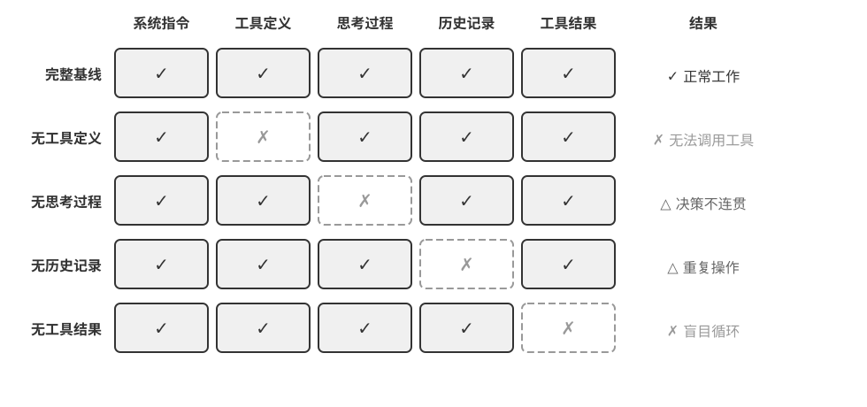
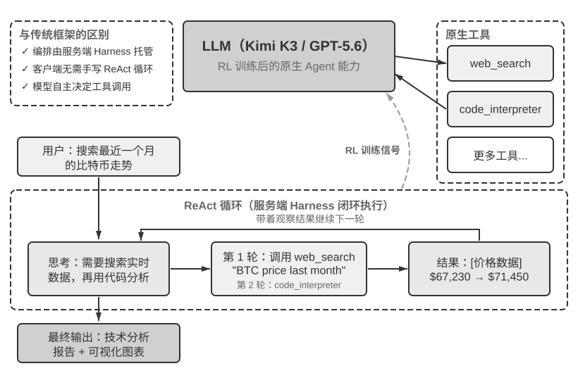

# 第1章 AI Agent 入门（实验解读）

> [!info] 使用说明
> 本章共 4 个实验（1-1～1-4）。每节含：**目的 / 设计 / 关键结论 / 精读批注**（AI 精读产物），以及**动手记录区**（留给你跑实验后补充：复现环境、观察结果、与书中结论的差异、自定义变体）。
> 配套代码：开源仓库 `github.com/bojieli/ai-agent-book` 的 `chapter1/` 目录（先看该目录 README 找到实验对应项目）。多数实验依赖外部模型 API（Kimi/OpenAI 等），需要 API 额度。

## 实验 1-1 ★★：上下文的关键作用（消融实验）

- **原书位置**：§「上下文：Agent 的眼睛」之后的实验框
- **目的**：验证上下文各组件的真实贡献——是否「每个组件都不可或缺」。
- **设计**：系统提示词不参与消融（无它则无角色认知，测试无意义）；其余组件各移除一个：完整基线 + 4 组对照（缺工具定义 / 缺工具执行结果 / 缺思考过程 / 缺历史消息）。
- **关键结论**：
  - 丢**工具定义** → 失去行动能力，但**不沉默**：给出格式工整、语气笃定的答案，数据来自参数记忆（看起来与真实观测答案无异）；坦白拒绝还是就地编造取决于模型幻觉率与诚实度，提示词约束只能降低概率。
  - 丢**工具执行结果** → 盲目执行、反复重试至迭代预算耗尽（闭环控制丢失）。
  - 丢**思考过程** → 几乎无代价（「为什么这么做」可从工具结果重建）。
  - 丢**历史消息** → 冗余操作与重复犯错。
  - 判据：组件价值 = 其信息能否从别处重建；且结论随模型换代可能改变。
- **核心洞察**：

> 上下文决定了 Agent 能看到什么，而 Agent 只能基于它看到的信息做决策。（原书 实验 1-1）

- **工程启示**：组件不等价；“给出了回答”不等于“完成了任务”——上下文残缺时典型失败是貌似完美的答案而非报错。

**图1-3 解读**：原书以该图说明实验 1-1 的对照设计——五组实验：一组保留全部组件的完整基线，再加四组各缺失一个组件的对照（缺工具定义 / 缺工具执行结果 / 缺思考过程 / 缺历史消息；系统提示词不参与消融），以此观察每个组件对 Agent 行为的影响（原书 实验 1-1）。

**📝 动手记录区**

| 复现日期 | 环境（模型/API/框架） | 观察结果 | 与书中结论的差异 |
| ---- | ------------- | ---- | -------- |
|      |               |      |          |

- [ ] 待尝试变体：换一个更新/更弱的模型重跑 4 组消融，结论是否变化？
- [ ] 待尝试变体：只丢「部分历史消息」（如截断到最近 N 轮）观察退化曲线。
- 备注：

---

## 实验 1-2 ★：Kimi K3 原生 Agent 能力

- **原书位置**：§「LLM：Agent 的大脑」之后的实验框
- **目的**：体验「模型即 Agent」——RL 把工具调用决策内化为原生能力的开源模型实例（约 2.8 万亿参数 MoE、100 万 token 上下文、原生视觉、始终开启思考模式；K3 Max 面向对话与 Agent，K3 Swarm Max 面向大规模并行）。
- **关键观察**：模型自主决定何时搜索/搜什么；根据搜索结果动态调整、自判信息是否充足；长链工具调用稳定（连续 200–300 次保持一致性）。
- **书中厘清的常见误解**（作者致谢 GitHub Issue #30）：**RL 写进参数的是「决策」**（何时调、调哪个、传何参数、是否继续、如何串联几十上百次调用）；**工具本身与执行由框架/API 提供**（web_search/code_runner 实现、沙盒、调用发起与结果回传在模型之外；Kimi 经 Formula 服务端脚本引擎运行官方工具）。→ **编排循环并没有消失，而是从客户端移到了服务端，决策权交给了模型**。
- 〔精读批注〕判断任何「模型即 Agent」宣传的通用框架：先问「决策在哪、执行在哪」；执行永远需要基础设施，Harness 不会归零，只会位移与变形。

**📝 动手记录区**

| 复现日期 | 环境（模型/API） | 观察结果 | 与书中结论的差异 |
| --- | --- | --- | --- |
|  |  |  |  |

- [ ] 待尝试：给出一个需要多步搜索+推理的开放问题，观察工具调用次数与「思考一致性」何时退化。
- [ ] 待尝试：对比同一任务在「始终思考模式」开/关下的轨迹长度与成功率。
- 备注：

---

## 实验 1-3 ★：GPT-5.6 原生 Deep Research 能力

- **原书位置**：§「LLM：Agent 的大脑」之后的实验框（紧跟实验 1-2）
- **目的**：展示先进模型 + API 内置工具在服务端形成「搜索—阅读—分析」编排闭环；认识两个 API 层机制。
- **机制 1 —— 自由格式工具调用（Freeform Tool Calling）**：`type:"custom"` 工具允许直接发送原始文本（一段 Python、一条 SQL），省去 JSON 转义；本质是 **API 参数格式演进而非模型架构革新**，客户端循环（检测 tool_calls → 执行 → 回传）不变。
- **机制 2 —— 意图澄清**：接到研究需求先提问澄清（例：比特币技术分析前先问「偏好数据源？哪些指标？」），在执行前弥合「用户说了什么」与「用户真正想要什么」的差距。
- **过程示例**：东盟 10 国首都最近距离（自动搜坐标 → Python 大圆距离计算）；比特币月度走势技术分析（多数据源 → MA/RSI/MACD → 图表 + 建议）。
- **复现提示（书中原文）**：不绑定厂商——阿里云百炼 qwen3.7-plus 的 Responses API 同样内置 web_search 与 code_interpreter；Kimi K3 的 Formula 托管搜索与 code_runner 同类。
- 〔精读批注〕「自由格式工具调用」与第 2 章 KV Cache 前缀设计存在潜在张力（原始文本 vs 严格 schema 对校验、缓存的影响不同），读到第 2/4 章值得回看。

**图1-5 解读**：原书说明该图展示「模型即 Agent」范式下原生工具调用的完整架构，以及 Kimi K3 / GPT-5.6 在实际任务中的 ReAct 执行过程（原书 §「模型即 Agent」实验框文字）——重点看「决策在模型、执行在服务端工具」的分工如何画在同一张图里。

**📝 动手记录区**

| 复现日期 | 环境（模型/API） | 观察结果 | 与书中结论的差异 |
| --- | --- | --- | --- |
|  |  |  |  |

- [ ] 待尝试：用自由格式工具调用让模型提交一段 Python 给代码解释器，观察参数传递与错误回传。
- [ ] 待尝试：对比「带意图澄清」与「直接执行」两类提问方式的结果质量。
- 备注：

---

## 实验 1-4 ★：文生图工作流与原生图像生成的对照

- **原书位置**：§「编排模式·工作流模式」的实验框
- **目的**：同一句大白话需求走两条路线，观察「适配层」是否被更强的模型内化。
- **设计**：
  - **工作流路线**：LLM 把需求改写为 Stable Diffusion 风格提示词 → 调文生图模型出图（两个固定节点：改写、生成）。
  - **原生路线**：原样发给支持原生图像生成的多模态模型（GPT-Image 2 等），一次调用直接出图。
  - 对照要点：改写节点把需求改成了什么样；两条路线谁更贴近原始需求。**分两类需求对照**：具体描述（如指定海报文案）与宽泛描述（如「AGI 实现后程序员的工作场景」——宽泛类下工作流改写可能仍有优势，因为模型改写时补充了场景想象力）。
- **结论性启示**：

> Harness 里那些给模型能力短板打补丁的部分，会随着模型变强被模型自己内化。（原书 实验 1-4 后的论证）

- 本章内已发生的多轮内化：few-shot /「让我们一步一步思考」→ 指令微调与推理模型内化；输出格式修复 / JSON 容错 → 结构化输出与原生工具调用内化；文生图提示词改写 → 原生多模态内化。「每一轮内化，消灭的都是'翻译'和'脚手架'这类适配层代码」（原书 §「编排模式·工作流模式」）。
- 〔精读批注〕实践含义：维护「已知适配层清单」，每次模型升级后逐项测试可否删除——即第 9 章持续进化的第 0 步。

**📝 动手记录区**

| 复现日期 | 环境（两条路线的模型） | 观察结果 | 与书中结论的差异 |
| --- | --- | --- | --- |
|  |  |  |  |

- [ ] 待尝试：同一句宽泛需求跑两路线，把改写后的提示词与原生直出图存档对比。
- [ ] 待尝试：给工作流路线的改写节点加约束（如禁止添加画面外的物体），看是否影响效果。
- 备注：

---

*精读日期：2026-09-08 · 原文：`D:\ObsidianRepository\book\chapter1.md`。配套代码见 GitHub 仓库 `chapter1/`。内容理解见 [[内容精读/第1章 AI Agent 入门]]。*
