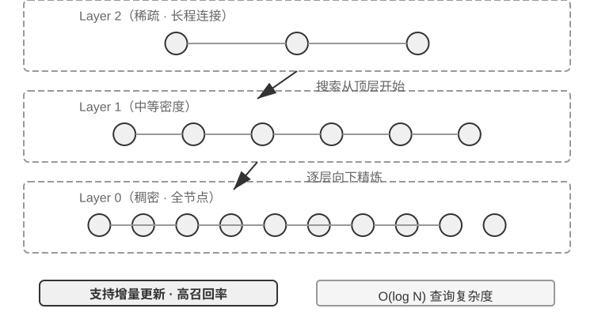

# 第3章 用户记忆和知识库（实验解读）

> [!info] 使用说明
> 本章共 12 个实验（3-1～3-12），前半聚焦**用户记忆**（评估、四格式、脱敏），后半聚焦**知识库检索**（ANN、BM25、混合检索、结构化索引、智能体化 RAG、上下文感知检索、结构化知识提取）。每节含：**目的 / 设计 / 关键结论 / 精读批注** + **动手记录区**。
> 配套代码：开源仓库 `github.com/bojieli/ai-agent-book` 的 `chapter3/` 目录（各实验有独立项目与 README）。多数实验可在本地跑（Ollama 小模型 + 向量库），部分需要 API 额度或较大语料（如 3-7 的 Intel 手册、3-12 的 CAIL2018）。

## 实验 3-1 ★：用三层次框架评估记忆系统

- **原书位置**：§「记忆能力的评估：三层次框架」之后（`user-memory` 项目）
- **目的**：把「什么样的记忆系统算好」变成可测量的评估集——后续 3-2、3-9、3-11 都复用它。
- **设计**：
  - 按三层次构建评估集，**每层各 20 个测试用例**，每个用例包含大量事实细节；第一层用例通常由单个会话构成，第二、三层的用例由多个**跨时间、跨对象**的会话构成（每个用例合计约 **50 轮**沟通）。
  - **关键约束**：要求被测 Agent 根据第一个会话生成记忆，然后**仅凭记忆**（不可回看之前会话的原始对话）结合下一个会话修改记忆，直到该用例所有会话处理完毕；最后根据记忆回答一个**新的用户问题**。
  - 用 **LLM-as-a-judge** 对回答与参考答案对比打分，作为该用例的奖励得分。
- **关键结论**：评估集与脚本收录在配套仓库 `user-memory` 项目，可查看每层测试用例的完整定义；三层次框架同时是「能力路线图」（难度递进：存取 → 跨会话检索 → 主动服务）。
- 〔精读批注〕「仅凭记忆、不可回看原始对话」是这套设计最关键的一步——它把「记忆质量」与「检索能力」解耦；否则模型可以直接翻原始记录，评估就退化成检索测试。如果你要为自己的 Agent 建记忆评估，**这个约束必须照抄**。另外注意 LLM-as-a-judge 本身有偏差（见第 7 章），跨版本对比时最好固定 judge 模型与提示词。

**📝 动手记录区**

| 复现日期 | 环境（模型/记忆方案） | 观察结果（各层得分） | 与书中结论的差异 |
| --- | --- | --- | --- |
|  |  |  |  |

- [ ] 待测：跑通评估脚本，记录三层各自的平均分与失败用例类型；
- [ ] 待测：把 judge 换成另一个模型，看排名是否稳定；
- [ ] 待测：观察「不可回看原始对话」这一约束对第二、三层的杀伤力；
- 备注：

---

## 实验 3-2 ★★：记忆策略的对比实验研究

- **原书位置**：§「用户记忆的四种存储格式」之后（`user-memory` 项目）
- **目的**：在统一接口下横向对比四种记忆格式（Simple Notes / Enhanced Notes / JSON Cards / Advanced JSON Cards）。
- **设计**：`user-memory` 为四种模式各自实现**记忆生成**（分析会话、写入记忆）与**记忆检索**（按当前问题取回相关记忆）；运行时通过**配置切换模式**，在实验 3-1 的三层次评估集上逐一测试，观察同一组测试会话在不同存储格式下提取出的记忆形态与最终得分差异。
- **关键结论（原书观察，与前文分析一致）**：
  - **Simple Notes** 以最低的生成成本通过第一层「基础回忆」的多数用例，但在需要**综合多条信息、区分同名实体**的第二、三层用例上频繁失分；
  - **Advanced JSON Cards** 在**消歧与跨会话关联**的用例上表现最好，代价是每次会话结束后的记忆维护调用**明显更贵、更慢**。
- **建议**：在项目中亲手切换四种模式，对比同一个测试用例生成的记忆文件——**四种格式的差异在具体例子面前一目了然**。
- 〔精读批注〕这个实验的价值在「同一评估集 × 同一模型 × 只换存储格式」的消融设计。落地时建议额外记录**每个用例的记忆写入 token 成本与延迟**，把得分-成本画成散点图——生产选型几乎总是落在「混合模式」而非单一格式上（原书 §四种存储格式 给出的选择标准）。

**📝 动手记录区**

| 复现日期 | 环境（模型/四种格式） | 观察结果（形态差异/得分/成本） | 与书中结论的差异 |
| --- | --- | --- | --- |
|  |  |  |  |

- [ ] 待测：同一用例分别用四种格式生成记忆文件，并排对比内容差异；
- [ ] 待测：记录四种格式的记忆维护成本（LLM 调用次数 / token / 延迟）；
- [ ] 待测：验证 Simple Notes 在第一层的通过率是否显著高于第二、三层；
- 备注：

---

## 实验 3-3 ★★：基于本地模型的智能日志脱敏

- **原书位置**：§「隐私保护：日志脱敏」（`log-sanitization` 项目）
- **目的**：在不把敏感数据送出本机的前提下，实现智能 PII 检测与脱敏。
- **设计**：通过 **Ollama 调用本地 Qwen3 0.6B** 小模型（可在 CPU、消费级设备运行；可按需切换 `qwen3:1.7b`、`qwen3:4b` 等更大规格）。**选择本地部署而非云端 API 的理由很明确：日志本身可能包含敏感信息，发送到云端脱敏就违背了隐私保护初衷。**
- **能力范围**：① 结构化信息（身份证号、银行卡号）；② 半结构化信息（地址）；③ 自然语言表达的敏感内容（如「我的密码是 abc123」）。
- **输出形式**：识别结果通过 **JSON Schema 结构化输出**，包含**敏感信息类型、位置和置信度**。
- **关键结论**：相比传统正则表达式，基于 LLM 的脱敏**召回率达 95% 以上**，同时显著降低假阳性；对**超高吞吐量场景可采用混合策略**——正则快速过滤明显模式，LLM 深度分析剩余文本。
- 〔精读批注〕这个实验示范了「隐私 → 本地小模型 + 结构化输出」的标准组合：小模型够用（0.6B）、结构化输出可校验（类型/位置/置信度），且给了一条成本-召回的分层策略。注意脱敏的两个隐含要求：**漏检比误检更危险**（假阳性只是多遮蔽，假阴性会泄露），因此评估时应分别报告 precision/recall，并准备人工抽检。

**📝 动手记录区**

| 复现日期 | 环境（Ollama/模型规格） | 观察结果（召回/假阳性/延迟） | 与书中结论的差异 |
| --- | --- | --- | --- |
|  |  |  |  |

- [ ] 待测：分别用 0.6B / 1.7B / 4B 跑同一批日志，比较召回率与延迟；
- [ ] 待测：故意构造「正则易漏」（自然语言密码、变体手机号）的样本来测 LLM 的增量价值；
- [ ] 待测：验证 JSON Schema 结构化输出的字段完整性与置信度可用性；
- 备注：

---

## 实验 3-4 ★★：构建向量检索服务：ANN 索引算法的比较研究

- **原书位置**：§「稠密嵌入」之后（`dense-embedding` 项目）
- **目的**：对比两类主流 ANN 算法（ANNOY 与 HNSW）的工程特性——**重点不在实现本身，而在对比**。
- **背景**：ANN（Approximate Nearest Neighbor，近似最近邻）用于在海量向量中快速找到与查询最接近的那些——知识库上百万条文档时逐一计算相似度太慢，ANN 用索引结构实现近似但极快的查找。
- **设计**：项目提供 **ANNOY 与 HNSW 两种可切换后端**，可直接观察其在实践中的区别。

| 特性 | ANNOY（基于树） | HNSW（基于图） |
| --- | --- | --- |
| 构建速度 | 快 | 较慢 |
| 内存占用 | 低 | 较高 |
| 增量更新 | 不支持（需完全重建） | 支持（长期增量插入后建议定期重建以保持查询精度） |
| 查询精度 | 较高 | 极高 |
| 适用场景 | 数据不常变的静态数据集 | 需要实时索引新信息的动态场景 |

- **关键结论**：**选择合适的索引策略与选择嵌入模型同等重要**，它直接决定系统的性能、成本和可维护性。
- 〔精读批注〕「增量更新」这一行对 Agent 场景是决定性的——用户记忆与知识库都是持续写入的，ANNOY 的「需完全重建」在百万级语料上不可接受；因此 HNSW（或同类图索引）通常是默认答案，代价是内存与「长期增量后需定期重建」。这与实验 3-9/3-11 中「索引是可重建的派生物」一致：**定期重建索引应当被设计成常规运维动作，而不是异常处理**。



**图3-7 解读**：该图展示 HNSW 的图结构索引（原书 实验 3-4）：向量作为节点按层级组织，查询时从稀疏高层快速靠近、再在底层精细搜索，以极小的精度损失换取大幅加速——这也是它支持增量插入的结构基础。

**📝 动手记录区**

| 复现日期 | 环境（向量库/数据规模） | 观察结果（构建/内存/精度/增量） | 与书中结论的差异 |
| --- | --- | --- | --- |
|  |  |  |  |

- [ ] 待测：同一数据集分别建 ANNOY 与 HNSW，对比构建时间与查询延迟/召回；
- [ ] 待测：连续增量插入 N 批数据，观察 HNSW 查询精度是否随时间下降（验证「定期重建」的必要性）；
- [ ] 待测：测算两种索引在真实语料规模下的内存占用；
- 备注：

---

## 实验 3-5 ★★：探究稀疏检索：从零实现 BM25 搜索引擎

- **原书位置**：§「从 TF-IDF 到 BM25」之后（`sparse-embedding` 项目）
- **目的**：以教学为目的从零实现 BM25，**完整展示内部过程**（项目核心价值不在性能优化）。
- **可观察的索引过程**：文本预处理（分词、去除「的」「了」这类停用词）→ 构建**倒排索引**（从「词 → 文档」的反向映射，像书后的术语索引页）→ 计算 TF 与 IDF。
- **可观察的查询过程**（项目自带小型语料 N=10，固定 `k1=1.5`、`b=0.75`、`avgdl=250`，IDF 采用 `ln((N−df+0.5)/(df+0.5))`）：

```text
查询分词: ["模型", "蒸馏"]

词 "模型" → 倒排索引命中 3 篇文档 (df=3, IDF=0.76):
  doc_1: TF=5, 文档长度=200词, BM25贡献=1.52
  doc_3: TF=2, 文档长度=500词, BM25贡献=0.82
  doc_7: TF=8, 文档长度=150词, BM25贡献=1.68

词 "蒸馏" → 倒排索引命中 2 篇文档 (df=2, IDF=1.22, 比"模型"更稀有):
  doc_1: TF=3, 文档长度=200词, BM25贡献=2.15
  doc_5: TF=1, 文档长度=250词, BM25贡献=1.22

最终排序: doc_1 (3.67) > doc_7 (1.68) > doc_5 (1.22) > doc_3 (0.82)
```

- **关键结论**：doc_1 中「蒸馏」的词频（TF=3）低于「模型」（TF=5），但因 **IDF 更高**（更稀有），贡献反而更大（2.15 vs 1.52）——这正是 BM25 的核心逻辑；doc_1 同时命中两个查询词、总分遥遥领先，印证**多词命中的叠加效应**。实验也揭示稀疏检索的优缺点：**精确关键词匹配在技术代码、人名等查询上极佳，却读不懂同义表达**。
- 〔精读批注〕建议把这个日志与 §3.12 的 RRF 一起看：BM25 的分数**不可跨语料比较**（依赖 N、df、avgdl、k1、b），这正是混合检索必须用 RRF「抛开分数只看排名」的原因。另外 k1/b 是**需要按语料调的超参**，项目固定值只适合教学复现。

**📝 动手记录区**

| 复现日期 | 环境（语料/k1/b） | 观察结果（排名与贡献分解） | 与书中结论的差异 |
| --- | --- | --- | --- |
|  |  |  |  |

- [ ] 待测：改 k1（如 0.5 / 3.0）观察长文档与重复词的排名变化；
- [ ] 待测：改 b（0 / 1）观察长度归一化的影响；
- [ ] 待测：构造同义表达查询（如 `kitty` vs `cat`）验证稀疏检索的盲区；
- 备注：

---

## 实验 3-6 ★★：混合检索流水线：结合稀疏、稠密与重排序

- **原书位置**：§「混合检索」之后（`retrieval-pipeline` 项目）
- **目的**：用一条完整的教育性流水线（稠密检索 + 稀疏检索 + 神经重排序）观察三者的分工与互补。
- **设计**：`test_client.py` 包含一系列测试案例，每个突出一种信息检索挑战——**语义相似**（如 `kitty` 对 `feline/cat`）、**精确名称**、**多语言查询**、**技术代码**；可直接观察稠密与稀疏两路在每类查询下各自的胜负。系统不仅返回重排序列表，还**详细展示每个文档在原始稠密/稀疏检索中的排名以及重排序后的变化**。
- **关键结论**：最引人注目的是**重排序器在提升最终结果质量上的显著作用**——通过「排名变化」数据可清晰看到它如何把**被单一方法低估但实际高度相关**的文档提升到顶端。实验结果清楚说明：**没有哪种单一检索策略在所有场景下都可靠；把稠密、稀疏和重排序组合起来，才是构建生产级 RAG 系统的正确做法。**
- 〔精读批注〕这个实验最该动手的是「排名变化」表：先记录两路各自的 top-k，再看重排后哪些文档上位、哪些掉队——**上位文档的共性就是重排序器补的能力（深层语义匹配）**。也建议顺手测一下重排序的候选池大小 N（如 20/50/100）对最终质量与延迟的影响，这是最值得调的超参之一。

**📝 动手记录区**

| 复现日期 | 环境（模型/重排模型/N） | 观察结果（各类查询胜负 + 排名变化） | 与书中结论的差异 |
| --- | --- | --- | --- |
|  |  |  |  |

- [ ] 待测：四类查询（语义相似/精确名称/多语言/技术代码）下两路各自的胜负统计；
- [ ] 待测：把重排序候选池 N 从 20 调到 100，记录质量与延迟变化；
- [ ] 待测：关闭重排序做对照，量化它对最终排序的贡献；
- 备注：

---

## 实验 3-7 ★★★：结构化索引：RAPTOR 与 GraphRAG 的知识组织哲学

- **原书位置**：§「结构化索引」之后（`structured-index` 项目）
- **目的**：在统一框架下完整实现 RAPTOR 与 GraphRAG，并用**长达数千页的 Intel CPU 架构技术手册**（高度结构化、层次性、关联性的典型材料）做一场「知识表达哲学」的对比研究。
- **对照案例**：查询「请解释 SSE 指令集」时两种系统的响应方式——
  - **RAPTOR 进行「跨层穿梭」**：可能先在较高层摘要中定位到「SIMD 指令集」宏观概念，再沿树状结构向下钻取，在叶子节点找到详细的 SSE 技术描述；**适合从高层概念逐步深入细节**的问题；
  - **GraphRAG 在「关系网」中漫游**：先定位图谱中的「SSE」实体，遍历关系边找到「XMM 寄存器」「浮点运算」及具体指令（如 `ADDPS`），并通过分析所在社区给出其在 CPU 架构中位置的上下文；**特别适合「谁和谁有关？A 如何影响 B？」这类关系性问题**。
- **关键结论**：两者解决不同问题——**生产场景里组合使用通常比单选一种效果更好**。
- 〔精读批注〕建议把该实验当作「索引期成本的度量实验」：分别记录两种索引的**构建耗时、LLM 调用次数、每 GB 文档的索引成本**，再对照查询质量。原书 §结构化索引 已给出判断标准（跨文档综合 / 多层次导航才值得投入），这个实验是量化那条标准的唯一途径。

**📝 动手记录区**

| 复现日期 | 环境（语料规模/模型） | 观察结果（两条检索路径 + 索引成本） | 与书中结论的差异 |
| --- | --- | --- | --- |
|  |  |  |  |

- [ ] 待测：同一查询分别走 RAPTOR 与 GraphRAG，记录各自的检索路径与答案质量；
- [ ] 待测：记录两种索引的构建成本（时间/LLM 调用/费用）；
- [ ] 待测：构造一个「关系型问题」（A 与 B 的关系）验证 GraphRAG 的优势；
- 备注：

---

## 实验 3-8 ★★：智能体化 RAG 与非智能体化 RAG 的对比研究

- **原书位置**：§「智能体化 RAG」之后（`agentic-rag` 项目）
- **设计**：构建一个可在**两种模式间自由切换**、并接入多种知识库后端（`retrieval-pipeline`、`structured-index` 等）的 Agent 系统，在专门构建的**中文司法问答数据集**（从简单到复杂的法律问题）上做全面消融实验。
- **关键对照**：
  - **简单问题**（「正当防卫是怎么规定的？」）：一次直接检索即可找到答案，**非智能体化 RAG 更快且答案质量相差无几**——说明在信息需求明确单一的场景，传统 RAG 仍是高效选择；
  - **复杂问题**（「醉酒过失致人重伤且有盗窃前科如何量刑？」）：差距显著——非智能体化因**首次检索关键词不精确**，上下文不全面，常遗漏关键信息甚至事实性错误；智能体化展现多轮迭代：① 分解问题并行搜索（过失致人重伤量刑标准 / 醉酒刑事责任 / 盗窃前科影响）→ ② 思考与评估（发现缺「不相关的盗窃前科应如何纳入考量」这一关键信息）→ ③ 二轮聚焦检索（「过失伤害罪」与「累犯」「数罪并罚」的关联）→ ④ 找到司法解释后综合给出逻辑严密、有法条依据的回答。
- **关键结论**：智能体化 RAG 的价值在于**「解决问题」而非「回答问题」的能力**——牺牲一定响应速度，换来复杂问题更强的鲁棒性与更高质量；在量刑场景中直接体现为**多跳问题准确率的显著提升**。
- 〔精读批注〕这个实验隐含一条成本法则：**按问题复杂度路由**——简单问题走单次检索，复杂问题才进多轮循环。工程上可以先用一个轻量分类器（或模型自判）决定模式，避免所有查询都付多轮的延迟。

**📝 动手记录区**

| 复现日期 | 环境（模型/知识库后端） | 观察结果（简单/复杂问题对照） | 与书中结论的差异 |
| --- | --- | --- | --- |
|  |  |  |  |

- [ ] 待测：同一批问题在两种模式下的质量与延迟对照（按难度分层统计）；
- [ ] 待测：记录智能体化 RAG 的轮数与工具调用次数分布；
- [ ] 待测：给非智能体化 RAG 加「查询改写」一步，看差距能缩小多少；
- 备注：

---

## 实验 3-9 ★★：利用智能体化 RAG 构建用户记忆

- **原书位置**：§「智能体化 RAG」之后（`agentic-rag-for-user-memory` 项目）
- **核心思想**：把 Agent 与用户的**完整对话历史本身视为知识库**——Agent 因此能「记住」过去的交互并在需要时主动检索，以更好理解当前上下文、提供个性化服务。与本章前面聚焦**表示与管理策略**（如 Advanced JSON Cards）不同，本实验聚焦**检索技术如何增强记忆的召回能力**。
- **设计**：**索引阶段**按固定窗口（如**每 20 轮对话**）分块索引对话历史；**应用阶段**赋予 Agent `search_user_memory` 工具。
- **三层表现**：
  - **第一层（基础回忆）**：如 `layer1/01_bank_account_setup.yaml` 中「我的支票账户号码是多少？」——**一次搜索即可**；
  - **第二层（多会话检索）**：`layer2/01_multiple_vehicles.yaml` 中用户在不同电话里分别讨论本田与特斯拉。用户说「我需要为我的车预约服务」时：① 初步搜索 `search_user_memory("车辆 服务 预约")` 可能只返回本田记录 → ② 评估：在本田对话中发现用户提到还有一辆特斯拉（**关键线索**）→ ③ 二次搜索 `search_user_memory("特斯拉 服务 预约")` 确认另一辆车状态 → ④ 完整回答：「你是指已预约周五保养的本田 Accord，还是尚未预约的特斯拉 Model 3？」
  - **局限**：`layer2/12_contradictory_financial_instructions.yaml` 中妻子先设立转账、丈夫随后在另一通电话修改金额与日期、最后妻子又改回——由于**索引的对话块孤立且缺乏上下文**，系统检索时可能看到三个各自独立但相互矛盾的转账指令，**无法轻易判断哪一个最终有效**，很可能给用户呈现混乱或错误的信息；要实现**第三层（主动服务）**——发现新预订机票与数月前护照过期之间的隐藏关联——仅检索零散对话历史更是远远不够。
- **关键结论**：局限的根源是**传统分块方法的固有缺陷**，需要 §上下文感知检索 来根本解决（实验 3-11）。
- 〔精读批注〕这个实验把「检索增强记忆」的天花板展示得很清楚：**分块窗口（20 轮）与语义单元无关**，冲突型对话会被切碎。记录一下失败用例的形态（同一主题跨多通电话、多方修改），它们是设计上下文前缀时最重要的输入。

**📝 动手记录区**

| 复现日期 | 环境（模型/分块窗口） | 观察结果（分层表现 + 失败形态） | 与书中结论的差异 |
| --- | --- | --- | --- |
|  |  |  |  |

- [ ] 待测：复现多车场景，确认「发现线索 → 二次搜索」是否真的发生；
- [ ] 待测：复现矛盾转账场景，观察系统给出的是哪一条（或是否呈现混乱）；
- [ ] 待测：调整分块窗口（如 10 / 20 / 50 轮）看对第二层的影响；
- 备注：

---

## 实验 3-10 ★★：上下文感知检索：解决 RAG 的上下文丢失问题

- **原书位置**：§「RAG 技巧：上下文感知检索」之后（`contextual-retrieval` 项目）
- **目的**：通过可控对比实验，**量化**上下文感知检索相对传统分块的性能提升。
- **设计**：并行构建两个知识库——一个用**传统无上下文分块**，另一个用**基于 LLM 生成上下文前缀**的方法；`compare_retrieval_methods` 允许同一查询在两个库中同时检索并并排比较。
- **关键对照**：查询「ACME 公司最近的收入增长情况如何？」——**无上下文**库中，查询可能匹配到许多含「收入增长」关键词但来自不同公司、不同年份甚至只是泛泛行业分析的文本块，相关性低、充满噪声；**有上下文**库中，每个块带有精确的「身份标签」，能准确命中既含关键词、上下文前缀又与「ACME 公司」「最近」等查询意图匹配的块。实验日志表明**上下文感知检索的结果得分显著更高、返回的文本块更精准**。
- **代价与收益**：代价是索引阶段额外 LLM 调用，但通过 **prompt caching**（相同前缀重复调用约 1/10 成本）完全可控——**每百万文档 token 约 1 美元**；据 Anthropic 研究数据，此技术结合 BM25 可将**检索失败率降低 49%**，再结合重排序器**降幅达 67%**。
- 〔精读批注〕「索引期一次性付费、检索期永久受益」是本章最高性价比的工程决策之一；建议在自己的语料上算一遍：索引期增加的成本 ÷ 月度检索次数 = 单次查询摊薄成本，再与失败率下降带来的收益对比。

**📝 动手记录区**

| 复现日期 | 环境（模型/语料规模） | 观察结果（得分对比/成本） | 与书中结论的差异 |
| --- | --- | --- | --- |
|  |  |  |  |

- [ ] 待测：同一查询在两个库中的并排结果对比（记录得分与噪声比例）；
- [ ] 待测：测算索引期额外成本与 prompt caching 后的实际开销；
- [ ] 待测：叠加重排序器，观察相对无上下文基线的失败率降幅；
- 备注：

---

## 实验 3-11 ★★★：利用上下文感知检索增强用户记忆

- **原书位置**：§「RAG 技巧」之后（基于实验 3-9 框架）
- **设计**：在索引对话历史前增加关键的**「上下文生成」步骤**——对每个对话块调用 LLM 生成包含关键背景信息的前缀摘要。一段孤立的「好的，就订这个吧」毫无信息量，只有知道上文是「从上海到西雅图的 500 美元单程机票」才有意义。
- **冲突场景的决定性优势**：回到 `layer2/12_contradictory_financial_instructions.yaml`，增强后三个相关块分别带上 `[妻子 Patricia Thompson 正在设立初始电汇]`、`[丈夫 James Thompson 正在修改之前的电汇]`、`[妻子在丈夫修改后再次修改电汇]` 的前缀——**包含时间、人物和意图的上下文，为 Agent 判断指令优先级与最终有效性提供了关键线索**。
- **达到第三层（主动服务）的双层结构**：需将 **Advanced JSON Cards**（结构化核心事实、常驻 Agent 上下文，如「用户 Jessica 的护照将于 2025 年 2 月 18 日过期」）与**上下文感知检索**（按需精准访问原始对话细节）结合。`layer3/01_travel_coordination.yaml` 的四步：① **事实回顾**（审视 JSON Cards，掌握「东京之行」与「护照信息」两个核心事实）→ ② **关联推理**（发现机票日期（一月）与护照过期日期（二月）非常接近，识别潜在风险）→ ③ **细节验证（RAG）**（通过上下文感知检索查找「护照」「东京机票」相关原始对话确认细节）→ ④ **主动服务**（综合结构化事实与对话细节，给出「护照即将过期，强烈建议加急续签」的主动建议）。
- **关键结论**：**最高级别的用户记忆系统并非单一技术的产物**——本章两条线索在此汇合为**双层记忆架构**。
- 〔精读批注〕这是全章最值得复现的实验：它同时验证「核心事实常驻 + 细节按需检索」的分工。复现时建议专门记录 **JSON Cards 里应该放什么**（放多了浪费常驻上下文、放少了触发不了关联推理）——这个取舍在书中未给量化标准，而你自己的业务会给出答案。

**📝 动手记录区**

| 复现日期 | 环境（模型/双层结构配置） | 观察结果（冲突判断/主动服务） | 与书中结论的差异 |
| --- | --- | --- | --- |
|  |  |  |  |

- [ ] 待测：复现矛盾转账场景，确认前缀是否让 Agent 判断出最终有效的指令；
- [ ] 待测：复现护照/机票场景，记录四步推理链是否完整发生；
- [ ] 待测：对比「只有 JSON Cards」「只有检索」「双层组合」三种配置的第三层得分；
- 备注：

---

## 实验 3-12 ★★★：从结构化数据中提取隐性知识：以司法判例分析为例

- **原书位置**：§「从数据集中提取深度知识」之后（`structured-knowledge-extraction` 项目）
- **目的**：以大规模 **CAIL2018 中文刑事判决数据集**为基础，构建一个从判例中学习「判决经验」的智能法律顾问。
- **知识提取阶段（自下而上的因子发现）**：**没有采用预先定义的僵化数据模式**，而是让 LLM 分析数百个样本案例、自由列出所有可能影响判决的关键因素，从而构建更贴合数据本身（而非人类先验）的模块化 Schema——包含适用于所有案件的**核心模式**（自首、赔偿等情节）与针对不同罪名的**扩展模式**（涉案金额、伤害等级）。
- **因子分析阶段（不直接预测刑期）**：直接让 AI 预测刑期会产生「**黑箱**——能给出答案但说不清为什么」；项目先把案件翻译成数字：多选字段用**开关位**（盗窃 `[1,0,0]`、抢劫 `[0,1,0]`、诈骗 `[0,0,1]`；**之所以不用 1、2、3，是因为数字大小会让算法误以为「诈骗比盗窃严重 3 倍」，而开关位只表示「是哪一类」**），是非题用 1/0。然后用**聚类**在数据中寻找自然「案件原型」（如「轻微口角引发的徒手斗殴致人轻伤」「有预谋的团伙持械围殴致人重伤」），通过分析定义聚类的关键特征，构建数据驱动的**因子重要性层次模型**。
- **应用形态**：该模型成为 Agent **对话式信息收集**的核心驱动力——用户描述案情时，Agent 按重要性顺序提出引导性问题补全关键判决因素；收集完毕后检索最相似的案件原型，基于原型统计数据（如典型刑期范围）提供**数据驱动、有判例支持**的分析与解释。
- **关键结论**：Agent 不一定要把知识库当成只能检索的静态仓库——**它可以先把数据「读懂」，提炼出结构化的决策逻辑，再基于这个逻辑回答问题**。
- 〔精读批注〕两个可迁移的设计点：① **自下而上的 schema 发现**适用于任何「领域专家规则写不全」的场景；② **拒绝黑箱预测、改用「原型 + 统计」**让结论可解释、可追溯——这与第 7 章评估、第 9 章经验沉淀的方向一致。注意 one-hot 的理由值得记住：**编码方式会隐含地注入「距离」语义**。

**📝 动手记录区**

| 复现日期 | 环境（数据集/模型） | 观察结果（因子集合/原型/问答质量） | 与书中结论的差异 |
| --- | --- | --- | --- |
|  |  |  |  |

- [ ] 待测：跑因子发现，对比「自下而上」与「人工定义 schema」得到的因子集合差异；
- [ ] 待测：观察聚类得到的案件原型是否可被人读懂、能否命名；
- [ ] 待测：检验 Agent 的引导式提问顺序是否与因子重要性一致；
- 备注：

---

*精读日期：2026-09-13 · 原文：`D:\ObsidianRepository\book\chapter3.md`。配套代码见 GitHub 仓库 `chapter3/`。内容理解见 [[内容精读/第3章 用户记忆和知识库]]，思考题见 [[思考题引导/第3章 用户记忆和知识库]]。*
