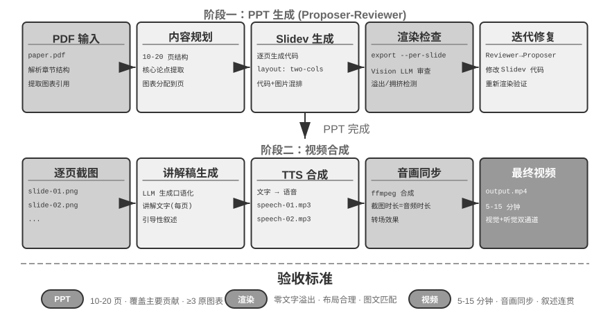
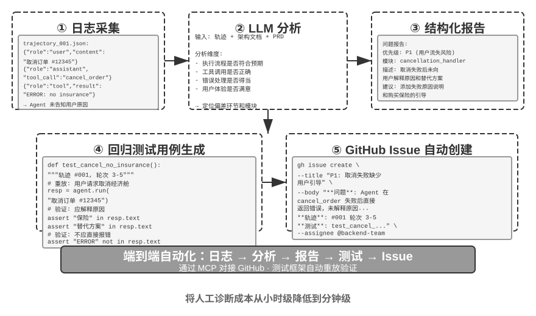
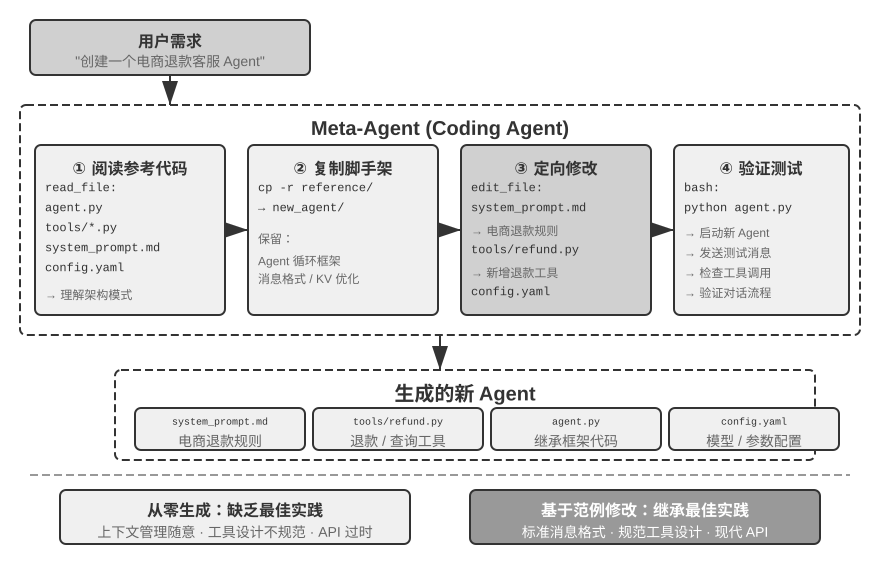

---
书名: 深入理解 AI Agent：设计原理与工程实践
章节: 5
章标题: Coding Agent 与通用 Agent
分册: 实验解读
状态: 已录入初稿（待动手复现补充）
阅读日期: 2026-09-21
tags:
  - AI-Agent
  - 精读笔记
---

# 第5章 Coding Agent 与通用 Agent（实验解读）

> [!info] 使用说明
> 本章共 16 个实验（5-1～5-16），数量全书最多，覆盖两类主题：**可靠性工程**（轨迹接管、断点接续、跨厂商恢复）与**代码作为元能力的六个方向**（思考、规则、多媒体、适配、UI、自举）。每节含 **目的 / 设计 / 关键结论 / 精读批注** + **动手记录区**。
> 配套代码：开源仓库 `github.com/bojieli/ai-agent-book` 的 `chapter5/` 目录（含 `coding-agent` 参考实现，可同时作为实验 5-16 的范例）。多数实验需要 API 额度或多模态模型（Vision LLM / 3D 生成模型 / TTS）。

## 实验 5-1 ★★★：跨厂商的轨迹接管

- **原书位置**：§「故障与错误恢复 · 接管」之后
- **目的**：验证**中立轨迹格式**能否让跑到一半的 Agent 轨迹换一家模型接着跑完，并量化「原样直传」与「一刀切剥光」两种做法的代价。
- **技术方案**：任务需要多轮工具调用，跑到中途对当前厂商**注入连续的限流与过载响应**，熔断后切换到另一家继续。轨迹按**中立格式**保存——思考分为**可移植的文字**与**不可移植的凭证**两部分，工具调用只记录名称与参数。三种做法对照：
  - **直传**：把原厂商返回的消息原样搬进新厂商的结构；
  - **剥离**：删掉全部思考与凭证；
  - **中立**：丢弃凭证，把文字或厂商给出的思考摘要以**普通内容**的身份带入，标识符按目标厂商重新生成；遇到强制要求凭证的接收端，则把历史调用**改写为文字叙述**。
  选**三家线上格式互不相同**的厂商，两两切换。
- **验收标准**：切换后的首个请求都要留下**原始响应**；直传的失败必须是厂商真实返回的错误，**不得以模拟错误代替**。要求中立做法在**全部厂商组合上都不出现接口错误**，另外两种在哪些组合上失败、报什么错，如实记录。三者对比**任务完成率、切换后重复调用同一工具的次数（按「工具名 + 参数」指纹计）、切换后到完成所需的额外轮数与 token**。若中立做法在重复调用上并未优于剥离，同样如实记录。
- 〔精读批注〕这是本章最"打脸"的实验设计——它要求**如实记录负面结果**。动手时建议把每次切换的原始请求/响应存盘（脱敏后），因为厂商的凭证校验规则变化很快，记录时间戳很重要。另外「中立格式」的验证不止看接口是否报错，还要看**思考质量是否下降**（用切换后重复调用次数与额外轮数衡量）。

**📝 动手记录区**

| 复现日期 | 环境（三家厂商/模型） | 观察结果（三做法 × 各组合） | 与书中结论的差异 |
| --- | --- | --- | --- |
|  |  |  |  |

- [ ] 待测：记录直传在各组合上的**真实报错原文**；
- [ ] 待测：中立做法在「强制要求凭证」的接收端上是否走了「改写为文字叙述」的退路；
- [ ] 待测：对比中立与剥离在重复调用次数上的差异（若中立不优于剥离，如实记录）；
- 备注：

---

## 实验 5-2 ★★：输出到一半断掉之后的接续

- **原书位置**：§「故障与错误恢复 · 降级与接续」之后
- **目的**：比较「整轮重发」与「以半截输出为前缀续写」两种恢复方式在**成本、正确性与副作用**上的差异。
- **技术方案**：在流式响应上取**三个断点**——思考中途、正文中途、工具调用参数中途——切断连接。三种恢复方式：① 丢弃半截整轮重发；② 把半截内容作为末尾的 assistant 消息要求模型接着写（有的厂商原生支持，有的要求**显式标注这是待续写消息**，都没有的退回下一种）；③ 追加一条**元指令**说明从断点继续。半截的**工具调用无法以原生结构回传**，需先转成文字再让模型补完，拼接后**重新解析校验**。若半截输出里已有工具因流式提前执行，续写前按**调用指纹去重**，避免重复副作用。
- **验收标准**：三类断点各重复若干次，报告每种方式的**恢复成功率、相对整轮重发节省的输出 token、补完后参数的合法率与语义正确率**（拼接处容易多出空白或重复字符，**合法不等于正确**），以及**重复副作用次数**。同时记录哪些断点在某些厂商上无法复现，以及降级路径是否可用。
- 〔精读批注〕「合法不等于正确」是本实验最值得记住的一句：JSON 能解析不代表参数语义对（如 `amount: 100100`）。建议把「拼接处前后 20 字符」单独存盘人工看几例——这类 bug 靠自动断言很难发现。

**📝 动手记录区**

| 复现日期 | 环境（厂商/模型/是否原生支持续写） | 观察结果（成功率/token/合法率/副作用） | 与书中结论的差异 |
| --- | --- | --- | --- |
|  |  |  |  |

- [ ] 待测：三类断点分别复现，记录哪些厂商无法复现；
- [ ] 待测：拼接处参数的合法率 vs 语义正确率差异；
- [ ] 待测：构造「半截工具调用已被提前执行」的场景，验证指纹去重是否生效；
- 备注：

---

## 实验 5-3 ★★：使用代码生成工具提升数学解题能力

- **原书位置**：§「代码作为思考工具」之后
- **目的**：验证 Agent 通过 Code Interpreter 辅助数学思考的准确性提升。
- **技术方案**：为 Agent 配备安装了 **sympy、numpy、scipy** 等数学库的 Python 沙盒；Agent 把数学问题形式化为 Python 代码——sympy 做符号计算（微积分、方程求解）、scipy 做数值优化、numpy 做矩阵运算；代码在沙盒执行并返回精确结果。
- **验收标准**：用 **AIME 风格题目**（对标美国数学邀请赛）评测，对比**纯思维链**与**代码辅助**的准确率，要求代码辅助模式显著更高；检查代码是否正确使用数学库、求解过程是否逻辑清晰。
- 〔精读批注〕这个实验的隐藏变量是**模型能力**（见 5-4 末的讨论：脚手架与模型此消彼长）。建议**至少用两档能力的模型各跑一遍**，把「纯思考 / 代码辅助」两条曲线画在同一张图上——你会直观看到增益如何随模型变强而收窄。

**📝 动手记录区**

| 复现日期 | 环境（模型/沙盒依赖） | 观察结果（纯思考 vs 代码辅助） | 与书中结论的差异 |
| --- | --- | --- | --- |
|  |  |  |  |

- [ ] 待测：两档模型 × 两种模式的 2×2 对照；
- [ ] 待测：记录失败案例里「代码正确但问题理解错」与「问题理解对但代码错」的比例；
- 备注：

---

## 实验 5-4 ★★：使用代码生成工具提升逻辑思考能力

- **原书位置**：§「代码作为思考工具」之后
- **目的**：评估 Agent 通过**约束求解**代码辅助逻辑思考的能力。
- **技术方案**：为 Agent 配备包含 **python-constraint** 库的 Code Interpreter；Agent 把逻辑谜题（如骑士与无赖问题）转化为形式化约束定义——识别所有变量（每个岛民身份）、约束条件（「骑士说真话」等推导），定义约束并调用求解器搜索满足所有约束的解。
- **验收标准**：用 [K&K Puzzle 数据集](https://huggingface.co/datasets/K-and-K/perturbed-knights-and-knaves) 评测，**代码辅助模式求解准确率达 90% 以上**，显著高于纯思考模式。
- **关键结论（比准确率更重要）**：**模型与脚手架是此消彼长的关系**——模型足够强时脚手架可以更薄（代码求解器带来的增益收窄至接近零）；模型不够强时就要在脚手架里做更多事。原书**刻意选用较弱模型**来放大这一对照，并给出方法论提醒：**同一套脚手架配上不同能力的模型，结论可能截然不同**。
- 〔精读批注〕这条结论应当写进任何 Agent 技术评测的方法论章节：报告效果时必须标注**模型档位 + 脚手架厚度**两个维度，否则结论不可迁移。

**📝 动手记录区**

| 复现日期 | 环境（模型/求解器） | 观察结果（准确率 + 增益随模型变化） | 与书中结论的差异 |
| --- | --- | --- | --- |
|  |  |  |  |

- [ ] 待测：弱模型与强模型各跑一遍，观察代码辅助增益是否收敛；
- [ ] 待测：统计「约束建模错误」与「求解器使用错误」的失败占比；
- 备注：

---

## 实验 5-5 ★★：小模型通过代码化知识提升执行规则的准确性

- **原书位置**：§「代码作为业务规则的约束」之后
- **目的**：验证小参数量模型（**Qwen3-4B**）通过**代码化业务规则**显著提升复杂政策执行的准确性与一致性。
- **技术方案**：基于 **τ-bench 航空客服场景**设计对照实验。**控制组**：纯自然语言规则，依赖模型自身思考。**实验组**：三重保障——① 系统提示词保留自然语言规则；② 工具描述列出完整政策，并以可选 `expected_*` 参数引导模型**调用前逐条核对**（checklist）；③ 工具内部基于**模拟数据库真值**的代码化校验（政策事实一律查库、时间取服务端时钟、**不采信模型自报参数**）。
- **评测指标**：任务成功率、政策违规次数、无效工具调用次数、用户体验。
- **预期结果**：实验组显著优于控制组。更重要的是观察**模型在准备参数时就自主识别违规操作、直接向用户提议替代方案**（验证「参数作为 checklist」有效）；并统计 `expected_*` 自报值与数据库真值**不一致的比例**（验证「服务端真值校验」拦截错误认知的必要性）。
- 〔精读批注〕「不一致比例」是这个实验最有信息量的指标：它同时暴露**模型幻觉**与**潜在注入**——把这个比例做成线上监控指标，就是第 7 章可观测性与第 9 章进化信号的现成入口。

**📝 动手记录区**

| 复现日期 | 环境（模型/τ-bench 配置） | 观察结果（成功率/违规/无效调用/不一致率） | 与书中结论的差异 |
| --- | --- | --- | --- |
|  |  |  |  |

- [ ] 待测：控制组与实验组的政策违规次数对比；
- [ ] 待测：统计 `expected_*` 与真值不一致的比例；
- [ ] 待测：观察模型是否在「准备参数阶段」就自行放弃调用并给出替代方案；
- 备注：

---

## 实验 5-6 ★★：基于论文的 PPT 自动生成

- **原书位置**：§「代码驱动的多媒体生成」之后
- **目的**：从学术论文自动生成高质量演示文稿，验证**提议者—审核者**在内容创作质量控制中的有效性。
- **技术方案**：使用 **Slidev** 框架。Proposer Agent 阅读论文 PDF，提取章节结构、核心论点与图表，规划结构，逐页生成 Slidev 代码。**关键步骤**：Reviewer Agent **渲染每页截图**，用 **Vision LLM** 检查渲染效果，识别文字溢出、内容拥挤、图片尺寸不当等问题，生成**结构化改进建议**；迭代直到效果达标。
- **验收标准**：生成 10–20 页 PPT，覆盖论文主要贡献；**至少 3 张原文图表且与文字说明匹配**；渲染无文字溢出、布局合理；**对比单 Agent 自我审查 vs 提议者—审核者分工在上下文消耗与生成质量上的差异**。
- 〔精读批注〕后一条对照才是本实验的核心：它直接验证「双 Agent 的核心优势在上下文管理」。建议量化两个数——**单 Agent 方案在第几轮触及上下文上限**、**双 Agent 方案的累计 token 曲线**。

**📝 动手记录区**

| 复现日期 | 环境（模型/Vision LLM/Slidev） | 观察结果（质量 + 上下文消耗对照） | 与书中结论的差异 |
| --- | --- | --- | --- |
|  |  |  |  |

- [ ] 待测：单 Agent 自我审查 vs 双 Agent 的上下文消耗曲线；
- [ ] 待测：统计 Reviewer 反馈中「被采纳建议」的比例（判断反馈是否可执行）；
- [ ] 待测：迭代轮数与最终质量的关系（是否存在明显边际递减）；
- 备注：

---

## 实验 5-7 ★★：论文讲解视频的自动生成

- **原书位置**：§「代码驱动的多媒体生成」之后（基于实验 5-6）
- **目的**：扩展 PPT 生成能力，结合视觉与听觉通道实现**视频讲解自动生成**。
- **技术方案**：基于实验 5-6 的流程，Agent 同时生成**每页的口语化讲解文字**（引导性叙述而非复述），调用 **TTS**（文本转语音）合成语音，用 **ffmpeg** 将 PPT 截图与音频同步合成视频。
- **验收标准**：视频 5–15 分钟，**每页展示时间与语音时长精确匹配**，讲解内容与视觉元素呼应。
- 〔精读批注〕「每页时长精确匹配」是一个隐藏的工程难点：需要先测每段 TTS 音频时长，再回写幻灯片切分点——本质上是**用代码把两个产物的时间轴对齐**，属于「代码作为适配器」的同类问题。

**图5-6 解读**：该图给出从论文到讲解视频的端到端流水线（原书 实验 5-7）：论文 →（提议者—审核者）Slidev 幻灯片 → 逐页讲解稿 → TTS 语音 → ffmpeg 合成，视觉与听觉两条通道按页对齐。

**📝 动手记录区**

| 复现日期 | 环境（TTS/ffmpeg/模型） | 观察结果（时长匹配/讲解质量） | 与书中结论的差异 |
| --- | --- | --- | --- |
|  |  |  |  |

- [ ] 待测：测量每页语音时长与展示时长的偏差分布；
- [ ] 待测：对照「引导性叙述」与「复述页面文字」两种讲解稿的观感差异；
- 备注：

---

## 实验 5-8 ★★：基于 API 的智能视频剪辑

- **原书位置**：§「代码驱动的多媒体生成」之后
- **目的**：验证 Agent 通过生成 **Blender Python API** 代码实现视频编辑，并评估**基于视觉反馈的提议者—审核者**在多媒体处理中的作用。
- **核心挑战**：理解自然语言编辑需求并转化为精确 API 调用序列；处理多种操作（剪辑、合并、字幕、音轨混合、视觉效果）；Proposer 写完代码**无法直接判断视频效果**，必须由 Reviewer 渲染并检查关键帧。
- **技术方案（两步定位）**：用户提供素材（冲浪/徒步/滑雪等）并自然语言描述需求（如「把冲浪部分剪出来」）。Proposer 调用**视频分析子 Agent**：
  - **第一步 · 粗粒度**：传入视频路径、**每 10 秒截图间隔**、目标问题；子 Agent 用 ffmpeg 截帧 + Vision LLM，返回场景区间（如「冲浪在第 40–110 秒」）；
  - **第二步 · 精细粒度**：缩小范围，**每秒一张**截图再次调用，精确定位边界时间点。
  将视频分析封装为**子 Agent**以**避免大量截图占用主 Agent 上下文**；定位后生成 Blender API 脚本；Reviewer 执行**快速预览**检查关键帧并反馈，迭代达标后再完整渲染。
- **验收标准**：准确识别场景、正确生成剪辑脚本；起止点误差**不超过 3 秒**；特效要求（慢动作、转场、字幕）正确应用；Reviewer 能检测明显错误（遗漏关键内容、包含无关片段）并触发修正；输出格式与画质符合预期。
- 〔精读批注〕「两步定位」是「渐进式披露」在多模态定位上的漂亮应用：先用低成本粗扫缩小搜索空间，再对疑似区间做高成本精扫。建议统计**两步相比一步到底节省了多少截图 token**。

**📝 动手记录区**

| 复现日期 | 环境（Blender/ffmpeg/Vision LLM） | 观察结果（定位误差/特效/迭代） | 与书中结论的差异 |
| --- | --- | --- | --- |
|  |  |  |  |

- [ ] 待测：记录两步定位的截图数量与 token 消耗，对比「一步每秒截图」；
- [ ] 待测：统计边界误差是否 ≤ 3 秒，以及误差来源（粗扫区间 vs 精扫边界）；
- [ ] 待测：验证「快速预览 → 达标后再完整渲染」节省的渲染时间；
- 备注：

---

## 实验 5-9 ★★：同一个零件的两种生成路线——代码与生成模型

- **原书位置**：§「代码驱动的多媒体生成 · 3D 与工业零件」之后
- **目的**：拿同一个带尺寸规格的机械零件，对比**代码生成**与 **3D 生成模型**两条路线在**尺寸精度、可编辑性与制造可用性**上的差异，验证「按内在复杂度与精度要求选路」的判断框架。
- **技术方案**：带明确规格的自然语言需求（如「法兰盘，外径 80mm，厚度 10mm，4 个均布 M5 安装孔，孔位圆直径 60mm」）。**路线 A**：Agent 编写 **CadQuery（或 OpenSCAD）** 代码构造零件，导出 STEP 与 STL。**路线 B**：把同一规格交给 **3D 生成模型**（如混元 3D），得到三角面片网格。**程序化验证**：测量两条路线产物的关键尺寸（外径、厚度、孔位、孔径）与规格的偏差，并检查安装面平整度。
- **变更实验**：发出「安装孔从 M5 改为 M6」，记录两条路线的**修改成本**——代码路线改一个参数重新运行；生成模型路线只能整体重新生成，**其余尺寸是否保持不变无法保证**。
- **对照组**：生成一盆绿植，两条路线的优劣**正好反转**——代码路线即便加入程序化噪声也僵硬呆板，生成模型路线则自然生动。
- 〔精读批注〕这个实验把「表示选择」讲得很实：**可参数化 + 需可验证 + 要求可编辑 → 代码；内在复杂度近乎无限 + 无硬约束 → 生成模型**。建议把两组的尺寸偏差与修改代价列成同一张表，作为后续项目选路的判据模板。

**📝 动手记录区**

| 复现日期 | 环境（CadQuery/3D 生成模型） | 观察结果（尺寸偏差/修改成本/绿植对照） | 与书中结论的差异 |
| --- | --- | --- | --- |
|  |  |  |  |

- [ ] 待测：两条路线的关键尺寸偏差表；
- [ ] 待测：M5→M6 变更的修改成本与「其余尺寸是否漂移」；
- [ ] 待测：绿植对照组的观感差异（是否需要人主观判断，如何记录）；
- 备注：

---

## 实验 5-10 ★★★：自适应的日志解析系统

- **原书位置**：§「代码作为系统适配器」之后
- **目的**：构建能**自我进化**的 Agent 日志可视化系统。
- **技术方案**：初始系统仅支持基本格式。**闭环**：前端检测解析失败 → 报告 Agent（附原始日志样本与详细报错）→ Agent 生成解析代码 → **虚拟浏览器中自动测试**（验证解析正确性，并用 Vision LLM 检查可视化效果）→ **热更新部署**。全流程自动化。
- **验收标准**：自动检测失败并触发学习；生成代码通过自动测试；热更新后正确解析新格式。
- 〔精读批注〕这个实验是第 9 章「持续进化」的最小实现，但要特别注意**反面风险**（见本章思考题 3）：如果格式变化本身是一个 bug，Agent 的「自适应」会**把问题掩盖掉**。建议在动手时加一条判定——**未知格式先归类为「异常」并报告，只有被确认属于预期演化的格式才进入自动适配流程**。

**📝 动手记录区**

| 复现日期 | 环境（前端框架/虚拟浏览器） | 观察结果（自动修复成功率/误适配） | 与书中结论的差异 |
| --- | --- | --- | --- |
|  |  |  |  |

- [ ] 待测：人为注入「预期演化」与「bug 导致的格式异常」各一组，观察系统行为差异；
- [ ] 待测：记录修复代码被采纳前的自动测试覆盖率；
- 备注：

---

## 实验 5-11 ★★★：生产日志的智能诊断系统

- **原书位置**：§「代码作为系统适配器」之后
- **目的**：从生产轨迹中**自动发现问题、生成测试用例、创建工作项**。
- **技术方案**：Agent 读取生产环境的**轨迹集合**，结合**系统架构文档与 PRD** 分析：识别问题模式、定位涉及模块；生成**结构化问题报告**（优先级、模块、描述、改进建议）；自动生成**回归测试用例**（引用轨迹 ID 与交互轮次，由测试框架**自动重放验证**）；通过 **MCP 对接 GitHub 自动创建 Issue**。
- **复现动机（三个痛点）**：问题定位困难（任务失败可能由多模块协同错误导致）、复现成本高（生产复杂性难以在测试环境模拟）、已修复问题容易反复出现（缺乏系统化回归测试）。
- 〔精读批注〕这个实验的产出物设计得很讲究：**问题报告 → 回归用例 → Issue** 三段都落在工程系统里（而不是留在对话里），这正是第 9 章「把经验沉淀为可执行产物」的形态。复现时建议记录「自动生成的回归用例中有多少能真正复现问题」——这是衡量诊断质量的关键指标。

**图5-7 解读**：该图给出生产日志智能诊断流水线（原书 实验 5-11）：读取生产轨迹 + 架构文档/PRD → 识别问题模式并定位模块 → 生成结构化问题报告与回归测试用例 → 自动重放验证 → 经 MCP 创建 Issue 并分派。

**📝 动手记录区**

| 复现日期 | 环境（轨迹来源/测试框架/GitHub MCP） | 观察结果（诊断准确率/用例有效率） | 与书中结论的差异 |
| --- | --- | --- | --- |
|  |  |  |  |

- [ ] 待测：生成的问题报告中「真问题 / 误报」比例；
- [ ] 待测：回归用例自动重放能否复现原问题；
- [ ] 待测：Issue 内容是否包含足够的定位信息（轨迹 ID、模块、复现步骤）；
- 备注：

---

## 实验 5-12 ★★：动态表单生成的意图澄清系统

- **原书位置**：§「代码作为生成式 UI」之后
- **目的**：验证 Agent 通过**动态生成 HTML 表单**澄清用户意图的能力。
- **技术方案**：Agent 分析用户请求、识别澄清点、生成含**级联逻辑**的表单代码；前端渲染，用户**一次提交**，Agent 解析 JSON 数据继续任务。
- **验收标准**：用户输入「我想订一张去北京的机票」，Agent 生成表单包含：出发城市（文本输入）、出发日期（日期选择器）、旅行类型（单选：单程/往返）、**返程日期（仅选择「往返」时显示）**；用户一次提交完成所有信息。
- 〔精读批注〕注意验收标准里的「级联」是核心：它验证的是**表单能表达问题之间的依赖关系**（这是纯文本问答做不到的）。建议对照实验：同一需求用「文本问答」与「表单」两种方式澄清，比较**澄清轮数与用户操作步数**。

**📝 动手记录区**

| 复现日期 | 环境（前端框架/模型） | 观察结果（级联正确性/轮数对比） | 与书中结论的差异 |
| --- | --- | --- | --- |
|  |  |  |  |

- [ ] 待测：表单式 vs 文本问答式的澄清轮数对比；
- [ ] 待测：级联逻辑在边界情形（未选往返、切换选项）下是否正确；
- 备注：

---

## 实验 5-13 ★★：自然语言交互的 ERP Agent

- **原书位置**：§「代码作为生成式 UI · 生成 SQL 查询」之后
- **目的**：验证 Agent 把自然语言查询转换为 SQL 的能力（ERP 场景）。
- **技术方案**：建立 PostgreSQL 数据库，包含两个表——① **员工表**（员工 ID、姓名、部门、级别、入职日期、离职日期（空表示在职））；② **工资表**（员工 ID、发薪日期、工资，每月一条记录）。Agent 自动回答 10 个问题：平均在职时长；各部门在职人数；哪个部门平均级别最高；各部门今年/去年新入职人数；前年 3 月到去年 5 月 A 部门平均工资；去年 A 与 B 部门平均工资对比；今年各级别平均工资；入职一年内/一到两年/两到三年员工最近一个月平均工资；去年到今年涨薪幅度最大的 10 位员工；**有没有拖欠工资（某月在职但未发薪）**。
- 〔精读批注〕第 10 题（拖欠工资）是**最值得动手的一题**：它要求 Agent 用「在职区间 × 发薪记录」做**存在性检测**（gap detection），而不是简单聚合——这类「缺失即异常」的查询最能暴露模型对时间语义的理解缺陷。建议把这 10 题的 SQL 与「人工写的标准 SQL」逐条对照，统计语义等价率。

**📝 动手记录区**

| 复现日期 | 环境（PostgreSQL/模型/只读账号） | 观察结果（10 题正确率/语法与语义错误分布） | 与书中结论的差异 |
| --- | --- | --- | --- |
|  |  |  |  |

- [ ] 待测：10 题逐条对照标准 SQL，统计语义等价率；
- [ ] 待测：用只读账号 + `SELECT` 白名单验证「生成的 SQL 不能执行破坏性操作」；
- 备注：

---

## 实验 5-14 ★★：对话式界面定制系统

- **原书位置**：§「代码作为生成式 UI · 动态生成软件」之后
- **目的**：让用户通过自然语言对话**即时定制软件界面**，验证由**热加载**机制支持的代码生成能否有效提供个性化体验。
- **技术方案**：构建基础 chatbot 应用（React 前端 + FastAPI 后端），**前后端均运行在开发模式下支持热加载**（React HMR、FastAPI reload）。用户在对话中提出 UI 定制需求（颜色、字体、布局、组件位置等），Agent 自主修改代码；热加载自动检测文件变化、前端重新编译刷新，用户**实时看到界面变化**；支持多轮迭代定制。
- 〔精读批注〕这个实验的隐性价值是**把「生成—反馈」周期压到秒级**：HMR 让用户成为 Reviewer（第 4 条思考题正是问「如何让用户偏好参与 Reviewer 循环」）。建议记录**每轮定制的端到端延迟**与**回退成本**（改错了如何一键恢复）。

**📝 动手记录区**

| 复现日期 | 环境（React/FastAPI/模型） | 观察结果（延迟/迭代质量/回退） | 与书中结论的差异 |
| --- | --- | --- | --- |
|  |  |  |  |

- [ ] 待测：记录每次定制的端到端延迟（含 HMR 编译时间）；
- [ ] 待测：改错后的一键回退路径是否可用（Git 工作区 / 备份）；
- 备注：

---

## 实验 5-15 ★★★：动态生成软件的权限内嵌数据对象

- **原书位置**：§「代码作为生成式 UI · 动态生成软件」之后
- **目的**：构建一个允许**应用层代码动态生成或重写**、但仍能在**数据层强制执行权限与数据完整性**的对象存储，验证生成代码即使跳过状态机、写入越界数据或尝试跨租户读取，**也不能突破稳定的数据层边界**。
- **技术方案**：在 **PostgreSQL** 之上提供 Python 对象存储中间层；数据类型**声明自己的权限规则、访问上下文、校验器、对象关系与后果反应**；每次读写对象都依次经过**权限与校验流水线 → 持久化 → 引用完整性校验**等。
- **验收标准**：合法的招聘流程更新成功；**跳过候选人状态转换、写入超出职位范围的工资、跨租户读取**均被数据层拒绝。
- 〔精读批注〕这是全章最重要的安全实验，直接验证「权限不能与被约束代码同域」。动手时建议**故意写一段"坏"的应用层代码**（漏掉权限判断、伪造身份、直连数据库）分别测试三条防线：**行级安全 / 受信任运行时绑定的访问上下文 / 访问路径强制经过数据层**——哪一条被绕过，就说明架构还有缺口。

**📝 动手记录区**

| 复现日期 | 环境（PostgreSQL/Python 中间层） | 观察结果（三类越权是否被拒） | 与书中结论的差异 |
| --- | --- | --- | --- |
|  |  |  |  |

- [ ] 待测：跳过状态机 / 越界金额 / 跨租户读取三类攻击的拦截情况；
- [ ] 待测：伪造访问上下文（自报身份）是否被拒绝；
- [ ] 待测：生成代码绕过中间层直连数据库时是否被阻断；
- 备注：

---

## 实验 5-16 ★★★：开发一个能创造 Agent 的 Agent

- **原书位置**：§「代码创造代码：Agent 自举」之后
- **目的**：构建具备**元编程**能力的 Coding Agent，能根据用户需求自动创建新 Agent 系统，并确保遵循最佳实践。
- **技术方案**：为 Coding Agent 提供**高质量 Agent 实现作为参考范例**（可使用 `ch5/coding-agent` 项目本身）。接到创建新 Agent 的需求时，Agent 首先**复制这个范例代码**，然后基于用户具体需求做**针对性修改**（调整系统提示词匹配新角色、替换或增删工具、修改业务逻辑但保留架构框架）。
- **验收标准**：生成的 Agent 能成功运行并完成基本任务；验证采用**标准消息格式与工具调用协议**、使用**当前推荐的模型和 API**；测试多轮对话中上下文与状态管理正确；**对比「从零生成」与「基于范例修改」两种模式**，验证后者在质量与效率上的优势。
- 〔精读批注〕「从零 vs 基于范例」的对照是本实验的核心（对应本章四类常见缺陷：上下文随意、工具不规范、选型滞后、生态脱节）。若要更进一步，可以加一道**代际测试**：连续自举 3 代，每代用同一批任务评测——这正是第 2 条思考题（自举退化）的动手版本。

**图5-11 解读**：该图给出「能创造 Agent 的 Agent」流水线（原书 实验 5-16）：以高质量范例为模板，经角色提示词调整、工具替换与业务逻辑修改产出新 Agent，形成「复制 + 变异」的元编程流程。

**📝 动手记录区**

| 复现日期 | 环境（范例项目/模型） | 观察结果（从零 vs 范例/代际质量） | 与书中结论的差异 |
| --- | --- | --- | --- |
|  |  |  |  |

- [ ] 待测：从零生成 vs 基于范例修改的质量与效率对比；
- [ ] 待测：检查生成 Agent 是否使用标准消息格式与当前推荐 API；
- [ ] 待测（可选）：连续自举 3 代，用同一批任务做代际回归；
- 备注：

---

*精读日期：2026-09-21 · 原文：`D:\ObsidianRepository\book\chapter5.md`。配套代码见 GitHub 仓库 `chapter5/`。内容理解见 [[内容精读/第5章 Coding Agent 与通用 Agent]]，思考题见 [[思考题引导/第5章 Coding Agent 与通用 Agent]]。*
