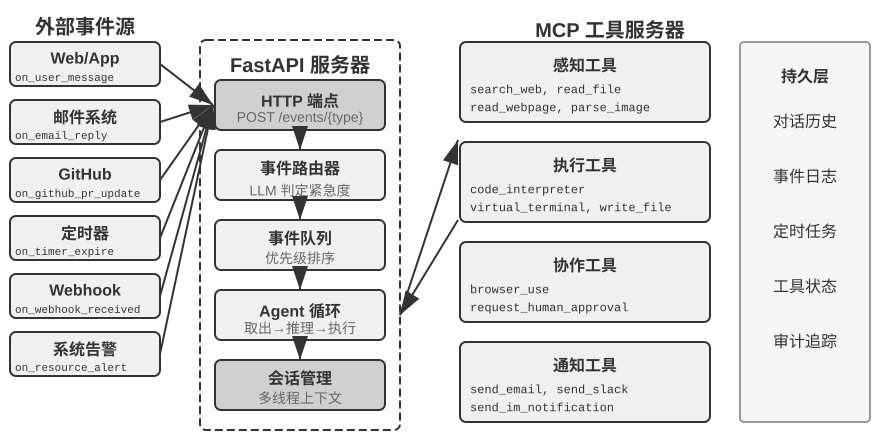
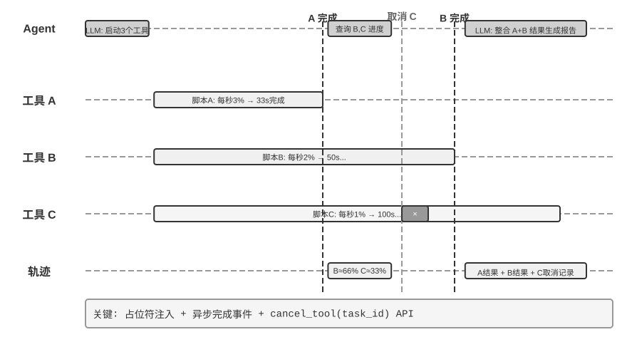

# 第6章 交互：观察与动作空间的扩展（实验解读）

> [!info] 使用说明
> 本章共 **14 个实验（6-1～6-14）**，按四节分布：异步与事件驱动 3 个（6-1～6-3）、语音 4 个（6-4～6-7）、Computer Use 2 个（6-8～6-9）、机器人 5 个（6-10～6-14）。每节含 **目的 / 设计 / 关键结论 / 精读批注** + **动手记录区**。
> 配套代码：开源仓库 `github.com/bojieli/ai-agent-book` 的 `chapter6/` 目录（实验 6-8 路径 B 直接引用 `chapter6/computer-use-open-model`）。多数实验需要 API 额度或多模态模型（Vision LLM / Omni 语音模型 / 具身推理模型），机器人实验另需真机与现场安全条件。
> ⚠️ **真机实验（6-10、6-12）与模拟/GPU 实验（6-11、6-13、6-14）在原书中被明确要求分开报告**，两者共用同一任务目标、动作语义与成功条件，但结论不可互相外推。

---

## 实验 6-1 ★★★：事件驱动的邮件处理 Agent

- **原书位置**：§「事件处理机制」之后
- **目的**：理解事件驱动的核心概念——Agent 不再只是被动等待用户输入，而是可以**响应外部事件主动行动**；掌握**事件源注册、事件队列**以及「事件到达 → Agent 处理 → 结果输出」的基本闭环。
- **设计**：构建一个最简单的事件驱动 Agent——**自动邮件处理助手**，监听收件箱，新邮件到达即触发处理流程（分类、摘要、起草回复，必要时通知用户）。
  - **事件源统一接入**：邮件事件（`on_email_received`，定期检查收件箱或接收推送）、IM/短信（`on_im_message`、`on_sms_message`）、GitHub 事件（`on_github_pr_update`、`on_github_issue_update`）、定时器（`on_timer_expire`）、Webhook（`on_webhook_received`）、系统事件（`on_user_inactive`、`on_process_timeout`、`on_resource_alert`）。
  - **事件队列**：所有事件进入统一队列，按到达顺序依次处理；**每个事件触发一次独立的 Agent 思考循环**（读事件 → 调用相关工具 → 生成结果 → 通知或执行）。
  - **验证场景**：监听测试邮箱，模拟三封邮件——**会议邀请**（自动检查日历冲突并起草接受/拒绝回复）、**客户投诉**（提取关键信息、标记高优先级、通知用户）、**营销广告**（自动归档），全程无需用户介入。
- **关键结论**：这是事件驱动 Agent 最直观的入门场景——**一个外部事件触发一次完整的 Agent 思考循环**；它的覆盖范围也到此为止：**只处理串行事件**，事件依次入队、一个接一个处理完毕。

**图6-3 解读**：该图给出实验 6-1 的事件驱动 Agent 架构（原书 实验 6-1）：多类事件源（邮件、IM/短信、GitHub、定时器、Webhook、系统事件）统一汇入事件队列，队列按到达顺序逐个触发一次独立的 Agent 思考循环，产出分类、摘要、草稿回复或通知。

- 〔精读批注〕这个实验最值得记录的是**事件源清单本身**——它是「Agent 的感官」的一张现实清单。动手时建议把「每个事件源是推送还是轮询」逐条标出来（原书 §事件触发工具 已给出这条判据），因为**推送/轮询的分界直接决定你的延迟下限**；同时留意同一事件重复投递的处理（幂等）——这是第 4 章执行工具遗留的问题，在事件驱动下会被放大。

**📝 动手记录区**

| 复现日期 | 环境（模型/API/框架） | 观察结果（三封邮件的处理路径与耗时） | 与书中结论的差异 |
| --- | --- | --- | --- |
|  |  |  |  |

- [ ] 待测：逐条标注每个事件源是**推送**还是**轮询**，记录实际延迟下限；
- [ ] 待测：让同一封邮件重复投递两次，观察 Agent 是否重复处理（幂等性）；
- [ ] 待测：把「营销广告」换成「伪装成广告的投诉邮件」，观察分类错误如何影响后续动作；
- 备注：

---

## 实验 6-2 ★★★：带并行执行和打断能力的异步 Agent

- **原书位置**：§「不支持原生异步时的兼容方案」之后
- **目的**：在实验 6-1 的简单事件队列基础上，通过**兼容同步接口的运行时**实现**并行工具执行、执行取消和状态管理**——Agent 不再逐个处理事件，而要同时管理多个并发任务、处理打断和恢复，并据实时状态做动态决策。原生 Astra 接口的对照见实验 6-3。
- **设计**：四个能力点，每个都有明确的验证场景。
  1. **异步工具执行**：支持耗时工具（至少 3–5 秒）异步执行，**启动后立即返回占位符**。验证场景：Agent 执行长时间终端命令，期间用户问「现在几点了？」，Agent 立即回应，等分析结果返回后再呈现。
  2. **事件队列与批量处理**：累积非紧急事件，批量追加到轨迹。验证场景：长任务执行中用户连续发送「记得用日语回复」和「整理成网页」，任务完成时一次性处理所有事件，生成日语网页。
  3. **打断机制**：用户的「停止」立即终止执行流并**取消异步工具**。验证场景：Agent 执行长任务，用户发送「取消」，Agent 立即停止，轨迹记录打断事件和取消操作。
  4. **并行工具的取消与状态查询**：异步工具完成后通过新事件把真实结果注入对话，支持按**任务 ID** 取消或查询进度。验证场景：用户要求「帮我同时运行这三个脚本，哪个先完成了，就看看剩下的脚本进度怎么样，如果还没超过 50%，就取消」——三个脚本模拟分析进程，运行时不断输出进度，速度分别为**每秒 3%、2%、1%**；Agent 同时启动三个异步终端命令；当每秒 3% 的脚本在**约 33 秒**后完成时，Agent 查询剩下两个终端的状态，发现一个执行到**约 66%**、另一个**约 33%**，于是取消不超过 50% 的那个；两个终端都完成后整合结果生成完整报告。
- **关键结论**：这套实验落地的是「**兼容同步格式的异步实现**」五条规则——工具调用完成时才记录 tool result、执行中的打断用占位符修补配对关系、非打断事件进队列等当前周期结束后批量追加；**取消需要执行器真正响应取消信号，收到「停止」消息本身不会撤销已经发生的动作**。

**图6-4 解读**：该图给出实验 6-2 的异步 Agent 打断与恢复流程（原书 实验 6-2）：异步工具启动后立即返回占位符，真实结果稍后作为新事件注入；用户打断走取消路径，非紧急事件走队列批量路径，两条路径都要求轨迹保持合法的工具配对结构。

- 〔精读批注〕第 4 个场景是本章最"划算"的一个实验——它同时考察**并行启动、进度查询、条件判断、取消、结果整合**五件事，而且判据是可算的（3%/2%/1% 的进度差与 33 秒的时间点）。动手时建议加测两个边界：**取消发生在工具刚好完成的那一瞬间**（取消与完成的竞态），以及**取消后真实结果仍然到达**（迟到的结果该归到哪个任务）。
- 〔精读批注〕注意场景 1 的占位符是"**必需的谎言**"：原书在正文里专门提醒模型可能把「已启动」误当「已完成」。建议在动手时显式验证这一点——让 Agent 在结果返回前被问「分析结果是多少」，看它是否编造数据。

**📝 动手记录区**

| 复现日期 | 环境（模型/API/框架） | 观察结果（四场景 × 是否复现书中行为） | 与书中结论的差异 |
| --- | --- | --- | --- |
|  |  |  |  |

- [ ] 待测：三脚本实验的实际时间点与「取消 33% 那个」的决策是否符合书中描述；
- [ ] 待测：取消与完成的竞态（工具在取消信号到达前完成）；
- [ ] 待测：占位符是否诱发编造（结果未返回时追问结果）；
- [ ] 待测：批量追加 2 条以上事件时，模型是否遗漏前面的要求（对应正文「注意力分散问题」）；
- 备注：

---

## 实验 6-3 ★★★：模型原生异步与回合中途引导

- **原书位置**：§「从『能接收异步消息』到『可靠处理异步任务』」之后
- **目的**：对比**同步工具、原生异步工具、回合中途引导**三种交互方式，观察等待是否阻塞其他工作、新要求是否进入后续计划、结果到达后能否继续原任务；再选一个**不支持原生能力的模型作对照**，理解**模型能力与运行时编排各自解决什么问题**。
- **设计**：任务场景为「**为一次会议选择场地**」——Agent 发起耗时查询后，先完成不依赖查询结果的准备工作；期间用户补充**预算与人数**要求；等查询完成，再根据**全部约束**选择场地。调用 GPT-6 Astra API 分别跑三种交互方式。
- **关键结论**：**异步工具调用把「发起行动」和「获得结果」分开**——关键是分清工作的依赖关系（能独立推进的继续做，必须依据结果的决策留到结果到达之后）；**回合中途引导**让用户不必等一整轮回答结束才表达变化，系统保留已完成的工作并把新约束带入后续处理；但**修改计划不等于停止正在运行的工具，也不会自动撤销已经发生的动作**。评估要覆盖两层：**模型是否理解了变化、系统是否按变化正确执行**。

- 〔精读批注〕这个实验的对照组设计是本章的精华：**「不支持原生能力的模型 + 同样的运行时编排」**能把"模型原生能力"与"运行时工程"的贡献分离开——这正是第 5 章「同一 Harness 中切换模型，阈值也可能改变」那条判断的实验化。动手时建议把「预算 + 人数」两条约束做成**互相冲突**（如预算对应人数上限），观察模型是综合使用两条更新，还是只记住最后一条。
- 〔精读批注〕原书正文已给出该能力的核对日期（2026-09-05），**这类厂商能力变化极快，复现前务必先核对当前 API 文档**，并在记录区写下核对日期。

**📝 动手记录区**

| 复现日期 | 环境（模型版本/API 文档核对日期） | 观察结果（三方式 × 阻塞/约束/恢复） | 与书中结论的差异 |
| --- | --- | --- | --- |
|  |  |  |  |

- [ ] 待测：同步 vs 原生异步在**总耗时**上的差；
- [ ] 待测：中途新约束是否进入**后续**决策（而非被当成新一轮任务）；
- [ ] 待测：两条互相冲突的约束是否被**同时**遵守；
- [ ] 待测：不支持原生能力的模型 + 兼容层，表现与原生差多少；
- 备注：

---

## 实验 6-4 ★：构建传统语音 Agent

- **原书位置**：§「范式一 · 级联流水线（Cascading）」
- **目的**：建立后续所有语音方案的**级联基线（baseline）**。
- **设计**：用 WebSocket 串起**麦克风 → Silero VAD → 本地 Whisper → 流式 LLM → Fish S1 TTS**，形成完整的一条 VAD→ASR→LLM→TTS 串行流水线。
- **关键结论**：这是理解「延迟瀑布」（图6-7）的实物版本——四级模块的等待**串行累积**；同时它也是「信息在接口处丢失」的实物版本：VAD 输出的只有「有声/无声」二值信号，犹豫、情绪、附和与环境声都在这一级被丢掉。

- 〔精读批注〕做这个实验时**务必记录分段耗时**（VAD 判定、ASR 首字、LLM 首 token、TTS 首包），否则后面几个优化实验（6-5、6-6、6-7）就没有可比基线。原书明确「真实数值取决于输入长度、模型、硬件、网络和负载」——**所以基线要连同硬件与网络环境一起记录**。

**📝 动手记录区**

| 复现日期 | 环境（硬件/模型/网络） | 观察结果（分段耗时与总响应时间） | 与书中结论的差异 |
| --- | --- | --- | --- |
|  |  |  |  |

- [ ] 待测：分别记录 VAD / ASR / LLM 首 token / TTS 首包四段耗时；
- [ ] 待测：用户中途停顿（如报数字）时 VAD 是否误切分；
- 备注：

---

## 实验 6-5 ★：使用 Qwen2-Audio 模拟流式语音感知

- **原书位置**：§「从串行到流式感知」（实验 6-4 之后）
- **目的**：验证「流式感知」相对「静音判定后一次性识别」的差异。
- **设计**：**Qwen2-Audio 本身不是流式模型**——实验用**递增音频前缀**模拟连续感知，并与 **600ms VAD + Whisper** 的方案做对照。
- **关键结论**：模拟结果说明流式感知能缩短等待并减少「上下文被切断」导致的人名/专有名词识别错误；同时也暴露了模拟与真流式的差距——**真正的流式 ASR 需要模型支持**（Whisper 的解码虽自回归，但编码器需要完整音频段，因此不能直接等同于流式模型）。

- 〔精读批注〕「用递增前缀模拟流式」是一种**廉价近似**，它的代价是**重复计算**（每次前缀都重跑编码器）。动手时值得顺手量一下：模拟版的计算开销是真实流式的多少倍——这个数字直接决定它能不能进生产。

**📝 动手记录区**

| 复现日期 | 环境（模型/硬件） | 观察结果（延迟、识别错误、计算开销） | 与书中结论的差异 |
| --- | --- | --- | --- |
|  |  |  |  |

- [ ] 待测：Qwen2-Audio 递增前缀 vs 600ms VAD + Whisper 的延迟对比；
- [ ] 待测：含人名/邮箱/专有名词的句子在两方案下的识别差异；
- [ ] 待测：递增前缀方案的重复计算开销倍数；
- 备注：

---

## 实验 6-6 ★★：本地运行 MiniCPM-o 4.5，对比端到端与自级联

- **原书位置**：§「范式二 · 端到端全模态模型（Omni）」
- **目的**：测量**音频信息是否被保留**——比较「直接从音频作答」与「同模型自级联（先转录再作答）」的差别。
- **设计**：本地运行 **MiniCPM-o 4.5**，**关闭 thinking mode**（避免思考链混入变量），同一模型两种通路对照。
- **关键结论**：原书明确划出边界——**它测的是音频信息是否被保留，不是后文的「边想边说」**。这是本章实验纪律的一个范例：**一个实验只回答一个问题**。

- 〔精读批注〕建议用**只有音频才能区分**的测试集（语气/情绪/停顿/环境声/同音异义），否则文字通路也能答对，实验就没有分辨力。关闭 thinking mode 这一步要记录清楚——它是控制变量，不是省事。

**📝 动手记录区**

| 复现日期 | 环境（MiniCPM-o 版本/量化/硬件） | 观察结果（端到端 vs 自级联） | 与书中结论的差异 |
| --- | --- | --- | --- |
|  |  |  |  |

- [ ] 待测：构造只能靠音频区分的题目（语气、情绪、环境声）；
- [ ] 待测：同一题在两条通路上的答案差异；
- 备注：

---

## 实验 6-7 ★★：基于 Fish Audio 的控制标记驱动 TTS

- **原书位置**：§「更像人的语音合成」
- **目的**：验证控制标记（`THINKING`、`EMO:happy`、`SPEED:0.8x`）能否通过 TTS 映射为停顿、韵律、语速等非语言音频，从而降低「机器感」。
- **设计**：使用 **Fish Audio S1** 构建**多参考语音库**，比较三种配置：**无控制标记 / 单一参考音 / 多参考音**；执行层根据标记选择匹配的情绪、语速和风格。
- **关键结论**：停顿、填充词与偶尔的重复是人类表达不确定性和思考状态的信号，传统 TTS「过于流畅、零停顿」反而暴露机器身份；控制标记把「怎么说」显式化为可解析的字段。

- 〔精读批注〕这是一个**主观指标实验**，建议在设计阶段就固定评价方式（人评盲测 + 固定问题集），否则三次配置的结论无法比较。另一个可量化的替代指标是**「用户打断前的等待时长」**——如果加入停顿后用户更少抢话，说明"机器感"确实下降了。

**📝 动手记录区**

| 复现日期 | 环境（TTS 版本/参考音来源） | 观察结果（三配置盲测对比） | 与书中结论的差异 |
| --- | --- | --- | --- |
|  |  |  |  |

- [ ] 待测：无标记 / 单参考 / 多参考三配置的盲测；
- [ ] 待测：控制标记被 TTS 正确解析的比例（是否有标记被念出来）；
- [ ] 待测：加入停顿后用户打断频率的变化；
- 备注：

---

## 实验 6-8 ★：运行 Computer Use（Anthropic 参考路径或开放模型路径）

- **原书位置**：§「动作空间设计」
- **目的**：分别用**闭源参考实现**与**开放权重模型**驱动同一个感知-思考-行动循环，验证动作空间的可移植性。
- **设计**：
  - **路径 A（Anthropic Computer Use Demo）**：容器打包完整的 **Ubuntu 桌面环境**（含浏览器、终端等常用工具）；前端接收任务，后端把指令与截图发送给 Claude，再执行模型返回的鼠标、键盘、终端或编辑动作。
  - **路径 B（本书 `chapter6/computer-use-open-model`）**：默认以开放权重的 **Qwen3-VL 32B Instruct** 驱动 **browser-use**，可通过 **OpenRouter** 托管 API，也可连接自托管的 **vLLM / SGLang** 等服务。
- **关键结论**：动作空间的设计不是模型供应商的私有协议——**只要 Harness 能把同样的截图、动作约束和执行结果转换成目标模型支持的消息与结构化输出，Claude、开放权重视觉模型和自托管端点都可以驱动同一个循环。**

- 〔精读批注〕两条路径同时跑的价值在于**成本-能力曲线**：路径 A 稳定但按量计费、路径 B 可控但需要自己解决视觉定位质量。建议记录**同一任务的成功率与 token 成本**两组数，这比"哪个更好用"的感觉有说服力得多。

**📝 动手记录区**

| 复现日期 | 环境（路径 A/B、模型、部署方式） | 观察结果（成功率与成本） | 与书中结论的差异 |
| --- | --- | --- | --- |
|  |  |  |  |

- [ ] 待测：同一任务在路径 A 与路径 B 上的成功率、步数、token 成本；
- [ ] 待测：自托管（vLLM/SGLang）与托管 API 的延迟差异；
- 备注：

---

## 实验 6-9 ★：使用 browser-use 实现自动浏览器操作

- **原书位置**：§「视觉定位（Grounding）」
- **目的**：体验**结构化元素索引**这条定位路线——把开放式坐标预测转成封闭式 ID 选择。
- **设计**：基于 **Playwright**（用代码控制浏览器的工具库）结合多模态大模型实现自然语言驱动的浏览器操作；**启用 SoM 可视化模式**，每次决策前保存带标注框的截图。测试任务：「**打开 Google 查询旧金山天气**」——系统启动后截图显示 Google 搜索页，交互元素被编号，模型选择搜索框、输入 `San Francisco weather today`、提交搜索，再从结果页提取温度与天气状况。
- **关键结论**：结构化索引方案**不省 token**（要把所有标注信息都发给模型），但**定位准确稳定**，还免去了分割模型可能引入的漏检和误检；代价是**依赖 DOM/无障碍信息的可得性**——Canvas/WebGL、游戏界面等没有结构化信息的场景仍要回退到视觉标注或坐标预测。

- 〔精读批注〕动手时建议做两组对照：**（1）关掉 SoM 标注**（逼模型预测坐标），比较成功率；**（2）构造一个非标准控件页面**（canvas 渲染的按钮），观察方案失效的位置。这两组数据合起来就是第 9 题（结构化 vs 纯视觉路线之辩）的实证材料。
- 〔精读批注〕注意原书对这类方案的一条隐含提示：**它把"定位"的成本从模型侧转移到了 Harness 侧**（元素枚举 + 标注绘制 + 文本列表生成）——**代价从 token 变成了工程复杂度**。

**📝 动手记录区**

| 复现日期 | 环境（浏览器/模型/框架版本） | 观察结果（开启与关闭 SoM 的对比） | 与书中结论的差异 |
| --- | --- | --- | --- |
|  |  |  |  |

- [ ] 待测：开启/关闭 SoM 的成功率对比；
- [ ] 待测：非标准控件（canvas 按钮）下的失效模式；
- [ ] 待测：每次决策送入模型的 token 量（验证"不省 token"这一条）；
- 备注：

---

## 实验 6-10 ★：真机遥操作 XLeRobot 整理桌面

- **原书位置**：§「硬件与算法的分工」
- **目的**：测量**真机在足够强的操作者控制下能做到什么**——为人机两条闭环建立第一条参考线。
- **设计**：在真实 XLeRobot 工作区放置**红色杯子、托盘、黄色废纸、垃圾盒**；操作者通过**一种校准完成的遥操作方式**执行固定任务：「把红色杯子放进托盘，把黄色废纸放进垃圾盒，最后重新观察并确认桌面状态」。**至少重复多轮**，记录摄像头画面、操作者输入、机械臂状态、动作时间、抓取失败、重试次数和最终状态。
- **验收标准**：**不能只看"最后桌面似乎收拾好了"**——红色杯子必须位于托盘内，黄色废纸必须位于垃圾盒内，机械臂回到安全姿态，而且**全程没有碰撞、越界或未经确认的人工代做**。
- **关键结论**：**对于这个任务，硬件本体不是瓶颈，算法才是瓶颈**；遥操作不只是收集演示数据，也是一种**「固定硬件、替换操作者」的诊断实验**。

- 〔精读批注〕**这条实验最重要的产出是验收标准本身**：「看起来收拾好了」被明确否掉，改判为四个可检查的条件 + 无人代做。这可以直接搬到你自己的 Agent 评测里——**凡是"看起来完成了"的判据，都要改写成可逐项检查的后置条件**。
- ⚠️ 真机实验需要**标定、急停装置与现场观察员**（原书本节阅读提示已声明）。

**📝 动手记录区**

| 复现日期 | 环境（机械臂/遥操作方式/桌面布置） | 观察结果（成功率、重试、耗时） | 与书中结论的差异 |
| --- | --- | --- | --- |
|  |  |  |  |

- [ ] 待测：多轮重复下的成功率与平均重试次数；
- [ ] 待测：四条件验收逐项打勾（杯入托盘 / 纸入垃圾盒 / 安全姿态 / 无碰撞越界代做）；
- [ ] 待测：不同遥操作入口（键盘 / 手柄 / Joy-Con / VR）的完成时间差异；
- 备注：

---

## 实验 6-11 ★：在模拟器中测量同任务的理想控制上限

- **原书位置**：§「硬件与算法的分工」（实验 6-10 之后）
- **目的**：测量「**感知和决策都正确时，这个任务至少可以做到什么**」——建立第二条参考线（理想闭环）。
- **设计**：在**二维桌面模拟器**中随机摆放红色杯子、黄色废纸及其目标区域，由**理想控制器**依次接近物体、抓取并移动到正确位置。它**不需要识别图像，也不会选错动作**。关注**任务成功率、完成步数和路径长度**，并改变物体初始位置与任务规模，观察理想上限是否稳定。
- **关键结论**：它与实验 6-10 使用**相同的成功条件**，但测量的是**理想化模拟结果，不代表 XLeRobot 真机已经运行**。二者共同构成后续自主控制的两条参考线：**实验 6-10 = 真实硬件上的人类闭环，实验 6-11 = 模拟环境中的理想闭环。**

- 〔精读批注〕两条参考线的用法值得记住：**实验 6-12（自主真机）的结果应当落在两条线之间**——超过理想上限说明测量有问题，低于人类闭环说明差距在算法。这正是"先造标尺，再量自己"。

**📝 动手记录区**

| 复现日期 | 环境（模拟器实现） | 观察结果（成功率/步数/路径长度） | 与书中结论的差异 |
| --- | --- | --- | --- |
|  |  |  |  |

- [ ] 待测：随机初始位置下的上限稳定性；
- [ ] 待测：任务规模（物体数量）增大时步数与路径长度的增长曲线；
- 备注：

---

## 实验 6-12 ★★：使用 Gemini Robotics-ER 1.5 驱动 XLeRobot 自主整理桌面

- **原书位置**：§「长程规划与任务分解」
- **目的**：把实验 6-10 的**人类操作者替换为 Agent**，在同一硬件、同一任务上直接比较「人类闭环与模型闭环之间还差什么」。
- **设计**：保持真实 XLeRobot、桌面布置、任务指令与成功条件不变。可用 **Gemini Robotics-ER 1.5** 这类**具身推理模型**负责观察与规划，通过 RoboCrew 风格的智能体循环**只开放五个工具**：`observe_scene`、`pick`、`place`、`verify_state`、`stop`。
  - 模型先观察桌面、决定处理顺序，再调用经过标定的抓取与放置动作。
  - **每完成一个技能都必须重新观察并检查后置条件**；抓取失败只能重试当前技能；用户喊停、物体离开工作区或状态无法确认时**必须调用 `stop`**。
  - **模型不能直接输出任意关节角，也不能仅凭自己先前说过"已经完成"就跳过真实检查。**
- **验收标准**：与实验 6-10 **完全相同**（杯入托盘 / 纸入垃圾盒 / 安全姿态 / 无碰撞越界）。区别在于：**任务语义必须来自模型观察，真实动作必须来自工具调用，最终状态必须由新观察确认；人只能负责启动、急停和安全监护，不能在中途代替 Agent 完成动作。**
- **关键结论**：这样实验 6-10 与 6-12 才能直接比较「同一硬件、同一任务，人类闭环与模型闭环之间还差什么」。

- 〔精读批注〕这一节把**工具契约当成了安全边界**：只开五个有边界的技能、禁止直接输出关节角、禁止自我宣称完成——三条合起来才是"可审计的自主"。动手时建议加一条记录：**`verify_state` 返回"未完成"时，模型是否会诚实重试，还是会换一种说辞宣称成功**（自我宣称完成是这类系统最典型的失败模式）。
- ⚠️ 真机实验，需要急停装置与现场观察员。

**📝 动手记录区**

| 复现日期 | 环境（具身推理模型/工具实现/标定方式） | 观察结果（成功率、失败模式） | 与书中结论的差异 |
| --- | --- | --- | --- |
|  |  |  |  |

- [ ] 待测：与实验 6-10 的完成时间/重试次数对比；
- [ ] 待测：`verify_state` 判定未完成时模型的行为（重试 / 换说法宣称成功 / 调用 stop）；
- [ ] 待测：失败时是否发生「仅凭自己说过已完成」而跳过检查；
- 备注：

---

## 实验 6-13 ★★：在模拟器中比较三种自主整理桌面的闭环

- **原书位置**：§「世界模型」（实验 6-12 之后）
- **目的**：把实验 6-12 的**任务、对象状态、成功条件和五个工具原样放进模拟器**，只把真实执行器换成可控的模拟执行器，并让**抓取偶尔出现可恢复的瞬时失败**，从而在不改变问题的前提下比较三种策略。
- **设计**：三种策略——**开环执行**（一次生成完整动作序列，中途不重新观察）；**逐步检查**（每个 `pick` 和 `place` 之后重新读取状态，失败时只重试当前技能）；**预测式执行**（再增加一个短期世界模型，先比较候选技能的预期结果，再选择下一步）。比较**任务成功率、工具调用开销和失败恢复能力**，并检查**最终成功是否都由 `verify_state` 的新观察确认**。
- **关键结论**：实验**不是为了证明小型模拟世界模型等同于真实机器人的物理模型**，而是验证一个更基础的关系——**开环计划会把一次局部失败带到任务末尾，逐步检查能够恢复，动作预测则可以进一步帮助规划器为候选技能排序**。最终是否真的完成，**仍然必须由环境反馈决定**。

- 〔精读批注〕这个实验的巧妙之处是**只换执行器、不换问题**——三个策略的差异因此完全可归因。动手时建议额外记录**每次失败恢复所消耗的额外工具调用数**，它比成功率更能体现"逐步检查"的成本。
- 〔精读批注〕注意三种策略其实是一个**成本阶梯**：开环最省调用但失败会传播；逐步检查用调用换鲁棒性；预测式再加一层推理成本换排序质量。**这条阶梯的形状（越鲁棒越贵）才是可迁移的结论。**

**📝 动手记录区**

| 复现日期 | 环境（模拟器/世界模型实现） | 观察结果（三策略 × 成功率/调用数/恢复） | 与书中结论的差异 |
| --- | --- | --- | --- |
|  |  |  |  |

- [ ] 待测：三策略的成功率与工具调用总数对比；
- [ ] 待测：开环方案中"一次局部失败传到任务末尾"的实际表现；
- [ ] 待测：最终成功是否**全部**由 `verify_state` 的新观察确认（有无漏检）；
- [ ] 待测：注入的瞬时失败比例对三策略差异的放大程度；
- 备注：

---

## 实验 6-14 ★★★：同一桌面任务的 RGB 跨环境测试

- **原书位置**：§「从仿真环境到真实机器人」
- **目的**：回答一个**更窄的问题**——**训练时主动扩大画面变化范围，是否有助于同一个杯子—托盘、废纸—垃圾盒任务适应新的摄像头画面。**
- **设计**：在模拟环境中继续使用「把物体移动到对应目标」的基本问题，**把每个样本理解为整理桌面中的一个局部决策**：根据 RGB 画面判断应该向哪个方向接近物体，或是否已经可以抓取。训练**四种结构相同的视觉策略**：① 只看固定画面；② 改变背景；③ 改变物体外观；④ 同时改变背景、外观、光照和噪声。所有策略都在**原始环境**和**变化后的新环境**中测试，比较**视觉条件变化前后的动作判断准确率**。
- **关键结论**：实验要回答的**不是「模拟器是否已经等于 XLeRobot 真机」**；**即使结果改善，真机部署仍然需要真实相机标定、执行器测试和完整的安全闭环。**

- 〔精读批注〕四种策略是一个**递增的数据增强阶梯**，它的结论形状值得预期：**只在训练分布内评测时，增强可能略降；跨环境评测时，增强明显占优**——真正的决策依据是「部署环境会有多少变化」，而不是"增强总是更好"。
- ⚠️ 原书在这里划的边界最值得抄下来：**仿真结论只能用于排除，不能用于承诺。**

**📝 动手记录区**

| 复现日期 | 环境（仿真器/策略实现/训练量） | 观察结果（四策略 × 原始/新环境准确率） | 与书中结论的差异 |
| --- | --- | --- | --- |
|  |  |  |  |

- [ ] 待测：四策略在原始环境与新环境上的准确率矩阵；
- [ ] 待测：增强策略在**分布内**是否反而略降（验证取舍）；
- [ ] 待测：把「背景 + 外观 + 光照 + 噪声」逐项打开，看边际收益；
- 备注：

---

*原文：`D:\ObsidianRepository\book\chapter6.md`（库外只读）。逐节深析见 [[内容精读/第6章 交互：观察与动作空间的扩展]]，思考题见 [[思考题引导/第6章 交互：观察与动作空间的扩展]]，规范见 [[01-精读笔记规范]]。*
