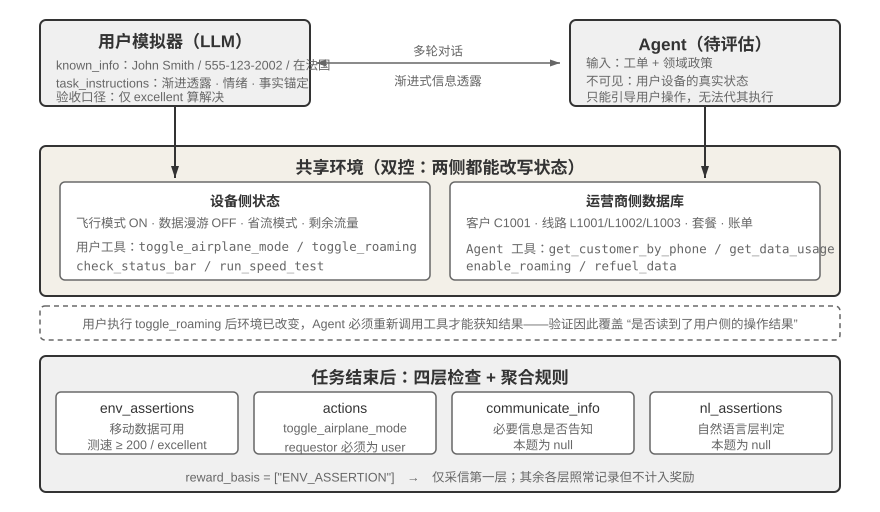
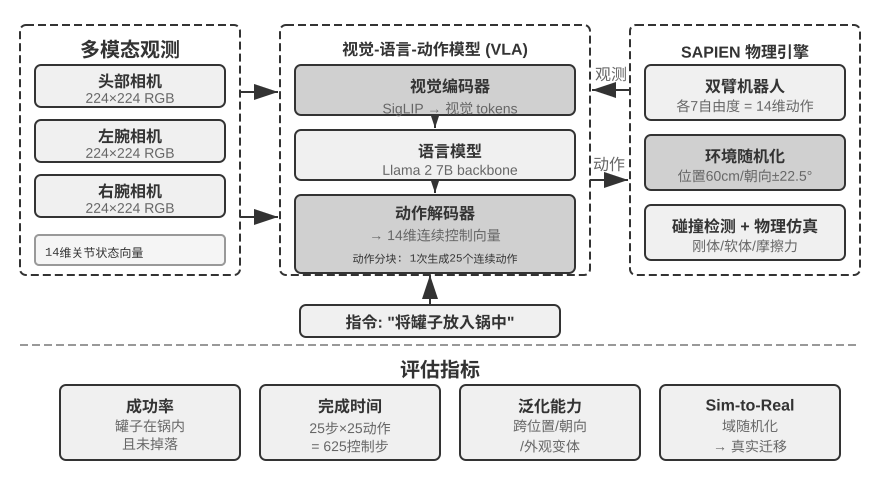

# 第7章 Agent 的评估（实验解读）

> [!info] 使用说明
> 本章共 **14 个实验（7-1～7-14）**，按主题分布：基准与环境通读 2 个（7-1、7-2）、Rubric 与记忆评估 3 个（7-3～7-5）、失败归因与回归任务 2 个（7-6、7-7）、排名的统计方法 1 个（7-8）、选型与成本 4 个（7-9～7-12）、改进闭环 1 个（7-13）、仿真环境 1 个（7-14）。每个实验含 **目的 / 设计 / 关键结论 / 精读批注** + **动手记录区**。
> 配套代码：开源仓库 `github.com/bojieli/ai-agent-book` 的 `chapter7/` 目录（含 `tau2-bench-eval`、`android-world`、`user-memory-evaluation` 等）。多数实验需要 API 额度；实验 7-2、7-6 可完全离线（读文件 + 人肉分析），适合作为入门。

---

## 实验 7-1 ★：运行 τ²-bench 并对比 τ-bench 的演进

- **原书位置**：§「一次真实运行的轨迹」（在解剖完一条任务定义之后）
- **目的**：通过运行 τ²-bench 评估框架，理解**人机交互型评估环境的设计要点**。
- **设计**：先按路径通读任务定义文件（`chapter7/tau2-bench-eval`，任务文件 `data/tau2/domains/telecom/tasks_small.json`）——**每条任务包含已知信息、任务指令、初始状态与成功条件四个部分**；随后运行完整评估流程，**观察用户模拟器与 Agent 的多轮对话**，分析典型失败模式（**政策违规、信息遗漏、过度转接人工**等）。
- **关键结论**：这条任务把「一个评估集必须回答的问题」摆全了——什么算成功、任务从何而来、由谁验证、分数如何转化为决策。配套仓库保留了一次运行记录：成功轨迹里关键转折出现在**用户侧工具调用**（双控机制），失败轨迹的典型形态是**证据已进入上下文但 Agent 未据此回溯**。

**图7-3 解读**：该图给出 τ²-bench 的双控环境与分层验证（原书 实验 7-1）：Agent 与模拟用户各自拥有一套工具并都能改变环境状态，评分标准按 `actions`、`env_assertions`、`communicate_info`、`nl_assertions` 分层检查后由 `reward_basis` 聚合。

- 〔精读批注〕做这个实验时建议**逐轮标注「谁在调用工具」**（Agent / 用户 / 系统）——双控机制的价值只有在标注出来之后才看得见。另外建议把「政策违规」类失败单独计数：这类失败在终态断言上往往看不出来（原书已举出「一次发两个工具调用」未被捕获的例子）。

**📝 动手记录区**

| 复现日期 | 环境（模型/τ²-bench 版本） | 观察结果（成功率、失败模式分布） | 与书中结论的差异 |
| --- | --- | --- | --- |
|  |  |  |  |

- [ ] 待测：统计三类典型失败模式（政策违规 / 信息遗漏 / 过度转接人工）各占多少；
- [ ] 待测：逐轮标注工具调用发起方，找出双控机制真正起作用的那一轮；
- [ ] 待测：对比 τ-bench 与 τ²-bench 在同一模型上的分数差异；
- [ ] 待测：手动构造一条「用户声称已获批准」的陷阱任务，看是否会违规；
- 备注：

---

## 实验 7-2 ★：人肉执行基准测试任务

- **原书位置**：§「质量控制与长期维护」（实验 7-2）
- **目的**：亲手完成基准任务，理解**任务描述与验证器之间的距离**。
- **设计**：从 **GAIA、AndroidWorld、SWE-Bench Verified、Terminal-Bench、OSWorld-Verified** 中挑选任务亲手完成，**每个数据集建议完成简单、中等、困难各一个**（「困难」级别对人类同样具有挑战）。
- **验收问题**（完成后回答两个）：① 该任务的描述是否存在**多种合理解释**，若存在，**验证器认可哪一种**？② 若试图蒙混过关，**成本最低的路径是什么，验证器能否拦截**？
- **关键结论**：这是本章成本最低、信息量却最大的实验——它把「验证器能核实到什么深度」从表格变成了手感。原书给出的三档深度（精确字符串匹配 / UI 状态断言 / 真实执行）在做题时会直接体现为「能不能糊弄过去」。

- 〔精读批注〕这个实验的产出可直接变成自建评估集的**设计检查表**：每题写两行——「歧义的合理解释有几种」「最便宜的作弊路径是什么」。凡是第二行答不出来的题，验证器多半有漏洞。
- 〔精读批注〕建议把「困难」级任务留给人类独立完成并计时——你会得到一条**人类基线**，这正是第 6 章「固定硬件、替换操作者」的诊断思路在评估上的复用。

**📝 动手记录区**

| 复现日期 | 数据集/任务 | 难度 | 是否有多解 | 最便宜的作弊路径 | 验证器能否拦截 |
| --- | --- | --- | --- | --- | --- |
|  |  |  |  |  |  |

- [ ] 待测：五个数据集 × 三难度，至少各完成一个；
- [ ] 待测：记录人类完成「困难」级任务的耗时与失败点；
- 备注：

---

## 实验 7-3 ★★：构建基于 Rubric 的用户记忆评估系统

- **原书位置**：§「LLM-as-a-Judge」（Rubric 四准则之后）
- **目的**：把第三章 `chapter3/user-memory-evaluation` 框架中「单一 LLM 调用返回通过/失败 + 评估理由」的简单评分机制，**升级为结构化的多维度 Rubric 评估系统**——现有系统**缺乏结构化的诊断能力**。
- **设计**：设计统一的多维度 Rubric 框架，适用于所有三层任务。评价维度包括：**事实正确性（Precision）**——在所有给出的信息中，有多少是正确的，验证数字、日期和名称是否与记忆信息一致；**事实完整性（Recall）**——在所有应该给出的信息中，有多少被提及，验证是否遗漏关键内容；**思考正确性**——是否正确理解了信息间的关系和隐含逻辑；**思考主动性**——是否在适当时候提供超出直接回答的建议或风险提醒；**幻觉检测**——确保未编造记忆中不存在的信息。
- **关键结论**：**四档制评分（优秀/良好/及格/不及格），每档配具体判定标准而非抽象描述；幻觉维度设为一票否决项；为每个维度提供示例和边界案例。**

- 〔精读批注〕**Precision 与 Recall 这一对是本实验最值得带走的设计**——它把「答得对不对」拆成了「说的都对」和「该说的都说了」两个可分别失败的命题，与 SWE-bench 的 FAIL_TO_PASS / PASS_TO_PASS 是同一个思路。动手时建议先只用这两个维度跑一轮，确认它们确实能区分出不同失败类型，再加后三维度。
- 〔精读批注〕**「思考主动性」这一维度要小心**：它天然鼓励「多说」，正是原书警告的长度偏差的温床。建议给它加一条上限（如「主动补充不得超过两条」），否则它会污染总分。

**📝 动手记录区**

| 复现日期 | 环境（模型/Rubric 版本） | 观察结果（各维度分数分布与典型失败） | 与书中结论的差异 |
| --- | --- | --- | --- |
|  |  |  |  |

- [ ] 待测：五维度各自的分数分布（哪一维最容易失分）；
- [ ] 待测：幻觉否决被触发的次数与样例；
- [ ] 待测：维度之间是否高度相关（若相关，说明 Rubric 未真正拆分）；
- [ ] 待测：「思考主动性」是否引发长度偏差；
- 备注：

---

## 实验 7-4 ★★：Advanced JSON Cards 与 RAG 的对比评估

- **原书位置**：§「LLM-as-a-Judge」（实验 7-3 之后）
- **目标**：在**同一套评估集**上公平对比**结构化记忆与非结构化检索的优势边界**。
- **设计**：复用两个第三章项目，在 `chapter3/user-memory-evaluation` 的 **60 个测试用例**上对比三种配置——**纯 Advanced JSON Cards**（结构化卡片常驻上下文、无需检索）、**纯 RAG**（对话分块入向量库、必须检索）、**混合系统**（核心事实常驻 + 原始对话按需检索）。
- **关键结论**（配套实验用同一组 60 个问题测试三套记忆方案，**共保留 180 条真实 API 运行轨迹**，见表7-3）：

| 系统 | 基础回忆 | 多会话消歧 | 跨会话隐藏关联 | 总体 |
| --- | ---: | ---: | ---: | ---: |
| Advanced JSON Cards | 95% | 60% | 50% | 68.3%（41/60） |
| RAG | 90% | 40% | 15% | 48.3%（29/60） |
| 混合系统 | 80% | 70% | 50% | 66.7%（40/60） |

  **最值得注意的是，混合方案并没有自然胜出**——它在 **3 道题**上做到了两种单一方案都没做到的事，却在另外 **8 道题**上不如表现更好的单一方案；与每道题上的最佳单一方案相比，平均成功率反而低了。**纯 RAG 在基础回忆题上与结构化卡片相差不大，一到跨会话关联题成功率却降到 15%。** 另一个容易被忽视的数字是：**180 次评判中，幻觉否决触发了 28 次**。

- 〔精读批注〕**「混合方案没有自然胜出」是本实验最有价值的负面结论**——它反驳了「组合总是更好」的直觉。建议在动手时把「3 胜 8 负」的题目逐条列出来，看混合方案到底在什么条件下输（很可能是**核心事实常驻挤占了检索结果的位置**，与第 2 章的位置偏好直接相关）。
- 〔精读批注〕**幻觉否决触发 28 次 / 180 次**这个比例值得单独记下来——它说明「一票否决」不是装饰性设计，而是**实际承担了近六分之一的判定**。

**📝 动手记录区**

| 复现日期 | 环境（嵌入模型/主模型/向量库） | 观察结果（分层成功率） | 与书中结论的差异 |
| --- | --- | --- | --- |
|  |  |  |  |

- [ ] 待测：复现三层分层的成功率，与表7-3 对比；
- [ ] 待测：找出混合方案「胜 3 负 8」的具体题目与失败原因；
- [ ] 待测：统计幻觉否决触发次数与触发场景；
- [ ] 待测：换一个嵌入模型，看分层结论是否稳定；
- 备注：

---

## 实验 7-5 ★★：构建全自动 TTS 质量评估流水线

- **原书位置**：§「多模态 LLM-as-a-Judge」
- **目的**：从零设计并实现完整的**多模态 LLM-as-a-Judge TTS 质量评估系统**。
- **设计**：
  - **TTS 多维度 Rubric**：**准确性**（是否正确读出所有文字，无遗漏/错读/添加）；**自然度**（是否流畅，有无机器感、不自然停顿，韵律是否符合人类习惯）；**情感表达**（语气是否符合文本情感色彩——疑问句升调、感叹句强调、悲伤内容语速慢语调低）；**音色一致性**（有参考语音时评估说话人相似程度，**多模态模型同时接收参考语音与合成语音对比**）。
  - **多样化测试语料库**：不同长度（单句→长段落）、文体（新闻/故事/对话）、情感（中性/兴奋/悲伤）、特殊挑战（**数字/专有名词/多音字/方言词汇**）。
  - **评估流水线**：TTS 生成模块接入主流服务（OpenAI、ElevenLabs、Fish Audio、Minimax、豆包），由**可直接接收音频的多模态评判模型**将合成语音、原始文本、参考语音和 Rubric 一起输入，逐维度评分并给出详细理由；分析评估结果的分布，**同时记录评判模型、参考音频哈希和候选音频哈希，使结果可复核**。
- **关键结论**（配套仓库的一次小规模听评）：OpenAI 与 Fish Audio 分别生成数字、多音字、长句和兴奋语气四类音频，8 条音频由 **Voxtral** 按四维度评分——两者在**准确性和自然度**上都得到 **5.00 和 4.00**；**Fish Audio 在情感表达和音色一致性上得到 4.00 和 3.00，OpenAI 则是 3.75 和 2.75**。**四个维度分开评分后，即使「有没有读对」看不出差别，语气和音色上的差别仍会显现出来。**
- **但这组分数不能用来判断哪家 TTS 更好**：每家只有四条音频，更关键的是**实验使用的固定参考音频来自 Fish S1，拿它来比较音色本来就更有利于 Fish Audio**。作者由此给出本节最硬的提醒——**「选什么参考答案、参考图片或参考音频，本身就是评估设计，而不是评估开始前无关紧要的准备工作。」** 若要比较**通用 TTS**，就不该把「像不像 Fish 参考音色」算进总分；若要比较**声音克隆**，则应让所有方案模仿**同一个目标说话人**，并用**人工盲听校准模型评分**。

- 〔精读批注〕这个实验的**方法论价值远大于它的评测结果**：它示范了「一个看起来客观的多维评分，如何被一个未言明的设计选择整体带偏」。动手时建议**先做对照组设计再跑数据**——把所有候选音频统一转成同一种参考音，或干脆去掉音色维度，看排名是否翻转。
- 〔精读批注〕建议额外记录**同一批音频多次评判的方差**：如果评判模型自身的波动就超过两家的分差，那么这组对比在统计上不成立（对应 §7.8 的显著性纪律）。

**📝 动手记录区**

| 复现日期 | 环境（TTS 服务/评判模型） | 观察结果（四维度分数矩阵） | 与书中结论的差异 |
| --- | --- | --- | --- |
|  |  |  |  |

- [ ] 待测：四类语料 × 多家 TTS 的四维度矩阵；
- [ ] 待测：**互换参考音频**后排名是否翻转（验证「参考物即评估设计」）；
- [ ] 待测：同一音频重复评判的方差；
- [ ] 待测：多音字与数字在这些 TTS 上的错误率；
- 备注：

---

## 实验 7-6 ★★：对 AndroidWorld 失败轨迹做失败归因

- **原书位置**：§「失败归因」→§「做对了但说错了」问题
- **目的**：用**真实轨迹**练习归因方法。**不需要模拟器，也不需要调用模型 API**——素材是 `chapter7/android-world` 中已保存的 T3A 运行记录（`t3a.md` 是全部任务的逐步 `Action`/`Reason`/`Summary`，`t3a_failed.md` 集中收录了 **50 余条失败轨迹**，每条末尾都带验证器给出的客观判定）。
- **设计（五个步骤）**：
  1. **抽样分层**：从 `t3a_failed.md` 中抽取至少 **10 条全程没有工具报错的静默失败**——轨迹里不能有失败的工具返回，Agent 自行宣告完成或者耗尽步数，只有末尾的验证器判定为失败。
  2. **定位首个错误**：为每条轨迹标出**首错步号**，并注明它是一次**工具调用**还是一条 **assistant message**。静默失败要靠两种办法定位：一是**事实锚点比对**（把 Agent 的陈述与工具返回值逐步对齐，取首次背离）；二是**轨迹前缀二分**（把轨迹截到第 k 步交给人接手，能救回来说明错误在 k 之后）。**不能用搜索报错关键字代替。**
  3. **写成结构化记录**：每条轨迹产出一条 **JSON 或 YAML** 记录，包含任务名、首错步号、错误类别、**根因责任方**、原文证据，并**区分主因与后果**。
  4. **与现成笔记对照**：与仓库中的 `t3a_failed_analysis.md` 逐条比较并记录分歧。**这份归因笔记不是标准答案**——特别注意根因归属：该笔记原本把图片转录失败记成「视觉模型缺乏 OCR 能力」，而 **T3A 的观察空间里根本没有图像像素，真正的根因是观察通道缺失**。
  5. **转成回归任务**：挑出 **3 条首错发生在 assistant message 上的轨迹**，各截取首错之前的前缀，**写出可接受动作集合与禁止动作**，形成轨迹前缀回归任务。
- **关键结论**：这个实验是对「**先检查输入，而不是继续堆提示词**」这条原则的实操演练；它同时说明**归因笔记本身也会错**，因此需要交叉验证而不是照抄。

- 〔精读批注〕**第 4 步是本实验的精髓**——它把「AI 写的归因笔记」也放在被质疑的位置上。动手时建议独立完成前 3 条轨迹的归因后**再**去看 `t3a_failed_analysis.md`，避免锚定。
- 〔精读批注〕「事实锚点比对 + 轨迹前缀二分」是两种可迁移的静默失败定位法，建议把它们写成 prompt 模板固化下来（这正是原书说的「归因类别与方式可作为归因标注 Agent 的提示词或 Skill」）。

**📝 动手记录区**

| 复现日期 | 抽样条数 | 首错步号分布（工具调用/assistant message） | 与 `t3a_failed_analysis.md` 的分歧数 |
| --- | --- | --- | --- |
|  |  |  |  |

- [ ] 待测：至少 10 条静默失败的归因记录（JSON/YAML）；
- [ ] 待测：与现成笔记的分歧清单（谁对谁错，依据是什么）；
- [ ] 待测：3 条轨迹前缀回归任务（含可接受动作集合与禁止动作）；
- 备注：

---

## 实验 7-7 ★★：轨迹前缀边界评估：同一上下文的多种表示

- **原书位置**：§「端到端回归任务与轨迹前缀回归任务」
- **前置要求**：需理解轨迹前缀评估协议；案例使用第三章的用户记忆表示与 LLM-as-a-Judge 的 Rubric 设计，**不要求运行完整的 60 用例端到端记忆矩阵**。
- **目的**：本实验**不测试「上下文检索器有没有找回信息」**，而是把一组**已经提供给 Agent 的上下文**（本案例为用户记忆）、当前任务、trajectory prefix、工具返回和环境状态一起输入模型，**要求模型只输出下一步可观察动作**。
- **设计**：
  - 用例来自三类生产问题案例：**用户纠正、点踩关联轨迹、事后规则/LLM 审计发现的错误**。
  - **边界覆盖**：论文风格与 X 帖子的**作用域冲突**、worktree/PR 习惯与**仓库规则冲突**、**当前明确指令覆盖旧偏好**、**低置信度推断**、**高风险删除前确认**，以及**对外发布前预览**等情况。
  - **对同一组用例运行 JSON Cards、Markdown 和 Python-like 三种语义等价的表示**——它们是用户记忆这一案例的三种编码；换成 RAG 证据、系统提示或工具观察时也可沿用同一套协议。
  - **评分由确定性规则完成**：决策类别是否属于允许集合、下一步动作是否安全、是否出现要求的证据、是否触发禁止动作，以及上下文是否在该场景被正确使用。
- **关键结论**（配套实验用 **GPT 5.6 Sol** 完成 **11 个边界用例 × 3 种表示 = 33/33 个 API 单元**且没有 API 错误）：**三种表示的总成绩碰巧都是 6/11，但失败位置并不完全相同**——Markdown 通过了「仓库规则未知时先检查」的用例，却多失败了一个作用域冲突用例；JSON Cards 和 Python-like 的情况相反。**三种表示都没有通过论文风格过度泛化、过时偏好覆盖当前要求、以及高风险删除前确认这三类用例。** 这个小样本评估说明，**改变上下文的表示方式并不会自动修复应用策略**。

- 〔精读批注〕「总分相同、失败位置不同」这个发现值得抄下来——它说明**只报总分是评估的失职**，必须连失败分布一起报（与第 7.10 节「小而集中的失败簇」是同一个道理）。
- 〔精读批注〕三类**所有表示都过不了**的用例才是真正的高价值发现：它们共同指向**应用策略层面的缺陷**（而不是表示层面的缺陷），因此换编码方式没用，得改护栏或改提示词。

**📝 动手记录区**

| 复现日期 | 环境（模型/用例数/表示数） | 观察结果（总分与失败分布） | 与书中结论的差异 |
| --- | --- | --- | --- |
|  |  |  |  |

- [ ] 待测：三种表示的总分与**逐用例通过矩阵**；
- [ ] 待测：三类「全部表示都失败」的用例是否复现；
- [ ] 待测：把用户记忆换成 RAG 证据，协议是否可直接复用；
- 备注：

---

## 实验 7-8 ★★：从配对比较数据构建模型排行榜

- **原书位置**：§「配对比较与模型排名」
- **目的**：从零实现 **Elo rating 计算系统**，以深入理解 **Bradley-Terry 模型**如何从大量配对比较中提取相对能力评分。
- **设计**：
  - 使用 **Chatbot Arena 开源的真实投票数据集**（包含数百万次用户盲选投票）。
  - **实现 Elo rating 迭代更新算法**：初始所有模型评分 **1000** 分，**按时间顺序**处理投票记录；对每场对决根据两个模型当前评分差计算预期胜率，将实际结果与预期比较，**按固定学习率调整**——胜者加分、败者减分，调整幅度与预期偏差成正比（**爆冷失败会导致更大的分数变化**）。按最终评分降序排列并计算**两两胜率矩阵**，与官方榜单对比。
  - **第二部分**：创建**历史排名演进动画**——把投票数据按时间切片（每周或每月），对每个时间点计算 Elo 评分快照；使用 **D3.js** 实现条形图竞赛动画（水平条形长度=评分，纵向位置=排名，随时间平滑变化），通过动画识别**技术突破时刻**（某模型评分骤升）、**竞争格局演变**、**模型生命周期**。
- **关键结论**：**不必苛求逐分对齐**——Chatbot Arena 官方用的是 **Bradley-Terry 极大似然拟合**（对全部对局一次性求解，与投票先后顺序无关），而本实验实现的是**在线增量更新的 Elo**（结果受学习率 K 因子和处理顺序影响）；**两种算法在总体排名上应当吻合，但具体分值不会精确一致。**

- 〔精读批注〕**「两种算法应当吻合但分值不会一致」这句话本身就是一次统计素养教学**：它提醒你排名类结论要报告**方法**（拟合方式、K 因子、时间窗口），否则数字无法比较。
- 〔精读批注〕动手时建议加一个对照组：**把投票顺序打乱再跑一次**，看排名变化幅度——这个幅度就是「方法噪声」，可以用来判断多大的排名差异才算真实（对应 §7.8）。

**📝 动手记录区**

| 复现日期 | 环境（数据集版本/实现语言） | 观察结果（与官方榜单的一致性） | 与书中结论的差异 |
| --- | --- | --- | --- |
|  |  |  |  |

- [ ] 待测：自实现 Elo 排名与官方榜单的 Top-N 吻合度；
- [ ] 待测：打乱投票顺序后的排名波动（方法噪声）；
- [ ] 待测：改变 K 因子对收敛速度的影响；
- [ ] 待测：动画中可识别的技术突破时刻清单；
- 备注：

---

## 实验 7-9 ★★：在固定 Coding Harness 中测量模型的行动阈值

- **原书位置**：§「模型的行为策略」
- **实验目标**：**隔离模型因素**，量化不同 Coding 模型在「继续收集信息」与「开始修改代码」之间的默认取舍，并把**路径效率与最终质量联合起来评价**。
- **技术方案**：默认通过**同一个 OpenRouter OpenAI-compatible 端点**调用 **GPT-5.6-sol 与 Claude Sonnet 5**，**固定系统提示、工具 Schema、任务仓库、测试命令和最大轮次**；中性提示**既不要求读够若干文件，也不要求尽快编辑**。三个小型代码库分别覆盖**局部 bug、跨模块身份规范化、公共契约敏感的缓存修复**，每个模型对每题**独立运行三次，共 18 条轨迹**。
- **因果判断**：中性实验回答「同一 Harness 下，行为是否随模型变化」；**如需测 Harness 的调节作用，再用 `--policy explore-first` 单独跑一组；不要把两种 policy 混在同一模型比较里。** 若更换模型时行为改变、而同一模型跨 Harness 保持倾向，则证据更支持**模型效应**；反之则更支持 **Harness 效应**。
- **实验发现**：**GPT-5.6-sol 在第一次修改前平均调用工具 6.89 次、读取 4.67 个文件；Claude Sonnet 5 分别为 4.56 次和 3.56 个文件。** 差距**在局部任务中最明显**，而在明确跨模块的任务中几乎收敛（**7.00 对 6.67 个文件**）。**两者的首个受测补丁和最终测试均为 100% 通过**，因此这个小实验支持的是「**行动策略随模型而变**」，而**不是「多读或早改必然更好」**。**时间到首次修改也几乎相同（15.01 秒对 14.48 秒）**，提醒我们**工具步数、并行调用和模型延迟必须分开看**。

- 〔精读批注〕**「两者最终测试均 100% 通过」是本实验最诚实的一笔**——它主动报告了「差异没有带来质量差」。动手时应保留这条：**测量差异 ≠ 证明优劣**，报告里要把两者分开写。
- 〔精读批注〕「工具步数、并行调用和模型延迟必须分开看」值得单独做成记录项——只记「到达首次修改的时间」会把并行调用多的模型误判为「思考得快」。

**📝 动手记录区**

| 复现日期 | 环境（模型对/端点） | 观察结果（步数、文件数、时间到首次修改） | 与书中结论的差异 |
| --- | --- | --- | --- |
|  |  |  |  |

- [ ] 待测：两模型在**局部 / 跨模块 / 契约敏感**三类任务上的行动阈值；
- [ ] 待测：工具步数与实际延迟分开统计（含并行调用数）；
- [ ] 待测：加跑 `--policy explore-first`，验证 Harness 的调节作用；
- [ ] 待测：三次重复的方差（单次运行是否够用）；
- 备注：

---

## 实验 7-10 ★：Agent 任务的端到端成本分析

- **原书位置**：§「Agent 系统的成本分析」
- **实验目标**：复现八轮任务的全链路成本拆解，并**用自己的真实工作负载**验证优化策略。
- **技术方案**：先复现配套仓库中的**固定八轮客服退款任务**（查询订单、物流、退款政策和知识库，随后完成风控、退款、通知与关单，调用 `gpt-4o-mini`，分别打开或关闭「**稳定前缀**」和「**压缩历史**」两个开关，得到四组对照）；再换成几个**自己的典型任务**。使用 **LangSmith 或自建追踪系统**记录每次 LLM 调用的**输入/输出 token 数、思考 token 数、工具调用次数和返回大小、端到端延迟**；计算每类任务的**平均成本、成本分布（p50/p95/p99）和成本构成比例**。
- **验收标准**：生成**成本拆解报告**，识别主要成本驱动因素；**四种开关组合都要运行**，既比较每项优化单独带来的变化，也检查**两项优化合用后的结果**。
- **关键结论**（表7-4）：无缓存无压缩 20,700 输入 token / $0.003776；仅稳定前缀省 **28.3%**（缓存 13,568）；仅压缩历史省 **17.5%**；两者同开省 **30.0%**（缓存 6,144）——**两者一起并不是相加，因为压缩历史缩短了可命中的缓存前缀**。

- 〔精读批注〕**「四组开关都要跑」这条验收标准是本实验的关键**——它把「不可加性」变成一个必须亲手验证的事实，而不是一句结论。建议在报告里把「单项节省率之和」与「实测合计节省率」并列写出来，差距本身就是结论。
- 〔精读批注〕换成自己的工作负载时，**优先挑「工具返回特别大」的任务**（网页搜索、长日志、大文件读取）——原书指出工具返回会跟着历史反复计费，这类任务的优化空间最大。

**📝 动手记录区**

| 复现日期 | 环境（模型/追踪工具） | 观察结果（四组开关的成本与 token） | 与书中结论的差异 |
| --- | --- | --- | --- |
|  |  |  |  |

- [ ] 待测：复现四组对照，核对 28.3% / 17.5% / 30.0%；
- [ ] 待测：换成自己的 2–3 个典型任务重跑四组；
- [ ] 待测：统计工具返回在输入 token 中的占比（原书基线为 9,544/20,700）；
- [ ] 待测：思考 token 单独计费后的成本占比；
- 备注：

---

## 实验 7-11 ★★：多维度模型性能基准测试

- **原书位置**：§「评估驱动的持续迭代」
- **实验目标**：对主流 LLM 及不同 API 提供商进行全面基准测试，**建立多维度模型选型决策数据库**。
- **技术方案**：
  - **选择测试范围**：GPT 系列、Claude 系列、Gemini 系列、Doubao 系列等闭源 SOTA 模型，以及 Qwen、Kimi、DeepSeek 等开源模型；**对同一模型测试不同 API 提供商**（如 DeepSeek 官方 vs Siliconflow），**验证第三方性能监测平台（如 Artificial Analysis）的结果**。
  - **设计标准化测试工作负载**：输入吞吐量测试使用**固定长度上下文**（8K/32K/128K tokens）；输出吞吐量测试请求生成**固定长度响应**（512/2048 tokens）；延迟测试包含 **TTFT** 和端到端延迟，**对支持思考的模型单独测量思考长度与思考延迟**；**每个配置至少 100 次请求**，计算标准差/p50/p95/p99——**高延迟方差意味着用户体验不稳定**。
  - **评估 API 的可用性与稳定性**：**在一周内每小时探测一次**，记录成功率、错误类型和故障时长；计算**故障率、MTTR（平均恢复时间）和最长连续可用时间**；**测试速率限制的实际阈值**——通过逐步提升并发量找到限流点，记录 RPM/TPM 上限；计算综合成本（收集输入/输出/缓存 token 单价，**考虑 KV Cache 的影响**，计算典型多轮 Agent 任务的平均成本）。
- **关键结论**：选型不是「选最强」，而是在**吞吐/延迟、成本、性能、速率限制与可靠性、预算—能力曲线**之间做权衡；**公开榜单不能替代自己的实测**（原书已指出思考长度与任务效果不一定正相关）。

- 〔精读批注〕这个实验的工作量最大，建议**先做纵向切片**（同一模型两家提供商 + 一个竞品），把流水线跑通再铺开——否则会淹没在配置矩阵里。
- 〔精读批注〕「每小时探测一周」的可用性测试很有价值但容易做错：**探测请求本身会消耗配额**，需要单独计预算，并注意别把探测频率误当成生产负载。

**📝 动手记录区**

| 复现日期 | 环境（模型/提供商） | 观察结果（TTFT、p95、故障率、成本） | 与书中结论的差异 |
| --- | --- | --- | --- |
|  |  |  |  |

- [ ] 待测：至少 2 个模型的 8K/32K/128K 输入吞吐与 TTFT；
- [ ] 待测：同一模型两家提供商的性能与稳定性差异；
- [ ] 待测：一周探测的可用性曲线（故障率 / MTTR / 最长连续可用）；
- [ ] 待测：实测 RPM/TPM 限流点与官方声明的差异；
- 备注：

---

## 实验 7-12 ★★：用户记忆系统的端到端选型评估

- **原书位置**：§「评估驱动的持续迭代」（实验 7-11 之后）
- **前置要求**：需完成第三章上下文检索或智能体化 RAG 实验。
- **目标**：对用户记忆检索 Agent 做**全链路选型评估**，看**嵌入模型、reranker、Agent 主模型**三个选择点如何共同影响**检索质量、延迟与成本**。
- **设计**：复用 `chapter3/contextual-retrieval-for-user-memory` 或 `chapter3/agentic-rag-for-user-memory`，在 **60 个测试用例**上对比；**遍历三个选择点**——**嵌入模型**（BGE-M3 / OpenAI / 豆包等，记 top-5 检索准确率、延迟、成本）、**reranker**（**含「不用 reranker」基线**，量化其边际价值）、**主模型**（相同检索配置下比成功率与工具使用效率）。
- **关键结论**：**发现：更强的嵌入可能让 reranker 变得多余，更强的主模型可能弥补检索的不足。** —— 也就是说，这三个选择点**不是独立可加的**，必须联合评估。

- 〔精读批注〕**「更强的嵌入可能让 reranker 变得多余」是一条典型的交互效应**，其工程含义是：**不要分别调优三个组件再拼起来**，否则会在某个组件上重复投入。建议先做二维矩阵（嵌入 × 是否用 reranker），再决定是否加主模型这一维。
- 〔精读批注〕注意「reranker 基线」是本实验的必需项——**没有基线就无法量化边际价值**，这与 §7.11.2 的「记录基线统计」是同一条纪律。

**📝 动手记录区**

| 复现日期 | 环境（嵌入/reranker/主模型组合） | 观察结果（准确率、延迟、成本） | 与书中结论的差异 |
| --- | --- | --- | --- |
|  |  |  |  |

- [ ] 待测：嵌入模型 × {用/不用 reranker} 的二维矩阵；
- [ ] 待测：reranker 的边际价值是否随嵌入模型变强而衰减；
- [ ] 待测：主模型升级能否弥补检索不足（换强主模型 + 弱检索）；
- [ ] 待测：三个选择点的延迟与成本分解；
- 备注：

---

## 实验 7-13 ★★★：AndroidWorld 的评估和改进

- **原书位置**：§「从 Benchmark 报告到系统改进」（实验 7-13）
- **实验目标**：练习**如何从评估报告一路走到系统改进**。以 `chapter7/android-world` 中的 **AndroidWorld 历史报告和三组已保存的配对结果**为起点（**只跑了 API 35 模拟器上的 4 个 Wi-Fi 设置任务，每项任务做一次配对对照**）。
- **设计（五个步骤）**：
  1. **诊断**：交叉分析**逐任务表格和能力标签矩阵**，将表面的任务失败映射到深层的能力缺陷；识别**成功率低于预期的能力标签**和**集中失败的任务区域**。
  2. **构建假设**：按**三层框架（表层→中层→深层）**形成改进假设，每个假设明确**预期的成功率提升目标和验证方法**。
  3. **分阶段实验**：先复现 **H1、H5 和 H5C，每轮只改变一个变量**；除成功率外，还要记录 **token、延迟和是否出现回退**。
  4. **数据驱动决策**：根据**成本收益比**做部署决策——**不是简单地采用所有有效的改进**，而是需要权衡每项改进的适用范围、延迟影响和成本开销；**低成本高收益的改进优先部署，高成本的改进限定在关键场景中使用**。
  5. **迭代**：**小范围实验通过后，只能进入完整复测**；在**标准环境完成 116×5 次运行**后，才能讨论是否部署；**报告中必须保留环境差异、样本量和尚未完成的部分**。
- **关键结论**（表7-5）：H1（增加导航提示）25%→25%、token 0.47× → 没有提高成功率，沿用原提示；H5（accessibility feed 换成 UIAutomator）25%→100%、token 2.498× → 效果明显但太费 token；H5C（精简元素树）100%→100%、token 0.506× → **成功率不变、token 减半，进入完整复测**。

- 〔精读批注〕这个实验的三个假设构成一条清晰的**信息阶梯**：提示词（表层）→ 输入表示（中层）→ 输入精简（中层优化）。**三轮都没有换模型**，这正是第 7.1 节 model swap 的反面示范——**先排除 Harness 问题，再考虑模型**。
- 〔精读批注〕第 5 步「报告必须保留环境差异、样本量和尚未完成的部分」值得抄进任何实验模板：**它不是免责声明，而是让下一轮的人能接着做。**

**📝 动手记录区**

| 复现日期 | 环境（模拟器版本/模型） | 观察结果（三轮成功率与 token） | 与书中结论的差异 |
| --- | --- | --- | --- |
|  |  |  |  |

- [ ] 待测：4 项 Wi-Fi 任务的诊断矩阵（能力标签 × 失败簇）；
- [ ] 待测：复现 H1 / H5 / H5C 三轮，核对 25%→25%、25%→100%、100%→100%；
- [ ] 待测：每轮记录 token 比与延迟比（是否出现回退）；
- [ ] 待测：写一份含「结论适用范围 / 未通过的底线 / 下一轮验证什么」的报告；
- 备注：

---

## 实验 7-14 ★★：配置 OpenVLA 与 RoboTwin2 的具身智能环境

- **原书位置**：§「仿真环境：从评估到后训练的桥梁」
- **目的**：搭建**机器人操作的仿真环境**，理解仿真环境作为「评估 → 后训练」桥梁的形态。
- **设计**：阅读 `ch7/SimpleVLA-RL` 和 OpenVLA 文档，理解**视觉-语言-动作模型的架构**（**视觉编码器 + 语言模型 + 动作解码器端到端整合，图像和文本投影到共享语义空间**）；配置 **RoboTwin2** 环境，理解**观测空间（三视角 RGB + 14 维关节状态）**和**动作空间（14 维控制向量）**；研究 **`move_can_pot`** 中的**环境随机化机制和空间约束逻辑**；运行预训练模型评估，**记录成功率、完成时间和失败模式，重点关注动作分块机制的影响**。
- **关键结论**：仿真环境与评估环境的核心区别在于**交互频率（数百万次 vs 数千次）、需要随机化、必须提供即时反馈**；RoboTwin2 通过**环境随机化物体位置、朝向和外观**提升泛化能力，并用**动作分块**实现实时控制。**仿真环境同样需要第 4 章的隔离执行环境与虚拟身份机制。**

**图7-10 解读**：该图给出 OpenVLA 与 RoboTwin2 的具身智能环境（原书 实验 7-14）：视觉-语言-动作模型把图像与文本投影到共享语义空间并输出动作；RoboTwin2 提供三视角 RGB 观测与 14 维关节状态/控制向量，并通过环境随机化提升泛化能力。

- 〔精读批注〕**「重点关注动作分块机制的影响」是本实验与第 6 章的接点**——动作分块越长越平滑、但对环境突变的响应越慢；在仿真里可以安全地扫这个参数，这正是仿真环境相对真机的核心价值（**可以批量注入故障**）。
- 〔精读批注〕配置完成后建议顺手记录**仿真环境的 reset 成本**（一次重置耗时多少、能否并行）——这直接决定它能否作为训练环境使用（原书点明的两项训练额外要求之一）。

**📝 动手记录区**

| 复现日期 | 环境（仿真器/模型/GPU） | 观察结果（成功率、完成时间、失败模式） | 与书中结论的差异 |
| --- | --- | --- | --- |
|  |  |  |  |

- [ ] 待测：预训练模型在 `move_can_pot` 上的成功率与典型失败模式；
- [ ] 待测：不同动作分块长度对成功率与响应速度的影响；
- [ ] 待测：环境随机化强度与泛化能力的曲线；
- [ ] 待测：单次 reset 耗时与可并行实例数（评估环境 → 训练环境的门槛）；
- 备注：

---

*原文：`D:\ObsidianRepository\book\chapter7.md`（库外只读）。逐节深析见 [[内容精读/第7章 Agent 的评估]]，思考题见 [[思考题引导/第7章 Agent 的评估]]，规范见 [[01-精读笔记规范]]。*
